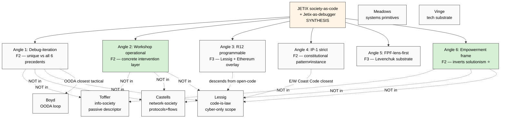

# Jetix differentiation surface — 6 angles

```mermaid
%%{init: {'theme':'base', 'themeVariables': {'primaryTextColor':'#000','textColor':'#000','lineColor':'#333','primaryBorderColor':'#333','primaryColor':'#fafafa','noteTextColor':'#000','edgeLabelBackground':'#fff'}}}%%
graph TB
    J[JETIX society-as-code<br/>+ Jetix-as-debugger<br/>SYNTHESIS]

    J --> A1[Angle 1: Debug-iteration<br/>F2 — unique vs all 6 precedents]
    J --> A2[Angle 2: Workshop operational<br/>F2 — concrete intervention layer]
    J --> A3[Angle 3: R12 programmable<br/>F3 — Lessig + Ethereum overlay]
    J --> A4[Angle 4: IP-1 strict<br/>F2 — constitutional pattern≠instance]
    J --> A5[Angle 5: FPF-lens-first<br/>F3 — Levenchuk substrate]
    J --> A6[Angle 6: Empowerment frame<br/>F2 — inverts solutionism ⭐]

    P_T[Toffler<br/>info-society<br/>passive descriptor]
    P_C[Castells<br/>network-society<br/>protocols+flows]
    P_L[Lessig<br/>code-is-law<br/>cyber-only scope]
    P_M[Meadows<br/>systems primitives]
    P_B[Boyd<br/>OODA loop]
    P_V[Vinge<br/>tech substrate]

    A1 -.NOT in.-> P_T
    A1 -.NOT in.-> P_C
    A1 -.NOT in.-> P_L
    A1 -.OODA closest tactical.-> P_B
    A2 -.NOT in.-> P_T
    A2 -.NOT in.-> P_C
    A2 -.NOT in.-> P_L
    A3 -.descends from open-code.-> P_L
    A4 -.E/W Coast Code closest.-> P_L
    A6 -.NOT in.-> P_T
    A6 -.NOT in.-> P_C
    A6 -.NOT in.-> P_L

    style J fill:#fff4e6
    style A2 fill:#d6f0d6
    style A6 fill:#d6f0d6
```

**Most defensible (F2):** Angles 1, 2, 4, 6. **Aggregate F2 defensibility ✅.**
