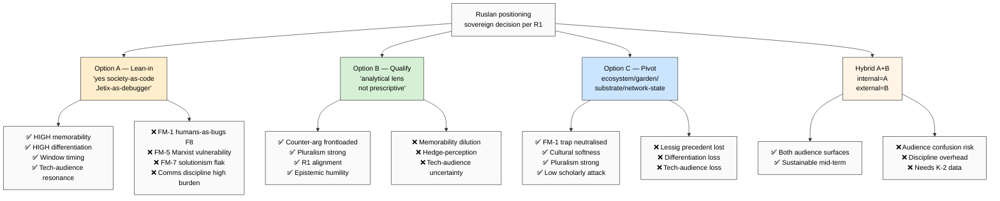

# 3 positioning options tradeoffs

```mermaid
%%{init: {'theme':'base', 'themeVariables': {'primaryTextColor':'#000','textColor':'#000','lineColor':'#333','primaryBorderColor':'#333','primaryColor':'#fafafa','noteTextColor':'#000','edgeLabelBackground':'#fff'}}}%%
graph TB
    DC[Ruslan positioning<br/>sovereign decision per R1]

    DC --> OA[Option A — Lean-in<br/>'yes society-as-code<br/>Jetix-as-debugger']
    DC --> OB[Option B — Qualify<br/>'analytical lens<br/>not prescriptive']
    DC --> OC[Option C — Pivot<br/>ecosystem/garden/<br/>substrate/network-state]
    DC --> OH[Hybrid A+B<br/>internal=A<br/>external=B]

    OA --> A_pro["✅ HIGH memorability<br/>✅ HIGH differentiation<br/>✅ Window timing<br/>✅ Tech-audience resonance"]
    OA --> A_con["❌ FM-1 humans-as-bugs F8<br/>❌ FM-5 Marxist vulnerability<br/>❌ FM-7 solutionism flak<br/>❌ Comms discipline high burden"]

    OB --> B_pro["✅ Counter-arg frontloaded<br/>✅ Pluralism strong<br/>✅ R1 alignment<br/>✅ Epistemic humility"]
    OB --> B_con["❌ Memorability dilution<br/>❌ Hedge-perception<br/>❌ Tech-audience uncertainty"]

    OC --> C_pro["✅ FM-1 trap neutralised<br/>✅ Cultural softness<br/>✅ Pluralism strong<br/>✅ Low scholarly attack"]
    OC --> C_con["❌ Lessig precedent lost<br/>❌ Differentiation loss<br/>❌ Tech-audience loss"]

    OH --> H_pro["✅ Both audience surfaces<br/>✅ Sustainable mid-term"]
    OH --> H_con["❌ Audience confusion risk<br/>❌ Discipline overhead<br/>❌ Needs K-2 data"]

    style OA fill:#ffeecc
    style OB fill:#d6f0d6
    style OC fill:#cce5ff
    style OH fill:#fff4e6
```

**Recommended pre-decision test:** 2-week pitch test 100-readers measuring FM-1 flag rate (H-SC-9 acceptance) before final A/B/C/Hybrid choice.
