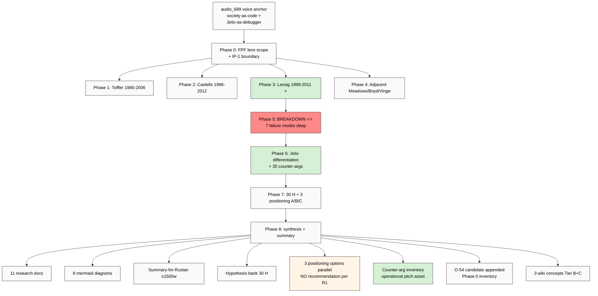

# K-3 master TLDR

**Top-3 takeaways:**
1. **Lessig closest precedent** — DAO 2016 = empirical refutation; «code as one regulator among 4» = responsible position
2. **FM-1 humans-as-bugs F8 severity** — communications discipline non-negotiable regardless of A/B/C
3. **35 counter-args ready** — pitch resilience asset operational independent of positioning choice
