# Diagram 01 — Cross-Precedent Adoption Timelines

```mermaid
timeline
    title 4 universal protocol precedents adoption timelines
    section TCP/IP (Phase 1 §B)
        1974 : Cerf-Kahn paper
        1981 : RFC 791 IP + 793 TCP
        1983 : ARPANET Flag Day NCP→TCP
        1985 : NSFNET adoption
        1990s : Internet ubiquity
        2011 : IPv4 exhaustion
    section HTTP (Phase 1 §C)
        1989 : Berners-Lee CERN proposal
        1991 : First Web page
        1993 : Mosaic browser
        1996 : HTTP/1.0 RFC 1945
        1999 : HTTP/1.1 RFC 2616
        2015 : HTTP/2 RFC 7540
        2022 : HTTP/3 RFC 9114
    section USB-C (Phase 1 §A)
        2014 : USB Type-C 1.0 spec
        2015 : First USB-C laptops
        2017 : Samsung Galaxy S8
        2021 : USB-PD 240W EPR
        2022 : EU Directive 2022/2380
        2023 : Apple iPhone 15 USB-C
        2024 : EU mandate active
    section OpenAPI + GraphQL (Phase 1 §D)
        2011 : Swagger origin
        2012 : GraphQL internal Facebook
        2015 : GraphQL public + OAI founded
        2016 : GitHub API v4 GraphQL
        2017 : OpenAPI 3.0
        2018 : GraphQL Foundation
        2023 : ~85% public APIs use OpenAPI
```

## Key insight

All 4 precedents took **5-15 years** to reach mature adoption. FPF System Merger Protocol is likely on similar curve.

**Anchor tenant signals visible in each timeline:** NSFNET (TCP/IP), Mosaic (HTTP), Apple+EU (USB-C), GitHub+Facebook (GraphQL).
