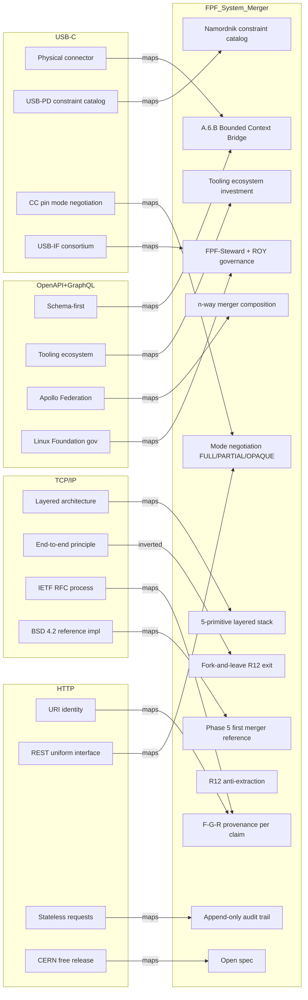

# Diagram 02 — 4 Precedents → FPF Primitive Mapping

## 7 design imperatives (Phase 1 §F)

1. Open spec + reference impl (TCP/IP + HTTP + OpenAPI)
2. Layered architecture (TCP/IP)
3. Mode negotiation (USB-C CC pin)
4. Backward compatibility / exit (USB-C; R12)
5. Anchor tenant (Apple iPhone 15; GitHub GraphQL)
6. Tooling ecosystem (OpenAPI lesson)
7. Security/constraint enforcement built-in (avoid HTTP retrofit pain)
