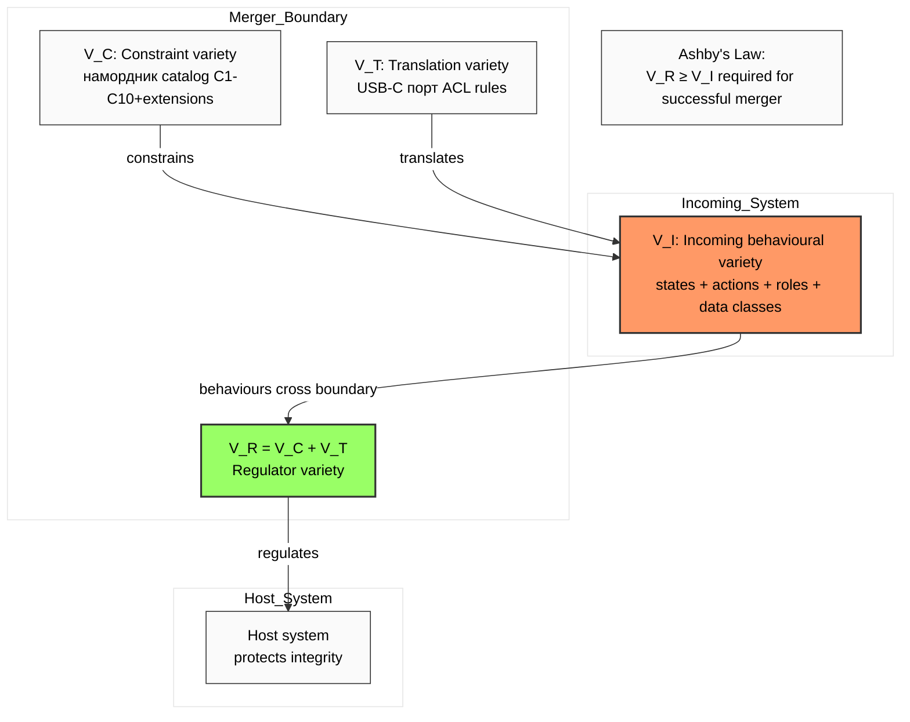

# Diagram 03 — Ashby Requisite Variety × Merger Boundary

## Operational implication

- **Phase 1 Discovery:** enumerate V_I (which behaviours of incoming are relevant к merger boundary).
- **Phase 2-3:** construct V_C (намордник) + V_T (translation) such that V_R ≥ V_I.
- **Phase 4 Pilot:** empirical verification that V_R sufficient.

**Failure modes:**
- V_R < V_I → emergent unregulated behaviours → R12 violations, integration failure (Phase 3 §A.2).
- V_R >> V_I (over-engineered) → incoming cannot operate (FM-N2 in Phase 3 §A.7).

**Hypothesis H-SM-14:** strong correlation (r > 0.5) between V_R / V_I ratio and merger success.
