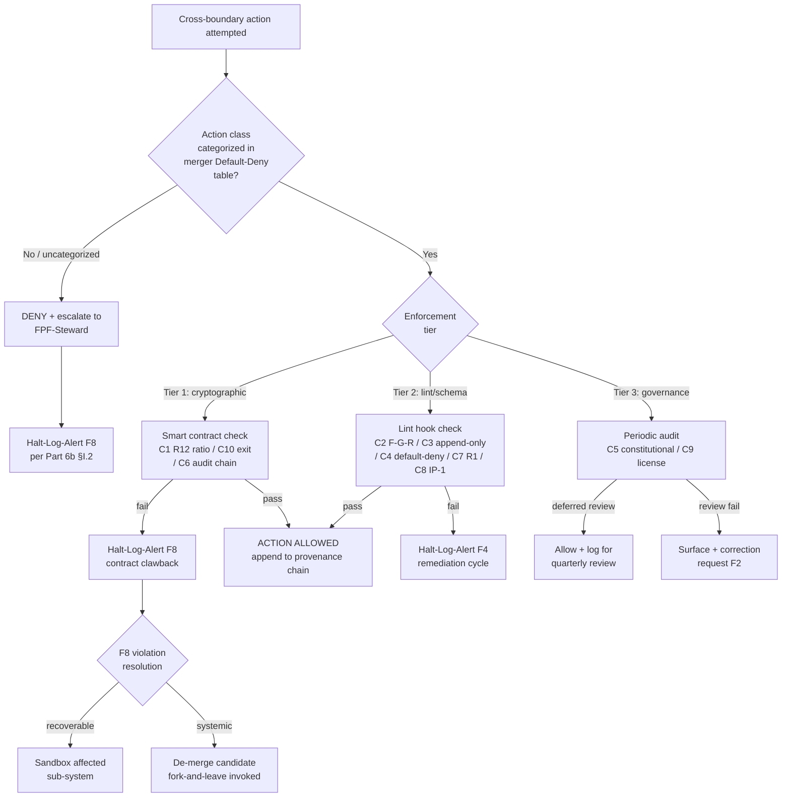

# Diagram 04 — Намордник Constraint Catalog Enforcement Flow

## Constraint catalog summary (Phase 3 §A.3)

| # | Constraint | Tier | Grade if violated |
|---|---|---|---|
| C1 | R12 anti-extraction | 1 (smart contract) | F8 |
| C2 | FPF F-G-R discipline | 2 (lint) | F4 |
| C3 | Append-only history | 2 (git hook) | F8 |
| C4 | Default-Deny novel actions | 2 (table check) | F8 |
| C5 | Constitutional posture | 3 (quarterly audit) | F8 |
| C6 | Audit trail commitment | 1 (chain anchor) | F4 |
| C7 | R1 sole-strategist binding | 2 (schema) | F8 |
| C8 | IP-1 Role≠Executor | 2 (schema) | F4 |
| C9 | Open-source default | 3 (quarterly audit) | F0 |
| C10 | Fork-and-leave exit | 1 (token contract) | F8 |
