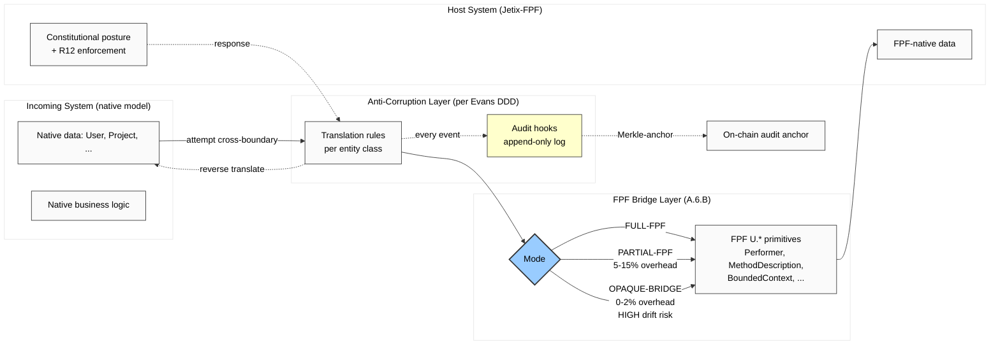

# Diagram 05 — USB-C порт Translation Flow

## Mode characteristics (Phase 3 §B.4)

| Mode | Use case | Overhead | Maintenance | Drift risk |
|---|---|---|---|---|
| FULL-FPF | Incoming small / greenfield / FPF-curious | ~0% | High initial, low later | Low |
| PARTIAL-FPF | Mid-size with legacy; pragmatic | 5-15% | Medium ongoing | Medium |
| OPAQUE-BRIDGE | Highly proprietary / regulated | 0-2% | Low | High |

**Hypothesis H-SM-12:** PARTIAL-FPF overhead <15% acceptable; >20% requires redesign.

**Hypothesis H-SM-18:** OPAQUE-BRIDGE without upgrade в 24 months shows 3× drift vs PARTIAL/FULL.
