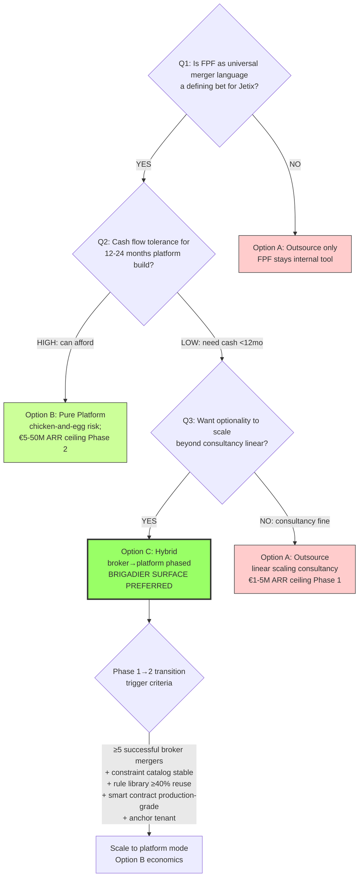

# Diagram 06 — Strategic Q Decision Tree

## Composite scoring (Phase 4 §4)

| Dim | A | B | C |
|---|---|---|---|
| D1 Revenue speed | ✓✓✓ | ✓ | ✓✓ |
| D2 Sales cycle short | ✓✓ | ✗ | ✓✓→✓ |
| D3 Sponsor diversity | ✓✓ | ✓✓ | ✓✓✓ |
| D4 Risk profile low | ✓✓✓ | ✗ | ✓✓ |
| D5 Constitutional preservation | ✓✓ | ✓✓✓ | ✓✓✓ |
| D6 Scale 12-36mo | ✓ | ✓✓✓ | ✓✓✓ |
| D7 FPF as moat | ✓ | ✓✓✓ | ✓✓ |
| D8 Optionality value | ✓ | ✓✓ | ✓✓✓ |
| **Composite (heuristic)** | **14** | **16** | **22** |

R1 reminder: Ruslan picks. Brigadier surface only.
