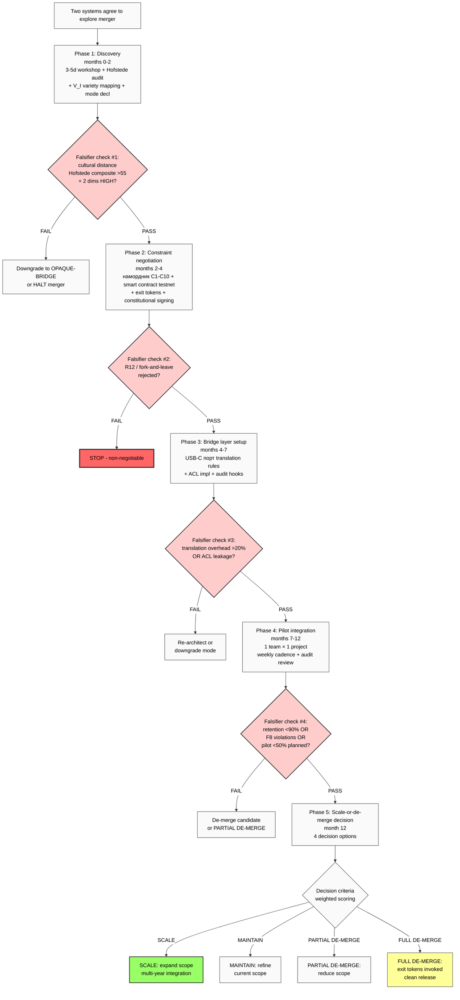

# Diagram 07 — First Merger 5-Phase Flow

## Resource estimate (Phase 5 §5)

| Phase | Duration | Jetix FTE-months | Both parties FTE-months | 3rd-party cost |
|---|---|---|---|---|
| P1 Discovery | 2 mo | 1-2 | 4-6 | €10-25K |
| P2 Constraint negotiation | 2 mo | 1-2 | 3-5 | €15-40K |
| P3 Bridge setup | 3 mo | 3-4 (A) / 1-2 (B/C) | 6-10 | €10-20K |
| P4 Pilot integration | 5 mo | 2-3 (A) / 0.5-1 (B/C) | 15-25 | €5-15K |
| P5 Decision | 1 mo | 0.5-1 | 1-2 | €5-10K |
| **Total 12 mo** | | **8-12 (A); 4-6 (B/C)** | **30-50** | **€45-110K** |

**Revenue Option A:** €200-500K Jetix engagement fee.
**Revenue Option B:** €50-150K platform fee + transaction fees.
**Revenue Option C:** €100-300K Phase 1; platform fee Phase 2.
