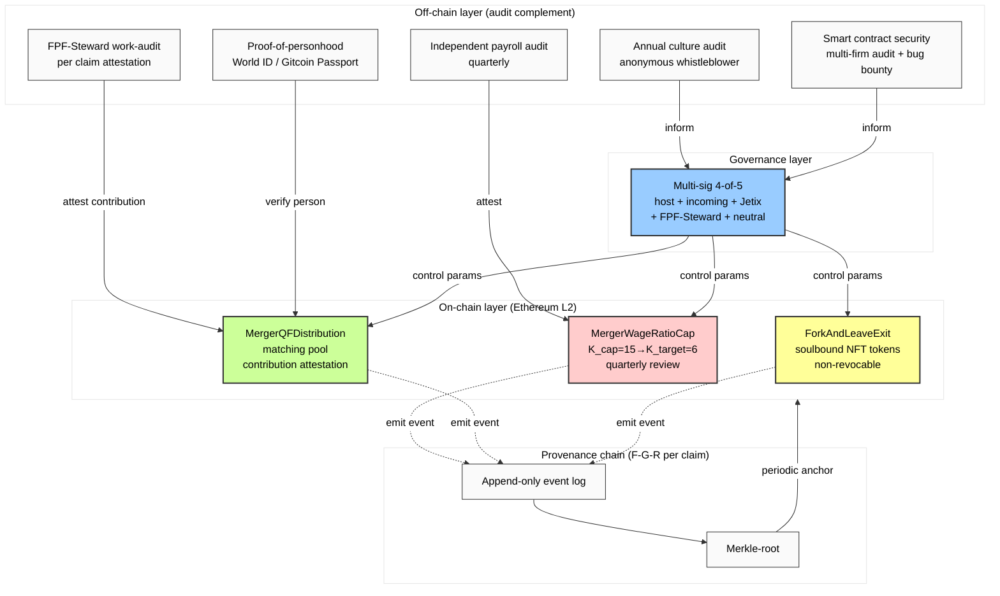

# Diagram 08 — R12 Programmable Enforcement Architecture

## 3 R12 mechanisms (Phase 6 §2)

| Mechanism | On-chain enforcement | Off-chain complement | Failure mode mitigation |
|---|---|---|---|
| Mondragón wage ratio cap | K_cap monitor; tightening schedule | Quarterly payroll audit | Whistleblower bounty |
| QF revenue distribution | √(per-contribution) matching | Sybil verification + work audit | Cap-per-claimed-person |
| Fork-and-leave exit tokens | Soulbound NFT; unconditional invocation | Anonymous channel + multi-jurisdiction escrow | Arbitration clause |

## 8 failure modes (Phase 6 §5)

| FM | Failure mode | Mitigation |
|---|---|---|
| FM-R1 | Smart contract bug | Audit + bug bounty + pause+patch |
| FM-R2 | Off-chain extraction undetected | Independent audit cadence |
| FM-R3 | Governance capture | k-of-n multi-sig + key rotation |
| FM-R4 | Mass fork-and-leave (collapse) | Crisis comms + FPF-Steward emergency |
| FM-R5 | Sybil-inflated QF | Personhood verification + per-person cap |
| FM-R6 | Wage attestation lies | Random independent audit |
| FM-R7 | Exit token blocked off-chain | Anonymous channel + multi-jurisdiction |
| FM-R8 | Smart contract unenforceability | Off-chain agreement с on-chain reference |
