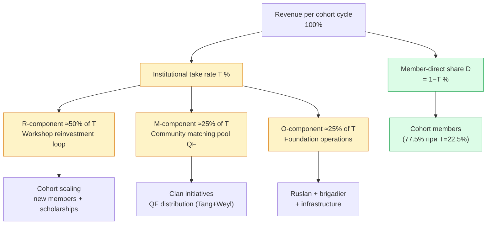
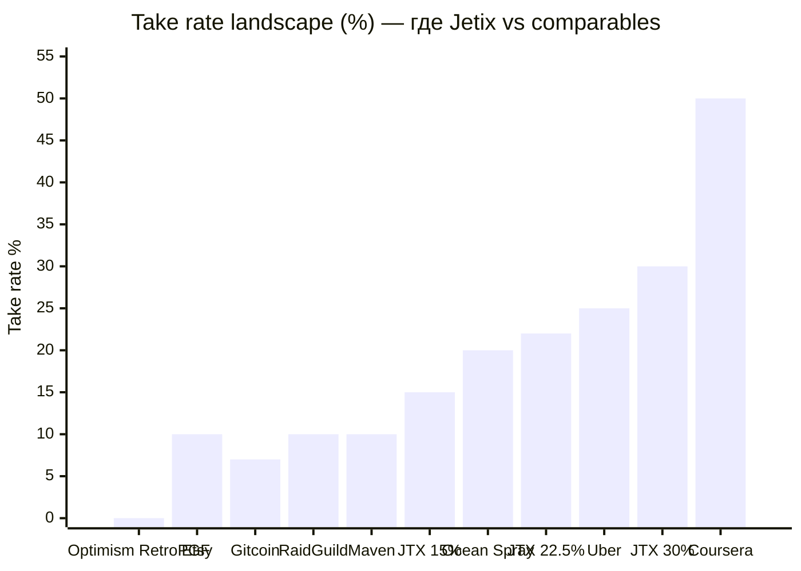
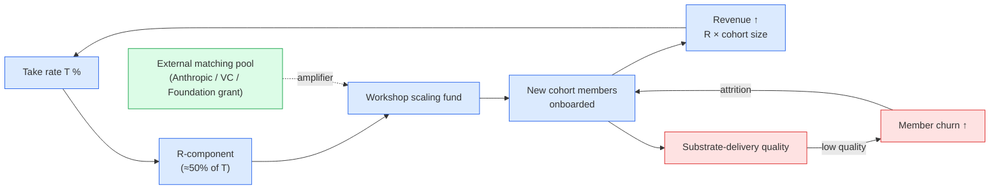
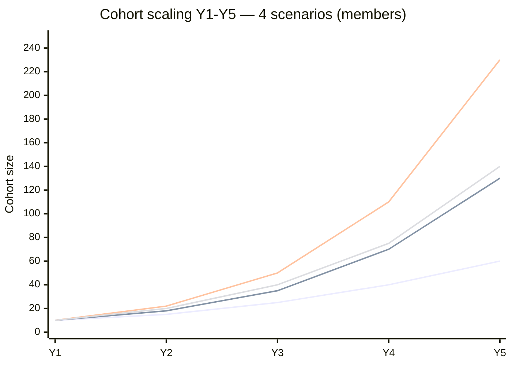
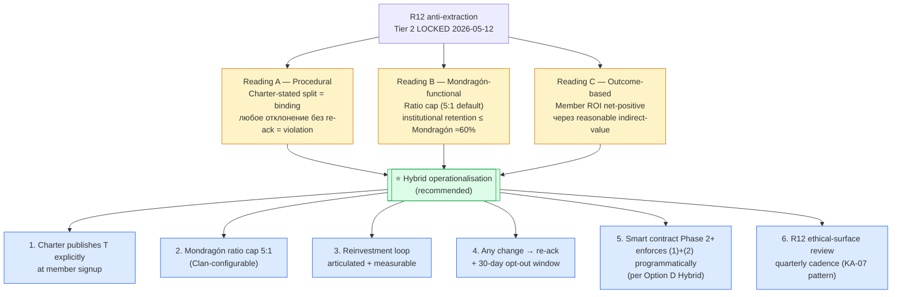
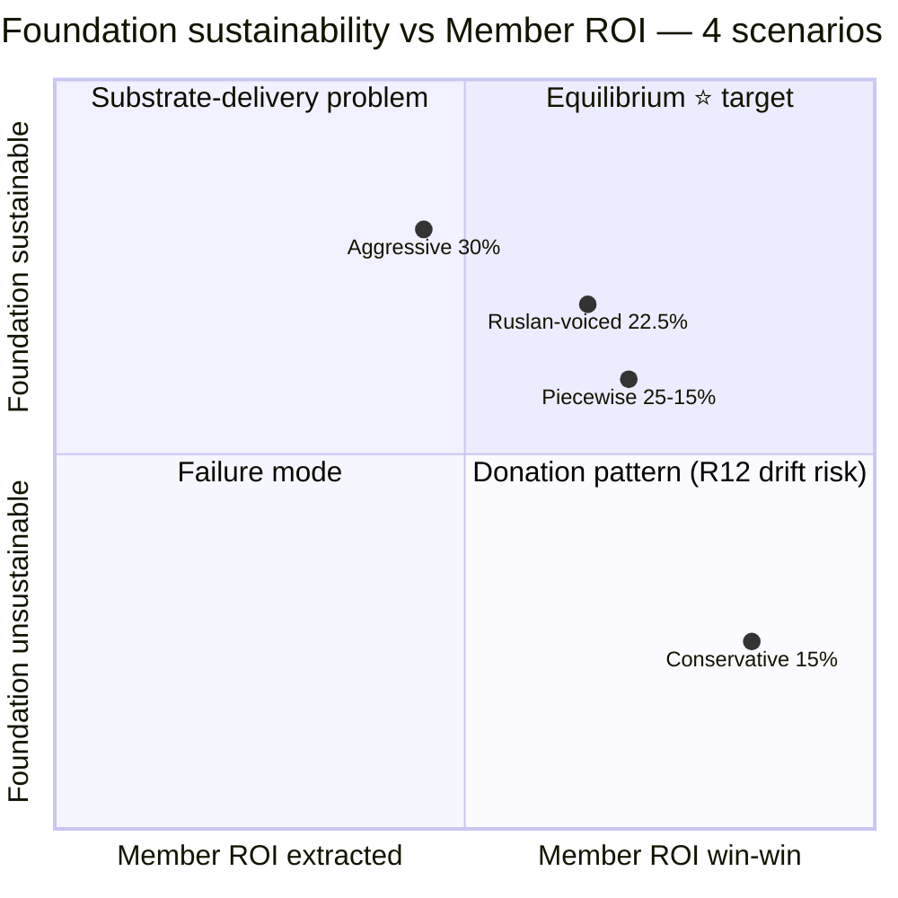

# DR-26 — 6 Mermaid Диаграммок (визуальное пояснение)

> **Цель.** Визуализировать 6 основных идей DR-26 для быстрого понимания при review. Каждая диаграмма с коротким пояснением «что показывает» + cross-link к phase-substrate. **NOT publicly committing** анализ ни в одном из направлений — surface only per Pillar C Tier 2 rule 1.

---

## Diagram 1 — Revenue split skeleton (как T делится на R + M + O)

**Что показывает:** структуру take rate T% — куда уходит каждый процент. Per Phase 2 §3.2 distribution skeleton. Recommended split при Mondragón-style retention pattern: ≈50% R / 25% M / 25% O от institutional take.

**Ключевая идея.** Take rate ≠ extraction; T делится на reinvestment loop + matching pool + operations. Member-direct остаётся >70% при любом разумном T в band 15-30%.

**Cross-link:** Phase 2 §3 distribution skeleton; Phase 5 §1 baseline assumptions.

---

## Diagram 2 — Take rate landscape (где Jetix vs comparables)

**Что показывает:** позиционирование Jetix-options (15% Conservative / 22.5% Ruslan-voiced / 30% Aggressive) против industry comparables. Industry-grounded; не anomalous; cooperative-federation + cohort-platform band.

**Ключевая идея.** Ruslan-voiced 20-25% sits squarely в established cooperative-federation + cohort-platform band — между Maven 10% (cohort-platform comparable) + Ocean Spray 20% (agricultural cooperative) + Uber 25% (marketplace industry-norm). Аggressive 30% между marketplace и education-platform norms. Conservative 15% выше Maven но ниже Ocean Spray. **Никакая опция не industry-anomalous.**

**Cross-link:** Phase 1 §7 cross-comparable summary; Phase 3 §7 master reference matrix; Phase 6 recommendation memo §2.

---

## Diagram 3 — Reinvestment loop dynamics (positive feedback цикл)

**Что показывает:** компаунд-механика reinvestment loop. R-component из take rate → Workshop scaling → новые cohort members → больше revenue → больше R-component. Per Phase 4 §1.4 compound growth + Phase 5 §8 loop dynamics.

**Ключевая идея.** Loop positive-feedback ТОЛЬКО если growth_factor > onboarding_cost / R-per-existing-member. Per Phase 5 §8.1 расчёт: при baseline placeholders + €5K onboarding, reinvestment alone недостаточен для cohort doubling — **substrate-delivery quality + external matching pool = primary levers**.

**Cross-link:** Phase 4 §1.4; Phase 5 §8.

---

## Diagram 4 — 5-year cohort scaling trajectory (4 scenarios)

**Что показывает:** прогноз cohort size Y1-Y5 для каждого из 4 scenarios. Baseline assumptions: R=€2000/мес/member, growth multiplier per Phase 5 §1.1. Ruslan-voiced 22.5% scaling 10→130; Aggressive 30% scaling 10→230; Conservative 15% scaling 10→60; Piecewise 25→15% scaling 10→140.

**Легенда (по порядку lines):**

- Line 1 — **Conservative 15%**: 10 → 60 (slowest; reinvestment-fragile)
- Line 2 — **Ruslan-voiced 22.5%** ⭐ recommended: 10 → 130 (balanced)
- Line 3 — **Aggressive 30%**: 10 → 230 (fastest; needs strict R12 discipline)
- Line 4 — **Piecewise 25→15%**: 10 → 140 (gradient; Foundation-building heavy first)

**Ключевая идея.** Cohort scaling speed ≠ единственный критерий. Aggressive 30% быстрее всех но R12 perception risk высокий; Conservative 15% медленнее всех но R12-exemplar. **Sweet spot Ruslan-voiced** = 65% от Aggressive scaling speed + R12 normal discipline + Y5 break-even на ops.

**Cross-link:** Phase 5 §2-§5 per-scenario projections; Phase 6 recommendation §2 side-by-side matrix.

---

## Diagram 5 — R12 3 readings + hybrid operationalisation

**Что показывает:** три возможных интерпретации «extraction beyond agreed share» (Phase 4 §2.4) + recommended hybrid operationalisation (6 operational pillars).

**Ключевая идея.** R12 НЕ purely numerical threshold — это **paired-frame discipline**: T procedurally Charter-stated + functionally within Mondragón cap + outcome-aligned substrate-delivery. **6 операционных столпов** обеспечивают R12-compliance при любом T в band 15-30%.

**Cross-link:** Phase 4 §2.4-§2.5 R12 3 readings + hybrid operationalisation.

---

## Diagram 6 — Foundation sustainability vs Member ROI (4 scenarios positioning)

**Что показывает:** где каждый из 4 scenarios располагается на матрице «Foundation sustainability» × «Member ROI». Per Phase 4 §3.2 matrix; Phase 5 §3.4 / §4.4 R12 compliance check.

**Ключевая идея.**
- **Conservative 15%** — Member ROI высокий (член получает 85%) НО Foundation sustainability fragile (cumulative -€465K Y1-Y5 без external funding) → drift risk в Q4 «Donation pattern» (если Foundation позже начнёт extraction-creep чтобы выжить = R12 violation)
- **Ruslan-voiced 22.5%** ⭐ — balanced; ближе всех к Q1 «Equilibrium»; Y5 break-even ops + R12-compliant
- **Aggressive 30%** — Foundation sustainable strong но Member ROI threshold выше; substrate-delivery должна быть 3-5× standard cohort platform; Q2 «Substrate-delivery problem» при weak substrate
- **Piecewise 25→15%** — adaptive trajectory; Foundation-building heavy первые годы → efficiency at scale; Q1-bordering

**Cross-link:** Phase 4 §3.2 ROI-vs-sustainability matrix; Phase 5 §7 cross-scenario summary; Phase 6 recommendation memo §2.

---

## §7 Diagrams meta-observations

### §7.1 Что 6 диаграмм совместно показывают

1. **Mechanics (Diagram 1):** T = R + M + O split; не unified extraction
2. **Positioning (Diagram 2):** Jetix-options industry-grounded; не anomalous
3. **Dynamics (Diagram 3):** reinvestment loop работает с amplifiers (substrate-quality + external matching)
4. **Trajectory (Diagram 4):** scaling speed differential 60 vs 230 members Y5; trade-off с R12 discipline
5. **Constitutional (Diagram 5):** R12 не numerical; paired-frame discipline с 6 операционных столпов
6. **Equilibrium (Diagram 6):** Ruslan-voiced ближе всех к Q1 sweet spot

### §7.2 Что не показано (open для Ruslan ack)

- ❌ Specific Workshop pricing baseline (€1500 / €2000 / €3000) — affects all diagrams via R sensitivity
- ❌ Foundation operations cost actual reality (€80K-200K range) — affects Diagram 6 positioning
- ❌ External matching pool feasibility (Anthropic / Foundation / VC) — Diagram 3 amplifier critical at low T
- ❌ First cohort substrate-delivery quality assessment — Diagram 3 churn loop critical

### §7.3 Constitutional posture diagrams

- ✅ R1 surface — 6 diagrams visualize options, не prescriptive lock
- ✅ R12 paired-frame — каждая диаграмма sustainability + member-side; не one-sided extraction visualization
- ✅ Append-only — new file; не modify existing diagrams
- ✅ Russian primary — labels + descriptions Russian; Mermaid syntax English (technical requirement)
- ✅ NOT publicly locked — все диаграммы surface 4 options; ни одна не commits к финальной цифре

---

*Diagrams closure 2026-05-21. F2 surface; ready для Ruslan review; не публично locked.*
