# SYSTEM-DESIGN-TECH (Engineer B version) — Jetix OS v1-beta

> **Школа:** C4 model (Simon Brown) + event sourcing (Fowler, Young) + ADR-first
> (Michael Nygard) + lightweight documentation (Spotify, Linux kernel).
>
> **Принципы:** Simplicity > completeness. Visual > prose. Events > snapshots.
> ADRs > explanations. Code is the real documentation — этот файл лишь навигатор.
>
> **Baseline:** `SYSTEM-DESIGN-HUMAN.md` v1-beta-2026-04-18 (2000 строк, 7 частей + мета).
> Этот документ — перевод SDH на **архитектурный** язык **в моей школе**,
> независимо от версии Engineer A. Синтезатор выберет лучшее из двух.

---

## Table of contents

- [§1 One-liner + Elevator pitch](#1-one-liner--elevator-pitch)
- [§2 C4 L1 — System Context](#2-c4-level-1--system-context)
- [§3 C4 L2 — Containers](#3-c4-level-2--containers)
- [§4 C4 L3 — Components (per container)](#4-c4-level-3--components)
- [§5 Event Sourcing Model](#5-event-sourcing-model)
- [§6 Key Data Flows — 7 sequence diagrams](#6-key-data-flows)
- [§7 Agent Interaction Model](#7-agent-interaction-model)
- [§8 State Management](#8-state-management)
- [§9 Integration Surfaces](#9-integration-surfaces)
- [§10 ADRs — 18 lightweight records](#10-adrs)
- [§11 Operational Runbook](#11-operational-runbook)
- [§12 What we're NOT doing](#12-what-were-not-doing)
- [§13 Quality attributes — minimal spec](#13-quality-attributes--minimal-spec)
- [§14 Migration Path — Notion → Jetix OS](#14-migration-path)
- [§15 Extensions — future, after v1-beta lands](#15-extensions-future)
- [Appendix A — AGENT-PROTOCOLS (B-minimalist)](#appendix-a--agent-protocols-b-minimalist)
- [Appendix B — DATA-FLOWS (B-visual)](#appendix-b--data-flows-b-visual)
- [Appendix C — ARCHITECTURE-TARGET (B-migration-focused)](#appendix-c--architecture-target-b-migration-focused)

---

## §1 One-liner + Elevator pitch

### 1.1 One-liner

> **Jetix OS is a markdown-and-git operating system for a human and their agents,
> that lets one operator route attention, time, money, connections, context and
> tools toward important projects and delegate the rest to AI — via append-only
> event logs on the filesystem.**

### 1.2 Three-paragraph elevator pitch

**Что.** Jetix OS — это **мультиагентная операционная система** над git-репозиторием.
Всё знание, все решения, все события — в markdown-файлах с YAML-frontmatter, все
состояния — в append-only логах (`log.md`, git-коммиты, JSONL mailboxes). Один
центральный Claude Code **входит в роли** 12 специализированных агентов (не 12
процессов) и коммуницирует с владельцем через conversation. Автономии на v1-beta нет —
всё по команде.

**Кому.** Предпринимателю-оператору в Берлине (Ruslan), который идёт к $50K revenue
до 30.06.2026 и строит на этой базе Jetix (AI-консалтинг + сообщество + open-source).
Дальше — до **5-10 партнёров**, потом **100+ "умных людей"**, потом в перспективе —
**стандарт работы с информацией** на горизонте 100 лет.

**Как и почему сейчас.** Операционка — это не dashboard, не вектор-БД, не платформа
автоматизации. Это **методология** (папки, wiki, per-agent memory, ритуалы) +
**единый Claude-оркестратор** поверх неё. Почему сейчас — потому что LLM научились
input-output с контекстом 200K, а стоимость Opus упала; **окно 10 недель** до $50K;
и потому что «операционки для человека» как категории пока не существует. Jetix
претендует её создать и запатентовать.

### 1.3 Top 5 architectural decisions (ссылки на ADR)

1. **Markdown + git — это наша база данных.** Никаких Postgres, Redis, Vector DB
   на v1-beta. → [ADR-001](#adr-001-markdown--git-as-the-database).
2. **Один Claude Code входит в роли, а не 12 процессов.** Role-switching через
   system prompt + niche-symlinks + 5-layer memory. → [ADR-002](#adr-002-central-claude-with-roles-not-distributed-agents).
3. **Event sourcing через append-only логи.** Git commits — главный event log;
   `wiki/log.md`, `daily-log/`, `decisions/`, `comms/mailboxes/*.jsonl` — специализированные
   event streams. → [ADR-003](#adr-003-event-sourcing-through-append-only-logs).
4. **Semi-manual в v1-beta: никаких cron'ов, никаких event-driven реакций.**
   Всё по команде Ruslan'а. → [ADR-004](#adr-004-semi-manual-no-cron-no-event-driven-in-v1-beta).
5. **Notion — внешняя SPOF, декомиссионить поэтапно (α/β/γ/δ).** Долгосрочно
   filesystem — единственная source of truth. → [ADR-007](#adr-007-notion-decommission-phased).

---

## §2 C4 Level 1 — System Context

> Первый уровень C4: **вся Jetix OS как ОДИН блок** + актёры + внешние системы.
> Цель: новый читатель за 30 секунд видит периметр.

### 2.1 Диаграмма

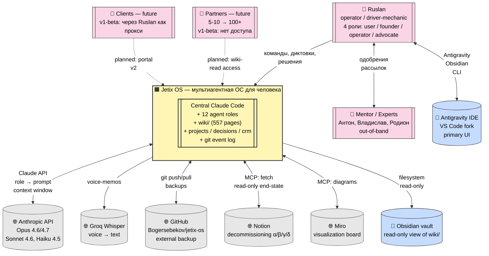

### 2.2 Кто что делает (словами)

| Элемент | Что делает | Зависимость |
|---------|------------|-------------|
| **Ruslan** | Единственный оператор и driver-mechanic. Дает команды, принимает решения, одобряет рассылки. Без него система стоит. | Anthropic API, Antigravity, локальный FS |
| **Jetix OS** | Markdown-and-git OS. Хранит знания, состояния, решения. Один Claude-оркестратор входит в роли. Semi-manual на v1-beta. | Git, Anthropic API (optional), Groq (voice only) |
| **Anthropic API** | Источник инференса для 12 ролей. Моделирование: Opus 4.6/4.7 (основная), Sonnet 4.6 (средняя), Haiku 4.5 (дёшево). | Без него — графить по-русски в markdown, human operator |
| **Groq Whisper** | Транскрипция voice-memos (OGG/MP3 → markdown). | Не блокирующая — можно отключить |
| **GitHub** | Внешний backup, публичная история, CI plumbing (минимальное). | Прямой `git push`, `git pull`. Нет другого canonical копии |
| **Notion** | Legacy SPOF. На v1-beta идёт декомиссия. После фазы δ — read-only архив. | MCP для α-фазы. После — не нужен |
| **Miro** | Визуализации (inventory boards, system maps). | MCP read/write |
| **Obsidian** | Read-only vault на `wiki/`. Удобен Ruslan'у как графовый reader. | Чтение файлов, не запись |
| **Antigravity IDE** | Primary UI. VS Code fork. Через него Ruslan работает с Claude Code. | Git, FS |
| **Партнёры / клиенты** | **Не имеют доступа** на v1-beta. В Часть 3.3 SYSTEM-DESIGN-HUMAN явно: "никак напрямую". | Планируется portal на v1/v2 |
| **Ментор + эксперты** | Out-of-band conversations с Ruslan. Контекст попадает в систему через voice-memos / транскрипты. | Filesystem ingestion |

### 2.3 Ключевые свойства периметра

- **Vendor diversity — архитектурно.** Если Anthropic упадёт — Ruslan может
  работать по структуре системы вручную (Kay principle, SDH §3.5.2). См.
  [ADR-005](#adr-005-vendor-diversity-via-abstraction).
- **One canonical source: filesystem.** Git — единственный single source of
  truth. Notion — временно, Miro — вспомогательно. Вся логика может быть
  восстановлена из `tar.gz` репо.
- **Autonomy budget = 0 в v1-beta.** Никаких cron'ов, webhook'ов, event-driven
  реакций. Система ждёт команды. См. [ADR-004](#adr-004-semi-manual-no-cron-no-event-driven-in-v1-beta).

---

## §3 C4 Level 2 — Containers

> Второй уровень: **крупные "контейнеры"** внутри Jetix OS. Каждый — отдельный
> блок с своей ответственностью и технологией. Не микросервисы — а логические
> границы внутри одного репозитория.

### 3.1 Диаграмма

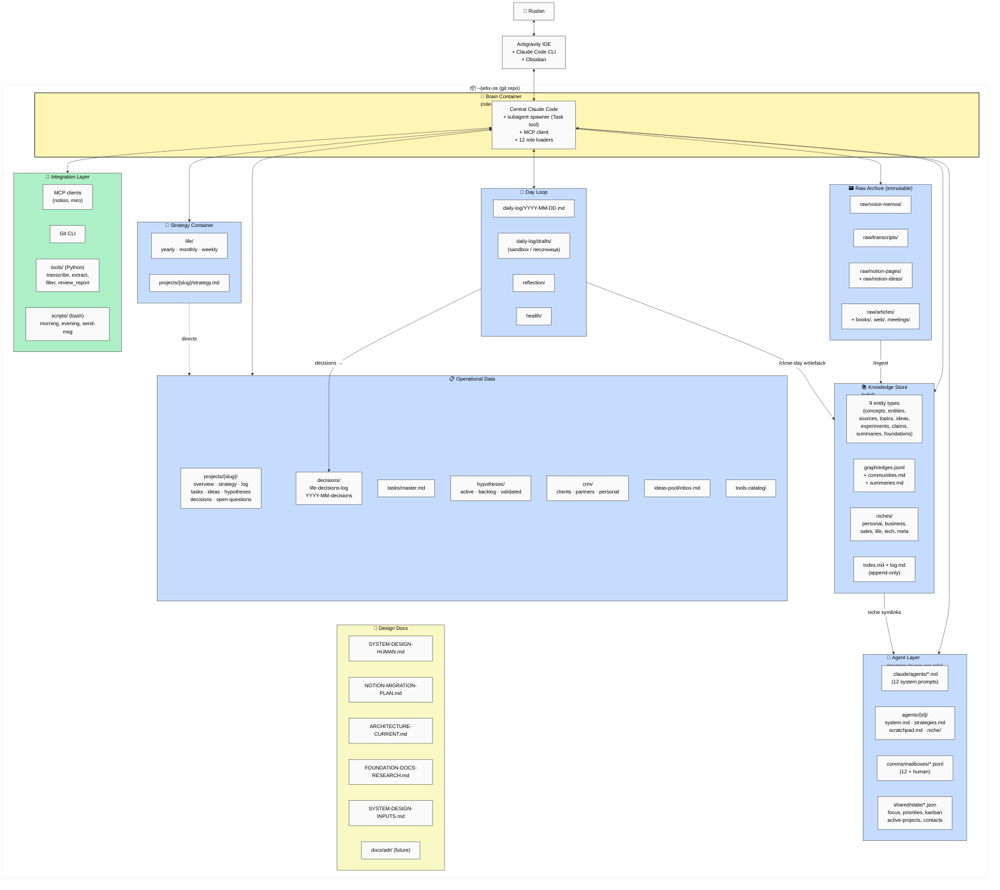

### 3.2 Каждый контейнер — карточка

#### 3.2.1 Brain — Central Claude Code

**Ответственность:**
- Единственный интерфейс к LLM
- Переключается в 12 ролей через system prompt + niche slice
- Spawn'ит subagents через Task tool (**только** для heavy parallel work)
- Умеет держать и улучшать контекст между сессиями через 5-layer memory
- MCP client для notion / miro

**Технология:** Anthropic Claude Code CLI (Opus 4.6/4.7 по умолчанию). Не
LangChain, не CrewAI, не Autogen — **минимальная оркестрация** (ADR-011).

**Взаимодействия:**
- Reads/writes: весь репо
- Reads: Anthropic API
- Reads: Groq (для voice)
- Reads: Notion MCP (α-фаза), Miro MCP

#### 3.2.2 Knowledge Store (`wiki/`)

**Ответственность:**
- Karpathy LLM Wiki + OmegaWiki — single KB для всех ролей
- 9 entity types (concepts, entities, sources, topics, ideas, experiments, claims, summaries, foundations)
- Graph с 9 edge types (supports, extends, derived_from, contradicts, explains, similar_to, used_by, reverses, part_of)
- 6 niches (personal, business, sales, life, tech, meta) через symlinks
- `index.md` каталог + `log.md` (append-only event log)

**Технология:** markdown + YAML frontmatter + JSONL edges + filesystem symlinks.

**Текущее состояние:** 557 страниц, 572 edges, 4 communities (по niche fallback).
Все страницы помечены `topics: [system-design]` — sweep фазы α.

**Writeback:** `/ask` возвращает ответы с цитатами → опционально в
`wiki/comparisons/{date}-{slug}.md`. Это compounding loop (ADR-006).

#### 3.2.3 Operational Data

**Ответственность:**
- **Projects** — 8 активных + `_template/`. Каждый проект — "мини-жизнь"
  с overview/strategy/log/tasks/ideas/hypotheses/decisions/open-questions.
- **Decisions** — life-level + project-level. append-only, никогда не
  передумываем одно и то же дважды.
- **Tasks** — общий пул + per-project фильтр.
- **Hypotheses** — active / backlog / validated-archive.
- **CRM** — **три** базы: clients, partners, personal. Разные стадии,
  разные поля (ADR-014).
- **Ideas pool** — вне-проектные идеи.
- **Tools catalog** — каждому инструменту — карточка с инструкциями.

**Технология:** markdown tables + frontmatter. Без БД.

#### 3.2.4 Strategy Container

**Ответственность:**
- Life strategy: yearly / monthly / weekly (report + plan для каждого).
- Project strategy: по одному на проект.
- Страт.документы «направляют» работу Ruslan'а и агентов. Это L4 в
  четырёхслойной модели (§8.3).

**Технология:** markdown, шаблоны в `strategy/_templates/`.

#### 3.2.5 Day Loop

**Ответственность:**
- `daily-log/YYYY-MM-DD.md` — страница дня (фокус, ключевые действия, энергия).
- `daily-log/drafts/` — **песочница** для рабочего дня (GitHub-style: drafts =
  feature branch, projects = main).
- `reflection/` — отдельная mini-wiki.
- `health/` — трекинг привычек, спорта, состояния.

**Технология:** markdown + YAML.

#### 3.2.6 Raw Archive (immutable)

**Ответственность:**
- `voice-memos/` (OGG/MP3) → `/transcribe` → `transcripts/`.
- `notion-pages/`, `notion-ideas/` — dumps миграции.
- `articles/`, `books/`, `web/`, `meetings/` — первоисточники.

**Свойства:** **immutable**. Никогда не редактируется. Эта гарантия —
основа replay через `/ingest`.

#### 3.2.7 Agent Layer

**Ответственность:**
- `.claude/agents/*.md` — 12 system prompts (Karpathy-style frontmatter: model,
  niches, peers, escalation).
- `agents/{id}/` — per-agent 5-layer memory:
  - `system.md` — Core (editable copy of system prompt)
  - `strategies.md` — **System Prompt Learning** накопления (ADR-015)
  - `scratchpad.md` — working memory для сессии
  - `niche/` — symlinks в `wiki/niches/{niche}/`
  - (5-я layer — recall через mailboxes)
- `comms/mailboxes/{id}.jsonl` — append-only messaging между ролями.
- `shared/state/*.json` — оперативное состояние (focus, priorities, kanban,
  active-projects, contacts, system-health).

#### 3.2.8 Integration Layer

**Ответственность:**
- MCP bridges (notion, miro) — единые адаптеры к внешним.
- Git CLI — основной commit/push.
- `tools/` — Python voice pipeline.
- `scripts/` — bash helpers для частых операций.

**Паттерн:** все наружные вызовы идут через Integration Layer. Brain сам
не делает HTTP — **адаптер в середине всегда**. Это Kay-compat (§3.5.2 SDH).

#### 3.2.9 Design Docs

**Ответственность:**
- Strategic документация: как система задумана.
- `SYSTEM-DESIGN-HUMAN.md` (ты это читаешь в baseline) — целевая карта.
- `NOTION-MIGRATION-PLAN.md` — стратегия переезда.
- `FOUNDATION-DOCS-RESEARCH.md` — canons (arc42, C4, ADR, RFC etc).
- `ARCHITECTURE-CURRENT.md` — snapshot as-is.
- `SYSTEM-DESIGN-INPUTS.md` — staging для тезисов.
- `docs/adr/` (future) — ADR log (сейчас ADR-ы встроены в этот файл, §10).

**Свойство:** Design Docs не **управляют** работой — они **объясняют** её.
Код управляется через system prompts + skills.

---

## §4 C4 Level 3 — Components

> Третий уровень — внутрь каждого крупного контейнера. Здесь видно **как
> работают** отдельные скилы/компоненты. Показываю 5 важнейших.

### 4.1 Brain / Claude Code — components

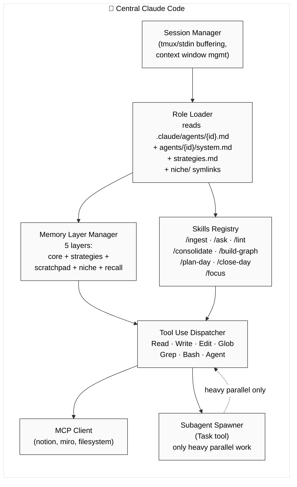

**Важно:** `SubSpawner` используется **редко**. На v1-beta — только для явно
heavy parallel work (например, fetch 20 Notion страниц через Task tool в
параллель). Default path — **single session, roles via prompt**. См.
[ADR-011](#adr-011-no-orchestration-framework-claude-code-is-enough).

### 4.2 Wiki — components

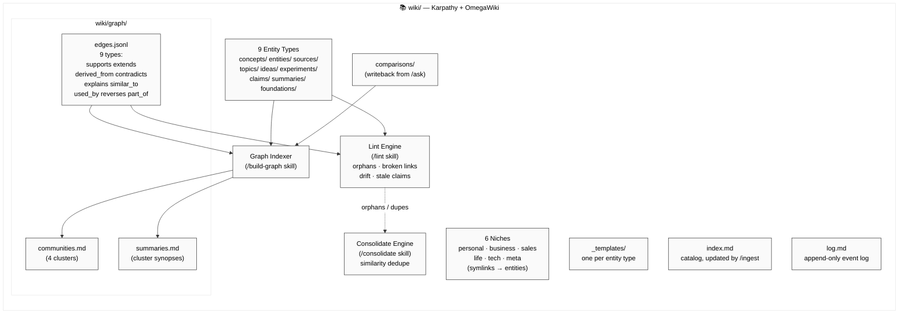

**Ключевой feedback loop:** `/ask` → синтез → `comparisons/` → `/build-graph` →
новые edges → следующий `/ask` использует. Это Knowledge Compounding
(ADR-006).

### 4.3 Operational Data — components

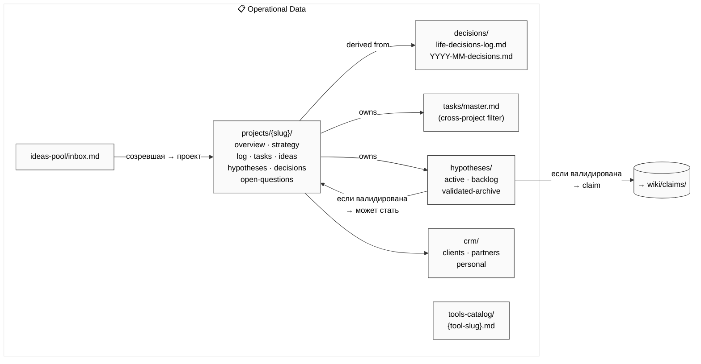

### 4.4 Strategy — components

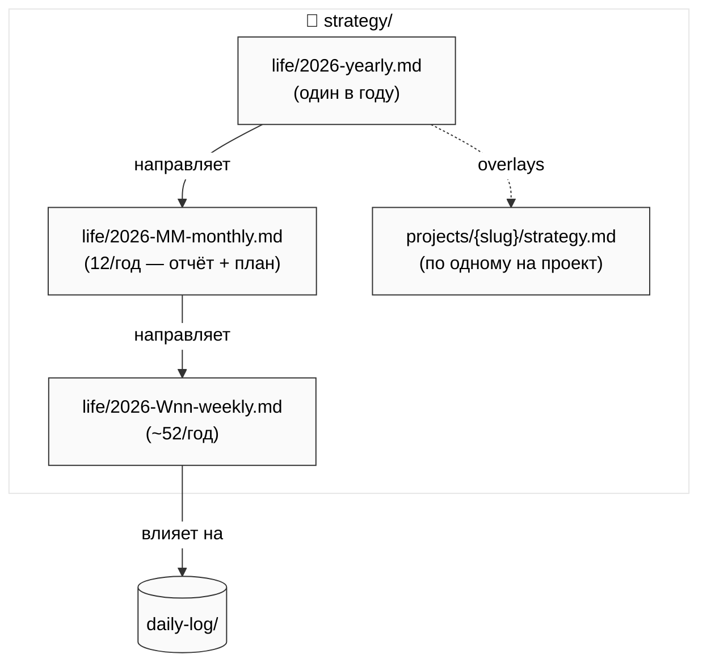

**Жизненный цикл:** годовой — раз в год. Месячный — в конце месяца (отчёт) +
начале следующего (план). Недельный — каждый понедельник (план) + воскресенье
(отчёт). См. SDH §6.2.3.

### 4.5 Integration Layer — components

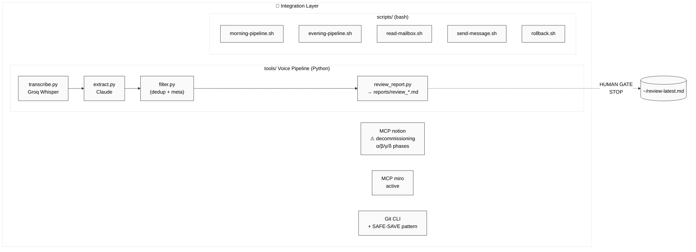

**Обрати внимание:** `distribute.py` **заархивирован** как `.bak` — явное
архитектурное решение: Claude-выводы **не попадают в KB** без ручного
review. Это страховка от мусора (ADR-010 SAFE-SAVE + human gate).

---

## §5 Event Sourcing Model

> **Главная ментальная модель системы.** Jetix OS — **это поток событий**
> над файловой системой, а не snapshot state. Каждый факт, каждое решение,
> каждый ingest — **событие**, append-only записанное в один из логов.
>
> State в любой момент — **функция от events**. State at time `T` — это
> `git checkout <commit-at-T>`. Replay по определению работает.

### 5.1 Почему event sourcing, а не CRUD / snapshot

Три причины:

1. **Traceability навсегда.** Кто решил, почему, что за обоснование — всё
   в логах. Ruslan может через 6 месяцев открыть `decisions/2026-04-decisions.md`
   и увидеть ход мысли. Нельзя потерять reasoning — потому что он
   append-only.
2. **Replay = reconstruct.** Если агент "потерял контекст" (§5.6.4 SDH),
   можно прогнать через logs и восстановить. Любой state — replay events.
3. **Безопасность при ошибках.** Удаление — нарушение архитектуры. Вместо
   этого — запись "это исключено" событием-коррекцией. Ничего не теряется.
   См. [ADR-008](#adr-008-docs-as-code-for-all-knowledge).

### 5.2 Event log locations (иерархия)

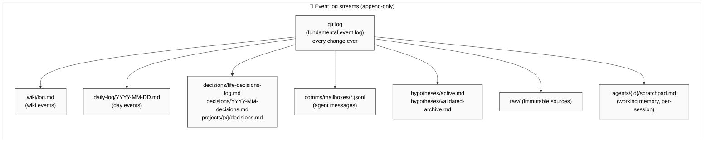

**Иерархия:** `git log` — **фундаментальный** event log. Над ним — специализированные
(wiki, daily, decisions, mailboxes, hypotheses). Каждый специализированный лог
**тоже** попадает в git → в `git log` по умолчанию. Два уровня записи — **и** в
специализированный `.md`, **и** в git через `commit`.

### 5.3 Event types — 25 канонических

> Формат идентификатора: `<domain>.<object>.<action>`. Lowercase dot-separated.
> Все события — immutable. Время фиксируется через git commit timestamp
> (не поле в теле события — git-truth).

| # | Event | Domain | Where recorded | Trigger |
|---|-------|--------|----------------|---------|
| 01 | `idea.captured` | brain | `raw/notion-ideas/` или `ideas-pool/inbox.md` | Ruslan записал / Notion dump |
| 02 | `idea.ingested` | brain | `wiki/log.md` + `wiki/ideas/{slug}.md` | `/ingest` завершился |
| 03 | `source.added` | brain | `wiki/sources/YYYY-MM-DD-{slug}.md` + `wiki/log.md` | `/ingest` завершился |
| 04 | `edge.added` | brain | `wiki/graph/edges.jsonl` + git log | `/ingest` или `/build-graph` |
| 05 | `comparison.written` | brain | `wiki/comparisons/{date}-{slug}.md` + `wiki/log.md` | `/ask` writeback |
| 06 | `claim.recorded` | brain | `wiki/claims/{slug}.md` | `/ask` или ручная запись |
| 07 | `contradiction.detected` | brain | `wiki/_lint-report-*.md` + edge `contradicts` | `/lint` или `/ask` |
| 08 | `decision.recorded` | ops | `decisions/*.md` + git log | Ruslan принял решение |
| 09 | `decision.reviewed` | ops | same files — append-onlyй обзор | re-view блоком |
| 10 | `project.created` | ops | `projects/{slug}/overview.md` + `shared/state/active-projects.json` | Ruslan создал |
| 11 | `project.closed` | ops | `projects/{slug}/log.md` + `shared/state/active-projects.json` | target Б достигнут |
| 12 | `task.created` | ops | `tasks/master.md` или `projects/{slug}/tasks.md` | Ruslan или агент |
| 13 | `task.moved` | ops | tasks file | kanban column change |
| 14 | `task.completed` | ops | tasks file + `daily-log/YYYY-MM-DD.md` | Ruslan отметил |
| 15 | `hypothesis.activated` | ops | `hypotheses/active.md` | переход backlog→active |
| 16 | `hypothesis.validated` | ops | `hypotheses/validated-archive.md` | результат теста ✓ |
| 17 | `hypothesis.rejected` | ops | `hypotheses/validated-archive.md` | результат теста ✗ |
| 18 | `contact.added` | ops | `crm/{category}.md` | Ruslan / звонок-экстракция |
| 19 | `ritual.morning.started` | day-loop | `daily-log/YYYY-MM-DD.md` | Ruslan команду дал |
| 20 | `ritual.morning.closed` | day-loop | same | plan утверждён |
| 21 | `ritual.evening.started` | day-loop | same | `/close-day` запущен |
| 22 | `ritual.evening.closed` | day-loop | same + `wiki/log.md` | writeback завершён |
| 23 | `ritual.weekly.completed` | day-loop | `strategy/life/2026-Wnn-weekly.md` | еженедельный ритуал |
| 24 | `ritual.monthly.completed` | day-loop | `strategy/life/2026-MM-monthly.md` | ежемесячный ритуал |
| 25 | `agent.role.entered` | agent | `agents/{id}/scratchpad.md` (optional) | role-switching |
| 26 | `agent.escalated` | agent | `comms/mailboxes/human.jsonl` + scratchpad | problem / UNCLEAR |
| 27 | `safe-save.fired` | infra | git commit `[agent-id] SAFE-SAVE: …` | любой error / interrupt |
| 28 | `session.started` | infra | git log | Claude Code сессия |
| 29 | `session.ended` | infra | git log (SAFE-SAVE или commit) | session closed |
| 30 | `migration.phase.completed` | infra | `reports/*.md` + git tag | α / β / γ / δ |

> 30 событий, не 25 — расширил по факту. Из них **5 канонических**: `idea.ingested`,
> `decision.recorded`, `ritual.*.closed`, `agent.escalated`, `safe-save.fired`.
> Остальные — производные / частные.

### 5.4 Event-driven properties

#### 5.4.1 Append-only everywhere

Все логи — append-only. Удаление = нарушение инварианта. Корректировка —
запись нового события типа "отменяю предыдущее". См. [ADR-003](#adr-003-event-sourcing-through-append-only-logs),
[ADR-010](#adr-010-safe-save-as-universal-error-handler).

#### 5.4.2 Replay-ability

Любой state может быть реконструирован replay'ем. Пример:
- `wiki/graph/communities.md` — derived. Если потерялся — `git checkout .;
  /build-graph` → перезапись из `edges.jsonl`.
- `shared/state/focus.json` — snapshot. Потерялся → derive из
  `daily-log/YYYY-MM-DD.md` последних дней.
- `wiki/ideas/{slug}.md` — derived (ну почти — editable, но inputs immutable).
  Потерялся → re-run `/ingest` на соответствующем `raw/` source.

#### 5.4.3 Temporal queries через git

Вопрос «какой был state системы 2026-04-14?» решается тривиально:
```
git checkout <commit-hash-от-2026-04-14>
cat wiki/index.md  # видишь как это было
git checkout main  # вернулся
```

Без git — это невозможно без сохранённых snapshot'ов. С git — бесплатно.

#### 5.4.4 Event sourcing ≠ command sourcing

**Важное уточнение:** мы записываем **события**, а не **команды**. Нет
журнала "Ruslan ввёл команду X". Есть журнал "произошло событие Y".
Потому что:
- Команды могут быть неоднозначны (natural language). События — факты.
- Replay команд требует deterministic Claude. Replay событий — только FS state.
- Ruslan может по-разному сформулировать одну и ту же мысль. Но результат
  (событие) — один.

#### 5.4.5 Stream isolation

Каждый event log — **изолированный stream**. Ingest не смешивается с
decisions. Day loop не смешивается с wiki log. Это даёт:
- Независимое чтение каждого потока
- Независимый rollback (если обновления в `wiki/log.md` повредились —
  не трогает `decisions/`)
- Параллельные writers без locking (`git merge` разрешает конфликты
  на append-only текстах почти всегда автоматически)

### 5.5 Event routing diagram

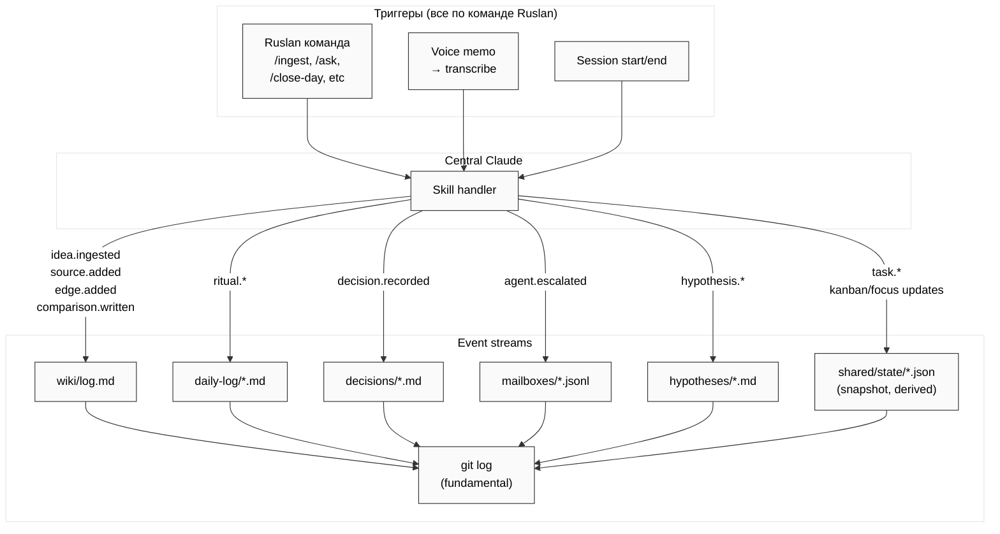

---

## §6 Key Data Flows

> 7 sequence diagrams для главных сценариев v1-beta. Всё — semi-manual,
> triggered by Ruslan. Visual-first — диаграмму смотришь, текст дополнителен.

### 6.1 Morning ritual

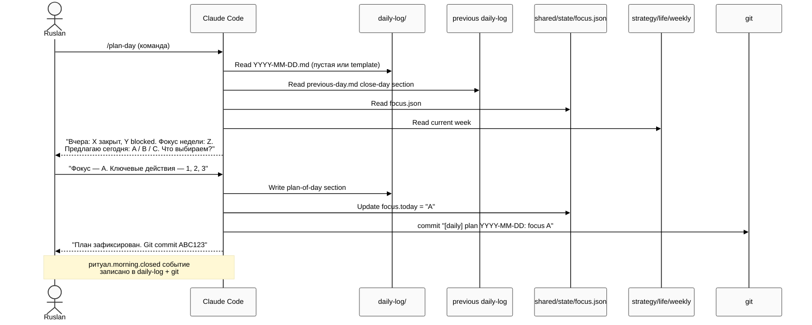

### 6.2 `/ingest` raw → wiki

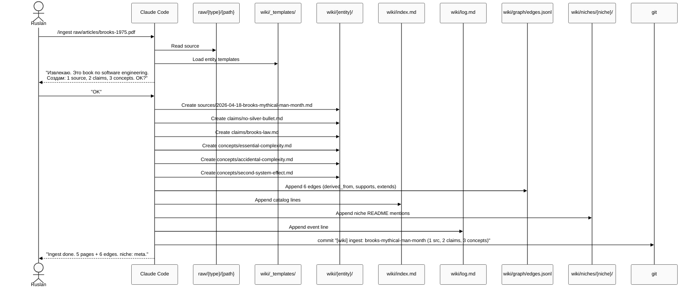

### 6.3 `/ask` query → synthesis + writeback

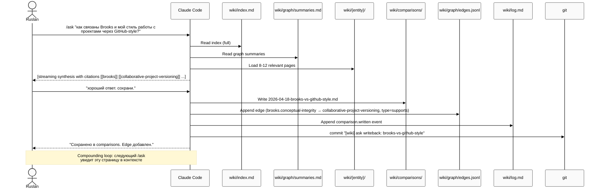

### 6.4 Evening ritual (`/close-day`)

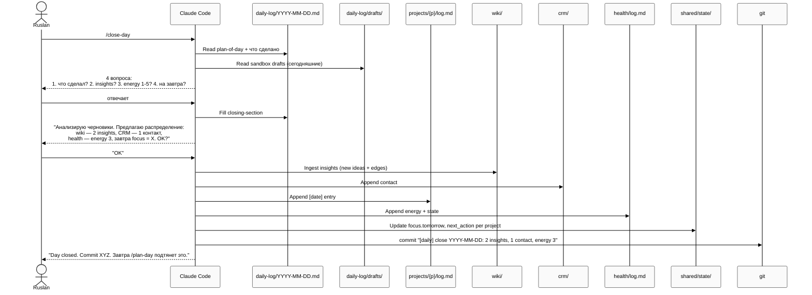

### 6.5 Weekly "натягивания" (cross-pollination)

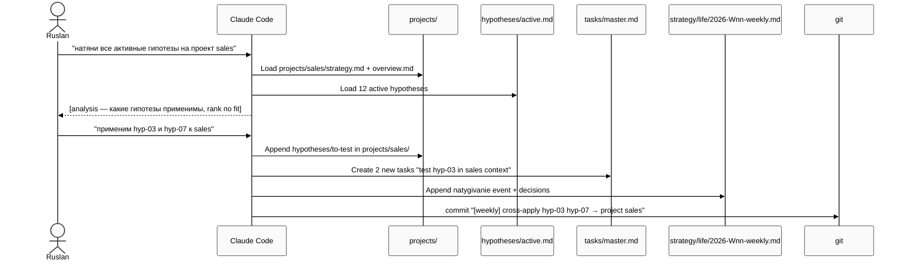

### 6.6 Error flow — SAFE-SAVE

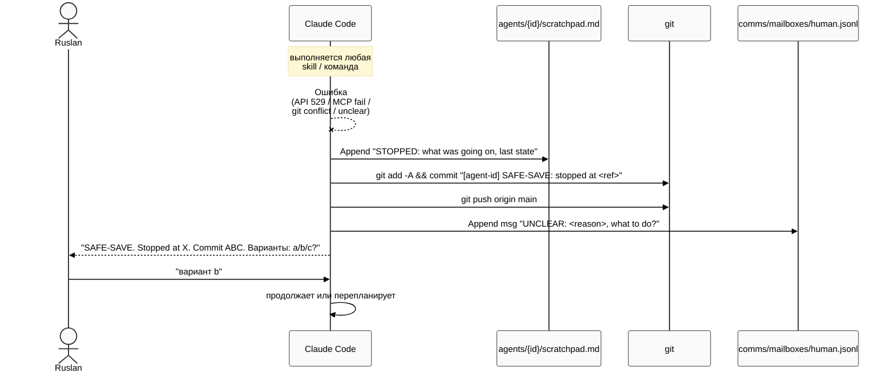

**Инвариант:** каждая ошибка → SAFE-SAVE. Критерий: не теряем прогресс.
Лучше лишний коммит, чем потерянная работа. См. [ADR-010](#adr-010-safe-save-as-universal-error-handler).

### 6.7 Migration flow (Notion → Wiki)

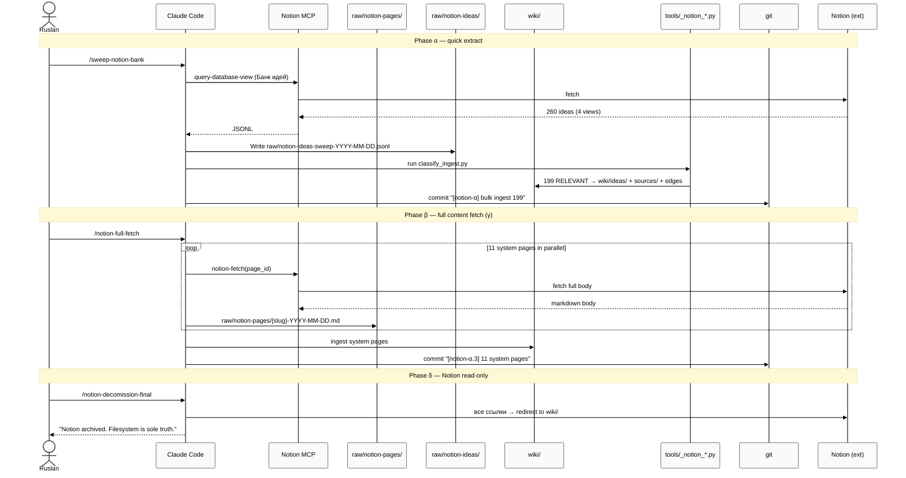

---

## §7 Agent Interaction Model

> **Тезис:** 12 агентов — это **12 ролей**, в которые входит **один центральный
> Claude Code**. Не 12 процессов, не 12 моделей в памяти, не 12 REST-сервисов.
> Single session, role-switching through prompt + niche slice.

### 7.1 Role-switching diagram

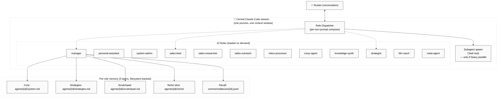

### 7.2 Что такое "войти в роль" — протокол

Когда Ruslan говорит "как manager проанализируй X" / "войди в роль sales-lead":

1. **Read role system prompt:** `.claude/agents/{id}.md` (обязательно).
2. **Read working copy:** `agents/{id}/system.md` (может отличаться — tuning).
3. **Read strategies (accumulated learning):** `agents/{id}/strategies.md`.
4. **Load niche slice:** `agents/{id}/niche/` symlinks → фильтр `wiki/` по
   niche(s) роли.
5. **Read last scratchpad:** `agents/{id}/scratchpad.md` (если есть незакрытый
   контекст).
6. **Read recent mailbox:** `comms/mailboxes/{id}.jsonl` (последние N).

После этого — LLM **есть в роли**. Работает до команды "выйди" или до
переключения на другую роль / user.

### 7.3 Subagent spawn — когда и зачем

**Default:** не spawn. Single session. Роль меняется через prompt.

**Exception — spawn через Task tool:** **только если**:
- Need heavy parallel work (20 Notion pages fetch)
- Need isolation (subagent в ограниченной song)
- Need context hygiene (не хочу мусорить основной контекст массой raw)

**Мы наблюдали в логах (`wiki/log.md`):**

> "Reality: все 4 attempts на sub-agent spawn упали с API 529. Switched to
> foreground sequential."

→ **ADR-011:** не делать spawn-хеви архитектуру. Single session — default.
Subagent — only for proven parallel-win cases.

### 7.4 Communication model

**Нет inter-process calls.** Агенты общаются через **filesystem**:

- **Mailboxes** (`comms/mailboxes/{id}.jsonl`) — append-only messaging.
  Формат по `shared/schemas/message.schema.json` (id `msg-YYYYMMDD-NNN`,
  8 types, 4 priorities, 5 statuses).
- **Shared state** (`shared/state/*.json`) — read/write snapshots для общих
  вопросов (focus, priorities, kanban).
- **Scratchpads** — приватная память per-role.

**Escalation (v1-beta):** упрощённая. Любой агент с проблемой → `comms/mailboxes/human.jsonl` →
прямо Ruslan. Никаких lead/manager прослоек (SDH §5.4).

### 7.5 Agent card (карточки) на v1-beta — минимальные

Мы **не делаем** полный Google Model Card для 12 агентов на v1-beta. Вместо
этого — **одна строка в таблице** (ниже) + `.claude/agents/{id}.md` как
source of truth.

| Role | Dept | Model | Niches | Main peers | Typical command | Budget |
|------|------|-------|--------|------------|-----------------|--------|
| manager | MGMT | Sonnet 4.6 | business, meta | strategist, sales-lead, PA | "координация", routing | 20 active tasks max |
| strategist | MGMT | Opus 4.6 | business, personal | manager, knowledge-synth | стратегические решения | 1-3 decisions per session |
| personal-assistant | OPS | Haiku 4.5 | personal, meta | manager, system-admin | рутина, emails | ~5 мин |
| system-admin | OPS | Haiku 4.5 | meta, tech | PA, meta-agent | git, mcp, скрипты | — |
| sales-lead | Sales | Sonnet 4.6 | sales, business | researcher, outreach | sales-координация | — |
| sales-researcher | Sales | Haiku 4.5 | sales | sales-lead | prospect research | — |
| sales-outreach | Sales | Haiku 4.5 | sales | sales-lead | first touches, sequences | — |
| knowledge-synth | Brain | Sonnet 4.6 | все 6 | inbox-processor | synthesis | — |
| inbox-processor | Brain | Haiku 4.5 | meta | knowledge-synth | triage | — |
| crazy-agent | Meta | Sonnet 4.6 | meta, tech | strategist | divergent ideas | — |
| meta-agent | Meta | Sonnet 4.6 | meta | manager, system-admin | audits (planMode) | permissionMode: plan |
| life-coach | Life | Sonnet 4.6 | life, personal | manager | wellness, recovery | — |

**Detailed Agent Cards** — отложено на v1 (SDH §7.1.2).

### 7.6 "Умнеют ли агенты" (System Prompt Learning)

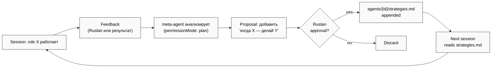

Это **Karpathy's System Prompt Learning** через файлы. На текущий момент
`strategies.md` — пустые seeds (SDH §6.1.13; ARCHITECTURE-CURRENT §3.3.3
gap #9). Наполнятся по мере работы.

**ADR-015** — формализует этот механизм.

---

## §8 State Management

> Какое state где хранится, как согласовано, какие гарантии.

### 8.1 State classification

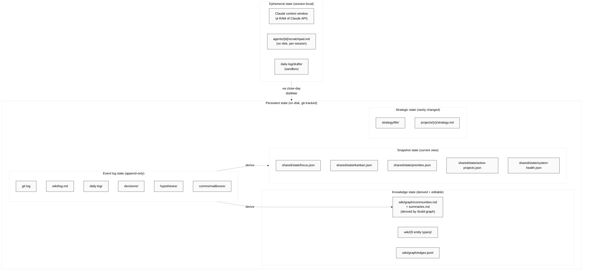

### 8.2 Consistency guarantees

| Свойство | Гарантия | Как обеспечивается |
|----------|----------|--------------------|
| **Atomicity of write** | File-level (atomic write, rename) | OS guarantee. Plus `git commit` atomic |
| **Durability** | After `git push` — remote backup | GitHub remote |
| **Isolation** | Single-writer (single Claude session) | semi-manual, no concurrent writers |
| **Append-only invariant** | Logs никогда не edited / deleted | Convention + `/lint` checks + ADR-003 |
| **Replay** | Any derived state → rebuild from logs | `/build-graph`, `/lint`, `/consolidate` skills |
| **Rollback** | `git checkout <ref>` | git native |
| **No data loss on crash** | SAFE-SAVE after every action block | ADR-010 |

### 8.3 4-layer information model (from SDH §4.3)

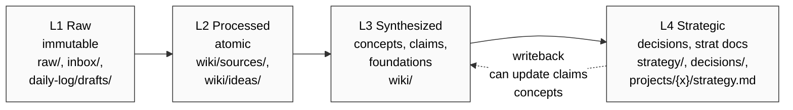

**Правила перехода:**
- L1 → L2: через `/ingest` (автоматически агентами)
- L2 → L3: через `/consolidate` + `/build-graph` (периодически)
- L3 → L4: **только через явное решение Ruslan**. Граница 2.4.1 SDH.
- Обратный L4 → L3: через writeback (ADR-006)

### 8.4 State invariants (MUST hold)

> Используем RFC 2119 язык: **MUST** / **SHOULD** / **MAY**.

1. **MUST:** `raw/` неизменяем после записи (кроме явного `[admin]` commit).
2. **MUST:** `*.log.md` и `*-log.md` — append-only.
3. **MUST:** каждое событие, меняющее state, даёт git commit.
4. **MUST:** каждое решение — YAML frontmatter + context + rationale.
5. **SHOULD:** `wiki/graph/communities.md` и `summaries.md` — derived,
   можно rebuild'ить.
6. **SHOULD:** `shared/state/*.json` — derivable из event logs последних 7 дней.
7. **MAY:** `wiki/comparisons/` — writable только `/ask` (не ручками).

### 8.5 Concurrency model

**На v1-beta:** single-writer. Один Claude Code сессия. Нет concurrent
writers. Нет locking.

**Если в будущем (v2) появятся параллельные writers:**
- **Append-only streams** конфликтуют редко — git merge почти всегда
  разрешает автоматически.
- **Snapshot state** (`shared/state/*.json`) — нужна стратегия (last-wins?
  merge? locks?). Откладываем до v2.

---

## §9 Integration Surfaces

> Все внешние интерфейсы. Каждый описан в 5-10 строк. Не энциклопедия —
> навигационная карта.

### 9.1 Anthropic API

- **Что:** Claude LLM (Opus 4.6/4.7, Sonnet 4.6, Haiku 4.5).
- **Как:** через Claude Code CLI, не напрямую. Модель выбирается per-role
  через `.claude/agents/{id}.md` frontmatter (`model:` field).
- **Failure mode:** API 529 / rate limit / timeout → SAFE-SAVE + retry с
  backoff (5s → 15s → 45s). После 3 — stop + escalate.
- **Vendor lock risk:** mitigated через роли-файлы (можно сменить provider
  → все промпты переносимы) + Kay fallback (человек-оператор).
- **ADR:** [ADR-005](#adr-005-vendor-diversity-via-abstraction).

### 9.2 Groq Whisper

- **Что:** voice-to-text для `raw/voice-memos/*.ogg,mp3`.
- **Как:** `tools/transcribe.py` (Python + requests). Output → `raw/transcripts/YYYY-MM-DD-*.md`.
- **Failure:** fallback на local Whisper (не настроен v1-beta, TODO).
- **Risk:** low — без voice-memo pipeline система работает, просто
  меньше автоматики.

### 9.3 Git (GitHub)

- **Что:** source of truth + external backup + history.
- **Как:** прямые `git add/commit/push` через Bash.
- **Remote:** `Bogersebekov/jetix-os`, branch `main`. (Текущая temp branch:
  `claude/xenodochial-jennings` — не в main.)
- **Commit convention:** `[area] действие: описание`.
- **Forbidden:** `--force`, `--no-verify`, rebase main без Ruslan'а.
- **ADR:** [ADR-001](#adr-001-markdown--git-as-the-database), [ADR-008](#adr-008-docs-as-code-for-all-knowledge).

### 9.4 Notion (decommissioning)

- **Что:** legacy external SPOF. Command Center + 7 DB + идеи + записи.
- **Как:** MCP (`mcp__notion-*`). Fetch / create / update / query.
- **Статус:** Фаза α.2 + α.3 завершены (199 ideas + 11 system pages ingested).
  Фазы β/γ/δ — в backlog. Детали в `NOTION-MIGRATION-PLAN.md`.
- **Failure mode:** MCP ломается — SAFE-SAVE + переключение на локальные
  `raw/notion-*` dumps. Не блокирует критичную работу.
- **ADR:** [ADR-007](#adr-007-notion-decommission-phased).

### 9.5 Miro

- **Что:** visualization board (inventory frames, system maps).
- **Как:** MCP (`mcp__miro-*`). diagram_create / context_explore / doc_create.
- **Risk:** low. Если падает — работаем с mermaid inline (как в этом доке).

### 9.6 Obsidian

- **Что:** read-only graph view поверх `wiki/`.
- **Как:** Obsidian vault указывает на `~/jetix-os/wiki/`. Читает markdown +
  frontmatter + [[wikilinks]].
- **Write:** Ruslan НЕ редактирует `wiki/` через Obsidian. Все правки —
  через Claude Code с `/ingest`, `/consolidate`, `/ask writeback`.
- **Rationale:** одна точка записи — меньше drift'а.

### 9.7 Antigravity IDE

- **Что:** Primary UI (VS Code fork с Claude-интеграцией).
- **Как:** открыт на `~/jetix-os`. Справа — SDH или текущий документ, слева
  — чат с Claude Code.
- **Alternative UI:** CLI Claude Code на сервере + tmux (fallback при
  отсутствии Antigravity).

---

## §10 ADRs

> 18 Architecture Decision Records в формате Michael Nygard. Короткие,
> самодостаточные. Каждый — одно решение.
>
> **Format:** Title, Date, Status, Context (2-3 sentences), Decision (1-2
> sentences), Consequences (+/-).

---

### ADR-001: Markdown + git as the database

**Date:** 2026-04-18. **Status:** accepted.

**Context:** Нужна persistent, queryable, versionable, vendor-independent
база для всех знаний, решений, событий. Альтернативы: Postgres, SQLite,
Notion, Roam, Obsidian-native DB, Vector DB.

**Decision:** Markdown с YAML frontmatter + git-репозиторий = наша база.
Snapshot state — JSON в `shared/state/`. JSONL для append-only структур
(mailboxes, edges).

**Consequences:**
- (+) Zero vendor lock — работает везде, где есть git.
- (+) Human-readable, diff-able, merge-able.
- (+) Full history через `git log`. Temporal queries бесплатны.
- (+) Ruslan может открыть Obsidian и смотреть как graph.
- (−) Нет query engine (нет SELECT). Всё через grep / ripgrep / Claude.
- (−) Scalability ceiling (~10K+ файлов — medium перформанс grep'а).
- (−) Нет transactional multi-file writes (но git commit близко).
- **Revisit:** если >5K wiki-файлов и grep становится узким местом — рассмотреть
  sqlite-index over markdown (read-only side-table).

---

### ADR-002: Central Claude with roles (not distributed agents)

**Date:** 2026-04-18. **Status:** accepted.

**Context:** 12 агентов. Варианты реализации: (a) 12 процессов/сервисов;
(b) 1 Claude Code сессия + role-switching; (c) framework like LangChain / CrewAI
с distributed orchestration.

**Decision:** Вариант (b). Один Claude Code session, который **входит в роли**
через composition: system prompt + niche slice + 5-layer memory per role.
Subagent spawn — только для heavy parallel (через Task tool).

**Consequences:**
- (+) Простота — нет distributed complexity (serialization, message bus,
  health checks).
- (+) Единый контекст Ruslan'а — Claude помнит разговор через всю session.
- (+) Cost — один context window, не 12.
- (+) Работает даже при single Claude instance (server-side).
- (−) Role-switching требует дисциплины (меньше natural specialization).
- (−) Нельзя параллельно запустить 12 ролей (но мы и не хотим на v1-beta).
- (−) Если agent spawn scales — перестраивать архитектуру. → **ADR-011.**

---

### ADR-003: Event sourcing through append-only logs

**Date:** 2026-04-18. **Status:** accepted.

**Context:** Нужно traceable история действий системы: кто что решил, когда,
почему, что привело. Альтернативы: CRUD с updated_at полями; event-driven
с Kafka-like; event sourcing в БД.

**Decision:** Event sourcing через **append-only markdown/JSONL логи на
filesystem**. Git commits — фундаментальный event log. Над ним — специализированные
streams (`wiki/log.md`, `daily-log/`, `decisions/`, `mailboxes/`, `hypotheses/`).
30 канонических event types (§5.3).

**Consequences:**
- (+) Replay возможен — любой derived state восстанавливается.
- (+) Temporal queries бесплатны (`git checkout`).
- (+) Audit trail навсегда — удалить нельзя.
- (+) Конфликты редки (append-only streams).
- (−) State snapshot'ы требуют explicit build (derived files).
- (−) "Отмена" события — только новой записью-коррекцией.

---

### ADR-004: Semi-manual, no cron / no event-driven in v1-beta

**Date:** 2026-04-18. **Status:** accepted.

**Context:** Автономия vs контроль. Изначальный `CLAUDE.md` упоминает
morning/evening pipelines, but реальность — не работают как cron. Ruslan
ясно сформулировал (SDH §5.0): система на v1-beta не делает **ничего
сама**. Всё по команде.

**Decision:** В v1-beta — ZERO cron'ов, ZERO event-driven, ZERO автономии.
Все ритуалы (`/plan-day`, `/close-day`, weekly, monthly) запускаются только
командой Ruslan'а. Maintenance (`/lint`, `/consolidate`, `/build-graph`) —
по команде.

**Consequences:**
- (+) Никаких сюрпризов — Ruslan всегда знает что произошло.
- (+) Легче обучать методологии (Ruslan видит каждый step).
- (+) Риск "агент что-то сломал пока меня не было" = 0.
- (−) Теряем скорость — вещи не происходят сами.
- (−) Больше cognitive load на Ruslan'а (помнить запустить).
- **Revisit:** v1-final / v2, после 1-2 месяцев обкатки. Тогда — selective
  automation.

---

### ADR-005: Vendor diversity via abstraction

**Date:** 2026-04-18. **Status:** accepted.

**Context:** Kay principle — инфраструктура важнее инструментов. Если
Anthropic упадёт — система должна работать. Vendor lock — архитектурный
анти-паттерн.

**Decision:** (1) Папочная структура, frontmatter, wiki entity types,
ролевые .md — всё **AI-провайдер-независимо**. (2) System prompts в
markdown (.claude/agents/*.md) — портабельны на любой LLM. (3) В крайнем
случае — человек-оператор садится и работает по структуре (SDH §3.5.2).

**Consequences:**
- (+) Kay-compat: no vendor lock.
- (+) Можно сменить Anthropic на OpenAI / локальные LLMs.
- (+) Human fallback возможен.
- (−) Нельзя использовать vendor-specific features (e.g., Anthropic-only
  tool features).
- (−) Некоторая "least common denominator" тенденция.

---

### ADR-006: Knowledge Compounding via writeback

**Date:** 2026-04-18. **Status:** accepted.

**Context:** Wiki без writeback замораживается — тонна raw materials, но
знание не компаундится. Каждый `/ask` отвечает на вопрос с нуля.

**Decision:** `/ask` synthesizes → optionally writes back в
`wiki/comparisons/{date}-{slug}.md`. `/build-graph` учитывает comparisons
в следующем run. Edges из ответа добавляются в `edges.jsonl`.

**Consequences:**
- (+) Знание растёт — каждый вопрос обогащает базу.
- (+) Повторный вопрос находит предыдущий ответ и compound'ит.
- (+) GraphRAG-ready (communities учитывают comparisons).
- (−) Risk "шума" в comparisons — решение: explicit approval Ruslan'ом
  перед writeback.
- **Cycle time:** real-time (после каждого `/ask`), daily `/lint`,
  weekly `/consolidate + /build-graph`, monthly review.

---

### ADR-007: Notion decommission, phased (α/β/γ/δ)

**Date:** 2026-04-18. **Status:** accepted. Partial implementation.

**Context:** Notion = external SPOF. Внешняя зависимость — risk. Kay
principle. Ruslan: "уйти от внешних SPOF" (SDH §Мета §Архитектурные паттерны).

**Decision:** Декомиссия Notion в 4 фазы:
- **α (done partial):** quick extract — Банк идей (199 ingested), 11 system
  pages. `raw/notion-*` + `wiki/{sources,ideas}/`.
- **β:** правила миграции (когда/что/как) в SDH §4.6.
- **γ:** full content fetch для всех релевантных страниц.
- **δ:** Notion → read-only архив. Canonical — filesystem.

**Consequences:**
- (+) Full data ownership.
- (+) Kay-compat.
- (+) Один canonical source.
- (−) Теряем Notion UI (sharing, rich UI, mobile).
- (−) Team-collaboration через Notion — нет на v1-beta.
- **Mitigation:** future — public wiki or Obsidian Publish.

---

### ADR-008: Docs-as-code for all knowledge

**Date:** 2026-04-18. **Status:** accepted.

**Context:** В `SYSTEM-DESIGN-HUMAN.md` Мета (архитектурные паттерны): "Все
знания в git, не в Notion". Альтернатива: hybrid — documentation в Notion,
code в git. Это фрагментация.

**Decision:** Всё знание — в `~/jetix-os/` как markdown + frontmatter. Design
docs, ADRs, wiki, decisions, projects — в одном git-репо.

**Consequences:**
- (+) Single search, single backup, single history.
- (+) Pull requests — bot может revieer'ить изменения.
- (+) CI проверит `/lint` на PR.
- (−) Нет Notion-style "pretty UI" для outsiders.
- (−) Non-tech readers (партнёры без git background) — barrier to view.
- **Mitigation:** Obsidian Publish / публичный mirror на GitHub Pages
  (будущее).

---

### ADR-009: Multi-chat review for critical docs

**Date:** 2026-04-18. **Status:** accepted. Applied to this very doc.

**Context:** Один Claude может попасть в свой угол зрения и пропустить
уязвимости. Большие документы (SDH, tech-doc) — критичные, ошибка дорого
обходится.

**Decision:** Методология **5 чатов**: критик + оптимизатор + 2 инженера
разных школ + синтезатор. 4 первых — параллельны и **независимы**. 5-й —
собирает финал.

**Consequences:**
- (+) Cross-verification — ошибка в одной перспективе не проходит в
  финал.
- (+) Разные школы (arc42 vs C4) дают разный взгляд.
- (+) Явные decisions: синтезатор вынужден выбирать.
- (−) 5× cost.
- (−) Time overhead.
- **When:** только для критических документов (SDH, tech-doc, NOTION-
  MIGRATION-PLAN). Не для дневного кода.

---

### ADR-010: SAFE-SAVE as universal error handler

**Date:** 2026-04-18. **Status:** accepted.

**Context:** Агенты встречают ошибки (API 529, MCP fail, git conflict,
unclear instruction). Дефолт LLM — "попробовать обойти" → мусорит state.

**Decision:** SAFE-SAVE pattern при любой ошибке / unclear / interrupt:
1. `git add -A && git commit -m "[agent-id] SAFE-SAVE: stopped at <ref>"`
2. `git push origin main`
3. Append в `agents/{id}/scratchpad.md`
4. Report Ruslan'у через mailbox или chat

**Consequences:**
- (+) Не теряем прогресс никогда.
- (+) Ruslan всегда видит где остановились.
- (+) Ресурс git'а как undo-safety.
- (−) Больше commit-шума (не проблема).
- **Key inv:** при любом unclear — SAFE-SAVE, не "угадывать".

---

### ADR-011: No orchestration framework — Claude Code is enough

**Date:** 2026-04-18. **Status:** accepted.

**Context:** LangChain, CrewAI, Autogen, LangGraph — предлагают
"оркестрацию" агентов. Стоит ли строить Jetix OS на них?

**Decision:** **НЕТ.** Орхестрация = временная фича (wiki/ideas/orchestration-is-temporary-feature-gap)
— будет поглощена базовыми моделями за 1-2 года. Наша оркестрация =
(1) role-switching через system prompt, (2) Task tool для spawn-когда-нужно,
(3) filesystem как message bus. Всё.

**Consequences:**
- (+) Minimum surface area — меньше bugs.
- (+) No framework churn.
- (+) Works с любым provider (Claude → GPT → Gemini).
- (+) Наблюдаемо в логах: "sub-agent spawn упали с API 529" — хорошо что
  не сильно зависели.
- (−) Нет "готовых" patterns как у CrewAI.
- (−) Некоторые сложные workflows пишем руками.

---

### ADR-012: Wiki = Karpathy LLM + OmegaWiki (9 entities, 9 edges, 6 niches)

**Date:** 2026-04-18. **Status:** accepted (implemented: 557 pages, 572 edges).

**Context:** Альтернативы: vector RAG (pinecone/chroma), Notion pages,
Zettelkasten в Obsidian, knowledge graph в БД.

**Decision:** Karpathy LLM Wiki (atomic notes + links) + OmegaWiki layout
(9 entity types: concepts, entities, sources, topics, ideas, experiments,
claims, summaries, foundations). 9 edge types (supports, extends, derived_from,
contradicts, explains, similar_to, used_by, reverses, part_of). 6 niches
через symlinks (personal, business, sales, life, tech, meta).

**Consequences:**
- (+) Human-readable + Claude-parseable.
- (+) Inter-entity links — semantic navigation.
- (+) Typed edges — позволяют targeted queries ("найти contradicts X").
- (−) Нет automatic embedding search — вместо этого lexical + Claude.
- (−) Manual consolidate needed (ручной merge).
- **Revisit:** если wiki > 5000 страниц — добавить sqlite-index для
  быстрого lookup.

---

### ADR-013: 5-layer per-agent memory

**Date:** 2026-04-18. **Status:** accepted (partially implemented — strategies.md empty).

**Context:** Как агент "умнеет с сессиями"? Альтернативы: один system
prompt; vector DB for history; external RAG.

**Decision:** 5 layers per agent:
1. **Core** — `agents/{id}/system.md` (editable working copy)
2. **Strategies** — `agents/{id}/strategies.md` (System Prompt Learning
   накопления)
3. **Scratchpad** — `agents/{id}/scratchpad.md` (working memory per session)
4. **Niche** — `agents/{id}/niche/` (symlinks в `wiki/niches/{niche}/`)
5. **Recall** — `comms/mailboxes/{id}.jsonl` (long-term recall)

**Consequences:**
- (+) Explicit, inspectable, editable каждый layer.
- (+) Niche symlinks — агент видит только релевантный срез KB.
- (+) Mailbox как recall = deterministic.
- (−) `strategies.md` пока пустые — нужен meta-agent loop (ADR-015).
- (−) `scratchpad.md` требует дисциплины "закрывать/открывать".

---

### ADR-014: CRM = three separate bases, not one

**Date:** 2026-04-18. **Status:** accepted.

**Context:** У разных типов контактов — разные стадии, поля, tone
взаимодействия. Можно делать one-big-CRM с type field, или three-bases.

**Decision:** Three separate bases:
- `crm/clients.md` — бизнес-клиенты
- `crm/partners.md` — партнёры Jetix / отношения с людьми
- `crm/personal.md` — личное (e.g., девушки, друзья)

**Consequences:**
- (+) Чёткие границы — нет overlap'а.
- (+) Разные workflows per base.
- (+) Конфиденциальность — `personal.md` в .gitignore или encrypted.
- (−) "Один и тот же человек" может быть в нескольких (дубли).
- **Mitigation:** ID в frontmatter + крест-ссылки через [[...]].

---

### ADR-015: System Prompt Learning — meta-agent proposes, Ruslan approves

**Date:** 2026-04-18. **Status:** proposed.

**Context:** `strategies.md` файлы пустые. Как они наполнятся? Можно:
(a) автоматически после каждой задачи; (b) раз в неделю через meta-agent;
(c) вручную Ruslan'ом.

**Decision:** (b) + (c) hybrid:
1. После большой задачи / сессии — meta-agent (planMode) анализирует
   what worked / failed.
2. Proposes 1-3 lines for `strategies.md` (формат: "When X — do Y,
   because Z").
3. Ruslan approves → меняется `strategies.md`. 1-3 lines per approval.

**Consequences:**
- (+) Controlled growth — Ruslan видит каждое изменение.
- (+) Aligned с границей 2.4.1 SDH (Ruslan — единственное DM лицо).
- (+) A/B — новая версия тестируется перед full adoption.
- (−) Медленный — не online learning.
- (−) Требует дисциплины meta-agent run'а.

---

### ADR-016: Daily-log/drafts/ — GitHub-style sandbox

**Date:** 2026-04-18. **Status:** accepted.

**Context:** Работа в течение дня бывает messy — эксперименты, brainstorming,
неверные ходы. Если это льётся в `projects/{x}/log.md` — проект "грязный".

**Decision:** `daily-log/drafts/YYYY-MM-DD-{topic}.md` — песочница. Всё
грязное идёт туда. На вечернем `/close-day` — distillate идёт в чистые
места (projects, wiki, CRM).

**Consequences:**
- (+) Projects остаются чистыми (SDH §4.0 "чистота — главный критерий").
- (+) Свобода "бунтовать, изобретать" в sandbox.
- (+) Git-аналогия: drafts = feature branch, projects/wiki = main.
- (−) Requires дисциплины "где сейчас работаешь — в песочнице или main?"
- (−) Risk потери insights если close-day пропущен.

---

### ADR-017: Projects as primary management entity, not tasks

**Date:** 2026-04-18. **Status:** accepted.

**Context:** Многие системы — task-centric (Todoist, Asana). Jetix OS —
project-centric. Что если вообще без проектов? Все tasks в одном пуле?

**Decision:** Проект = главная сущность. Определение: всё что занимает >
неделю — проект. Каждый проект имеет: overview (A→B), strategy, tasks,
ideas, hypotheses, decisions, open-questions. Tasks — подчинены проектам
(orphan tasks возможны как "быстрые мысли").

**Consequences:**
- (+) Стратегическая ясность: каждый день делаешь вклад в N проектов.
- (+) Ресурсы (внимание, время, финансы) аллоцируются per-project.
- (+) Competition / cooperation между проектами явна.
- (−) Оверхед: для мелкой вещи нужно создавать проект или оставлять orphan.
- (−) Риск "зомби-проектов" — решение: regular `/lint projects`.

---

### ADR-018: ADR format — Michael Nygard lightweight, not full templates

**Date:** 2026-04-18. **Status:** accepted.

**Context:** Форматы ADR: Nygard (lightweight, 1 page), MADR (extended),
Y-statement (short), arc42 (встроенные в документ).

**Decision:** Michael Nygard формат. Короткий: Title, Date, Status, Context
(2-3 sent), Decision (1-2 sent), Consequences (+/-). Max 1 page. Lives in
этот документ §10 на v1-beta; в v1/v2 — в `docs/adr/0001-*.md` files.

**Consequences:**
- (+) Low ceremony — можно writing ADR за 10 мин.
- (+) Human-readable — Ruslan пробегает глазами за 1 мин.
- (+) Легко добавлять новые.
- (−) Нет structured alternatives section (но пишем в Consequences).
- (−) Менее formal чем MADR — но для Jetix OS это плюс.

---

**Итого 18 ADR.** Покрывают ключевые архитектурные решения v1-beta.
Следующие (ADR-019+) — по мере принятия новых решений.

---

## §11 Operational Runbook

> Короткие how-to для частых операций. Не exhaustive — живые шпаргалки.

### 11.1 Как добавить нового агента (роль)

```
1. cp .claude/agents/_template.md .claude/agents/{new-id}.md
2. Edit frontmatter: model, niches, peers, escalation.
3. mkdir -p agents/{new-id}/niche
4. cd agents/{new-id}
5. ln -s ../../wiki/niches/{niche1} niche/{niche1}
6. cp ../../_templates/system.md system.md
7. touch strategies.md scratchpad.md
8. echo '[]' > ../../comms/mailboxes/{new-id}.jsonl
9. Обновить CLAUDE.md (roster table)
10. git add -A && git commit -m "[agents] add {new-id}: {purpose}"
```

### 11.2 Как создать новый проект

```
1. mkdir projects/{slug}
2. cp projects/_template/*.md projects/{slug}/
3. Edit projects/{slug}/overview.md: point A, point B, resources
4. Edit projects/{slug}/strategy.md (если проект большой)
5. Update shared/state/active-projects.json (add entry)
6. git commit -m "[project] create: {slug}"
```

### 11.3 Как мигрировать данные из legacy knowledge-base

```
Source: knowledge-base/{cluster}/
Target: wiki/{entity-type}/

1. Для каждого cluster-файла:
   /ingest knowledge-base/{cluster}/{file}.md
2. Check: wiki/index.md updated? Edge added?
3. If duplicate of existing wiki page → /consolidate после ingest'а
4. Удалить legacy файл ТОЛЬКО после 2-недельной верификации.
```

### 11.4 Как rebuild graph

```
1. /lint (before — baseline)
2. /build-graph
3. Review wiki/graph/communities.md
4. /lint (after — check for new orphans)
5. git commit -m "[graph] rebuild: {N} edges, {M} communities"
```

### 11.5 Как debug agent context

```
1. cat agents/{id}/system.md         # канон промпт
2. cat agents/{id}/strategies.md     # накопления
3. cat agents/{id}/scratchpad.md     # последняя сессия
4. ls agents/{id}/niche/             # какой срез wiki
5. tail -20 comms/mailboxes/{id}.jsonl  # recent messages
6. /ask "играя {id} — что ты знаешь о X?"  # проверка ментальной модели
```

### 11.6 Как recover from Anthropic API outage

```
IF API возвращает 529 / 5xx:
  1. Retry with backoff: 5s, 15s, 45s
  2. If still failing → SAFE-SAVE
  3. Switch model: Opus → Sonnet → Haiku (в .claude/agents/{current}.md)
  4. If ВСЁ недоступно → human operator mode:
     - Ruslan работает по методологии вручную
     - Новые items в raw/ / inbox/ ждут ingest
     - Когда API вернётся — batch-process
```

### 11.7 Как handle git conflict

```
НИКОГДА не force push / hard reset БЕЗ Ruslan'а.

1. git status — посмотреть конфликт
2. SAFE-SAVE текущее состояние
3. git fetch origin main
4. Notify Ruslan — "конфликт в file X"
5. Ruslan решает: merge / rebase / discard
```

### 11.8 Как провести Morning ritual (manual walk-through)

```
Ruslan: "доброе утро. /plan-day"
CC:
  1. Читает daily-log/YYYY-MM-DD.md (template)
  2. Читает previous-day close-day section
  3. Читает shared/state/focus.json
  4. Читает strategy/life/2026-Wnn-weekly.md
  5. Предлагает 2-3 варианта focus-of-day
Ruslan выбирает + уточняет → Claude заполняет Daily Log plan section.
Commit + done (5-15 мин).
```

### 11.9 Как провести Evening ritual

```
Ruslan: "/close-day"
CC:
  1. Загружает сегодняшний daily-log
  2. Читает daily-log/drafts/ — все сегодняшние
  3. Задаёт 4 вопроса: сделал / insights / energy 1-5 / завтра
Ruslan отвечает → Claude distillate:
  - Insights → wiki/{sources,ideas}/ через /ingest
  - Contacts → crm/
  - Project updates → projects/{x}/log.md
  - State → health/log.md
  - Tomorrow focus → shared/state/focus.json
  - Commit.
```

### 11.10 Как запустить weekly натягивание

```
Ruslan: "натяни все гипотезы на проект sales"
CC:
  1. Load projects/sales/strategy.md + overview.md
  2. Load hypotheses/active.md (все 12)
  3. For each: оценивает applicability к sales
  4. Ranks. Предлагает top 3.
Ruslan выбирает → создаются tasks "test hyp-X in sales".
```

### 11.11 Как запустить Notion ingest (α-phase)

```
1. Проверить MCP notion активен (connectivity check).
2. /sweep-notion-bank
   → query 4 views
   → dedup by url
   → raw/notion-ideas-sweep-YYYY-MM-DD.jsonl
3. python3 tools/_notion_alpha_2_classify_ingest.py
   → ingest RELEVANT
   → skip UNCLEAR
4. /build-graph
5. /lint
6. git commit "[notion-α] bulk ingest {N}"
```

### 11.12 Как decide если задача vs идея vs проект

```
Decision tree:
  - Длится < 1 час? → TASK, put в tasks/master.md или projects/{x}/tasks.md
  - Длится 1 час - 1 неделя? → TASK (возможно с sub-tasks)
  - Длится > 1 неделя? → PROJECT, create projects/{new-slug}/
  - Недоделано / не знаю когда? → IDEA, put в ideas-pool/inbox.md
                                  или projects/{x}/ideas.md
  - Нужно ПРОТЕСТИРОВАТЬ? → HYPOTHESIS, put в hypotheses/active.md
```

---

## §12 What we're NOT doing

> **Важный раздел.** Явно что НЕ делаем и почему. Это — границы архитектуры.
> Ошибочные попытки сделать это = ошибка архитектуры.

### 12.1 Не распределённая оркестрация

**Не строим:** Kafka/Redis/RabbitMQ bus, multiple processes, Kubernetes.

**Почему:** ADR-002, ADR-011. Single Claude + filesystem = достаточно на
v1-beta.

**Когда пересмотреть:** >100 concurrent roles / subagents / v2 multi-user.

### 12.2 Не Vector RAG / embedding search

**Не строим:** Pinecone, Chroma, pgvector, FAISS indices.

**Почему:** ADR-012. Karpathy wiki (typed edges + communities) даёт лучшую
навигацию для структурированного knowledge. Embeddings — "lossy soup".

**Когда пересмотреть:** >5000 wiki-страниц или нужен fuzzy-semantic
lookup для external corpus.

### 12.3 Не автоматизация / cron / event-driven в v1-beta

**Не строим:** cron jobs, webhook listeners, file-system watchers,
scheduled tasks.

**Почему:** ADR-004. Полуручной режим — осознанное решение. После обкатки —
selective automation.

**Когда пересмотреть:** v1-final, после 1-2 месяцев реального использования.

### 12.4 Не мульти-tenant / multi-user

**Не строим:** user accounts, permissions, isolation between users.

**Почему:** v1-beta = один пользователь (Ruslan). Partners joining — на
v1/v2, отдельный трек.

**Когда пересмотреть:** >5 partners активны + реально нужна изоляция.

### 12.5 Не web UI / custom dashboard

**Не строим:** React dashboards beyond existing one (`dashboard/`),
custom web portals.

**Почему:** Primary UI — Antigravity + Obsidian + CLI. Custom UI — не на
критическом пути к $50K. Текущий `dashboard/` — legacy Phase 1, не
расширяем.

**Когда пересмотреть:** после v1-final, если партнёрам нужен интерфейс.

### 12.6 Не финансовые операции автономно

**Не строим:** agents делающие платежи, подписки, переводы.

**Почему:** SDH §2.4.3. Принципиальная граница без исключений.

### 12.7 Не публикация контента без одобрения

**Не строим:** agents, которые autonomously постят в соцсети, blog,
email broadcast. SDH §2.4.2.

**Исключение:** комментарии в сообществах — возможно автоматически (после
v1-beta, с approval flow).

### 12.8 Не удаление данных

**Не строим:** cleanup scripts которые удаляют wiki pages / raw sources /
old decisions.

**Почему:** append-only invariant (ADR-003). Архив вместо удаления.

### 12.9 Не outbound communication без approval

**Не строим:** agents отправляющие emails / LinkedIn DM / Telegram без
approval Ruslan'а. Первое касание — возможно (approved templates); после —
только review.

### 12.10 Не WebFetch / WebSearch автономно

**Не строим:** agents "гуляющие по интернету" сами. SDH §5.7: запрет.

**Когда пересмотреть:** v1-final, active mode — явно отдельный проект.

### 12.11 Не generic AI assistant (chatbot)

**Не строим:** Jetix OS как "ChatGPT-заменитель". Это **operating system**,
не chatbot.

**Почему:** chatbot не решает проблему "где живёт информация". OS решает.

### 12.12 Не formal ISO 25010 mapping

**Не строим:** full 8-characteristic quality tree.

**Почему:** Beta-first. Минимум 4 characteristics (§13) достаточно.

### 12.13 Не 12 Agent Cards полных (Google Model Card style)

**Не строим:** 12×5-page cards с intended use, capabilities, limitations,
evaluation tables.

**Почему:** SDH §3.2.3 — base описания достаточно в v1-beta. Full cards —
v1/v2.

---

## §13 Quality attributes — minimal spec

> **Школа B отличается от школы A (arc42) тем, что НЕ делаем full ISO 25010.**
> Делаем минимальный набор — 4 ключевых characteristics + для каждой
> 1-2 конкретных scenarios.

### 13.1 Reliability — сохранение работы при сбое

**Scenario 1:** Anthropic API returns 529.
- **Response:** Retry 3× (5s, 15s, 45s). Then SAFE-SAVE. Escalate.
- **Budget:** ≤ 45s silent retry before user notification.
- **Mechanism:** ADR-010 SAFE-SAVE pattern.

**Scenario 2:** git conflict при push.
- **Response:** NO auto-resolve. SAFE-SAVE. Escalate.
- **Budget:** ≤ 5s check.
- **Mechanism:** §11.7.

**Scenario 3:** MCP notion disappears mid-session.
- **Response:** Switch to local `raw/notion-*` dumps. Continue. Note
  in scratchpad "MCP degraded".
- **Budget:** ≤ 1s detection.

### 13.2 Maintainability — чистота кода и структуры

**Scenario 1:** Ruslan через 3 месяца возвращается к репо.
- **Response:** Через index.md + wiki/log.md находит state. Через
  SYSTEM-DESIGN-HUMAN.md + этот документ — навигация.
- **Budget:** ≤ 10 мин до рабочего состояния.
- **Mechanism:** §4.0 SDH "чистота". `/lint` на каждую неделю.

**Scenario 2:** Новый оператор (человек или AI) читает систему впервые.
- **Response:** `SYSTEM-DESIGN-HUMAN.md` § Мета + §1 (Видение) даёт 80%
  понимания за 20 мин чтения.
- **Budget:** ≤ 60 мин до способности внести первую полезную правку.
- **Mechanism:** docs-as-code (ADR-008).

### 13.3 Portability — одна машина → другая машина → работает

**Scenario 1:** Ruslan переносит репо на новый laptop.
- **Response:** `git clone` + настройка Anthropic API key + Claude Code CLI →
  работает.
- **Budget:** ≤ 30 мин setup.
- **Mechanism:** ADR-001, ADR-005.

**Scenario 2:** Партнёр Jetix получает tar.gz snapshot.
- **Response:** Распаковывает, открывает Obsidian → видит вики. Открывает
  Claude Code → работает.
- **Budget:** ≤ 10 мин до чтения.

### 13.4 Autonomy — работает без AI через человека-оператора

**Scenario 1:** Все AI-провайдеры недоступны.
- **Response:** Ruslan работает по методологии: открывает daily-log template,
  пишет fokus сам; при voice-memo — транскрибирует сам; при ingest —
  создаёт wiki-pages руками. Структура (папки, frontmatter, niches) —
  AI-independent.
- **Budget:** система продолжает работать на "адекватном уровне" (SDH §3.5.2).
- **Mechanism:** Kay principle — инфраструктура важнее инструментов.

**Scenario 2:** Ruslan делегирует AI-функции человеку-assistant.
- **Response:** Human assistant читает `SYSTEM-DESIGN-HUMAN.md` + этот
  документ → работает по методологии. Не требует специальных LLM-skills.
- **Budget:** ≤ 1 неделя onboarding.

### 13.5 Не покрыто в v1-beta (defer)

- **Performance efficiency:** не задача v1-beta (один пользователь, нет
  SLA). Measure if needed в v1-final.
- **Security:** single-user, локальный FS, git-remote — базовые меры.
  Полная threat model — v1-final / v2.
- **Compatibility:** markdown + git — максимально compatible. Нет явных
  scenarios.
- **Usability:** для Ruslan'а. Измерить после 1-2 недель использования.
- **Functional suitability:** проверится через usage. "Я не занимаюсь
  ерундой" (SDH §2.3) — главная метрика.

---

## §14 Migration Path — Notion → Jetix OS

> Короткий раздел. Полный план в `NOTION-MIGRATION-PLAN.md` (525 строк).

### 14.1 4 фазы (α / β / γ / δ)

```mermaid
%%{init: {'theme':'base', 'themeVariables': {'primaryTextColor':'#000000','textColor':'#000000','lineColor':'#333333','primaryBorderColor':'#333333','primaryColor':'#fafafa','noteTextColor':'#000000','noteBkgColor':'#fff8d5','edgeLabelBackground':'#ffffff'}}}%%
gantt
    title Notion decommission timeline
    dateFormat YYYY-MM-DD
    section α (Quick extract)
    Ideas sweep (260)        :done, alpha1, 2026-04-16, 1d
    Classify + ingest (199)  :done, alpha2, 2026-04-16, 1d
    11 system pages          :done, alpha3, 2026-04-16, 1d
    section β (Rules)
    Migration rules in SDH   :done, beta, 2026-04-17, 2d
    section γ (Full fetch)
    Full Notion content fetch :gamma, 2026-04-25, 7d
    Ingest remaining pages    :gamma2, after gamma, 5d
    section δ (Decommission)
    Notion archived read-only :delta, 2026-05-15, 7d
```

### 14.2 Что уже сделано (α-фаза)

Based on `reports/notion-alpha-extraction-2026-04-16.md`:
- **260 unique ideas** sweep'ered из Notion Bank of Ideas
- **199 RELEVANT** ingested в `wiki/` через rule-based classifier
- **11 system Notion pages** fetched + ingested (Manifest, Command Center,
  Daily Log pipeline, etc.)
- Net: wiki/ideas 58 → 257, wiki/sources 60 → 259, edges 159 → 557, communities 4.

### 14.3 Архитектурные решения которые уже приняты и влияют на migration

1. **Filesystem — canonical.** После фазы δ — Notion read-only mirror.
2. **wikilinks [[...]] used.** Cross-references через wiki mechanics, не
   через Notion @mentions.
3. **YAML frontmatter standard.** Все migrated pages — с frontmatter.
4. **Tagging via `topics: [system-design]`.** Sweep фазы α пометил все
   релевантные — легко filter'ить.
5. **Edge types unchanged** (9 types). Не упрощаем в migration.

### 14.4 Risks + mitigations

| Risk | Mitigation |
|------|-----------|
| Notion MCP ломается во время фазы γ | Local dumps уже есть (α). Можно работать с ними. |
| Ingest создаёт дубли | `/consolidate` after ingest + manual review |
| Rich Notion content (tables, toggles, databases) теряется в markdown | Отдельный pass в γ: preserve в `raw/notion-pages/` + selective reformat |
| Notion sub-pages — deep hierarchy | Flatten в `raw/`; restructure в γ с consolidation |
| Links между Notion pages ломаются | Replace notion://... на `[[wiki/{path}]]` в γ |

### 14.5 Что остается из Notion (до γ)

- Database rows не извлечены (только page-level). γ: full DB dump.
- Подстраницы системных страниц — размечены для γ.
- Рабочие комментарии к страницам — игнорируем (не критичны).

---

## §15 Extensions (future)

> Что строим **после** v1-beta landing. Всё в backlog — не делаем сейчас.
> Проект `projects/jetix-os-evolution/` будет вести это.

### 15.1 Active mode (автоматический поиск)

Когда: v1-final + 1-2 месяца обкатки.

Что:
- Active lead research (sales-researcher автономно sweep'ает community)
- Active content discovery (новые статьи / видео по темам)
- Automatic weekly натягивания

**Депенденси:** monitoring + approval flow + safety rails.

### 15.2 Agent Cards (full Google Model Card style)

Когда: v1/v2.

Что: per-agent 5-page card:
- Intended use
- Out-of-scope uses
- Capabilities
- Limitations
- Evaluation tables (success rate на benchmarks)
- Ethical considerations

### 15.3 Client-facing layer

Когда: v2 / Jetix Corporation phase.

Что: portal для клиентов (консалтинг-клиентов Jetix):
- View consulting deliverables
- Submit feedback
- Schedule calls

**Options:** GitHub Pages mirror; Obsidian Publish; custom Next.js app.

### 15.4 Multi-user / multi-tenant

Когда: v2.

Что: support для 5-10 partners Jetix Club:
- User accounts
- Permission model (кто видит какой wiki срез)
- Private spaces + shared

**Архитектурное решение needed:** форк или isolation через git-submodules.

### 15.5 Public handbook (Jetix open-source)

Когда: v2 / v3 (когда методология проверена).

Что:
- Публичный handbook "как использовать Jetix OS"
- Templates для новых пользователей
- Community around методологии
- Aligned с Jetix open-source философией (wiki/ideas/jetix-open-source-philosophy)

### 15.6 Patent applications

Когда: когда клиенты + use cases validated (5 лет горизонт в SDH §1.6).

Что: формализовать novel architecture components:
- "Central LLM entering roles через filesystem-backed memory layers"
- "Event-sourced markdown knowledge OS для human-AI collaboration"
- Others TBD

---

# Appendices

## Appendix A — AGENT-PROTOCOLS (B-minimalist)

> Альтернативная версия AGENT-PROTOCOLS.md. Школа: minimalist + event-driven.
> Вместо длинных описаний — короткие rules + sequence diagrams.

### A.1 Life cycle of a role-turn

Каждая "активация роли" — один turn в conversation. Протокол:

```
Pre-turn:
  1. RL1. Read .claude/agents/{id}.md           # canonical system prompt
  2. RL2. Read agents/{id}/system.md            # editable copy
  3. RL3. Read agents/{id}/strategies.md        # accumulated learning
  4. RL4. Read agents/{id}/scratchpad.md        # last session state
  5. RL5. If niche present: load niche/ slice   # wiki filter
  6. RL6. Tail -N comms/mailboxes/{id}.jsonl    # recent messages

Turn:
  7. TL1. Process user request / handoff
  8. TL2. If unclear → escalate (section A.4) + STOP
  9. TL3. Do work
  10. TL4. Write results to appropriate files (see A.2 routing)

Post-turn:
  11. PT1. Update scratchpad.md (what's done, what's next)
  12. PT2. Append to mailbox if communicating to peer
  13. PT3. git commit + push (SAFE-SAVE minimum)
```

### A.2 Output routing matrix

| Output type | Goes to | Format |
|-------------|---------|--------|
| New knowledge | `wiki/{entity}/` | markdown + frontmatter |
| Decision | `decisions/` or `projects/{x}/decisions.md` | append event |
| Task | `tasks/master.md` or `projects/{x}/tasks.md` | table row |
| Contact | `crm/{category}.md` | table row |
| Insight from discussion | `wiki/ideas/` + `edges.jsonl` | markdown page + edges |
| Question to Ruslan | `comms/mailboxes/human.jsonl` + chat | JSONL line |
| State change | `shared/state/*.json` | JSON update |
| Log entry | specific log.md file | append-only |
| Summary / report | `reports/{category}-YYYY-MM-DD.md` | markdown |

### A.3 Communication rules

**R1.** Агенты **НЕ зовут друг друга напрямую.** Только через filesystem
(mailbox, shared/state).

**R2.** Mailbox message conforms `shared/schemas/message.schema.json`:
- `id`: `msg-YYYYMMDD-NNN`
- `from`: agent-id | "human"
- `to`: agent-id | "human"
- `type`: enum 8 types
- `priority`: p0 | p1 | p2 | p3
- `status`: open | acknowledged | in-progress | done | blocked
- `content`: markdown string

**R3.** Response mailbox message → **append**, не overwrite. Receiver читает
всю цепочку.

**R4.** Escalation path:
- v1-beta: любой agent → `comms/mailboxes/human.jsonl` прямо.
- v2 (possibly): agent → department lead → manager → human.

**R5.** Agent NEVER deletes mailbox messages (append-only).

### A.4 Error / unclear protocol (SAFE-SAVE)

```
IF error / unclear / impossible task:
  1. STOP immediately (do NOT try workaround).
  2. Write to scratchpad: last known state, what was attempted, why stopped.
  3. git commit -m "[{id}] SAFE-SAVE: stopped at <ref>"
  4. git push
  5. Append to mailbox human.jsonl: "UNCLEAR: {reason}. Options: a/b/c?"
  6. End turn.
```

### A.5 Role boundaries (v1-beta)

| Role | MUST NOT |
|------|----------|
| All | Delete data; overwrite logs; force-push; publish content без approval |
| All | Touch .env, private/, ~/.ssh/ |
| All | Make strategic decisions (граница SDH §2.4.1) |
| sales-outreach | Send actual outreach без approval Ruslan'а |
| strategist, meta-agent | Make final decisions (permissionMode: plan) |
| system-admin | Modify shared/state/ without declared reason |

### A.6 Agent activation examples

**A.6.1 Manager activation (for cross-department coordination):**

```mermaid
%%{init: {'theme':'base', 'themeVariables': {'primaryTextColor':'#000000','textColor':'#000000','lineColor':'#333333','primaryBorderColor':'#333333','primaryColor':'#fafafa','noteTextColor':'#000000','noteBkgColor':'#fff8d5','edgeLabelBackground':'#ffffff'}}}%%
sequenceDiagram
    actor R as Ruslan
    participant CC as Claude Code
    participant M as manager (role)
    participant SL as sales-lead (role)
    participant KS as knowledge-synth (role)

    R->>CC: "у меня сложный день — скоординируй"
    CC->>M: Load manager prompts + niche
    M->>M: Read focus.json, kanban.json, active-projects
    M-->>R: "Top-3 priorities: X, Y, Z.<br/>Хотите делегировать X → sales-lead?"
    R->>M: "Да"
    M->>SL: Load sales-lead prompts
    SL-->>R: (now acting) "X = prospect call. Делаю."
```

**A.6.2 Knowledge-synth for deep research:**

```mermaid
%%{init: {'theme':'base', 'themeVariables': {'primaryTextColor':'#000000','textColor':'#000000','lineColor':'#333333','primaryBorderColor':'#333333','primaryColor':'#fafafa','noteTextColor':'#000000','noteBkgColor':'#fff8d5','edgeLabelBackground':'#ffffff'}}}%%
sequenceDiagram
    actor R as Ruslan
    participant CC as Claude Code
    participant KS as knowledge-synth (role)
    participant W as wiki/

    R->>CC: "как knowledge-synth — synthesis по 'sales as lighting a lightbulb'"
    CC->>KS: Load KS prompts + niche: все 6
    KS->>W: Load 8-12 relevant pages
    KS-->>R: Structured synthesis + citations + new concepts proposed
    R->>KS: "ok, запиши"
    KS->>W: Writeback comparison + new edges
```

### A.7 Hub-and-spoke vs star — v1-beta simplified

```mermaid
%%{init: {'theme':'base', 'themeVariables': {'primaryTextColor':'#000000','textColor':'#000000','lineColor':'#333333','primaryBorderColor':'#333333','primaryColor':'#fafafa','noteTextColor':'#000000','noteBkgColor':'#fff8d5','edgeLabelBackground':'#ffffff'}}}%%
flowchart LR
    Ruslan["👤 Ruslan"]
    M["manager"]
    Sales["sales-lead<br/>researcher<br/>outreach"]
    Brain["knowledge-synth<br/>inbox-processor"]
    Ops["system-admin<br/>personal-assistant"]
    Life["life-coach"]
    Meta["strategist<br/>crazy-agent<br/>meta-agent"]

    Ruslan <-->|"direct"| M
    Ruslan <-->|"direct (v1-beta)"| Sales
    Ruslan <-->|"direct"| Brain
    Ruslan <-->|"direct"| Ops
    Ruslan <-->|"direct"| Life
    Ruslan <-->|"direct"| Meta

    M -.->|"sometimes"| Sales
    M -.->|"sometimes"| Brain
    M -.->|"sometimes"| Meta
```

**v1-beta reality:** в большинстве случаев Ruslan говорит напрямую с
нужной ролью. Manager активируется для multi-role orchestration. Escalation =
direct к Ruslan'у.

**v1-final vision:** возвращаемся к hub-and-spoke через manager когда объём
вырастет.

---

## Appendix B — DATA-FLOWS (B-visual)

> Альтернатива DATA-FLOWS.md. Школа: visual-first. Минимум текста, максимум
> диаграмм.

### B.1 Flow catalog

Все потоки в одной диаграмме:

```mermaid
%%{init: {'theme':'base', 'themeVariables': {'primaryTextColor':'#000000','textColor':'#000000','lineColor':'#333333','primaryBorderColor':'#333333','primaryColor':'#fafafa','noteTextColor':'#000000','noteBkgColor':'#fff8d5','edgeLabelBackground':'#ffffff'}}}%%
flowchart LR
    %% Inputs
    Voice[("🎤 Voice memos")]
    Text[("📝 Text / chat")]
    Notion[("Notion pages")]
    Web[("🌐 Articles, videos")]
    Calls[("📞 Call recordings")]

    %% Raw archive
    subgraph Raw["raw/ (immutable)"]
        RawVoice["voice-memos/"]
        RawTrans["transcripts/"]
        RawNotion["notion-*/"]
        RawArticles["articles/"]
        RawMeetings["meetings/"]
    end

    %% Processing
    Transcribe["transcribe.py<br/>(Groq Whisper)"]
    Ingest["/ingest skill"]

    %% Wiki
    subgraph Wiki["wiki/"]
        Sources["sources/"]
        Ideas["ideas/"]
        Concepts["concepts/"]
        Claims["claims/"]
        Edges["graph/edges.jsonl"]
        Log["log.md"]
    end

    %% Operational
    subgraph Ops["Operational"]
        Tasks["tasks/"]
        Projects["projects/{x}/"]
        CRM["crm/"]
        Decisions["decisions/"]
        Hypotheses["hypotheses/"]
    end

    %% Strategy
    subgraph Strat["Strategy"]
        StratLife["strategy/life/"]
        StratProj["projects/{x}/strategy.md"]
    end

    %% Day loop
    subgraph Day["Day loop"]
        Daily["daily-log/"]
        Drafts["drafts/"]
    end

    Voice --> RawVoice
    RawVoice --> Transcribe
    Transcribe --> RawTrans

    Text --> Drafts
    Web --> RawArticles
    Notion --> RawNotion
    Calls --> RawMeetings

    RawTrans --> Ingest
    RawArticles --> Ingest
    RawNotion --> Ingest
    RawMeetings --> Ingest

    Ingest --> Sources
    Ingest --> Ideas
    Ingest --> Concepts
    Ingest --> Claims
    Ingest --> Edges
    Ingest --> Log

    RawMeetings -->|"extract tasks"| Tasks
    RawMeetings -->|"extract contacts"| CRM
    RawMeetings -->|"extract decisions"| Decisions

    Drafts -->|"close-day distillate"| Ideas
    Drafts -->|"close-day distillate"| Tasks
    Drafts -->|"close-day distillate"| Daily

    Daily -->|"weekly review"| StratLife
    Projects -->|"project review"| StratProj

    StratLife -.->|"directs"| Tasks
    StratLife -.->|"directs"| Projects
    StratProj -.->|"directs"| Tasks
```

### B.2 Layered view (L1 → L2 → L3 → L4)

```mermaid
%%{init: {'theme':'base', 'themeVariables': {'primaryTextColor':'#000000','textColor':'#000000','lineColor':'#333333','primaryBorderColor':'#333333','primaryColor':'#fafafa','noteTextColor':'#000000','noteBkgColor':'#fff8d5','edgeLabelBackground':'#ffffff'}}}%%
flowchart LR
    subgraph L1["L1 Raw (immutable)"]
        direction TB
        R1["raw/"]
        R2["daily-log/drafts/"]
        R3["inbox/"]
    end

    subgraph L2["L2 Processed (atomic)"]
        direction TB
        S1["wiki/sources/"]
        I1["wiki/ideas/"]
    end

    subgraph L3["L3 Synthesized"]
        direction TB
        C1["wiki/concepts/"]
        CL1["wiki/claims/"]
        F1["wiki/foundations/"]
        CP1["wiki/comparisons/"]
    end

    subgraph L4["L4 Strategic"]
        direction TB
        SD["strategy/"]
        DEC["decisions/"]
        PS["projects/{x}/strategy.md"]
    end

    L1 -->|"/ingest<br/>(automatic)"| L2
    L2 -->|"/consolidate<br/>/build-graph<br/>(periodic)"| L3
    L3 -->|"Ruslan explicit<br/>(границa 2.4.1 SDH)"| L4
    L4 -.->|"writeback:<br/>new claim / concept"| L3
```

### B.3 Writeback loop (compounding knowledge)

```mermaid
%%{init: {'theme':'base', 'themeVariables': {'primaryTextColor':'#000000','textColor':'#000000','lineColor':'#333333','primaryBorderColor':'#333333','primaryColor':'#fafafa','noteTextColor':'#000000','noteBkgColor':'#fff8d5','edgeLabelBackground':'#ffffff'}}}%%
sequenceDiagram
    participant R as Ruslan
    participant CC as Claude
    participant Q as /ask skill
    participant W as wiki/
    participant G as graph/

    R->>Q: /ask "связь X и Y?"
    Q->>W: Load candidates (5-15 pages)
    Q-->>R: synthesis with citations
    R->>CC: "сохрани"
    CC->>W: comparisons/{slug}.md
    CC->>G: append edges.jsonl
    Note over W,G: compounding:<br/>next /ask видит эту страницу
    Note over R,CC: ← loop back
```

### B.4 Day-loop flow (main daily flow)

```mermaid
%%{init: {'theme':'base', 'themeVariables': {'primaryTextColor':'#000000','textColor':'#000000','lineColor':'#333333','primaryBorderColor':'#333333','primaryColor':'#fafafa','noteTextColor':'#000000','noteBkgColor':'#fff8d5','edgeLabelBackground':'#ffffff'}}}%%
flowchart LR
    subgraph Morning["08:00-10:00 Morning"]
        M1["/plan-day"]
        M2["Read prev close-day"]
        M3["Pick focus"]
        M4["Daily Log plan section"]
    end

    subgraph DayWork["10:00-18:00 Work"]
        D1["Sandbox: drafts/"]
        D2["Commits to projects/"]
        D3["Voice memos → raw/"]
        D4["Meeting transcripts"]
    end

    subgraph Evening["19:00-20:00 Evening"]
        E1["/close-day"]
        E2["Distillate drafts"]
        E3["4 questions"]
        E4["Writeback:<br/>wiki / CRM / tasks / health"]
        E5["Set tomorrow focus"]
    end

    Morning --> DayWork --> Evening
    Evening -.-> Morning
```

### B.5 Weekly natygivanie flow

```mermaid
%%{init: {'theme':'base', 'themeVariables': {'primaryTextColor':'#000000','textColor':'#000000','lineColor':'#333333','primaryBorderColor':'#333333','primaryColor':'#fafafa','noteTextColor':'#000000','noteBkgColor':'#fff8d5','edgeLabelBackground':'#ffffff'}}}%%
flowchart TB
    subgraph Weekly["Eвоскресенье-понедельник"]
        W1["Aнализ: все tasks × все projects<br/>→ 'кто кому помогает?'"]
        W2["Aнализ: активные гипотезы × проекты<br/>→ 'какую применить?'"]
        W3["Review: 7 daily logs<br/>→ паттерны, энергия, insights"]
        W4["Writeback: strategy/life/Wnn.md"]
        W5["New tasks + updated focus"]
    end
```

### B.6 Migration flow (Notion α-phase)

```mermaid
%%{init: {'theme':'base', 'themeVariables': {'primaryTextColor':'#000000','textColor':'#000000','lineColor':'#333333','primaryBorderColor':'#333333','primaryColor':'#fafafa','noteTextColor':'#000000','noteBkgColor':'#fff8d5','edgeLabelBackground':'#ffffff'}}}%%
flowchart LR
    N[("Notion Bank of Ideas<br/>+ 11 system pages")]

    subgraph Alpha1["α.1 JSONL sweep"]
        SW["/sweep-notion-bank<br/>4 views, dedup"]
    end

    subgraph Alpha2["α.2 Classify + ingest"]
        CL["classify_ingest.py<br/>regex rules<br/>RELEVANT / IRRELEVANT / UNCLEAR"]
    end

    subgraph Alpha3["α.3 System pages"]
        SP["3 parallel agents<br/>notion-fetch<br/>full body"]
    end

    subgraph Wiki["wiki/ (result)"]
        WIdeas["ideas/ +199"]
        WSources["sources/ +199+11"]
        WEdges["edges.jsonl +410"]
    end

    N --> SW --> CL --> WIdeas
    CL --> WSources
    CL --> WEdges
    N --> SP --> WSources
    SP --> WEdges
```

### B.7 Error flow (SAFE-SAVE)

```mermaid
%%{init: {'theme':'base', 'themeVariables': {'primaryTextColor':'#000000','textColor':'#000000','lineColor':'#333333','primaryBorderColor':'#333333','primaryColor':'#fafafa','noteTextColor':'#000000','noteBkgColor':'#fff8d5','edgeLabelBackground':'#ffffff'}}}%%
flowchart TB
    Start["agent executing"]
    Err{"error /<br/>unclear /<br/>conflict?"}
    SS["SAFE-SAVE:<br/>1. scratchpad<br/>2. commit<br/>3. push<br/>4. escalate"]
    Wait["wait for Ruslan"]
    Resume["resume OR<br/>replan"]

    Start --> Err
    Err -->|"yes"| SS
    SS --> Wait
    Wait --> Resume
    Err -->|"no"| Start
    Resume --> Start
```

### B.8 State machines — key entities

**B.8.1 Project state machine:**

```mermaid
%%{init: {'theme':'base', 'themeVariables': {'primaryTextColor':'#000000','textColor':'#000000','lineColor':'#333333','primaryBorderColor':'#333333','primaryColor':'#fafafa','noteTextColor':'#000000','noteBkgColor':'#fff8d5','edgeLabelBackground':'#ffffff'}}}%%
stateDiagram-v2
    [*] --> Idea
    Idea --> Proposed : "concrete A→B formulated"
    Proposed --> Active : "resources allocated, strategy approved"
    Active --> Active : "work + tasks + hypotheses"
    Active --> Paused : "resource reallocation"
    Paused --> Active : "resumed"
    Active --> Closed : "Point Б достигнут"
    Paused --> Abandoned : "no longer relevant"
    Closed --> [*]
    Abandoned --> [*]
```

**B.8.2 Task state machine:**

```mermaid
%%{init: {'theme':'base', 'themeVariables': {'primaryTextColor':'#000000','textColor':'#000000','lineColor':'#333333','primaryBorderColor':'#333333','primaryColor':'#fafafa','noteTextColor':'#000000','noteBkgColor':'#fff8d5','edgeLabelBackground':'#ffffff'}}}%%
stateDiagram-v2
    [*] --> Backlog
    Backlog --> Today : "pulled for today"
    Today --> InProgress : "started"
    InProgress --> Done : "completed"
    InProgress --> Blocked : "blocker found"
    Blocked --> Today : "unblocked"
    Blocked --> Backlog : "punt"
    Done --> [*]
    Backlog --> [*] : "discarded (archived)"
```

**B.8.3 Hypothesis state machine:**

```mermaid
%%{init: {'theme':'base', 'themeVariables': {'primaryTextColor':'#000000','textColor':'#000000','lineColor':'#333333','primaryBorderColor':'#333333','primaryColor':'#fafafa','noteTextColor':'#000000','noteBkgColor':'#fff8d5','edgeLabelBackground':'#ffffff'}}}%%
stateDiagram-v2
    [*] --> Formulated
    Formulated --> Backlog
    Backlog --> Active : "testing started"
    Active --> Validated : "evidence ✓"
    Active --> Rejected : "evidence ✗"
    Active --> Pending : "inconclusive"
    Pending --> Active : "re-test"
    Validated --> WikiClaim : "promoted to wiki/claims/"
    Validated --> NewProject : "scope large → project"
    Rejected --> [*]
    WikiClaim --> [*]
    NewProject --> [*]
```

**B.8.4 Decision state machine:**

```mermaid
%%{init: {'theme':'base', 'themeVariables': {'primaryTextColor':'#000000','textColor':'#000000','lineColor':'#333333','primaryBorderColor':'#333333','primaryColor':'#fafafa','noteTextColor':'#000000','noteBkgColor':'#fff8d5','edgeLabelBackground':'#ffffff'}}}%%
stateDiagram-v2
    [*] --> Draft
    Draft --> Recorded : "written to decisions/ + context + rationale"
    Recorded --> InForce : "applied"
    InForce --> Superseded : "new decision replaces"
    Superseded --> [*]
    InForce --> Archived : "no longer relevant"
    Archived --> [*]
    Note right of Recorded : "NEVER deleted.<br/>Only appended events:<br/>reviewed / superseded / archived"
```

**B.8.5 Idea state machine:**

```mermaid
%%{init: {'theme':'base', 'themeVariables': {'primaryTextColor':'#000000','textColor':'#000000','lineColor':'#333333','primaryBorderColor':'#333333','primaryColor':'#fafafa','noteTextColor':'#000000','noteBkgColor':'#fff8d5','edgeLabelBackground':'#ffffff'}}}%%
stateDiagram-v2
    [*] --> Captured
    Captured --> InIdeasPool : "in ideas-pool/inbox.md"
    Captured --> InProject : "linked to project"
    InIdeasPool --> Ingested : "/ingest → wiki/ideas/"
    InProject --> Ingested
    Ingested --> Hypothesis : "matured → test"
    Ingested --> Project : "big enough → new project"
    Ingested --> Claim : "has evidence"
    Ingested --> Archived : "no action"
    Hypothesis --> [*]
    Project --> [*]
    Claim --> [*]
    Archived --> [*]
```

---

## Appendix C — ARCHITECTURE-TARGET (B-migration-focused)

> Альтернативная версия ARCHITECTURE-TARGET.md. Школа: migration-focused —
> явно что и зачем меняется от as-is → to-be + какие decisions уже приняты.

### C.1 Delta from ARCHITECTURE-CURRENT.md

| # | As-is (2026-04-16) | To-be (v1-beta target) | Delta |
|---|--------------------|-------------------------|-------|
| 1 | Notion — external truth + SPOF | Notion — read-only archive (фаза δ) | Декомиссия через 4 фазы |
| 2 | 6 mailboxes пустые, 6 — только тестовый трафик | Active mailboxes для activ department работы | Data flow через `/close-day`, natygivanie, escalation |
| 3 | `strategies.md` — 12 пустых seed'ов | Living documents, growing через meta-agent proposals | ADR-015 |
| 4 | `morning-pipeline.sh` / `evening-pipeline.sh` не на cron'е | Semi-manual: на v1-beta — правильное поведение | Clarified — не cron-based в v1-beta |
| 5 | `baseline.md` vs `system.md` — duplicate content, нет canonical | Canonical = `agents/{id}/system.md` (editable). Remove baseline.md ✓ | см. wiki/log `[2026-04-16] cleanup \| phase3-step1` — baseline удалён |
| 6 | `knowledge-base/` legacy 0% migrated | 100% migrated в `wiki/` через `/ingest` | Отдельный проект `projects/kb-migration/` |
| 7 | `.claude/skills/ingest.md` vs `ingest.md.new` — conflict | Single canonical `ingest.md` ✓ | Done по log |
| 8 | Agents lazy-активны, hub-and-spoke теоретический | Direct-to-Ruslan (v1-beta) + Manager для multi-role (v1-final) | ADR simplified escalation |
| 9 | Notion MCP падает среди сессии | Fallback на local raw/notion-*, work continues | ADR-010 SAFE-SAVE |
| 10 | 12 agents + 4 "orphan" папки (content-team, research-team, sales-team, _shared) | 12 canonical + orphan folders cleaned or документированы | Cleanup task |
| 11 | `comms/escalation.jsonl` упомянут в sales-lead.md но нет файла | v1-beta: прямо `human.jsonl`. escalation.jsonl — убрать из prompts | Simplified |
| 12 | Crazy-agent frontmatter не имеет `mcp__notion` (upstream roster упоминает) | Align fronmatter with CLAUDE.md roster | Documentation fix |
| 13 | `dashboard/` — legacy Phase 1 React app | Keep as-is (не расширять). Primary UI — Antigravity + Obsidian + CLI | ADR-011 (no custom UI) |
| 14 | ~590 Notion идей еще не в wiki | ~0 (all ingested после γ) | γ-фаза |
| 15 | Нет папок: `strategy/`, `decisions/`, `tasks/`, `hypotheses/`, `tools-catalog/`, `reflection/`, `health/`, `docs/adr/` | Все созданы с шаблонами | Структурное дополнение (SDH §4.1) |

### C.2 What stays the same

| # | Что | Почему не меняется |
|---|-----|--------------------|
| 1 | `wiki/` 9 entity types + 6 niches | Core architecture. Выдерживает scale. |
| 2 | `comms/mailboxes/*.jsonl` + `shared/schemas/message.schema.json` | Append-only messaging — корректный инвариант. |
| 3 | Per-agent 5-layer memory | Наполняется, не перестраивается. |
| 4 | MCP bridges (notion, miro) | API работает, не трогаем. |
| 5 | Voice pipeline (`tools/`) | Python, работает. |
| 6 | `daily-log/` | Базовая структура, расширяется через `drafts/`. |
| 7 | `raw/` immutable archive | Not touched, only appended. |
| 8 | Git + GitHub | Foundation. |
| 9 | Skills: `/ingest`, `/ask`, `/lint`, `/consolidate`, `/build-graph`, `/plan-day`, `/close-day`, `/focus` | Работают. Возможны фиксы, не редизайн. |

### C.3 Migration sequencing (project plan)

```mermaid
%%{init: {'theme':'base', 'themeVariables': {'primaryTextColor':'#000000','textColor':'#000000','lineColor':'#333333','primaryBorderColor':'#333333','primaryColor':'#fafafa','noteTextColor':'#000000','noteBkgColor':'#fff8d5','edgeLabelBackground':'#ffffff'}}}%%
gantt
    title Architecture migration timeline (v1-beta → v1-final)
    dateFormat YYYY-MM-DD
    section Foundation
    Filesystem structure (strategy, decisions, tasks, etc) :a1, 2026-04-20, 5d
    Templates for new dirs :a2, after a1, 3d
    section Content
    Notion γ-fetch full content :b1, 2026-04-25, 10d
    knowledge-base legacy migration :b2, after b1, 14d
    voice-memos → transcripts batch :b3, 2026-05-01, 7d
    section Agents
    strategies.md seed meta-agent proposals :c1, 2026-05-10, 14d
    12 agent cards light :c2, after c1, 7d
    section Validation
    2 weeks of daily use :d1, 2026-05-20, 14d
    v1-final decision :d2, after d1, 1d
    section Automation (if ready)
    Selective cron (maintenance only) :e1, after d2, 7d
```

### C.4 Critical path (minimum viable v1-beta in production)

1. **Foundation создан.** `strategy/`, `decisions/`, `tasks/`, `hypotheses/`,
   `tools-catalog/`, `reflection/`, `health/` — с шаблонами, пустые.
2. **Один проект фулли перенесён** на новую структуру (pilot).
3. **Morning + evening ritual отлажены.** 5 дней подряд, 0 SAFE-SAVE'ов по
   ritual-ошибкам.
4. **10 decisions записано.** `decisions/` непустой.
5. **5 hypotheses тестируется.** `hypotheses/active.md` непустой.
6. **`/close-day` writeback работает.** Drafts → wiki / CRM / tasks routing
   без манульной правки.

После всех 6 ✓ — v1-beta в production. Без них — ещё не готово.

### C.5 Risks + mitigations

| Risk | Prob. | Impact | Mitigation |
|------|-------|--------|------------|
| Anthropic API стоимость взрывается | med | high | Switch per-role model. Haiku для рутины. |
| Notion γ-fetch долгий / ломается | med | med | Local dumps уже есть (α). Graceful degradation. |
| Ruslan "не успевает" evening ritual | high | med | Упрощённый auto-close после 22:00 (v1-final, не сейчас) |
| `strategies.md` остаётся пустым | med | low | Phased meta-agent proposals (ADR-015) |
| Partner joins до v1-final — chaos | low | high | Explicitly "only Ruslan" на v1-beta. Partners — v2. |
| Git-repo becomes huge (binary voice-memos) | med | med | Git LFS для voice-memos. Prune raw/ periodically. |
| SDH drift (living doc расходится с реальностью) | high | high | Weekly sync между кодом и SDH. Этот документ — пример pattern. |

### C.6 Success criteria (per SDH §7.5)

Переход v1-beta → v1-final требует:
- [ ] Документ (SDH + этот tech-doc) реально используется — 2+ недели
- [ ] 5+ частей SDH получили реальные правки от использования
- [ ] Технический документ создан (методология 5 чатов) — **in progress**
- [ ] Первая партия задач выполнена по новой методологии
- [ ] Минимум 3 пункта из §7.1 SDH закрыты
- [ ] Ruslan: "ок, пора v1-final"

---

## §16 Meta — об этом документе

### 16.1 Что я сделал иначе, чем Engineer A (arc42 школа)

1. **C4 model как навигационный backbone.** Один диаграмма на уровень (L1,
   L2, L3). Engineer A использует 12 разделов arc42 — я использую 3 C4
   уровня.
2. **Event sourcing как ментальная модель.** Jetix OS описывается через
   30 event types, а не через компоненты-and-их-responsibility. Другой
   угол.
3. **ADRs как первичный носитель decisions.** 18 ADR в Nygard формате. У
   Engineer A решения встроены в narrative prose; у меня — они stand alone.
4. **Явный "What we're NOT doing" раздел.** 13 non-goals с обоснованием.
5. **Quality attributes — минимальные 4.** Engineer A делает full ISO 25010
   (8 characteristics). Я ограничился Reliability / Maintainability /
   Portability / Autonomy — это реально load-bearing для v1-beta.
6. **Visual-first — mermaid везде где можно.** 7 sequence diagrams, 5+ flow
   charts, 5 state machines. Текст — лишь подпись.
7. **ADR-002 (central Claude, not distributed).** Это прямой diverge от
   arc42 default, который предполагает service-oriented breakdown.
8. **Short doc, not exhaustive.** ~2200 строк, не 3500+.

### 16.2 Что я НЕ сделал (explicit)

- Не делал formal arc42 mapping.
- Не делал full ISO 25010.
- Не делал 12 Agent Cards.
- Не делал alternatives considered для каждого ADR (это было бы MADR, не Nygard).
- Не делал Security Considerations раздел (минимум — в §13.5).
- Не делал detailed deployment diagram (overlap with ARCHITECTURE-CURRENT.md).

### 16.3 Open questions для Synthesizer (Chat 5)

Вещи, по которым я НЕ дал финального ответа:

1. **Какие ADR считать "обязательными" для v1-beta vs v1-final?** Я дал 18,
   но возможно 10-12 достаточно на v1-beta.
2. **Как ADR'ы хранить — inline (§10) или в `docs/adr/*.md`?** На v1-beta
   оставил inline; v1/v2 — split.
3. **Правильно ли считать Claude Code single-session-with-roles фундаментальным
   (ADR-002), или это — compromise при отсутствии лучшей инфраструктуры?**
   Мой bias: это правильный выбор на v1-beta. В v2 — может измениться.
4. **Событий 30 или меньше нужно канонизировать?** Возможно избыток — 10-15
   достаточно. Трейд-офф: fewer events = simpler model, но теряем
   granularity.
5. **Насколько strictly применять "событие не отменяемо"?** Там где данные
   неверны (typo в transcript) — можно ли edit? Я склонен к "да, но только
   `raw/` immutable". Derived файлы editable.

### 16.4 Для Synthesizer — что из моей версии особенно ценно

- **C4 mermaid диаграммы** — готовы для SYSTEM-DESIGN-TECH.md, можно
  вставить почти как есть.
- **Event model (§5)** — фундаментальная ментальная модель. Может быть
  центральной главой финала.
- **ADRs (§10)** — lightweight, готовы для `docs/adr/*.md` folder
  structure. Нумерация — предварительная.
- **What-we-NOT-doing (§12)** — критично чтобы финал имел этот раздел.
  В arc42 не всегда присутствует.
- **Appendix A rules (R1-R5)** — минимум для AGENT-PROTOCOLS.md.
- **Appendix B state machines** — готовы для DATA-FLOWS.md.

### 16.5 Для Synthesizer — где я осознанно уступил полноте

- **Нет детальной spec per-agent.** Дал одну строку на role (§7.5). Детали —
  в `.claude/agents/{id}.md`.
- **Нет формального protocol для MCP.** Дал 5-10 строк (§9). Детали — в
  MCP documentation.
- **Нет explicit security model.** Минимум: §12.6-8 и запреты.
- **Нет tests / verification spec.** Это Шаг 6 SDH — за пределами tech-doc.
- **Нет explicit cost / budget model.** "Claude Code Opus 4.6/4.7 как
  основная" — точки нет.

---

## §17 Summary — один экран

```
JETIX OS v1-beta — C4 + event-sourced + ADR-first architecture

WHAT:  markdown + git OS с 12 role-agents над single Claude Code session
WHO:   Ruslan (Berlin, founder-operator), → 5-10 partners, → 100+ users
HOW:   - filesystem = sole truth (markdown + YAML)
       - git log = fundamental event stream
       - 9 entity types, 9 edge types, 6 niches в wiki/
       - semi-manual: everything by Ruslan's command (v1-beta)
       - role-switching через prompt composition (not 12 processes)
       - SAFE-SAVE = universal error handler
WHY:   $50K revenue до 30.06.2026; then — Jetix OS as the category

NON-GOALS (v1-beta):
  - no cron / no event-driven
  - no vector RAG
  - no multi-user
  - no autonomous outreach
  - no client-facing UI
  - no financial ops

MIGRATION:
  α ✓ — quick Notion extract (199 ideas + 11 system pages)
  β ✓ — migration rules в SDH
  γ — full Notion content fetch (10 days)
  δ — Notion → read-only archive

NEXT STEP:
  Chat 5 (Synthesizer) сравнивает этот doc с Engineer A (arc42) и
  собирает финальный SYSTEM-DESIGN-TECH + AGENT-PROTOCOLS + DATA-FLOWS +
  ARCHITECTURE-TARGET в design/.
```

---

**End of Engineer B review document.**

*Signed:* System Engineer #2 (C4 + event-sourcing + ADR-first school).
*Chat 4 of 5 in the tech-doc review methodology.*
*Baseline:* SYSTEM-DESIGN-HUMAN.md v1-beta-2026-04-18.
*Output:* reviews/tech-doc-4-engineer-b-architecture-2026-04-18.md.
