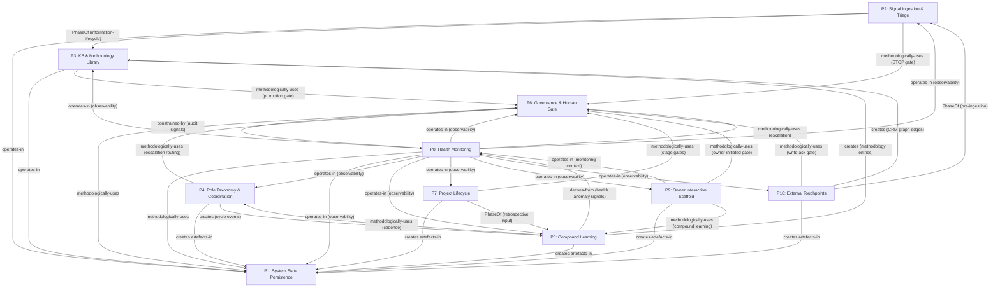

# JETIX Foundation — Master Plan (Wave A Draft)

---

## §0 Status / Scope / Constitutional Baseline

**Wave A deliverable.** This document is the skeleton of the Foundation: 10-part decomposition, interface card summaries, dependency graph, Wave C work-list, open questions, cross-reference matrices, and provenance. Per-part deep architecture is Wave C scope.

**What Wave A is NOT.** It is not a design document (that is Wave C). It is not an implementation plan (that is per-bundle cycles). It is the authority reference that Wave C and beyond must not contradict without an explicit gate.

**Constitutional baseline — three locked sources:**

1. **FUNDAMENTAL Vision v1.0** (`decisions/JETIX-VISION-FUNDAMENTAL-2026-04-27.md`, LOCKED) — 35 use-cases in 12 categories A-L; 55+ anti-scope hard rules; 5-tier access; two-axis evolution. Every Foundation part must map to ≥1 UC or be rejected as scope creep. [src:candidate-parts-merged.md:§5 Coverage Matrix]

2. **FPF v2.0** (`design/JETIX-FPF.md`) — IP-1..IP-8 pillars; 14 typed-mereology invariants (A.1-A.14); 11 Design Principles; 4 Guard-Rails; 8 alpha types; Agency-CHR; F-G-R triad; L/A/D/E lanes; A.14 typed mereology. Every part must declare its FPF anchor. [src:A-1-critic-gate.md:§2]

3. **LOCKS D1-D29** (decisions/ tree, LOCKED) — 29 architectural locks. Relevant anchors per part declared in §1 below.

**Existing 14-layer SYSTEM-OVERVIEW** is prior-art. Foundation supersedes/consolidates/reframes it — NOT a restart. Key divergences: L3 dissolved into Parts 3 and 5; L0+L9 consolidated into Part 6; Parts 7 and 8 are new; Part 10 surfaces CRM which was implicit in the 14-layer model. [src:candidate-parts-merged.md:§4]

**Working pieces respected — DO NOT reinvent:**
- Voice pipeline (cycle 11): `tools/transcribe.py`, `extract.py`, `filter.py`, `run_pipeline.sh`
- CRM (cycle 10): `crm/` tree, 10 `/crm-*` skills, 35 unit tests
- KM Mat A1 substrate (cycle 3b): `/ingest`, `/ask`, `/consolidate`, `/build-graph`, `/lint` skills; wiki/ (552 entities, 577 edges)
- ROY swarm Phase A: brigadier + 5 expert agents, `shared-protocols.md`, hook layer
- B2 mini-swarm (cycle 3b): `/project-bootstrap`, `/project-review`, `/project-archive`, stage-gate DSL

---

## §1 Main Parts of System (10 Parts)

### Summary Table

| # | Part | Classification | Primary UC | FPF anchor | D-Lock | Wave C bundle |
|---|------|----------------|------------|------------|--------|---------------|
| 1 | System State Persistence | U.System | H.1, H.2, H.3 | IP-3, A.1 | D25 | Bundle 1 |
| 2 | Signal Ingestion & Triage | U.System | B.1, B.5, G.1, G.2 | IP-3, A.1, D28 | D28, D25 | Bundle 2 |
| 3 | Knowledge Base & Methodology Library | U.Episteme (primary); U.System pipeline owned by Part 4 | B.2, B.3, B.4, C.2, C.3, F.1, F.2 | A.14, IP-2, A.1, D28 | D27, D28 | Bundle 2 |
| 4 | Role Taxonomy & Coordination Protocol | Dual: manifests=U.Episteme; protocol=U.System (IP-1 split mandatory) | E.1, E.2, E.3 | IP-1, IP-6, IP-8, A.13 | FUNDAMENTAL §3.2.4, D26 | Bundle 2 |
| 5 | Compound Learning & Methodology Capture | Dual: DRR=U.Episteme; ritual=U.System | C.1, C.2, C.3, F.1, F.2 | IP-7, P-10, IP-3 | FUNDAMENTAL §2.2, §3.3.1, §2.4 | Bundle 3 |
| 6 | Governance, Provenance & Human Gate | U.System | A.3, A.4, H.4, H.5, I.4 | IP-4, B.3, A.13, A.6.B | D25, D27, FUNDAMENTAL §4.5, §4.6, §6.7 | Bundle 1 |
| 7 | Project Lifecycle Substrate | U.System | D.1, D.2, H.5 | IP-5, A.6.B | D26, FUNDAMENTAL §3.3 | Bundle 4 |
| 8 | Health Monitoring & System Integrity | U.System | H.4, I.1, I.2, I.3, I.4 | IP-4, P-7 | FUNDAMENTAL §3, §5.2-§5.4, §2.5 | Bundle 3 (BLOCKED on TRADEOFF-01) |
| 9 | Owner Interaction Scaffold | U.System | A.1, A.2, A.3, I.1, I.2, J.1, J.2, J.3 | IP-7, IP-2 (single-owner; F.9 Bridge for multi-owner) | FUNDAMENTAL §2.6, §4.2-§4.3 | Bundle 4 |
| 10 | External Touchpoints & Network Interface | U.System | G.2, K.1, K.2, K.3, L.1, L.2, L.3 | IP-2, A.14, A.1 | D17, D27, FUNDAMENTAL §6.4 | Bundle 4 |

### Per-Part Scope Sentences

**Part 1 — System State Persistence.** Append-only, version-controlled ground truth substrate: git repository discipline, declarative YAML configuration, atomic commit format (`[area] verb what (why)`), reversibility primitives (git revert), and schema validation. Every other part stores its committed state through this part's interface. Has an independent lifecycle (integrity checks, backup cadence, restoration SLI) — a callable service, not a cross-cutting concern. [src:candidate-parts-merged.md:§2 Part 1]

**Part 2 — Signal Ingestion & Triage.** Pipeline converting external raw signals (voice memo, URL, file, book excerpt, email, clipboard) into provenance-tagged, anchor-linked draft candidates — with a mandatory human-review STOP gate enforcing FUNDAMENTAL §4.2 before any entry becomes canonical. The STOP gate is a structural enforcement mechanism (J-Approve class), not a behavioral convention. [src:candidate-parts-merged.md:§2 Part 2]

**Part 3 — Knowledge Base & Methodology Library.** Dual accumulation layer: the curated, queryable, provenance-linked wiki KB (atomic entity files, typed graph edges, niche slices) and the reusable methodology library (patterns, templates, workflows). Primary identity is U.Episteme (the wiki/ content layer). The wiki accessor pipeline (/ingest, /ask, /consolidate, /build-graph, /lint) is a U.System component owned by Part 4 or shared infrastructure — NOT internal to Part 3's holon boundary. [src:candidate-parts-merged.md:§2 Part 3; A-1-critic-gate.md:§6 item 4]

**Part 4 — Role Taxonomy & Coordination Protocol.** Typed message schema, role-manifest definitions, mailbox routing, escalation taxonomy, and hub-and-spoke dispatch protocol governing all agent-to-agent and agent-to-owner communication. IP-1 mandatory split: role manifests (U.Episteme) are never the same artifact as executor bindings (RUSLAN-LAYER). The canonical routing table as declarative YAML (`swarm/lib/routing-table.yaml`) is the primary Wave C gap. [src:candidate-parts-merged.md:§2 Part 4]

**Part 5 — Compound Learning & Methodology Capture.** Structured cycle ritual (Plan/Work/Review/Compound 40/10/40/10) and its artifacts (DRR ledger, per-agent strategies.md, methodology library entries). Converts execution experience into improved future execution via the R2 reinforcing loop. Distinct from Part 4 (coordination protocol) by the Kauffman adjacent-possible lens: Part 5 expands what is adjacent-possible; Part 4 executes within it. Engineering-expert dissent (dissolve into Parts 3+4) preserved — see §5 OQ-MERGED-2. [src:candidate-parts-merged.md:§2 Part 5]

**Part 6 — Governance, Provenance & Human Gate.** Stage-gate enforcement mechanism, provenance-tagging schema, F-G-R trust-calculus discipline, approval-log, and HITL escalation taxonomy ensuring every significant artifact passes human ack before canonical promotion. The immune-system function (IP-4 quarterly audit) is a generic function of this part; the specific executor role is RUSLAN-LAYER. Merged from four independent expert proposals because "provenance substrate" and "human gate" share the same enforcement invariant. [src:candidate-parts-merged.md:§2 Part 6; A-1-critic-gate.md:§6 item 3]

**Part 7 — Project Lifecycle Substrate.** Typed scaffolding for creating, staging, tracking, reviewing, and archiving work items (projects, tasks, cycles) — state machine: `scoped → staged → activated → under-review → closed | archived`. Stage-gate acceptance predicates, appetite declarations, scope records, resource tracking per project type. IP-5 FLAG-MAJOR correction applied: `active` → `activated`, `review` → `under-review` (whitelisted per §5.5a). [src:candidate-parts-merged.md:§2 Part 7; A-1-critic-gate.md:§6 item 1]

**Part 8 — Health Monitoring & System Integrity.** Operational observability substrate: SLI/SLO definition, metric collection, anomaly surfacing, backup verification, agent-drift detection, methodology-freshness tracking, and periodic self-preservation integrity checks. VSM Level-3 (Audit/Optimisation) function. Wave C scope is "specify and stub" — SLI/SLO schema and template authoring; not full implementation. BLOCKED on TRADEOFF-01 (VSM S3 authority designation between Parts 6 and 8). [src:candidate-parts-merged.md:§2 Part 8; wave-c-worklist.md:§2 Part 8]

**Part 9 — Owner Interaction Scaffold.** Structured interface between the system and its human owner: daily working page creation, draft-to-canonical promotion workflow, weekly and monthly review rituals, attention-budget cap enforcement, 3-tier approval SLA taxonomy (L1/L2/L3). Bounded context: single-owner professional knowledge-worker system. F.9 Bridge required when instantiated in multi-owner or team systems. IP-2 FLAG-MAJOR correction applied. [src:candidate-parts-merged.md:§2 Part 9; A-1-critic-gate.md:§6 item 2]

**Part 10 — External Touchpoints & Network Interface.** Typed interface layer for all external relationship and integration surfaces: CRM/contact network (relationship lifecycle, communication history, ICP-generic pipeline), external integration adapter pattern (read-only intelligence trackers, write-ack action coordinators), and multi-channel output routing. Third-party data owner — FUNDAMENTAL §6.4 privacy principles apply structurally. L.1-L.3 are Phase-A stubs; CRM (cycle 10) is operational. [src:candidate-parts-merged.md:§2 Part 10; A-1-critic-gate.md:§6 item 5]

### 5 Cross-Cutting Concerns (Not Parts)

The following were proposed as parts but resolved as ambient disciplines woven into every part's interface card. They MUST NOT be re-introduced as parts in Wave C.

1. **Git/Filesystem Discipline** (D25 Company-as-Code) — enforced via Part 6 governance; declared in every part's §C/§E as a mandatory git-commit output.
2. **Provenance Tagging** (F-G-R + inline `[src:]`) — Part 6 owns compliance enforcement; Part 1 owns durable storage; every part's interface card includes §G F-G-R section.
3. **Operational Rhythm** (40/10/40/10) — cycle structure owned by Part 5; daily/weekly interaction owned by Part 9; health signals owned by Part 8.
4. **Append-Only Log Pattern** — architectural invariant (FUNDAMENTAL §2.1, D25); every part's §E Deontics declares it.
5. **IP-1 Role≠Executor Discipline** — structural home in Part 4; audit home in Part 6; woven into every agent-involving part's interface card.

[src:candidate-parts-merged.md:§3]

---

## §2 Interface Cards Summary

Full per-part interface cards (sections A-H) live in:
`wave-a/interface-cards/part-N-<slug>.md`

**Top-level inputs / outputs / dependency summary per part:**

| Part | Key Inputs | Key Outputs | Primary typed deps (A.14) |
|------|------------|-------------|--------------------------|
| P1 | Write requests from all parts | Committed git artefacts; repo integrity metrics | None upstream (Layer 0) |
| P2 | External raw signals (owner-initiated) | Draft candidates + review report; STOP gate packets | `operates-in` P1; `PhaseOf` P3; `methodologically-uses` P6 |
| P3 | Triage-passed drafts (from P2); compound outputs (from P5); CRM edges (from P10) | Wiki entities; typed edges; methodology patterns; query results | `operates-in` P1; `methodologically-uses` P6; `receives-from` P10 (edges) |
| P4 | Role-manifest definitions; RUSLAN-LAYER executor bindings; dispatch briefs | Committed role manifests; routing decisions; cycle-event packets for P5 | `creates` in P1; `methodologically-uses` P6; `creates` (cycle events) → P5 |
| P5 | Cycle execution packets from P4; retrospective input from P7; health anomaly signals from P8 | DRR entries in strategies.md; promoted methodology patterns → P3 | `creates` in P1; `creates` (methodology) → P3; `methodologically-uses` P4; `derives-from` P8 |
| P6 | Draft artifacts from any part; audit signals from P8 | AWAITING-APPROVAL packets; promotion decisions; approval-log entries | `methodologically-uses` P1; `constrained-by` P8 (audit signals) |
| P7 | Project briefs (owner-initiated) | Project scaffolds; stage-gate evaluations; retrospective DRR input → P5 | `creates` in P1; `methodologically-uses` P6; `PhaseOf` (retrospective) → P5 |
| P8 | Health signals derived from committed artefacts of all parts | Weekly health dashboard; quarterly immune audit; alert packets → P6 | `methodologically-uses` P1; `methodologically-uses` P6 (escalation); `operates-in` all parts; `derives-from` P5 |
| P9 | Agent drafts (from all parts); project status (P7); health alerts (P8) | Daily-log artefacts; weekly review artefacts; monthly reflection; promoted artefacts → P6 | `creates` in P1; `methodologically-uses` P5; `methodologically-uses` P6; `operates-in` P8 |
| P10 | External contact interactions; inbound signals (Phase B: routes to P2); CRM CRUD events | CRM records (committed); CRM graph edges → P3 (edges.jsonl); write-ack gate packets → P6 | `creates` in P1; `PhaseOf` (pre-ingestion) → P2; `creates` (edges) → P3; `methodologically-uses` P6 |

**Cross-cutting coverage check (from dependency-graph.md §5):**
- Git discipline: ALL 10 parts declare git commits in §C and §E. FULLY COVERED.
- Provenance tagging: §G F-G-R tables universal (10/10). Inline [src:] citation density partial for Parts 7, 8, 9 — Wave C normalisation required.
- Append-only log: ALL 10 parts declare append-only discipline. FULLY COVERED.
- IP-1 discipline: ADEQUATE to EXPLICIT across all parts (strongest on Parts 4, 6, 8).

[src:dependency-graph.md:§5]

---

## §3 Dependency Graph

### §3.1 Mermaid Diagram (Topological — Layer 0 to Layer 5)



### §3.2 Topological Build Order

```
Layer 0 (no upstream): Part 1
Layer 1 (depends on P1 only): Part 6
Layer 2 (depends on P1, P6): Parts 2, 3, 4
Layer 3 (depends on P1, P6, P4): Part 5
Layer 4 (depends on P1-P6, P5): Parts 7, 8
Layer 5 (depends on P1-P8): Parts 9, 10
```

This ordering is the Wave C build sequencing constraint. Do not attempt to materialise Part 5 before Part 4's coordination protocol is canonicalised; do not attempt to materialise Part 8 before Part 5's compound phase ritual is specified.

### §3.3 Cycle Analysis Summary

**No true blocking cycles detected.** All three bidirectional pairs are non-blocking:

| Pair | Forward | Reverse | Verdict |
|------|---------|---------|---------|
| P6 ↔ P8 | `constrained-by` (audit) | `methodologically-uses` (escalation routing) | NON-BLOCKING — different relation types; temporal separation (audit is periodic; routing is real-time) |
| P5 ↔ P8 | `derives-from` (anomaly → retrospective) | `derives-from` (compound-rate → health signal) | NON-BLOCKING — healthy Ashby cybernetic control loop (R2 reinforcing + self-correction) |
| P4 ↔ P5 | `creates` (cycle events → DRR) | `methodologically-uses` (cadence) | NON-BLOCKING — time-separated; Part 4 dispatches NOW; Part 5 distils AFTER; improved strategies.md feeds NEXT cycle |

The graph is a DAG at build time. Feedback loops are runtime learning loops, not build-time deadlocks.

[src:dependency-graph.md:§2]

### §3.4 Interface Contradictions (4, from A-2 review)

| ID | Pair | Severity | Nature |
|----|------|----------|--------|
| C1 | P3 ↔ P4 (accessor pipeline ownership) | BLOCKING for Wave C | P3 disowns /ask, /ingest etc. to Part 4 or "shared infra"; P4 does not accept ownership |
| C2 | P8 ↔ P1,P5,P7,P9 (health signal schema) | MEDIUM — non-blocking today | Producing parts declare different signal shapes; P8 has no agreed field names |
| C3 | P10 ↔ P2 (inbound routing vs owner-initiated) | LOW in Phase A | P10 claims PhaseOf routing to P2; P2's trigger is owner-initiated /ingest; becomes real at Phase B |
| C4 | P9 ↔ P6 (PhaseOf vs methodologically-uses) | LOW — nomenclature | P9 §D says PhaseOf P6; correct type is methodologically-uses (P9 uses the gate as a service, is not the exclusive pre-gate phase) |

[src:dependency-graph.md:§3]

---

## §4 Wave C Work-List

Full per-part bullets (34 total) with effort estimates, expert cells, and provenance citations live in:
`wave-a/wave-c-worklist.md`

**Per-Part Bullet Summary:**

| Part | Bullets | Effort | Bundle | Primary gap | Blocking OQ |
|------|---------|--------|--------|-------------|-------------|
| P1 | 3 | S-M | 1 | D27 cross-fork provenance schema stub; D25 commit-format lint as Foundation artefact | None |
| P2 | 3 | M | 2 | STOP gate packet schema with `gate_class` field (UND-4); PARA-tier enforcement; multi-owner stub | UND-1 (Part 4→5 schema, resolved in Bundle 2) |
| P3 | 4 | M-L | 2 | Accessor pipeline ownership (C1 — BLOCKING); methodology library sub-layer materialisation; CRM edge validation (UND-5); /ask --save enforcement | C1 (must resolve with Part 4 Bullet 2 in same bundle pass) |
| P4 | 3 | M-L | 2 | Routing table as declarative YAML (highest-leverage single investment); C1 ownership decision; UND-1 DRR message schema | C1 + UND-1 |
| P5 | 3 | M | 3 | Compound ritual as canonical Foundation artefact; methodology promotion pipeline (UND-3); OQ-MERGED-2 dissolve-condition declaration | OQ-MERGED-2 (Ruslan ack) |
| P6 | 4 | M-L | 1 (partial) + 3 | F-G-R compliance scanner (/lint --check-fg-r stub); blast-radius table (OQ-MERGED-6); TRADEOFF-01 VSM S3 gate packet; C4 edge type correction | TRADEOFF-01 (OQ-1 Ruslan ack — Part 6 Bullet 3 triggers Bundle 3 gate) |
| P7 | 3 | M | 4 | Canonical project schema YAML; IP-5 past-participle exception whitelist (`decisions/policy/`); cadence alignment declaration | None |
| P8 | 4 | M-L | 3 | SLI/SLO schema definition; health signal schema per emitting part (C2 resolution); weekly dashboard + quarterly immune audit templates; alert-routing stub to P6 | TRADEOFF-01 (OQ-1 Ruslan ack before ANY Part 8 bullet) |
| P9 | 3 | M | 4 | Daily-log artefact schema; weekly review artefact schema (with draft-disposition table, C2 producer side); 3-tier SLA taxonomy as canonical Foundation artefact | None |
| P10 | 4 | M | 4 | L.1-L.3 integration adapter stubs; C3 Phase-A boundary clarification; privacy architecture declaration (FUNDAMENTAL §6.4); OQ-MERGED-3 fork-separation checklist | OQ-MERGED-3 (Ruslan ack on scope: Wave A vs Wave C) |

**Total Wave C estimate: ~40-60h ROY swarm work across 4 bundle cycles.**

### Bundle Composition and Order

| Bundle | Parts | Hours est. | Gate condition |
|--------|-------|-----------|----------------|
| Bundle 1 — Substrate Clarifications | P1 (all 3 bullets) + P6 (Bullets 2, 4) | 6-10h | No blockers — start immediately after Ruslan ack on this plan |
| Bundle 2 — Information Lifecycle | P2, P3, P4 (all bullets) | 12-18h | Bundle 1 complete |
| Bundle 3 — Compound + Health | P5, P8 (all bullets) | 10-16h | Bundle 2 complete + TRADEOFF-01 Ruslan ack (OQ-1) |
| Bundle 4 — Operations + External | P7, P9, P10 (all bullets) | 12-16h | Bundle 1 complete (Bundle 3 SLI schema needed for P9 weekly template revision pass) |

**Bundle 1 → Bundle 2 → Bundle 4 can run with Bundle 3 deferred until TRADEOFF-01 ack.** Bundle 3 (Part 8) is the only bundle fully blocked on Ruslan decision.

[src:wave-c-worklist.md:§2, §3, §4]

---

## §5 Open Questions

Consolidated from candidate-parts-merged.md §6, dependency-graph.md §7, A-1-critic-gate.md §4, and wave-c-worklist.md cross-bundle dependencies.

### §5.1 Ruslan Ack Required Before Wave C Dispatch (5 Blockers)

| OQ | Topic | Recommendation | Blocks |
|----|-------|----------------|--------|
| **OQ-1 / TRADEOFF-01** | VSM S3 authority: Part 8 (audit lead) vs Part 6 (enforcement arm) — who is S3 lead? | Part 8 = periodic S3 audit authority; Part 6 = real-time enforcement arm per artefact. Temporal split already declared in both cards. | Bundle 3 entire (Part 8 cannot be designed without this; alert routing depends on S3 lead) |
| **OQ-MERGED-1** | Part 6 consolidated vs split 6a (F-G-R tagging schema) + 6b (human-gate enforcement) | Keep consolidated. If critic disagrees, split would yield 11 parts — still in range. Critic (philosophy-expert) recommends consolidated: "Provenance Officer sub-function within Part 6" is sufficient. | Bundle 1 Part 6 design |
| **OQ-MERGED-2** | Part 5 standalone vs dissolve into Parts 3+4 | Keep standalone. Engineering-expert dissent preserved (F:F2). Dissolve test: if after 3 Wave C cycles DRR work collapses into Parts 3+4 with zero residue, reconvene. Critic supports standalone (R2 loop + Kauffman lens distinct from coordination). | Bundle 3 Part 5 scope |
| **OQ-MERGED-3** | Fork-separation declaration: Wave A scope vs Wave C scope | Critic recommends Wave A scope: per-part "what is Foundation vs RUSLAN-LAYER" declaration before interface card authoring. If deferred to Wave C, interface card authors make fork-separation decisions without constitutional guidance. Ruslan ack needed. | Bundle 4 Part 10 (highest creep risk); all parts to some degree |
| **OQ-MERGED-5 / OQ-SYS-5** | Part 8 materialisation gate: "specify and stub" (Wave C) or "specify and implement" (Wave C)? | Accept "specify and stub" for Wave C. FUNDAMENTAL §3 starter values require 2-3 months calibration. Full implementation is Phase-B work. | Bundle 3 scope definition |

### §5.2 Additional Open Questions (Non-Blocking, Wave C Addresses)

| OQ | Recommendation |
|----|----------------|
| OQ-MERGED-4: Torres CDH / continuous discovery at Foundation level | Generic "opportunity intake" sub-function acceptable in Part 9 weekly review; CDH-branded vocabulary is RUSLAN-LAYER. |
| OQ-MERGED-6: Blast-radius classification — Foundation or RUSLAN-LAYER | Foundation. Default-Deny classifier for novel actions MUST be in Part 6 (FUNDAMENTAL §6.1 hard rule). Delegation targets are RUSLAN-LAYER. |
| OQ-MERGED-7: U.System vs U.Episteme declarations — sufficient for A-2? | Yes, with corrections applied (§6 of A-1-critic-gate.md). No additional philosophy critic pass required before A-2. |
| OQ-3 / UND-1: Part 4→5 DRR schema (raw packets vs pre-processed extractions) | Part 5 receives raw task-return packets; does own DRR extraction. Part 4 §B update needed in Bundle 2. |
| OQ-4 / UND-4: Gate packet `gate_class` field | Add `gate_class: stop_gate | stage_gate | draft_promotion` to AWAITING-APPROVAL packet schema. Bundle 2 Part 6/2 work item. |
| OQ-5: Part 7 cadence alignment (event-driven vs cycle-boundary) | Event-driven (not cycle-boundary-gated) to avoid throughput bottlenecks. Declare in Part 7 §E Laws in Bundle 4. |
| OQ-6: Part 2 multi-owner STOP gate at Phase B/C scale | Multi-owner delegation stub required in Part 2 Wave C interface card. Structural change estimate ~35% (above 30% threshold) at 10× scale. |
| C1: Accessor pipeline ownership (Part 3 vs Part 4 vs shared infra) | BLOCKING for Wave C — must be resolved in Bundle 2 as a joint Part 3 + Part 4 decision. Candidate: `swarm/lib/` as shared-infra home with named owner in routing-table.yaml. |

---

## §6 Cross-Reference Matrices

### §6.1 Part × FUNDAMENTAL §1 UC Category (A-L)

| Part | A | B | C | D | E | F | G | H | I | J | K | L |
|------|---|---|---|---|---|---|---|---|---|---|---|---|
| P1 | | | | | | | | H.1 H.2 H.3 | | | | |
| P2 | | B.1 B.5 | | | | | G.1 G.2 | | | | | |
| P3 | | B.2 B.3 B.4 | C.2 C.3 | | | F.1 F.2 | | | | | | |
| P4 | | | | | E.1 E.2 E.3 | | | | | | | |
| P5 | | | C.1 C.2 C.3 | | E.2 | F.1 F.2 | | | | | | |
| P6 | A.3 A.4 | | | | | | | H.4 H.5 | I.4 | | | |
| P7 | | | | D.1 D.2 | | | | H.5 | | | | |
| P8 | | | | | | | | H.4 | I.1 I.2 I.3 I.4 | | | |
| P9 | A.1 A.2 A.3 | | | | | | | | I.1 I.2 | J.1 J.2 J.3 | | |
| P10 | | | | | | | G.2 | | | | K.1 K.2 K.3 | L.1 L.2 L.3 |

**All 12 UC categories A-L have ≥1 part owner. No orphan UCs detected.** [src:candidate-parts-merged.md:§5]

### §6.2 Part × FPF Invariants (IP-1..IP-8 primary; A.1-A.14 secondary)

| Part | IP-1 | IP-2 | IP-3 | IP-4 | IP-5 | IP-6 | IP-7 | IP-8 | A.1 | A.6.B | A.13 | A.14 |
|------|------|------|------|------|------|------|------|------|-----|-------|------|------|
| P1 | — | — | PRIMARY | — | — | — | — | — | Y (boundary=git root) | Wave C | — | creates edge type |
| P2 | — | — | Y | — | — | — | — | — | Y (permeable boundary) | Wave C | J-Approve (STOP gate) | PhaseOf P3 |
| P3 | — | Y (D27 fork) | Y | — | — | — | — | — | U.Episteme (content holon) | Wave C | J-Approve (promotion) | A.14 typed edges |
| P4 | PRIMARY | Y | Y | — | — | IP-6 (5-block role.md) | — | IP-8 (F.6 6-step onboarding) | Dual (manifests=U.Epist; protocol=U.Sys) | Wave C | J-Auto dispatch; J-Approve role changes | constrained-by P6 |
| P5 | — | — | Y | — | — | — | IP-7 (writing-as-thinking) | — | Dual (DRR=U.Epist; ritual=U.Sys) | Wave C | J-Auto (DRR); J-Strategic (strategic reflection) | creates P3; derives-from P8 |
| P6 | Y (immune fn, not executor) | — | Y | IP-4 (immune-system fn) | — | — | — | — | U.System | PRIMARY (L/A/D/E exemplar) | J-level matrix; Agency-CHR | constrained-by P8 |
| P7 | — | — | Y | — | IP-5 (past-pp states) | — | — | — | U.System | Wave C | J-Approve per stage gate | PhaseOf P5 |
| P8 | Y (immune fn, not executor) | — | Y | IP-4 (quarterly audit fn) | — | — | — | — | U.System | Wave C | J-Auto (monitoring); J-Approve (mode change) | derives-from all parts |
| P9 | — | IP-2 (single-owner; F.9 Bridge) | Y | — | — | — | IP-7 (owner authors; agents extract) | — | U.System | Wave C | L1=J-Strategic; L2=J-Approve; L3=J-Auto | methodologically-uses P5,P6 |
| P10 | — | IP-2 (CRM generic; DACH=RUSLAN) | Y | — | — | — | — | — | Dual (records=U.Epist; pipeline=U.Sys) | Wave C | J-Approve (external write-ack) | creates P3 (CRM edges) |

[src:candidate-parts-merged.md:§2 per-part FPF anchors; A-1-critic-gate.md:§2 per-part review]

### §6.3 Part × D-LOCKS (D1-D29, sparse — only anchored locks shown)

| Part | D17 | D25 | D26 | D27 | D28 | FUNDAMENTAL ref |
|------|-----|-----|-----|-----|-----|-----------------|
| P1 | — | PRIMARY (Company-as-Code substrate) | — | (gap: cross-fork provenance Wave C) | — | — |
| P2 | — | Y (commits via P1) | — | — | PRIMARY (anchor-mandatory at ingest) | §4.2 (HITL at STOP gate) |
| P3 | — | Y (wiki entities committed) | — | Y (forkable with ICP params external) | Y (anchor-mandatory enforced at P2 before P3) | — |
| P4 | — | Y | PRIMARY (hub-and-spoke survives to 50-100 humans) | — | — | §3.2.4 (acting_as mandatory) |
| P5 | — | Y | — | — | — | §2.2 (40/10/40/10 constitutional) |
| P6 | — | PRIMARY (every state change = git commit with provenance) | — | Y (LOCKED tag forkable) | — | §4.5 (12 "never automate" rules); §4.6 (Default-Deny); §6.7 (halt+log+alert) |
| P7 | — | Y | PRIMARY (project schema survives to 50-100 humans) | — | — | §3.3 (cycle completion rate 70-90%) |
| P8 | — | Y | — | — | — | §3 (30+ SLI/SLO pairs); §5.2 (fail-loud); §5.3-§5.4 (backup 3-2-1); §2.5 (health cadence) |
| P9 | — | Y | — | — | — | §2.6 (daily ops); §4.2-§4.3 (human-only tasks; 3-tier SLA) |
| P10 | PRIMARY (CRM filesystem-first) | Y | — | PRIMARY (CRM schema forkable; ICP params external) | — | §6.4 (privacy — consent; forget-request; encryption; no protected-characteristics inference) |

[src:candidate-parts-merged.md:§2 per-part D-Lock anchors]

### §6.4 Part × Current AUDIT Artefact

| Part | AUDIT artefacts (existing, operational) | Gap (Wave C materialisation needed) |
|------|----------------------------------------|--------------------------------------|
| P1 | git repo; `.claude/config/*.yaml` (3 files); `CLAUDE.md`; `shared/schemas/*.json`; `swarm/lib/shared-protocols.md` | D27 cross-fork provenance schema (Phase B); D25 commit-format lint check as Foundation artefact |
| P2 | `tools/transcribe.py, extract.py, filter.py, run_pipeline.sh`; `raw/transcripts/` (151 files); `/ingest` skill; `crm/_scripts/voice_router.py` | STOP gate packet schema with `gate_class`; PARA-tier enforcement in /ingest; multi-owner delegation stub |
| P3 | `wiki/` (552 entities, 577 edges, 9 entity types, 6 niches); `raw/books-md/` (393 books); `raw/research/` (27 files); `wiki/graph/edges.jsonl`; `/ask, /lint, /consolidate, /build-graph, /search-kb` | Methodology library sub-layer consistently populated; C1 accessor ownership declared; UND-5 CRM edge validation; /ask --save default |
| P4 | `.claude/agents/brigadier.md` + 5 expert `.md` files; `agents/*/strategies.md` (8 files); `comms/mailboxes/*.jsonl` (13 channels); `shared/schemas/message.schema.json`; `swarm/lib/shared-protocols.md`; `.claude/hooks/` (3 hook scripts) | `swarm/lib/routing-table.yaml` (declarative YAML — primary gap); C1 ownership decision |
| P5 | `agents/*/strategies.md` (8 files, 19 strategy entries); `swarm/wiki/meta/health.md`; `swarm/wiki/meta/agent-improvements/`; `swarm/evals/` (3/20 cells seeded) | Compound ritual as canonical Foundation artefact; methodology promotion pipeline (UND-3); OQ-MERGED-2 dissolve declaration |
| P6 | `swarm/awaiting-approval/cycle-*.md`; `swarm/gates/AWAITING-APPROVAL-*` (8 gate documents); `swarm/logs/cyc-*/cycle-log.md`; `decisions/` (D1-D29); `/company-status, /knowledge-diff, /lint --check-stage-gates --validate-predicate`; `.claude/config/sg-banned-phrases.yaml` (18 entries) | F-G-R compliance scanner (/lint --check-fg-r stub); blast-radius classification table; TRADEOFF-01 VSM S3 gate packet |
| P7 | `projects/` directory; `.claude/config/project-types.yaml`; `swarm/wiki/_templates/project-*/` (4 template trees); `/project-bootstrap, /project-review, /project-archive, /project-de-morph, /project-promote` skills | Canonical project schema YAML (Foundation artefact); IP-5 whitelist at `decisions/policy/`; cadence alignment declaration |
| P8 | `shared/state/system-health.json` (exists, reports "all green" — no computation mechanism); `shared/state/metrics/agent-performance.json`; `/lint` (11 KB health checks); `/company-status` | SLI/SLO schema; health signal schema; weekly health dashboard template; quarterly immune audit template; alert-routing stub — ALL are gaps; BLOCKED on TRADEOFF-01 |
| P9 | `daily-log/` directory (exists, 1 file); `shared/state/kanban.json`; `/plan-day, /close-day` skills; `shared/state/priorities.json` | Daily-log artefact schema; weekly review schema; 3-tier SLA taxonomy as canonical Foundation artefact |
| P10 | `crm/` tree (24 source files); `crm/_schema/` (4 YAML files); `crm/_scripts/crm.py`; 10 `/crm-*` skills; 35 unit tests; `crm/log.md`; `crm/_scripts/voice_router.py` | L.1-L.3 integration adapter stubs; C3 Phase-A boundary clarification; privacy architecture declaration (`swarm/wiki/foundations/part-10-privacy-architecture.md`); fork-separation checklist |

[src:candidate-parts-merged.md:§2 per-part AUDIT artefact mapping; wave-c-worklist.md:§2 per-part gaps]

---

## §7 Provenance

| Claim / decision | Source | Section |
|-----------------|--------|---------|
| 10 main parts list (deduplication from 20 candidates) | `wave-a/candidate-parts-merged.md` | §1 Synthesis Method, §2 |
| UC coverage matrix (10 parts × 12 categories) | `wave-a/candidate-parts-merged.md` | §5 Coverage Matrix |
| 14-layer SYSTEM-OVERVIEW mapping + divergence | `wave-a/candidate-parts-merged.md` | §4 |
| 5 cross-cutting concerns (resolved as disciplines) | `wave-a/candidate-parts-merged.md` | §3 |
| Interface card sections A-H per part | `wave-a/interface-cards/part-N-*.md` | All sections |
| Cross-cutting coverage checks (5 disciplines × 10 parts) | `wave-a/dependency-graph.md` | §5 |
| Topological build order (Layer 0-5) | `wave-a/dependency-graph.md` | §2.5 |
| 4 contradictions C1-C4 | `wave-a/dependency-graph.md` | §3 |
| 5 underspec UND-1..UND-5 | `wave-a/dependency-graph.md` | §4 |
| Scalability projections (BOSC-A-T-X per part) | `wave-a/dependency-graph.md` | §6 |
| 7 open questions (OQ-1..OQ-7) from dependency graph | `wave-a/dependency-graph.md` | §7 |
| 34 Wave C bullets (10 parts, 4 bundles) | `wave-a/wave-c-worklist.md` | §2 |
| 4-bundle composition + cross-bundle dependencies | `wave-a/wave-c-worklist.md` | §3, §4 |
| A-1 critic gate PARTIAL verdict + 5 FLAG items | `wave-a/A-1-critic-gate.md` | §1 Verdict, §6 |
| 7 OQ-MERGED items (critic positions + recommendations) | `wave-a/A-1-critic-gate.md` | §4 |
| IP-5 FLAG-MAJOR correction (Part 7 state naming) | `wave-a/A-1-critic-gate.md` | §6 item 1 |
| IP-2 FLAG-MAJOR correction (Part 9 bounded context) | `wave-a/A-1-critic-gate.md` | §6 item 2 |
| IP-1 FLAG-MINOR correction (Part 6 meta-agent executor name) | `wave-a/A-1-critic-gate.md` | §6 item 3 |
| A.1 FLAG-MINOR clarification (Part 3 pipeline sub-holon) | `wave-a/A-1-critic-gate.md` | §6 item 4 |
| §6.4 FLAG-MINOR addition (Part 10 privacy reference) | `wave-a/A-1-critic-gate.md` | §6 item 5 |
| OQ-MERGED-3 Wave A scope recommendation (critic) | `wave-a/A-1-critic-gate.md` | §4 OQ-MERGED-3 |
| TRADEOFF-01 VSM S3 designation recommendation | `wave-a/dependency-graph.md` | §2.2, §7 OQ-1 |
| Antifragility verdicts per part (BOSC-A-T-X lens) | `wave-a/dependency-graph.md` | §6.1-§6.10 |

---

*Dissents preserved from source artefacts:*

```yaml
dissents:
  - source: engineering-expert × integrator (candidate-parts-merged.md §6 OQ-MERGED-2)
    claim: "Part 5 (Compound Learning) should dissolve across Parts 3 and 4 rather than exist as standalone"
    F: F2
    ClaimScope: "Contingent on Ruslan ack of OQ-MERGED-2; contingent on Wave C cycle evidence"
    R: "Accepted if Ruslan acks dissolution; refuted if Ruslan acks Part 5 standalone (recommendation) OR if 3 Wave C cycles show zero residual compound-phase-exclusive work"
  - source: engineering-expert × integrator (dependency-graph.md §2.2)
    claim: "P6 constrained-by P8 relationship may produce VSM S3 oscillation at scale if S3 lead not designated"
    F: F4
    ClaimScope: "Holds under Beer VSM S3 theory; observable at higher agent/artefact volume than current Phase A"
    R: "Refuted if TRADEOFF-01 Ruslan ack designates S3 lead before Wave C Part 8 spec begins; accepted if oscillation is measured in health monitoring signal quality after Bundle 3 deployment"
```
