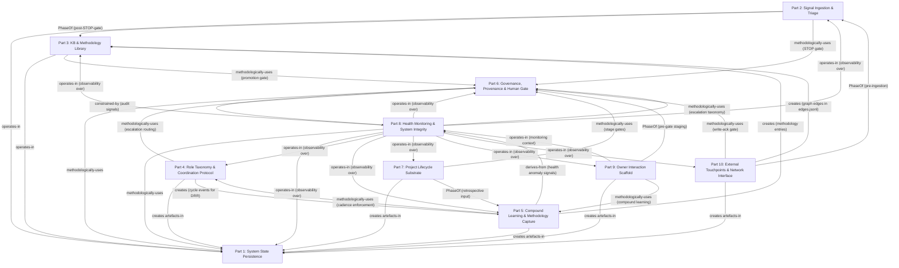

# Foundation Dependency Graph + Cycle/Contradiction Analysis

## §1 Dependency Graph (Mermaid + Adjacency)

### §1.1 Notation conventions

Edge types are per FPF A.14. The following types appear in the graph:

- `operates-in` — the source operates within the substrate/context provided by the target; destroying the target makes the source's persistence impossible but the source is NOT a constituent of the target
- `methodologically-uses` — the source applies a method/gate/protocol owned by the target; the target does not produce artefacts for the source, but the source's process depends on the target's method
- `creates` — the source produces committed artefacts that persist IN the target's write surface (e.g. creating a git commit via Part 1, or creating a methodology entry in Part 3)
- `PhaseOf` — the source is a temporal phase in a lifecycle owned by or leading to the target; the source's output IS the target's input at a pipeline boundary
- `derives-from` — the source's output is a structured derivative of the target's output; weaker than `creates`; the target doesn't depend on the source
- `constrained-by` — the source's behaviour is bounded by signals or audits the target produces; bidirectional accountability without structural dependency

Generic `depends-on` DOES NOT appear in this graph. Where interface cards used informal language I resolved to the correct A.14 type and flag resolutions in §1.3.

### §1.2 Mermaid diagram



### §1.3 Adjacency table (typed edges per FPF A.14)

All edges extracted from interface card §D sections. Source and resolution citations given for every edge.

| From | To | Edge type | Source (card §D) | Resolution notes |
|------|----|-----------|-----------------|-----------------|
| P2 | P1 | `operates-in` | part-2 §D | Canonical; pipeline stage outputs are committed files in git substrate |
| P3 | P1 | `operates-in` | part-3 §D | Canonical; wiki entity files and edges.jsonl are committed artefacts in git |
| P4 | P1 | `creates` | part-4 §D | Role-manifest artefacts, executor-binding.yaml, routing YAML all committed via Part 1 |
| P5 | P1 | `creates` | part-5 §D | DRR entries and all compound artefacts committed through git substrate per IP-3 |
| P6 | P1 | `methodologically-uses` | part-6 §D | Gate decisions committed through git; audit trail lives in Part 1 |
| P7 | P1 | `creates` | part-7 §D | All project artefacts are committed files per IP-3 / D25 |
| P8 | P1 | `methodologically-uses` | part-8 §D | Health records committed as git artefacts; durable storage via Part 1 |
| P9 | P1 | `creates` | part-9 §D | Interaction artefacts (daily logs, review files) are committed files |
| P10 | P1 | `creates` | part-10 §D | CRM records are filesystem-first committed artefacts per D17 / IP-3 |
| P10 | P2 | `PhaseOf` (pre-ingestion boundary) | part-10 §D | Part 10 is the external boundary; inbound signals forwarded to Part 2 for processing |
| P2 | P3 | `PhaseOf` (information-lifecycle) | part-2 §D + part-3 §D | Triage draft is the pre-KB phase; Part 3 is the next phase after STOP gate ack |
| P2 | P6 | `methodologically-uses` | part-2 §D | STOP gate is an instance of Part 6's HITL escalation discipline; J-Approve decision-class owned by Part 6 |
| P3 | P6 | `methodologically-uses` | part-3 §D | Every draft-to-canonical promotion requires Part 6's human-gate ack |
| P4 | P6 | `methodologically-uses` | part-4 §D | Governance gate owns compliance audit on role-manifests; escalation routing through Part 6 |
| P5 | P3 | `creates` | part-5 §D | Compound outputs create methodology library entries in KB |
| P5 | P4 | `methodologically-uses` | part-5 §D | Compound phase draws on coordination protocol cycle structure (40/10/40/10 cadence enforced at Part 4 dispatch level) |
| P6 | P8 | `constrained-by` (audit signals) | part-6 §D | Part 6 gate enforcement constrained by Part 8 audit signals; dual ownership declared |
| P7 | P5 | `PhaseOf` (retrospective input) | part-7 §D | Project retrospective DRR input feeds compound learning at cycle close |
| P7 | P6 | `methodologically-uses` | part-7 §D | Per-project stage gates reuse Part 6's gate mechanism |
| P8 | P1 | `methodologically-uses` | part-8 §D | Health records committed; durable storage via Part 1 |
| P8 | P6 | `methodologically-uses` | part-8 §D | Anomaly alerts routed through Part 6's escalation taxonomy |
| P8 | P5 | `derives-from` (health anomaly signals) | part-5 §D (partial) + part-8 §A | Health signals from Part 8 inform compound-phase retrospective; P8→P5 direction not P5→P8 |
| P9 | P1 | `creates` | part-9 §D | Interaction artefacts committed files |
| P9 | P5 | `methodologically-uses` | part-9 §D | Monthly reflection is the S4 input to Compound Learning; owner reflection feeds strategies.md update proposals |
| P9 | P6 | `PhaseOf` | part-9 §D | Promotion workflow forwards artefacts into Part 6's gate mechanism; Part 9 is the pre-gate staging phase |
| P9 | P8 | `operates-in` (monitoring context) | part-9 §D | Owner reflection data (attention-budget utilisation, daily log completion rate) are health signals Part 8 monitors |
| P10 | P1 | `creates` | part-10 §D | CRM records committed via Part 1 |
| P10 | P3 | `creates` | part-10 §D | CRM graph edges written to wiki/graph/edges.jsonl (8 CRM edge types feed Part 3's typed graph) |
| P10 | P6 | `methodologically-uses` | part-10 §D | All outbound write-actions to external services route through Part 6's gate mechanism |
| P4 | P5 | `creates` (cycle events) | part-4 §B | Coordination cycle events feed DRR extraction in compound phase |

**Edges declared in §A Inputs but not in §D (read-only references — verified NOT dependency edges):**

| From | To | Declared in | Type resolution | Verdict |
|------|----|-------------|----------------|---------|
| P2 (reads wiki/index.md) | P3 | part-2 §A + §D | Explicitly resolved in part-2 §D as `methodologically-uses P3` (read-only at anchor-suggestion step) — NOT a write dependency | Non-structural read; not added to dependency graph; Part 2 card correctly calls it out |
| P8 (collects health signals from all parts) | P1–P10 | part-8 §A | `operates-in` (observability over) — Part 8 observes committed artefacts; it does not write TO other parts | Correctly modelled as `operates-in`; Part 8 has no write dependency on individual parts; it reads derived health signals |

---

## §2 Cycle Analysis

A cycle in the dependency graph is a path A → B → ... → A where the SAME edge type closes the loop. This would mean Part A cannot be built without Part B which cannot be built without Part A — a blocking acyclic violation.

I examine every pair where edges run in both directions.

### §2.1 Candidate bidirectional pairs (all pairs with edges in both directions)

| Pair | Forward | Reverse | Both directions? |
|------|---------|---------|-----------------|
| P6 ↔ P1 | P6 `methodologically-uses` P1 | None from P1 to P6 | No — P1 has no upstream dependencies by design (part-1 §D: "No upstream part dependencies") |
| P6 ↔ P8 | P6 `constrained-by` P8 | P8 `methodologically-uses` P6 | YES — examine below |
| P5 ↔ P8 | P8 `derives-from` P5 (health signals inform retrospective) | P5 `derives-from` P8 (health anomaly signals inform compound phase) | YES — examine below |
| P9 ↔ P6 | P9 `PhaseOf` P6 | None from P6 to P9 directly | No — Part 6 sends gate results (rejections, promotions) back to Part 9's originating drafts, but this is a data-return event, not a structural dependency |
| P4 ↔ P5 | P5 `methodologically-uses` P4 | P4 `creates` (cycle events for) P5 | YES — examine below |

### §2.2 P6 ↔ P8 — Non-blocking (different relation types)

Forward: `P6 constrained-by P8` — Part 6's gate enforcement posture is constrained by Part 8's audit findings (e.g. if Part 8 detects F-G-R compliance drift, Part 6 updates its enforcement scope).

Reverse: `P8 methodologically-uses P6` — Part 8 routes anomaly alerts through Part 6's escalation taxonomy.

**Cycle type assessment:** The edge types are structurally DIFFERENT. `constrained-by` is an audit-accountability relation (Part 8 can change Part 6's operational parameters over time via audit findings). `methodologically-uses` is a runtime routing relation (Part 8 sends alert packets to Part 6 in a live cycle). These are not the same relation closing a loop — they are two distinct information flows running in opposite directions through the P6↔P8 channel.

**Is this a true blocking cycle?** No. The build order constraint is: Part 1 → Part 6 → Part 8 (Part 8 cannot escalate until Part 6's escalation taxonomy is defined). The `constrained-by` edge flows backwards in time (Part 8 audits Part 6 AFTER Part 6 has been operating for cycles, not at build time). There is no build-time deadlock.

**Severity: NON-BLOCKING.** Different relation types; temporal separation (build-time vs cycle-time).

**VSM S3 oscillation risk (TRADEOFF-01 — preserved from part-8 §H):** Beer VSM predicts that two controllers sharing S3 authority without a designated S3 lead create oscillation risk. This is not a graph cycle but a governance ambiguity: neither P6 nor P8 has explicit S3 authority dominance declared. Wave C MUST designate the S3 lead (recommendation: P8 as audit-authority lead; P6 as enforcement-arm follower). This is an OPEN Q (see §7-OQ-1).

### §2.3 P5 ↔ P8 — Non-blocking (different relation types, different data)

Forward: `P8 derives-from P5` — Part 8 collects the compound-application-rate metric that Part 5 emits (health signal: has the compound phase run? how many DRR entries were written?). Part 8 is the consumer; it observes Part 5's outputs.

Reverse: `P5 derives-from P8` — Part 8's anomaly reports inform the retrospective lens at compound phase. If Part 8 flags a health anomaly (e.g. strategies.md staleness), Part 5's compound-phase review addresses it.

**Cycle type assessment:** Both are `derives-from` but carry different payload in each direction. P8→P5 carries health signals (observational outputs from Part 8's monitoring run). P5→P8 carries retrospective scope (Part 5 reads Part 8 anomalies as input to the compound review). The loop is a healthy closed feedback loop: execute (Part 5) → observe (Part 8 monitors Part 5) → adjust (Part 5 reads Part 8 anomalies at next compound phase). This is the standard Ashby cybernetic control loop: controller (Part 5's retrospective) receives variety from the system state (Part 8's anomaly signals) to correct drift.

**Is this a true blocking cycle?** No. Build order: Part 1 → Part 5 (can be scaffolded without Part 8's signals; strategies.md is manually seeded at cycle 0). Part 8 can be built after Part 5 exists. The feedback loop only becomes live after both are operational — no build-time deadlock.

**Severity: NON-BLOCKING.** Healthy reinforcing feedback loop. The loop is DESIRED (it is the system's self-correction mechanism at the compound phase).

### §2.4 P4 ↔ P5 — Non-blocking (producer/consumer, no circular build dependency)

Forward: `P5 methodologically-uses P4` — Part 5 produces compound artefacts within the cadence that Part 4's dispatch protocol enforces. Part 5 does not define the cadence; it operates within it.

Reverse: `P4 creates (cycle events for) P5` — Part 4's dispatch of coordination cycles generates the raw events that Part 5 extracts DRR entries from.

**Cycle type assessment:** The loop structure is: Part 4 dispatches a cycle → Part 5 extracts learning from that cycle → Part 5's output (updated DRR rules in strategies.md) informs better coordination in the NEXT cycle → Part 4 dispatches the next cycle using those rules. This is the R2 reinforcing loop (agent self-improvement). It is time-separated: Part 4 dispatches NOW; Part 5 distils AFTER; the improved strategies.md is read by Part 4 in the NEXT cycle, not the current one.

**Is this a true blocking cycle?** No. Build order: Part 4 can be scaffolded before Part 5 (coordination protocol works at cycle 0 with empty strategies.md). Part 5 requires Part 4's cadence structure to be defined first (Part 4 is a build prerequisite for Part 5). The R2 feedback loop is not a build-time dependency — it is a runtime learning loop.

**Severity: NON-BLOCKING.** Healthy R2 reinforcing loop; Part 4 is a build prerequisite for Part 5 (acyclic at build time).

### §2.5 Cycle analysis verdict

**No true (blocking) cycles exist in the dependency graph.**

All three bidirectional pairs are non-blocking: they involve (a) different relation types, (b) temporal separation between build-time and cycle-time, or (c) healthy cybernetic feedback loops that are structurally desired.

The graph is a DAG (Directed Acyclic Graph) at build time. The topological sort (build order) is:

```
Layer 0 (no upstream dependencies):   Part 1
Layer 1 (depends on P1 only):          Part 6
Layer 2 (depends on P1, P6):           Part 2, Part 4, Part 3 (passive content layer)
Layer 3 (depends on P1, P6, P4):       Part 5
Layer 4 (depends on P1-P6, P5):        Part 7, Part 8
Layer 5 (depends on P1-P8):            Part 9, Part 10
```

This ordering defines the Wave C build sequencing constraint: do not attempt to materialise Part 5 before Part 4's coordination protocol is canonicalised; do not attempt to materialise Part 8 before Part 5's compound phase ritual is specified.

---

## §3 Interface Contradictions

For each consumer-producer pair where §A Inputs and §B Outputs declare incompatible data shapes.

### §3.1 Contradiction-C1: Part 3 accessor pipeline holon ownership — AMBIGUITY, not contradiction

**Consumer claim (Part 4 §A Inputs):** Part 4 does not explicitly claim to own the wiki accessor pipeline (/ingest, /ask, /consolidate, /build-graph, /lint).

**Producer claim (Part 3 §F Anti-scope):** "This part does NOT own the accessor pipeline (U.System) — `/ingest`, `/ask`, `/consolidate`, `/build-graph`, `/lint` are U.System accessor services owned by Part 4 (coordination protocol infrastructure) or shared infrastructure." [part-3 §F, first bullet]

**Part 4 §E Deontics:** Part 4 MUST maintain a canonical role-manifest registry. It does NOT explicitly accept ownership of the wiki accessor pipeline as a deontic obligation. The routing table YAML is Part 4's Wave C materialisation task, but no mention of /ask, /ingest, /consolidate.

**Contradiction status:** PARTIAL. Part 3 disowns the accessor pipeline to Part 4. Part 4's interface card does not accept that ownership. The pipeline is currently in limbo — Part 3 says "not mine, Part 4 or shared infra"; Part 4 does not say "mine." This is not a data-shape mismatch (no output → input format clash), but a BOUNDARY OWNERSHIP gap that will produce a Wave C task orphan if unresolved.

**Required reconciliation:** Wave C interface card for Part 4 MUST explicitly accept or reject the wiki accessor pipeline as a constituent. If accepted: Part 4 §B Outputs must list "`wiki accessor pipeline skills (/ask, /ingest, /consolidate, /build-graph, /lint) :: invocable by any consumer :: on-demand`" and §D must add a `creates` edge to Part 3. If rejected (treated as shared infrastructure): a new §3 cross-cutting concern entry must be added to candidate-parts-merged.md for "wiki accessor pipeline as shared infra" — it must be named, owned, and have a defined maintenance party. The current `F2 / R-low` routing table status (embedded in system prompts) makes this more urgent.

**Severity: BLOCKING for Wave C task assignment.** Not a runtime defect today (skills work), but a structural ownership gap that will cause Wave C work to be unanchored.

### §3.2 Contradiction-C2: Part 8 health signal collection — passive observation vs active interface contract

**Consumer claim (Part 8 §A Inputs):** Part 8 declares it collects health signals FROM all other parts: "Health signals from ALL other parts (derived from their committed artefacts) :: periodic-collection event." The qualifier "derived from their committed artefacts" implies passive observation — Part 8 reads git history and file system state.

**Producer claim (Parts 1-7, 9-10 §B Outputs):** Several parts explicitly list Part 8 as a named consumer in their §B Outputs and declare specific signals emitted to Part 8:
- Part 1 §B: "repo integrity metrics (commit cadence, branch status, backup SLI) :: health signal :: periodic health-poll event" [part-1 §B]
- Part 5 §B: "Compound-application-rate metric update; strategies.md growth delta" [part-5 §B]
- Part 7 §B: "Resource-budget summary per project (time / appetite / scope delta) → consumed by Part 8" [part-7 §B]
- Part 9 §B: no explicit Part 8 output declared; Part 9 §D says "Part 9 operates-in health monitoring context of Part 8" — signals flow from P9 to P8 but no structured output shape is declared

**Shape mismatch:** Parts 1, 5, 7 declare structured output shapes for Part 8 (specific metrics with named fields). Part 8 declares it collects signals as "derived from their committed artefacts" — a generic passive model. No agreed-upon schema exists between the emitter-side format and the collector-side ingestion format. Part 9 does not declare a Part 8 output at all despite Part 8 §A listing "daily log creation rate, attention-budget utilisation" as inputs from Part 9.

**Required reconciliation:** Wave C must define a health signal schema with named fields per part. The schema must be jointly authored by Part 8 (as consumer) and each producing part (as emitter). Currently the signal contract is implicit (both sides assume the other knows what fields look like). Specifically: Part 9 must add a §B Output row for Part 8 declaring the health signal shape it emits; Part 8 §A must declare the specific field names it reads per part.

**Severity: MEDIUM. Non-blocking today** (health monitoring is "specify and stub" per OQ-MERGED-5). Becomes blocking at Phase B when Part 8 attempts to compute SLI/SLO values from inputs that have no agreed schema.

### §3.3 Contradiction-C3: Part 10 inbound signal routing — dual role claim

**Part 10 §B Outputs declares:** "Inbound signal forwarding → Part 2 (Signal Ingestion) :: signal-ready events (external capture is Part 2's domain; Part 10 is the boundary layer, not the ingestion pipeline)"

**Part 10 §D declares:** `PhaseOf Part 2` — "inbound external signal capture is the pre-processing phase before Part 2's ingestion pipeline; Part 10 is the external boundary, Part 2 processes what enters"

**Part 2 §A Inputs declares:** "External world (owner-supplied): raw signal file ... :: owner initiates `/ingest --anchor=<topic>` or voice-pipeline run"

**Contradiction:** Part 10 positions itself as the external boundary that ROUTES signals to Part 2. But Part 2's §A Inputs declares the signal source as "External world (owner-supplied)" — it does not name Part 10 as its signal source. Part 2's triggering event is "owner initiates /ingest" — an owner action, not a Part 10 routing event. This creates an ambiguity: when an external CRM contact sends an email with a link, does Part 10 intercept it and forward to Part 2 (Part 10's model), or does the owner manually invoke /ingest on that email (Part 2's model)?

**Required reconciliation:** For Phase A (single-owner, manual-initiation discipline per FUNDAMENTAL §6.2), Part 2's model is correct: owner initiates all ingestion. Part 10's routing claim is a Phase-B/C capability (L.1-L.3 stubs) that does not yet apply. Wave C interface cards should clarify: Part 10's `PhaseOf Part 2` edge applies ONLY when L.1-L.3 external integrations are operational (Phase B); in Phase A, all signals enter Part 2 via owner-initiated /ingest. Part 10's Phase-A role is CRM record management and write-ack gating, not signal routing.

**Severity: LOW in Phase A.** L.1-L.3 are explicitly Phase-A stubs per Part 10's own interface card. The contradiction becomes real at Phase B. Flag now so Wave C does not inherit the ambiguity silently.

### §3.4 Contradiction-C4: Part 9 → Part 6 interaction — PhaseOf vs direct gateway claim

**Part 9 §D declares:** `PhaseOf Part 6` — "promotion workflow forwards artefacts into Part 6's gate mechanism; Part 9 is the pre-gate staging phase for human-initiated promotions"

**Part 9 §B Outputs declares:** "Promoted canonical artefacts → forwarded to Part 6 (Governance) for gate processing :: promotion-request events"

**Part 9 §C Side-effects declares:** "Trigger Part 6 AWAITING-APPROVAL packet for any item classified as L1 or L2 gate tier"

**Part 6 §A Inputs declares:** "Draft artifact from any part :: Markdown file with YAML frontmatter ... :: `submit-draft-for-gate-event`"

**Potential contradiction:** Part 9 §D calls itself a `PhaseOf Part 6`. But `PhaseOf` implies Part 9's output IS Part 6's input at a pipeline boundary — Part 9 is the pre-gate phase of Part 6's gate mechanism. However, Part 6 §A Inputs lists "draft artifact from ANY part" — not specifically from Part 9. Any part can submit directly to Part 6's gate. Part 9 is not the exclusive pre-gate funnel.

**Resolution:** This is not a true contradiction but a scoping imprecision. `PhaseOf` correctly describes Part 9's role for OWNER-INITIATED promotions (the owner reviews a draft in Part 9's daily/weekly workflow and then forwards it to Part 6). Other parts (Part 2, Part 3, Part 7) also submit directly to Part 6 for agent-produced artefacts. Part 9 is A pre-gate staging phase (for owner-initiated items), not THE only pre-gate phase. The edge type should arguably be `methodologically-uses Part 6` rather than `PhaseOf Part 6`, since Part 9 is not structurally a phase of Part 6's lifecycle — it uses Part 6's gate as a service.

**Required reconciliation:** Wave C Part 9 interface card should change the §D edge from `PhaseOf Part 6` to `methodologically-uses Part 6` with rationale: "Part 9 uses Part 6's AWAITING-APPROVAL gate as a service for owner-initiated promotions; it is not the exclusive or structurally-prior phase of Part 6's lifecycle." This is a minor nomenclature correction, not a behavioural change.

**Severity: LOW. Non-blocking.** Purely a typed-edge precision issue.

---

## §4 Underspecified Interfaces

For each Part X → Part Y dependency, assess whether the data-shape, event-trigger, and side-effect are fully specified in both cards.

### §4.1 UND-1: Part 4 → Part 5 (cycle events for DRR extraction)

**Part 4 §B Outputs declares:** "Part 5 (Compound Learning): DRR coordination patterns from cycle retrospective — structured extraction, not authored by agents :: `compound-phase-extract-event`"

**Part 5 §A Inputs declares:** "Cycle execution outputs (from all parts): Structured packets: `summary`, `proposed_writes[]`, `provenance[]`, `confidence`, `escalations[]` :: Compound phase trigger"

**Gap:** Part 4 says it emits "DRR coordination patterns from cycle retrospective — structured extraction." Part 5 says it receives "Structured packets: `summary`, `proposed_writes[]`, `provenance[]`, `confidence`, `escalations[]`." These are two different schemas described at the same interface boundary. Part 4 describes EXTRACTED patterns; Part 5 describes RAW task-return packets. It is unclear whether Part 5 receives the raw task-return packets (and does its own DRR extraction), or whether Part 4 pre-processes those packets into DRR-formatted extractions before handing to Part 5.

**What's missing:** The data-shape contract at the Part 4 → Part 5 boundary. Specifically: does Part 5 receive (a) raw structured packets from individual agents and extract DRR entries itself, or (b) pre-processed DRR-formatted extractions from Part 4's retrospective function? The answer determines which part owns the DRR extraction logic — a non-trivial responsibility.

**Required action:** Wave C must define the Part 4 → Part 5 message schema. Recommendation: Part 5 receives raw task-return packets (option a) and does its own DRR extraction, keeping the extraction logic close to the compound-phase semantics. Part 4 emits the packets; Part 5 processes them. Part 4 §B should be updated to say "Structured task-return packets from all dispatched roles :: `compound-phase-start-event`."

### §4.2 UND-2: Part 8 health signal schema (already noted in §3.2 — listed here for completeness)

The health signal schema between producing parts (P1, P5, P7, P9) and Part 8 is underspecified. No agreed field names, formats, or measurement cadences. Part 8 §A lists metrics by informal description; no producing part's §B Output uses Part 8's field names. See §3.2 for full analysis and reconciliation requirement.

### §4.3 UND-3: Part 5 → Part 3 (methodology pattern promotion)

**Part 5 §B Outputs declares:** "Promoted methodology patterns: templates, workflow schemas, validated heuristics — committed wiki entries with typed edges :: `methodology-entry-promoted-event`"

**Part 3 §A Inputs declares:** "Part 5 (Compound Learning & Methodology Capture): methodology library entry (DRR-derived pattern, workflow, or template in wiki-entity format) :: compound-phase-completed event :: end of each 40/10/40/10 cycle"

**Gap:** Both sides acknowledge the interface. But neither card specifies: (a) the admissibility criteria for a methodology pattern to be promoted (Part 5 §E says "≥1 DRR 'Result: validated' marker across ≥2 cycles" but Part 3 §E Admissibility does not mention this criterion — it lists general admissibility), (b) the entity-type the promoted pattern will use in Part 3 (is it `wiki/foundations/`, `wiki/concepts/`, or `wiki/methodology/`?), (c) who triggers the promotion (agent during compound phase, or owner after reviewing compound-phase output?).

**Required action:** Wave C must add to Part 3 §E Admissibility: "Methodology pattern from Part 5 is accepted only if it carries ≥1 DRR 'Result: validated' marker from ≥2 distinct cycles AND a `rule_slug` for deduplication." Wave C must also canonicalise the target entity-type for methodology patterns (current state: Part 5 §H notes this is the primary Wave C gap — "methodology library sub-layer within Part 3 is not yet consistently populated").

### §4.4 UND-4: Part 6 → Part 2 (STOP gate mechanism specification)

**Part 2 §D declares:** "`methodologically-uses Part 6` — the STOP gate is an instance of Part 6's HITL escalation discipline; the J-Approve decision-class authority is owned by Part 6 but instantiated structurally in Part 2"

**Part 6 §A Inputs:** Does not list Part 2's STOP gate as a named input trigger. Part 6 §A lists "Draft artifact from any part :: ... :: `submit-draft-for-gate-event`" — generic, covers Part 2 by implication.

**Gap:** The STOP gate is described in Part 2 as "structural, not behavioral" and as "an instance of Part 6's HITL escalation discipline." But Part 6's interface card does not describe how the STOP gate instance is distinguished from other gate submissions — the data-shape of the gate packet from Part 2's STOP gate is not declared. Does it carry a `gate_type: stop_gate` field? Is there a specific artefact path for Part 2 STOP gate packets? Neither card specifies this.

**Required action:** Wave C must define the gate packet schema with a `gate_class` field distinguishing STOP gate (Part 2 origin) from stage gate (Part 7 origin) from arbitrary draft promotion (Part 3 origin). This enables Part 6 to apply the correct J-level authority rule (STOP gate → J-Approve per J-level decision matrix; stage gate → also J-Approve but with different blast-radius classification).

### §4.5 UND-5: Part 10 → Part 3 (CRM graph edges into wiki/graph/edges.jsonl)

**Part 10 §B Outputs declares:** "CRM graph edges → `wiki/graph/edges.jsonl` :: relationship-map events (8 CRM edge types per CLAUDE.md CRM System section)"

**Part 3 §D:** Does not list Part 10 as a dependency or a creator of its content. Part 3 §D only notes: "Part 3 (U.Episteme) is passive content; it does not depend on the accessor pipeline." No mention of Part 10 as a content creator.

**Part 3 §C Side-effects declares:** "Graph edge append: `wiki/graph/edges.jsonl` — typed A.14 edge appended (never mutated in place)" — this describes Part 3's own writes; CRM edges from Part 10 are not mentioned.

**Gap:** Part 10 writes CRM relationship edges to `wiki/graph/edges.jsonl` — a file owned by Part 3. But Part 3 does not acknowledge Part 10 as a content creator in its §D Dependencies. The edge type from Part 10 to Part 3 is declared as `creates` in Part 10 §D, but this edge is missing from Part 3's §D. This asymmetry means the two cards are inconsistent in their view of who writes to `edges.jsonl`.

**Required action:** Part 3 §D must be updated in Wave C to add: "`receives-from Part 10` — CRM relationship edges (8 CRM edge types) written to `wiki/graph/edges.jsonl` by Part 10 as a content creator; these edges are NOT Part 3's own writes but are stored in Part 3's managed file." Part 3 §E Laws should also note: "edges from CRM (Part 10) must conform to the same A.14 typed-edge schema as Part 3's own edges; Part 3's /lint pass validates all edges in edges.jsonl regardless of source."

**Severity: MEDIUM.** /lint will catch schema violations at runtime, but the structural ownership of CRM edge validation is unresolved. If Part 10 writes malformed edges, who is responsible for catching them before write vs after?

---

## §5 Cross-Cutting Concerns Coverage Check

Five cross-cutting concerns from candidate-parts-merged.md §3. For each, assess whether every relevant part's interface card declares its application.

### §5.1 Cross-cutting 1: Git/Filesystem Discipline (D25 Company-as-Code)

**Requirement:** Every Foundation interface card's Effects (E lane) must declare the git-commit artefact that corresponds to each state change. [candidate-parts-merged.md §3 item 1]

| Part | §C Side-effects declares git commits? | §E Effects declares durable git commit? | Coverage verdict |
|------|--------------------------------------|----------------------------------------|-----------------|
| Part 1 | YES — "every accepted write from any part becomes an immutable commit" | YES — "After a successful commit: artefact is durable, path-addressable" | COVERED |
| Part 2 | YES — Transcript write, draft candidate write, STOP gate artefact all named with git commits | YES — "After pipeline run: reports/review_YYYY-MM-DD.md exists and is committed" | COVERED |
| Part 3 | YES — Entity file write, graph edge append, index update, log append all via Part 1 | YES — "After promotion: entity is path-addressable" | COVERED |
| Part 4 | YES — Mailbox write `comms/mailboxes/<role>.jsonl` named; committed role-manifest artefacts listed | YES — "Successful dispatch: verifiable via comms/mailboxes/<role>.jsonl append" | COVERED |
| Part 5 | YES — Writes to `agents/<role>/strategies.md` (append-only DRR entries); promotions via Part 3 | YES — "strategies.md entry count grows per cycle" | COVERED |
| Part 6 | YES — Writes `swarm/awaiting-approval/`, `decisions/`, approval-log entries via Part 1 | YES — "100% of canonical promotions trace to a Part 6 gate event in audit log" | COVERED |
| Part 7 | YES — git commits named: `[project] staged: <slug>`, `[project] activated: <slug>` | YES — "Project scaffold exists in projects/<slug>/ within one work session" | COVERED |
| Part 8 | YES — Append to `swarm/wiki/log.md`; write to `shared/state/system-health.json`; quarterly audit writes to `decisions/quarterly/` | YES — "Weekly: decisions/weekly/<YYYY-WNN>-health.md committed" | COVERED |
| Part 9 | YES — git commits named: `[daily] plan: <YYYY-MM-DD>`, `[review] weekly: <YYYY-WNN>` | YES — "Daily log creation rate: target ≥5 per working week" | COVERED |
| Part 10 | YES — git commits named: `[crm] touch: <slug>`, `[crm] add: <slug>` | YES — "CRM records committed with provenance within one session" | COVERED |

**Verdict: ALL 10 parts declare git discipline in §C and §E. FULLY COVERED.**

### §5.2 Cross-cutting 2: Provenance Tagging (F-G-R and inline [src:...])

**Requirement:** Every part's interface card includes a mandatory provenance section (§G F-G-R tagging) AND inline [src:] citations throughout. [candidate-parts-merged.md §3 item 2]

| Part | §G F-G-R table present? | Inline [src:] citations in §D? | Provenance coverage |
|------|------------------------|-------------------------------|-------------------|
| Part 1 | YES — 4-row table with F/G/R per artefact type | YES | COVERED |
| Part 2 | YES — 4-row table | YES | COVERED |
| Part 3 | YES — 5-row table | YES | COVERED |
| Part 4 | YES — 5-row table | YES — sources in frontmatter + inline | COVERED |
| Part 5 | YES — 5-row table | YES | COVERED |
| Part 6 | YES — 6-row table | YES — self-exemplification note at top of card | COVERED |
| Part 7 | YES — 5-row table | Partial — sources in frontmatter; §D cites sources by name but lacks inline [src:] format | PARTIAL — Wave C: add inline [src:] to §D and §E |
| Part 8 | YES — 5-row table | Partial — same as Part 7; sources in frontmatter but §D lacks inline citations | PARTIAL — Wave C: add inline [src:] to §D and §E |
| Part 9 | YES — 5-row table | Partial — sources in frontmatter; §D references "A-1-critic-gate.md §2 Part 9 A.14" correctly | PARTIAL — Wave C: standardise inline [src:] format throughout |
| Part 10 | YES — 7-row table | YES — inline citations present | COVERED |

**Verdict: §G tables are UNIVERSALLY present (10/10). Inline [src:] citation density is inconsistent across Parts 7, 8, 9 — these need Wave C normalisation to match the standard set by Parts 1-3 and 6.**

### §5.3 Cross-cutting 3: Operational Rhythm / Cadence (40/10/40/10)

**Requirement:** The cadence is owned by Part 5 (compound ritual) and Part 9 (owner interaction); health signals owned by Part 8. Every agent-involved part should declare its participation in the cadence or be explicit about its cadence-independence. [candidate-parts-merged.md §3 item 3]

| Part | Declares cadence participation? | Coverage verdict |
|------|-------------------------------|-----------------|
| Part 1 | Implicit — all commits happen within cycle rhythm; no explicit cadence declaration needed (substrate) | ADEQUATE — substrate has no cadence of its own |
| Part 2 | Implicit — pipeline runs per signal event, not per cycle cadence; no explicit declaration | ADEQUATE — event-driven, not cadence-driven |
| Part 3 | Implicit — KB is updated as drafts are promoted; cadence-independent content store | ADEQUATE |
| Part 4 | EXPLICIT — §E declares "40/10/40/10 cadence ratio is FUNDAMENTAL §2.2 constitutional value — drift tolerance ±10pp before health alert fires" | COVERED |
| Part 5 | EXPLICIT — owns the 40/10/40/10 cadence ritual; §E declares it as constitutional | COVERED |
| Part 6 | EXPLICIT — gate throughput is measured per cycle; approval lag SLI declared | COVERED |
| Part 7 | PARTIAL — mentions cycle completion rate as a health indicator; does not explicitly align project lifecycle states to the 40/10/40/10 cadence | GAP: Wave C should clarify whether project stage gates align with cycle boundaries or operate independently |
| Part 8 | EXPLICIT — DRR write rate per cycle, compound-application rate as inputs; §D declares Part 8 collects Part 5 cadence metrics | COVERED |
| Part 9 | EXPLICIT — weekly and monthly review artefacts; daily log creation rate; attention-budget cadence enforcement | COVERED |
| Part 10 | IMPLICIT — CRM "stuck" detection uses >14d criterion (time-based but not cycle-cadence-based); no cadence declaration | ADEQUATE — CRM operates on real-world time, not cycle cadence |

**Verdict: Cadence declaration is ADEQUATE across most parts. One gap: Part 7 does not declare whether project stage gates are cycle-aligned or event-driven. This should be clarified in Wave C.**

### §5.4 Cross-cutting 4: Append-Only Log Pattern

**Requirement:** Every part that produces state must declare append-only discipline in its Deontics (D lane). [candidate-parts-merged.md §3 item 4]

| Part | Append-only declared in §E Deontics or §C Side-effects? | Coverage |
|------|--------------------------------------------------------|---------|
| Part 1 | YES — "preserve every committed state indefinitely (append-only; no deletion without explicit HITL ack)" | COVERED |
| Part 2 | YES — "preserve raw source artefacts permanently in raw/transcripts/ and inbox/ — raw is immutable" | COVERED |
| Part 3 | YES — "wiki/graph/edges.jsonl is append-only; no in-place mutation of edge records" | COVERED |
| Part 4 | YES — "Mailbox write: comms/mailboxes/<role>.jsonl — appended per dispatch" | COVERED |
| Part 5 | YES — "Writes to agents/<role>/strategies.md — append-only DRR entries; no in-place edits of prior entries" | COVERED |
| Part 6 | YES — "maintain an append-only approval log — no edits of prior log entries" | COVERED |
| Part 7 | YES — "MUST append every state transition to swarm/wiki/log.md before returning" | COVERED |
| Part 8 | YES — "Append to swarm/wiki/log.md on each weekly health snapshot commit" | COVERED |
| Part 9 | YES — "Append to swarm/wiki/log.md on each committed review artefact" | COVERED |
| Part 10 | YES — "Append to crm/log.md on every contact interaction (append-only, CRM log discipline)" | COVERED |

**Verdict: ALL 10 parts declare append-only discipline. FULLY COVERED.**

### §5.5 Cross-cutting 5: IP-1 Role≠Executor Discipline

**Requirement:** Every agent-involving part must separate role manifests (U.Episteme) from executor bindings (RUSLAN-LAYER). [candidate-parts-merged.md §3 item 5]

| Part | IP-1 discipline applied? | Coverage |
|------|--------------------------|---------|
| Part 1 | N/A — substrate, no agent role declarations | ADEQUATE |
| Part 2 | N/A — pipeline, no role declarations; RUSLAN-LAYER signal-type filters noted as not in Foundation | ADEQUATE |
| Part 3 | Partial — accessor pipeline ownership (which role/executor runs /ask, /ingest?) is explicitly deferred to Part 4 or shared infra; IP-1 discipline applied implicitly | ADEQUATE |
| Part 4 | EXPLICIT — "IP-1 strict: role manifests (U.Episteme archetypes) are NEVER the same artifact as executor bindings (RUSLAN-LAYER). No executor name appears in any Foundation Part 4 artifact" | COVERED |
| Part 5 | EXPLICIT — "Strategic reflection MUST be owner-authored; agent extractions are structured inputs to owner authorship, not substitutes" | COVERED |
| Part 6 | EXPLICIT — FLAG-MINOR resolved: "meta-agent" executor name removed; replaced with generic immune-system function | COVERED |
| Part 7 | Implicit — no agent names in state machine declarations | ADEQUATE |
| Part 8 | EXPLICIT — "Does NOT name specific role holders for immune-system function — the immune-system function (IP-4 audit cadence) is generic; specific role assigned is a RUSLAN-LAYER executor-binding" | COVERED |
| Part 9 | Implicit — single-owner bounded context; no agent role declarations in the card | ADEQUATE |
| Part 10 | Implicit — no agent executor names in CRM schema; RUSLAN-LAYER ICP content explicitly excluded | ADEQUATE |

**Verdict: IP-1 discipline is ADEQUATE to EXPLICIT across all parts. The most at-risk parts (Part 4 — role taxonomy; Part 6 — immune-system function; Part 8 — immune-system audit role) all explicitly apply IP-1.**

---

## §6 Scalability Projection (Phase 3 / $1T lens)

Standing in scalability-architect mode: for each part, what is the architectural risk at Phase 3 ($1T trajectory + 50-100 humans + multi-org fork-and-merge)?

BOSC-A-T-X frame applied per systems-expert lens. "Antifragile" means the part GAINS capability from scale stress. "Fragile" means ≥30% structural change required at 10× current scale.

### §6.1 Part 1 — System State Persistence

**Scale risk:** Git monorepo architecture hits known limits at ~10K committed files / ~5K daily commits. At 50-100 humans with high commit frequency, monorepo integrity requires tooling (git-lfs for large assets, partial clone for contributors). The D27 fork-and-merge requirement introduces the hardest challenge: maintaining provenance across forked repos. A forked instance's git history cannot be trivially merged with the parent — the audit trail becomes fragmented.

**Antifragility verdict:** FRAGILE at multi-org scale. Git scales well for single-org; fork-and-merge provenance requires architectural extension (e.g. D27 "fork-and-merge" with ICP-specific content parameterised, but cross-fork audit trail is an unsolved schema problem at the Foundation level).

**Structural change estimate at 10×:** ~25% (git tooling + partial clone + cross-fork provenance schema). Below the 30% fragility threshold for single-org scale; AT the threshold for multi-org fork.

**Recommendation:** Foundation must declare D27 fork-and-merge provenance as a Wave C specification gap (it is currently noted in Part 3's §E Laws as "KB must be forkable" but the provenance chain between fork and parent is unspecified). The git substrate MUST declare: "cross-fork audit trail is Phase-B architecture work."

### §6.2 Part 2 — Signal Ingestion & Triage

**Scale risk:** The STOP gate is structurally sound at any scale — it is a human-in-loop gate, and adding humans scales the gate capacity linearly. The signal volume risk is: at 50-100 team members generating signals simultaneously, the owner's review queue overflows the WIP limit. The single-owner STOP gate becomes a bottleneck.

**Antifragility verdict:** FRAGILE at 50+ humans. D28 anchor discipline requires a single human to review each ingest event. At scale, this either requires delegation (multiple humans hold gate authority) or a triage hierarchy (Part 9's attention-budget cap applies only to Ruslan; team members need their own gate instances).

**Structural change estimate at 10×:** ~35% (requires distributing gate authority; Part 9 bounded-context declaration already flags F.9 Bridge for multi-owner; the STOP gate needs the same bridge). ABOVE 30% threshold.

**Recommendation:** Part 2's Wave C interface card should declare: "At multi-owner scale (Phase 3), the STOP gate must be instantiated per-owner with delegated gate authority. The Foundation interface declares the gate mechanism; RUSLAN-LAYER / F.9 Bridge declares the delegation topology." This is adjacent-possible: the mechanism is right; the authority graph needs parameterisation.

### §6.3 Part 3 — KB & Methodology Library

**Scale risk:** The Karpathy wiki pattern is designed for compounding — it gains value with every entity added. This is the most antifragile part in the Foundation. The risk is edge density management: at 10,000+ entities, graph traversal without indexing becomes slow. The current `wiki/graph/edges.jsonl` flat-file approach works at 552 entities / 577 edges; at 10× scale (5,500 entities / 5,770+ edges), `/build-graph` community detection becomes expensive. At 100×, flat-file traversal is unsustainable.

**Antifragility verdict:** TRUE ANTIFRAGILE at content level (more entities = more compounding leverage). FRAGILE at storage/query level beyond ~10K entities without infrastructure upgrade (graph DB or indexed query layer).

**Structural change estimate at 10×:** ~15% (edge density management; accessor pipeline performance). BELOW 30% threshold at 10× scale. Risk materialises at 100× scale.

**Recommendation:** Flag in Part 3's Wave C interface card: "edges.jsonl flat-file approach is valid Phase A through Phase B (~5K entities). At Phase C, consider graph storage upgrade. The entity schema and edge types are stable; storage backend is replaceable without entity-schema change." This is a good WLNK (causal link preservation) property — the schema is the interface, the storage is the implementation.

### §6.4 Part 4 — Role Taxonomy & Coordination Protocol

**Scale risk:** Hub-and-spoke topology scales to ~7-12 roles before the coordinator becomes a bottleneck (Miller's Law; coordinator message throughput limits). At 50-100 humans + agents, hub-and-spoke must evolve to a federated hub structure (multiple coordinators, each owning a domain). D26 constraint acknowledges this (Part 4 §F: "routing table as declarative YAML artifact" is the Wave C task that enables federated coordinator substitution).

**Antifragility verdict:** FRAGILE at 50+ roles without architectural extension (federated hub). The routing-table-as-declarative-YAML is the correct preparatory move — it makes coordinator substitution possible without system-prompt surgery.

**Structural change estimate at 10×:** ~40% (federated hub design; role manifest proliferation management; escalation taxonomy must scale to multi-domain). ABOVE 30% threshold.

**Recommendation:** Part 4 must declare in Wave C: "Hub-and-spoke is the Phase A/B topology. Phase C (50+ roles) requires federated coordinator architecture. The declarative routing table (Wave C primary gap) is the structural prerequisite for federation — do not defer it." This is the highest-leverage structural investment in the Foundation from a scalability standpoint.

### §6.5 Part 5 — Compound Learning & Methodology Capture

**Scale risk:** The 40/10/40/10 cadence is constitutionally encoded. At 50-100 agents, the compound phase produces 50-100 DRR entries per cycle — the strategies.md files grow large. Methodology pattern promotion to Part 3 becomes a high-volume operation. The owner cannot personally review 50-100 compound outputs per cycle (OQ from §6.2 about STOP gate applies here too).

**Antifragility verdict:** ANTIFRAGILE at content level (more agents = more learning signals per cycle). FRAGILE at governance level (owner review of compound outputs becomes bottleneck at large scale).

**Structural change estimate at 10×:** ~20% (automated DRR aggregation across agents; delegate compound review to a designated role). BELOW 30% threshold.

**Recommendation:** Part 5 Wave C should pre-declare: "At multi-agent scale (Phase B+), compound phase review is delegated to a designated compound-steward role (not necessarily the owner). The compound steward reviews aggregated DRR extractions and promotes methodology patterns. Owner reviews only: contested patterns, structural revisions to constitutional values. Foundation declares the delegation contract; RUSLAN-LAYER binds the steward role."

### §6.6 Part 6 — Governance, Provenance & Human Gate

**Scale risk:** Every canonical promotion passes through Part 6. At 50-100 humans + agents generating artefacts, the gate throughput requirement scales with team size. A single human gate becomes a daily decision-making burden. The "default-deny + escalate" posture is correct for Phase A (low volume); at Phase B/C it needs graduated authority levels — not all promotions should escalate to Ruslan.

**Antifragility verdict:** FRAGILE at high-volume canonical promotions without authority delegation. The J-level decision matrix (J-Auto / J-Approve / J-Strategic) already provides the conceptual framework for delegation — the architecture is right, but the authority-binding is currently single-owner.

**Structural change estimate at 10×:** ~30% (authority delegation tree; graduated AWAITING-APPROVAL routing; automated F-G-R compliance checker to reduce gate noise). AT the 30% threshold.

**Recommendation:** Part 6 Wave C should declare: "At Phase B, the J-Auto category must expand (more artefact types are auto-approved by role rather than escalated to owner). J-Approve gate is delegated to role-level authority where the role's mandate is defined and audited. J-Strategic remains owner-only. The blast-radius classification table (OQ-MERGED-6) is the mechanism for expanding J-Auto safely — prioritise its materialisation."

### §6.7 Part 7 — Project Lifecycle Substrate

**Scale risk:** At 50-100 concurrent projects, the project schema must support multi-accountable deliverables (D26 already flags this). The stage-gate mechanism (Part 6) must scale to gate multiple concurrent projects simultaneously without one project blocking another. The `shared/state/kanban.json` WIP-limit enforcement becomes the scaling constraint: a single JSON file for all project states is a serialisation bottleneck at high concurrency.

**Antifragility verdict:** ADEQUATE. The schema is team-ready by design (D26 constraint). The WIP limit is a structural property that PREVENTS fragility by limiting concurrent work. The scaling risk is the serialisation of state in a single JSON file.

**Structural change estimate at 10×:** ~20% (distributed kanban state; per-project kanban boards rather than single shared state). BELOW 30% threshold.

### §6.8 Part 8 — Health Monitoring & System Integrity

**Scale risk:** At 50-100 agents, 50-100 concurrent projects, and 10,000+ KB entities, the health monitoring signal space explodes. Ashby requisite variety: Part 8's monitoring channels must match the variety of Foundation failure modes. FUNDAMENTAL §3 names 30+ SLI/SLO pairs — at Phase C scale, this easily becomes 300+ signals. The weekly health dashboard becomes unreadable; the quarterly immune audit cannot be done by one role.

**Antifragility verdict:** FRAGILE at high signal volume. Dashboard-overload anti-pattern (Part 8 §H explicitly cites this risk: "over-reduce variety: blindspot risk; over-specify: dashboard-overload anti-pattern"). The VSM S3 authority split (TRADEOFF-01) becomes more acute at scale — two controllers sharing S3 authority will oscillate as signal volume increases.

**Structural change estimate at 10×:** ~40% (automated anomaly detection replacing manual review; graduated alert routing; S3 authority resolution). ABOVE 30% threshold.

**Recommendation:** Wave C MUST resolve TRADEOFF-01 (designate S3 authority lead between Parts 6 and 8). This is the highest-priority architectural decision for Part 8. Without S3 clarity, scaling Part 8 produces oscillating enforcement and audit cycles. The recommendation: Part 8 = S3 audit authority (periodic, system-wide, proactive detection). Part 6 = enforcement arm (reactive, per-artefact, triggered by Part 8 or direct submission). This preserves the real-time / periodic distinction already declared in both cards.

### §6.9 Part 9 — Owner Interaction Scaffold

**Scale risk:** Part 9 is explicitly bounded to a single-owner context (IP-2, F.9 Bridge required for multi-owner). At 50-100 team members, the owner-interaction scaffold must be instantiated per person with role-appropriate interaction patterns. The daily-log schema, weekly review ritual, and 3-tier SLA classification must all support multi-owner instantiation.

**Antifragility verdict:** FRAGILE by design (the bounded-context declaration is honest about this). The F.9 Bridge requirement is the correct preparatory move. The architecture is right; the scope is explicitly limited.

**Structural change estimate at 10×:** ~50% (instantiate per team member; delegate strategic review authority; multi-owner attention-budget aggregation). WELL ABOVE 30% threshold. This is by design — the card is honest about the bounded context.

**Recommendation:** Wave C must produce the F.9 Bridge specification stub (already listed as a Wave C bullet in Part 9 §H). The stub should declare: "Multi-owner Part 9 instantiation requires: (a) per-owner daily-log namespace, (b) role-scoped WIP limits, (c) delegated L1/L2/L3 classification authority by role, (d) aggregated owner-view for strategic layer." This is the Path to Phase 3 for Part 9.

### §6.10 Part 10 — External Touchpoints & Network Interface

**Scale risk:** At 50-100 humans generating external interactions, the CRM record volume grows rapidly (10K+ contacts feasible at Phase 3). The CRM schema's 14-section structure and markdown flat-file approach scales to ~10K records per the CLAUDE.md note; beyond that, grep performance degrades. The write-ack gate for external actions (Part 6 dependency) becomes a bottleneck when 50+ people are initiating external actions simultaneously.

L.1-L.3 external integrations are Phase-A stubs — at Phase 3, these are operational. Multi-org fork-and-merge for CRM (D27 fork-separation) means each fork has its own contact list, but relationship graph edges may cross forks. Cross-fork relationship graphs are architecturally non-trivial.

**Antifragility verdict:** FRAGILE at multi-org scale for cross-fork relationship graph. ADEQUATE for single-org growth.

**Structural change estimate at 10×:** ~25% (CRM query optimisation; distributed write-ack gate; L.1-L.3 full materialisation). AT the 30% threshold.

---

## §7 Open Questions for Brigadier

**OQ-1 (TRADEOFF-01 — VSM S3 authority): Must be resolved before Wave C Part 8 spec.**
Beer VSM S3 authority is split between Part 6 (real-time gate enforcement) and Part 8 (periodic audit). Neither card designates an S3 authority lead. Wave C Part 8 design cannot be completed without this designation. Recommendation: Part 8 = S3 audit authority lead; Part 6 = enforcement arm. This aligns with the temporal split (periodic vs real-time) already declared in both cards. Ruslan ack required before Wave C Part 8 spec begins.

**OQ-2 (Contradiction-C1 — wiki accessor pipeline ownership): Must be resolved before Wave C Part 4 spec.**
Part 3 disowns the wiki accessor pipeline (/ask, /ingest, /consolidate, /build-graph, /lint) to Part 4 or "shared infrastructure." Part 4's interface card does not accept this ownership. Wave C Part 4 spec must explicitly accept or reject. If rejected, a new §3 cross-cutting concern entry must be added to the Foundation document. This is a Wave C task anchor point — without it, the skills have no architectural home and will generate unowned work items.

**OQ-3 (UND-1 — Part 4 → Part 5 DRR schema): Should be resolved before Wave C Part 5 spec.**
The data-shape at the Part 4 → Part 5 boundary (raw task-return packets vs pre-processed DRR extractions) determines which part owns the DRR extraction logic. Recommendation: Part 5 receives raw packets and does its own extraction. Ruslan ack needed if a different split is preferred.

**OQ-4 (UND-4 — gate packet schema with gate_class field): Should be resolved during Wave C Part 6 spec.**
The STOP gate (Part 2), stage gate (Part 7), and arbitrary draft promotion (Part 3) should produce distinguishable gate packets so Part 6 can apply the correct J-level authority rule. A `gate_class` field in the AWAITING-APPROVAL packet schema is the minimal intervention. Brigadier should include this in the Part 6 Wave C work-list.

**OQ-5 (Part 7 cadence alignment): Should be declared in Wave C Part 7 spec.**
Part 7 does not declare whether project stage gates align with 40/10/40/10 cycle boundaries or operate on event-driven timelines. If stage gates only open at cycle boundaries, projects may stall during Work phases. Recommendation: stage gates are event-driven (not cycle-boundary-gated) to avoid project throughput bottlenecks.

**OQ-6 (Part 2 STOP gate at multi-owner scale): Required for D26 compliance path.**
The single-owner STOP gate is the bottleneck at Phase B/C scale. Part 2's Wave C interface card should include a multi-owner gate delegation stub (analogous to Part 9's F.9 Bridge). Brigadier should add this to the Part 2 Wave C work-list. Low urgency for Phase A; critical for Phase 3 readiness.

**OQ-7 (Part 10 → Part 3 CRM edge validation ownership): Should be clarified in Wave C Part 3 and Part 10 specs.**
Who validates that CRM graph edges written by Part 10 to `wiki/graph/edges.jsonl` conform to the A.14 typed-edge schema? Current state: Part 3's /lint validates all edges in edges.jsonl, but this responsibility is not declared in Part 3 §E. Wave C must add: "Part 3's /lint validates CRM-origin edges as well as its own; malformed CRM edges surface as Part 3 lint failures, not Part 10 failures."

---

## §8 Provenance

All claims in this document trace to specific interface card sections.

| Claim | Source |
|-------|--------|
| Part 1 has no upstream dependencies | part-1 §D: "No upstream part dependencies. Part 1 is the substrate." |
| All parts operate-in Part 1 | part-1 §D: "Parts 2-10 all carry an implicit `operates-in Part 1` edge" |
| P2 → P3 is PhaseOf information-lifecycle | part-2 §D + part-3 §D both declare this edge |
| P2 methodologically-uses P6 (STOP gate as Part 6 instance) | part-2 §D: "STOP gate is an instance of Part 6's HITL escalation discipline; J-Approve decision-class authority owned by Part 6" |
| P5 → P3 creates methodology entries | part-5 §D: "creates: Compound outputs create methodology library entries in KB" |
| P5 methodologically-uses P4 (cadence) | part-5 §D: "Compound phase draws on the coordination protocol cycle structure" |
| P6 constrained-by P8 (audit signals) | part-6 §D: "Part 6 `constrained-by` Part 8 audit signals; Part 8 `methodologically-uses` Part 6 escalation taxonomy" |
| P7 PhaseOf P5 (retrospective) | part-7 §D: "PhaseOf Part 5 — project retrospective DRR input feeds compound learning at cycle close" |
| P8 operates-in all other parts (observability) | part-8 §D: "`operates-in` all other parts — monitoring consumes health signals derived from artefacts of every other part" |
| P8 derives-from P5 (health anomaly signals) | part-5 §D (partial): "Part 8 → Part 5: `derives-from`" + part-8 §A lists Part 5 as input |
| P9 methodologically-uses P5 (compound learning) | part-9 §D: "monthly reflection is the S4 environment-scanning input to the Compound Learning engine" |
| P9 PhaseOf P6 (pre-gate staging) | part-9 §D: "Part 9 is the pre-gate staging phase for human-initiated promotions" |
| P9 operates-in Part 8 (monitoring context) | part-9 §D: "owner reflection data are health signals that Part 8 monitors" |
| P10 PhaseOf P2 (pre-ingestion boundary) | part-10 §D: "inbound external signal capture is the pre-processing phase before Part 2's ingestion pipeline" |
| P10 creates in P3 (CRM graph edges) | part-10 §D: "creates Part 3 — CRM graph edges written to wiki/graph/edges.jsonl" |
| P10 methodologically-uses P6 (write-ack gate) | part-10 §D: "all outbound write-actions route through Part 6's gate mechanism" |
| P4 → P5 creates cycle events | part-4 §B: "Part 5 (Compound Learning): DRR coordination patterns from cycle retrospective :: compound-phase-extract-event" |
| Contradiction-C1: Part 3 disowns accessor pipeline to Part 4 | part-3 §F first bullet; Part 4 §B does not list wiki accessor pipeline as output |
| Contradiction-C2: Part 8 health signal schema mismatch | part-8 §A vs Parts 1, 5, 7 §B — different schema descriptions |
| Contradiction-C3: Part 10 routing vs Part 2 owner-initiated ingestion | part-10 §D `PhaseOf Part 2` vs part-2 §A "owner initiates /ingest" as primary trigger |
| Contradiction-C4: Part 9 PhaseOf vs methodologically-uses Part 6 | part-9 §D; Part 6 §A "draft artifact from ANY part" |
| UND-1: Part 4 → Part 5 schema mismatch | part-4 §B "DRR coordination patterns" vs part-5 §A "Structured packets: summary, proposed_writes[], ..." |
| UND-3: Part 5 → Part 3 admissibility criteria gap | part-5 §E "≥1 DRR validated across ≥2 cycles" not reflected in part-3 §E Admissibility |
| UND-4: Part 6 gate packet schema lacks gate_class field | part-2 §D "STOP gate is structurally distinct" vs part-6 §A generic gate submission input |
| UND-5: Part 10 → Part 3 CRM edge write not in Part 3 §D | part-10 §D "creates Part 3"; part-3 §D does not list Part 10 as content creator |
| VSM S3 authority split (TRADEOFF-01) | part-8 §H: "splitting S3 across Part 6 and Part 8 creates oscillation risk" |
| Topological build order (Layer 0-5) | derived from adjacency table — Part 1 has no upstream; all others depend on Part 1 |
| Antifragility thresholds (≥30% = fragile) | systems-expert §6.4 antifragility check definition |
| D26 scaling constraint | part-7 §H: "project schema must be designed for 50-100 humans from the start" |
| D27 fork-and-merge | part-3 §E Laws: "KB must be forkable with ICP-specific content parameterized"; part-10 §A scope sentence |
| F.9 Bridge requirement (Part 9, Part 2 at scale) | part-9 §E Laws: "F.9 Bridge documentation: any deployment in multi-owner or team context MUST produce a bridge specification" |
| Accessor pipeline at F2 (embedded in system prompts) | part-4 §G: "Routing table YAML (Wave C) F5 target (currently F2 — embedded in system prompts)" |
