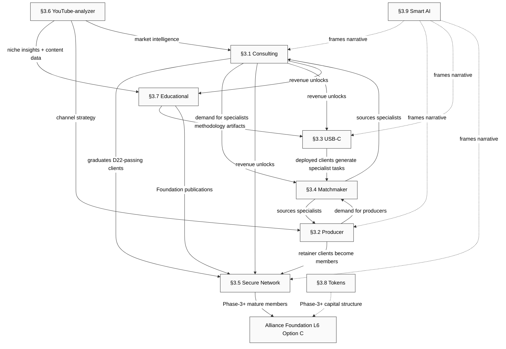

# §12 Cross-Direction Synergy + Conflict Matrix

---

## §12.0 Framing

This chapter maps the 9 L5 directions as a relational system — how they enable each other (synergy flows) and compete with each other (conflict matrix). It is not a per-direction deep-dive (§3.1–§3.9 own those mechanics) and not a temporal narrative (§13 Evolution owns gate-by-gate progression). The contribution here is a **relationship-level view**: which directions amplify others when they run, which directions pull finite resources in opposing directions, and what the Phase-1 → Phase-2 transition implies for each direction's activation sequence. The relational map complements §2 Portfolio (structural composition) and §13 Evolution (temporal unfolding) with the third lens — interdependence geometry. [src:swarm/wiki/drafts/T-layer-5-product-deep-dive-2026-04-25-mgmt-integrator-§2-portfolio.md §2.3]

---

## §12.1 Synergy Map — 4 Mandatory Flows + 3 Additional

### Flow 1 — Consulting leads → Secure Network membership leads → Alliance Foundation members

The most compounding cascade in the 9-direction portfolio runs through §3.1 Consulting as its entry node. Every successful Phase-1 consulting engagement with a client who passes the D22 five-criteria filter (startupper mindset / entrepreneurial azart / stable / adequate / upward-direction) [src:decisions/JETIX-VISION.md §7.1 D22] is simultaneously a consulting revenue event, a Secure Network candidate identification event, and a long-arc Alliance Foundation pipeline entry. The client who experienced a Jetix engagement and found value is the highest-quality Secure Network invite candidate — they have proof-of-methodology, proof-of-Ruslan-relationship quality, and self-evident skin-in-game. They do not need persuasion; they need an invite at the right moment. [src:decisions/LAYER-6-COMMUNITY-DEEP-DIVE.md §2.1 §8.1]

The three-stage graduation chain: §3.1 consulting first-contract → post-engagement Secure Network invite (§3.5 invite-only Phase-1 mechanism) → Phase-3+ Secure Network members with demonstrated Alliance-quality contribution → Mittelstand AI Alliance Foundation membership (L6 §5 Option C Hybrid recommendation, Q-01 ack pending). [src:decisions/LAYER-6-COMMUNITY-DEEP-DIVE.md §5 §11.1 G3]

Time-lag of the full cascade: Phase-1 consulting engagement closes → Phase-2/3 Secure Network membership matures → Phase-3+ Alliance Foundation candidacy. The lag means that Phase-1 decisions about who to take as consulting clients have Phase-3+ consequences — client selection is also ecosystem selection. Every consulting engagement that is rushed or taken for purely financial reasons at ICP misfit (someone who does not pass D22) degrades the downstream pipeline quality by inserting a non-Alliance-grade member into the invite pool. This is a concrete scalability reason — not just a quality argument — for strict Phase-1 ICP discipline.

Compounding multiplier: a single consulting client who graduates through all three stages simultaneously contributes revenue (§3.1), community density (§3.5), and Alliance credibility. Three directions advance from one action. [src:swarm/wiki/drafts/T-layer-5-product-deep-dive-2026-04-25-mgmt-integrator-§2-portfolio.md §2.3 Layer-2]

### Flow 2 — YouTube-analyzer research → Educational products content → Producer channel strategy

§3.6 YouTube-analyzer's core value proposition is bulk automated analysis of YouTube channels across any niche — advertising data, team structures, content cadence, audience profiles, ICP patterns [src:decisions/JETIX-VISION.md §5; reports/review_2026-04-24.md audio_514]. The data this direction produces is not useful only as a standalone SaaS product (G3→G4 gate); it is structurally feedable to three other directions in Phase-2+.

The primary downstream flow: YouTube-analyzer niche data → §3.7 Educational Products course content and case studies. A cohort on "AI for expert creators" that is built without niche intelligence about what content performs and why in the creator economy is a generic course. The same cohort built on systematic reverse-engineering of 1000+ channels in the creator niche is a differentiated, data-backed methodology artifact. This is the D28 query-driven KB principle applied to product development [src:decisions/LOCKS-D25-D28-ADDENDUM-2026-04-24.md §D28]: the educational product emerges from the data accumulation, not from abstract planning.

Secondary downstream: YouTube-analyzer insights → §3.2 Продюсерский центр (channel strategy recommendations for blogger retainer clients). A producer retainer client asking "what content format should I invest in" gets a generic answer without data and a niche-specific, competitor-benchmarked answer with YouTube-analyzer data. This is the compounding advantage that differentiates Jetix's producer retainer from a generic content agency.

Tertiary downstream: YouTube-analyzer data → §3.1 Consulting market intelligence (pre-research target clients by their YouTube presence, understand their production constraints before the discovery call). [src:decisions/LAYER-6-COMMUNITY-DEEP-DIVE.md §11.1 G1 outreach channels]

Time-lag: Phase-2 YouTube-analyzer manual reports → Phase-3 Educational cohort content built on systematic data. The manual Phase-2 variant (Ruslan running analyses for individual clients as a productized report service) generates the pattern-library that Phase-3 Educational Products codifies.

### Flow 3 — Matchmaker connects specialists to consulting projects → revenue uplift per engagement

§3.4 Matchmaker operates bidirectionally in relation to §3.1 Consulting. In the first direction: complex consulting engagements that require specialist skills outside Ruslan's core competence (deep engineering, philosophical facilitation, content production at scale) source those specialists from the Secure Network pool via the matchmaker mechanism [src:decisions/JETIX-VISION.md §5 D21]. Ruslan's consulting capacity effectively expands — engagements he would previously decline as out-of-scope become deliverable through a specialist match. Revenue per engagement increases because the scope the client can purchase increases.

In the second direction: complex specialist-matching tasks that come in through the Matchmaker's own intake (someone seeking a specialist for a task that is actually a full consulting engagement) route back to §3.1 Consulting as qualified leads. The matchmaker acts as a demand aggregation surface that pre-qualifies which "simple match" requests are actually consulting-scope requests.

The relational capital density this creates is the Phase-3+ moat: when Secure Network members have been matched with each other through Jetix-coordinated engagements, their trust in Jetix as a coordination layer deepens. Each match that succeeds increases the probability that both parties bring their next complex task back to Jetix's coordination surface rather than to an outside platform. [src:decisions/LAYER-6-COMMUNITY-DEEP-DIVE.md §6.1 §6.2]

Time-lag: Phase-1 manual informal matching (Ruslan in memory) → Phase-2 AI-smoothed coordination with portrait data → Phase-3 platform. The Phase-1 informal operation is the data-collection phase; every match attempted and its outcome (delivered/fell-through) is the training signal that Phase-2 AI-smoothed coordination learns from [src:decisions/LAYER-6-COMMUNITY-DEEP-DIVE.md §6.4 trigger 1].

### Flow 4 — Smart AI narrative frames all consulting + producer + USB-C offers as one category-bet

§3.9 Smart AI is the meta-narrative layer of the portfolio — not a product, not a revenue line, but the framing that prevents the 8 active directions from appearing to clients and partners as 8 separate sales pitches from 8 separate companies. The smartphones-vs-telephones analogy (audio_529) is the core of this: Jetix is not building AI tools (telephones), it is building AI-augmented operating systems for professionals — a categorical upgrade, not a feature upgrade [src:decisions/LOCKS-D25-D28-ADDENDUM-2026-04-24.md §Smart AI].

The internal framing function: when a Mittelstand client considers both a consulting engagement (§3.1) and a USB-C deployment (§3.3) from Jetix, the Smart AI narrative is what makes those two offers feel like one coherent relationship with one coherent partner rather than two separate transactions. When a blogger client considers a producer retainer (§3.2) and an invitation to the Secure Network (§3.5), the Smart AI narrative explains why the same entity provides both a production service and a professional community. Without this categorical framing, cross-sell between directions degrades into awkward upsell.

External graduation of §3.9 remains contingent on D29 ack (Ruslan explicit note: not a lock yet) [src:decisions/LOCKS-D25-D28-ADDENDUM-2026-04-24.md §Smart AI]. Phase-1 and Phase-2 use is strictly internal — framing in discovery calls and in stakeholder briefings, not in public marketing materials.

### Flow 5 — Producer content + Educational methodology → Secure Network thought leadership → Alliance publications

§3.2 Продюсерский центр produces AI-augmented content (one recording → 10+ derivative pieces). When Ruslan and the producer center produce methodology articles, case studies, and framework explanations from Jetix's consulting and producer work, those artifacts feed §3.5 Secure Network as thought-leadership content — the substance that makes the community valuable beyond tool-sharing. When the methodology stabilizes further, those same artifacts feed §3.7 Educational Products. At Phase-3+, the best of that content feeds Alliance Foundation publications — the public intellectual output that establishes Alliance credibility in the Mittelstand AI ecosystem. [src:decisions/LAYER-6-COMMUNITY-DEEP-DIVE.md §5 Option C]

### Flow 6 — USB-C client deployments → Matchmaker specialist demand

§3.3 USB-C Integration Services deploys Jetix methodology as private AI infrastructure for Mittelstand clients. A deployed client running their own KB, their own agents, and their own workflow configurations is not a static installation — they generate ongoing specialist demand: engineering tasks for maintenance, content tasks for knowledge-base updates, research tasks for methodology evolution. These tasks are natural Matchmaker routing opportunities. The USB-C client base is a demand-generator for the §3.4 Matchmaker's supply-side, creating a structured source of complex tasks that the specialist network can service. [src:decisions/LOCKS-D25-D28-ADDENDUM-2026-04-24.md §USB-C reinforcement; decisions/JETIX-VISION.md §5 D21]

### Flow 7 — Educational Foundation Apache 2.0 documents → Consulting + Producer client trust signal

§3.7 Educational Products, once the methodology is stable enough to publish (Phase-2+, post D27 fork-and-merge governance decision), generates Apache 2.0 Foundation artifacts — open methodology documentation, framework guides, and case studies. These public artifacts function as trust-signal for §3.1 Consulting and §3.2 Producer client acquisition: a prospect evaluating Jetix against a generic AI agency can read the methodology documentation and see the intellectual depth before a discovery call. This is the D24 open-source research direction applied at the methodology layer [src:decisions/JETIX-VISION.md §5 D24]: closed core (the implementation, the agent configurations, the KB architecture) but open surface (the published reasoning, the framework documentation). [src:decisions/LOCKS-D25-D28-ADDENDUM-2026-04-24.md §D27]

---

## §12.2 Conflict Matrix — 9 Directions Competing for Finite Resources

The three conflict dimensions are **attention** (Ruslan's time and focus budget, which is the binding constraint at Phase-1 and remains critical through Phase-2), **resources** (engineering time, capital, tooling, and hire decisions), and **ICP bandwidth** (the market's ability to absorb multiple simultaneous Jetix offers without confusion or dilution).

| Direction pair | Attention conflict | Resources conflict | ICP bandwidth conflict |
|---|---|---|---|
| **§3.1 Consulting vs §3.6 YouTube-analyzer** | **HIGH** — audio_514 urgency ("золотая жила") creates pull toward building the analyzer in Phase-1; bandwidth discipline requires deferral to G3–G4 [src:swarm/wiki/drafts/T-layer-5-product-deep-dive-2026-04-25-mgmt-integrator-§2-portfolio.md frontmatter dissent]. Resolution: YouTube-analyzer manual reports for individual clients (productized, not SaaS) in Phase-2 as a revenue-generating stepping stone that does NOT require engineering build. | **MED** — both consume founder cycles; YouTube-analyzer SaaS engineering investment (API integration, data pipeline) directly competes with consulting engagement delivery capacity. | **LOW** — different primary ICPs (Mittelstand consulting vs Blogger SaaS), minimal overlap. |
| **§3.2 Продюсерский центр vs §3.1 Consulting** | **LOW** — producer and consulting are co-primary Phase-1 directions, designed to be run in parallel with shared outreach motion targeting Startupper overlap (same archetype can be both client). | **MED** — voice pipeline, content production capacity, and any initial hire (producer-role vs consulting-role) compete on the same resource bucket. First hire prioritization is a real decision point at G1→G2. Resolution: shared infrastructure (D25 company-as-code, same agent stack) reduces marginal resource cost of running both simultaneously. | **MED** — English infobiz (producer primary) vs Mittelstand (consulting primary) are distinct, but Startupper archetype overlaps. Risk: a prospect receiving both a consulting and a producer pitch from Jetix in the same sequence may experience confusion about what Jetix's primary identity is. Resolution: Smart AI narrative (§3.9) is the framing device that makes both offers coherent. |
| **§3.3 USB-C vs §3.1 Consulting** | **LOW** — USB-C productizes consulting; the two are not parallel-running separate services but sequential expressions of the same service (hourly consulting → productized USB-C deployment). Tension only arises when a client is in-flight for hourly consulting while Ruslan is also designing the USB-C productized path — dual mode for same client is sustainable for short periods. | **HIGH** — technical infrastructure time (USB-C Path A/B/C architecture, GDPR compliance layer, private AI server configuration) directly competes with billable consulting-engagement delivery time. Resolution: per §6 scalability mode, Phase-1 USB-C is opportunistic (P1B, not active cold-outreach); engineering investment for Path A/B/C only justified post-G1 when consulting revenue validates capacity. | **LOW** — Mittelstand client can be simultaneously a consulting client and a USB-C deployment candidate; the conflict is sequential timing (hourly first, productized after), not ICP dilution. |
| **§3.4 Matchmaker vs §3.1 Consulting** | **MED** — complex consulting task that would be enhanced by a specialist match (routing some scope out) requires Ruslan to decide in real-time: keep the scope in-consulting or match it out. That decision burns attention on each engagement. Resolution: build a simple routing decision rule pre-G2 (task-type × scope-level matrix) so the attention cost per decision drops from 20 minutes of deliberation to a lookup. | **MED** — Ruslan's manual matchmaking time (Phase-1: ad hoc, ~10 connections/week ceiling per L6 §6.1) competes with consulting delivery time. At Phase-1 volumes this is manageable; at G2 it becomes a bottleneck requiring the AI-smoothed matchmaker design. | **LOW** — matchmaker ICP (specialists + complex-task buyers) is distinct from consulting ICP (entrepreneurs + Mittelstand GF). The only overlap is when a consulting client becomes a specialist in the matchmaker pool — which is a synergy, not a conflict. |
| **§3.5 Secure Network vs §3.1 Consulting** | **LOW** — Phase-1 Secure Network is «попутно» (invite-based Telegram chat, 5-20 personally known) — zero mechanics, near-zero attention budget. Tension only emerges at G1→G2 when Secure Network architecture design begins competing with consulting delivery bandwidth for Ruslan's time. Resolution: defer architecture work to paper exercises within G1 (2-4 hours, per L6 §11.2 G1 mitigation) so the design phase runs in parallel with consulting without consuming delivery time. | **HIGH** — post-G2, Secure Network platform infrastructure build (Telegram bot, portrait schema, subscription layer) competes for engineering time with USB-C deployment technical work and YouTube-analyzer SaaS planning. Resolution: D15 revenue-gated spend ensures both Secure Network build and parallel engineering tracks do not activate before €200K validation. Sequential gating reduces simultaneous resource collision. [src:decisions/JETIX-PLAN.md §4.1] | **LOW** — Secure Network is a community layer for all archetypes, not a competing market offer. |
| **§3.6 YouTube-analyzer vs §3.7 Educational** | **LOW** — both are Phase-2+ directions and not competing for Phase-1 Ruslan attention simultaneously. | **HIGH** — engineering time for YouTube-analyzer data pipeline (API, analysis infrastructure) and engineering time for Educational cohort platform (LMS, cohort management, methodology publishing) overlap significantly in Phase-2+ capacity planning. Both require the same engineering resource bucket that is also claimed by USB-C productization and Secure Network platform. Resolution: gate sequencing — YouTube-analyzer manual service first (zero engineering), Educational methodology repo first (zero engineering), only then platform builds activate post-G2. [src:decisions/JETIX-PLAN.md §5] | **LOW** — SaaS users (Blogger, agency) vs course students (Teacher archetype) are mostly distinct ICPs. |
| **§3.8 Tokens vs all other directions** | **LOW in Phase 1/2** (dormant; $100K self-earned trigger per D23 not reached). **HIGH in Phase 3+** — token economy design and legal/regulatory navigation will consume senior decision-making bandwidth that competes with operational directions. | **HIGH in Phase 3+** — legal capex (EU MiCA, US securities law, regulatory navigation), engineering capex (token infrastructure, smart contracts, escrow), and organizational capex (legal counsel) are substantial. Resolution: D23 explicit trigger ($100K self-earned gate) prevents premature resource allocation. Phase-1 and Phase-2 resource conflict with Tokens is zero; Phase-3+ resource planning must budget Tokens as a large-capex project. [src:decisions/JETIX-VISION.md §8 D23] | **LOW** — tokens are an internal utility and capital-structure mechanism, not a market-facing competing offer in Phase-1/2. |
| **§3.9 Smart AI narrative vs §3.1 Consulting** | **LOW** — Smart AI is a narrative layer, not a parallel product-building workstream. It requires zero additional attention budget once internalized as the framing language for all offers. Risk is the inverse: if §3.9 framing is NOT used in consulting conversations, Jetix presents as a vanilla AI consulting agency rather than a categorical infrastructure bet. The attention cost of NOT using the narrative is higher than the cost of using it. | **LOW** — narrative layer only; no engineering, no capital outlay. | **LOW** — Smart AI frames, Consulting delivers; the two are complementary at the ICP interface. |

**Resolution notes for HIGH-conflict cells:**

**§3.1 vs §3.6 (attention HIGH):** The primary resolution is Phase-1 ring-fencing. YouTube-analyzer does not consume Ruslan attention in Phase-1; it surfaces as a manual-service offering (productized individual channel analysis report, not SaaS) when a Phase-2 consulting or producer client requests it. The SaaS engineering build stays gated at G3. The "золотая жила" recognition (audio_514) is valid as directional signal but not as a Phase-1 action trigger. Routes to §15 open-question ack: does YouTube-analyzer move to G2 preparatory if Phase-1 consulting clients include YouTube operators? [src:swarm/wiki/drafts/T-layer-5-product-deep-dive-2026-04-25-mgmt-integrator-§2-portfolio.md frontmatter dissent]

**§3.3 vs §3.1 (resources HIGH):** The resolution principle is that USB-C technical infrastructure work is a P1B opportunity, not a P1A obligation. Technical design time is justified only when a qualified Mittelstand client expresses specific interest in a private AI deployment; design-in-advance-of-demand is Phase-1 resource waste. Each USB-C technical investment must be demand-triggered per D28 query-driven KB [src:decisions/LOCKS-D25-D28-ADDENDUM-2026-04-24.md §D28].

**§3.5 vs §3.1 (resources HIGH post-G2):** The D15 revenue-gated spend rule is the structural resolver. Secure Network platform build at G2 is contingent on €200K validation. The paper-exercise pre-work (portrait template, D22 qualification protocol, sub-channel architecture sketch) runs in G1 at zero cost; the engineering-intensive build only activates post-gate. [src:decisions/JETIX-PLAN.md §4.1]

---

## §12.3 Portfolio Balance Logic — Phase-1 → Phase-2 Transition Implications

**Core principle:** Phase-1 bandwidth is a hard constraint. Only §3.1 Consulting and §3.2 Продюсерский центр generate revenue in Phase-1; all other directions are either infrastructure that consulting revenue unlocks, or deferred investments that consulting revenue enables. This is not a preference — it is a bandwidth theorem operationalized in D15 [src:decisions/JETIX-PLAN.md §3.1]. What the Phase-1 → Phase-2 transition (G1 €50K gate) implies for each direction:

**§3.1 Consulting:** Transition from hourly-dominant revenue mix (~54% of Phase-1 target per §3.1.1 revenue decomposition) toward productized retainer dominant. Post-G1, the first BU separation of consulting from other directions becomes relevant: consulting needs its own sub-brigadier and eventually its own team. [src:swarm/wiki/drafts/T-layer-5-product-deep-dive-2026-04-25-mgmt-integrator-§2-portfolio.md §2.5]

**§3.2 Продюсерский центр:** Transition from pilot (1-2 clients) to 5-10 retainer clients. First producer-role hire becomes relevant post-G1 as the revenue validates capacity investment. The producer direction's Phase-2 form is a productized studio, not a solo Ruslan content service.

**§3.3 USB-C:** First productized Mittelstand client (P1B opportunistic). Path A/B/C decision (open, HITL-required) gates further investment. The Phase-2 form is a structured service offer with defined delivery, not an ad hoc custom deployment. [src:decisions/LOCKS-D25-D28-ADDENDUM-2026-04-24.md §USB-C reinforcement]

**§3.4 Matchmaker:** Manual → AI-smoothed design begins (not implementation). Pre-conditions per L6 §6.4: ≥15 Alliance digital portraits exist; Phase-1 scoreboard ≥30 matches with outcome data. G1 produces both inputs if Ruslan tracks every match from day one. [src:decisions/LAYER-6-COMMUNITY-DEEP-DIVE.md §6.4 trigger 1]

**§3.5 Secure Network:** Architecture design phase begins post-G1. Telegram sub-channels per 11 archetypes, portrait schema, складчина mechanic design — paper exercises at G1, implementation at G2. The Phase-2 form is a designed community, not an invite-based chat. [src:decisions/LAYER-6-COMMUNITY-DEEP-DIVE.md §11.2 G2]

**§3.6 YouTube-analyzer:** Manual reporting service productized (pre-SaaS) — an individual channel analysis report sold as a consulting deliverable or producer service add-on. No engineering investment. The Phase-2 form is a productized manual service with documented methodology; the SaaS form is Phase-3 (G3→G4). [src:swarm/wiki/drafts/T-layer-5-product-deep-dive-2026-04-25-mgmt-integrator-§2-portfolio.md §2.5 P3+ deferred]

**§3.7 Educational Products:** Investor program begins; first grant submission targeted; cohort pilot with 3-5 participants to validate methodology-as-teachable-artifact hypothesis. The methodology must be stable enough from consulting engagements before teaching it — Phase-1 is the stabilization phase. [src:decisions/LOCKS-D25-D28-ADDENDUM-2026-04-24.md §D27]

**§3.8 Tokens:** Dormant through Phase-1 and Phase-2. $100K self-earned trigger (D23) has not been reached at G1. Internal utility exploration begins at G2 (складчина token mechanism concept) but no capital allocation until G3+ and no public layer until G4+. Phase-2 transition has no activation implication for §3.8. [src:decisions/JETIX-VISION.md §8 D23]

**§3.9 Smart AI:** Narrative stable through Phase-2. No external promotion; internal use only. D29 not locked; Ruslan explicit note preserved. The transition implication is stability, not change. [src:decisions/LOCKS-D25-D28-ADDENDUM-2026-04-24.md §Smart AI]

**Sequencing logic visible:** §3.1 and §3.2 as revenue-primary pass compounding effects to the next activation tier. §3.5 Secure Network is the hinge at G2: when the Secure Network architecture launches, it simultaneously unlocks §3.4 Matchmaker AI-smoothed design (portraits precondition), §3.7 Educational community (cohort distribution channel), and §3.3 USB-C specialist sourcing (Secure Network as specialist pool). G2 is not just a revenue gate — it is the structural inflection point where five directions simultaneously enter a new phase.

---

## §12.4 Synergy-Flow + Conflict Diagram

### Mermaid: Synergy Flows



### ASCII Conflict Grid — HIGH-Conflict Cells

The grid marks only cells rated HIGH in any dimension. MED and LOW omitted for readability.

```
             §3.1  §3.2  §3.3  §3.4  §3.5  §3.6  §3.7  §3.8  §3.9
§3.1 Cons  [  —  ] [MED] [RES] [ATT] [RES] [ATT] [  —] [  —] [  —]
§3.2 Prod  [MED  ] [  —] [  —] [  —] [  —] [  —] [  —] [  —] [  —]
§3.3 USB-C [RES  ] [  —] [  —] [  —] [RES] [  —] [  —] [  —] [  —]
§3.4 Match [ATT  ] [  —] [  —] [  —] [  —] [  —] [  —] [  —] [  —]
§3.5 SecNt [RES  ] [  —] [RES] [  —] [  —] [  —] [  —] [  —] [  —]
§3.6 YT-Az [ATT  ] [  —] [  —] [  —] [  —] [  —] [RES] [  —] [  —]
§3.7 Educ  [  —  ] [  —] [  —] [  —] [  —] [RES] [  —] [  —] [  —]
§3.8 Tok   [  —  ] [  —] [  —] [  —] [  —] [  —] [  —] [  —] [  —]
§3.9 Smart [  —  ] [  —] [  —] [  —] [  —] [  —] [  —] [  —] [  —]

Key: ATT = Attention-HIGH; RES = Resources-HIGH; MED = multi-dimension Medium; — = Low/none
```

---

## §12.5 Cross-Cutting Resolution Principles

Five operating rules that govern how the 9-direction portfolio manages its internal tensions without defaulting to ad hoc case-by-case decisions:

**Attention discipline.** §3.1 Consulting and §3.2 Продюсерский центр are the sole active-outreach directions in Phase-1. Every other direction receives Ruslan attention proportional to demonstrated Phase-1 revenue progress, not to projected Phase-3+ upside. Audio_514's "золотая жила" characterization of YouTube-analyzer is a directional signal for Phase-3 planning, not a Phase-1 action trigger. The D15 revenue-gated unlock mechanism enforces this at the structural level. [src:decisions/JETIX-PLAN.md §3.1 §3.8]

**Resource discipline.** Infrastructure build for platform-tier directions (§3.3, §3.5, §3.7) lags revenue gates per D15. No Phase-1 engineering investment on directions that are not Phase-1 revenue-generating. Paper-exercise pre-work (architecture sketches, template design, qualification protocol documentation) is the permitted Phase-1 form of "building" for deferred directions — zero cost, high leverage, preserves optionality without burning capacity. [src:decisions/JETIX-PLAN.md §4.1; decisions/LAYER-6-COMMUNITY-DEEP-DIVE.md §11.2 G1 mitigation]

**ICP bandwidth discipline.** P1A primary ICP is Mittelstand Operator-Founder-CEO and Startupper — active cold outreach targeting [src:decisions/LAYER-6-COMMUNITY-DEEP-DIVE.md §2.1]. P1B (Expanded Tier-1 High-earners, millionaires) is referral-only in Phase-1 — no cold-outreach resource allocation. Directions with P1B or P2+ ICPs do not receive Phase-1 outreach budget; they surface opportunistically from P1A engagement flow.

**Synergy-first move rule.** When two directions are both relevant to a Phase-1 or Phase-2 client conversation, the preferred move is to surface the synergy (this direction feeds that direction, both advance with one relationship) rather than to treat them as separate upsell events. The Smart AI narrative (§3.9) is the cognitive tool that makes synergy-framing natural rather than awkward.

**Open tensions route to §15.** The two substantive unresolved tensions in this chapter — YouTube-analyzer pull-forward timing (§3.1 vs §3.6 attention conflict) and Smart AI external promotion gating (§3.9 D29 open) — are flagged in the §15 open-question ack list. This section does not resolve them; §15 owns the ack. What this section contributes is the structural argument for why they matter at the portfolio level, not just the per-direction level. [src:swarm/wiki/drafts/T-layer-5-product-deep-dive-2026-04-25-mgmt-integrator-§2-portfolio.md frontmatter dissent]

---

*Draft by mgmt-expert (mode: scalability), Cell C-14. Awaiting brigadier §5.5.5 provenance gate before promotion to canonical LAYER-5-PRODUCT-DIRECTIONS-DEEP-DIVE.md.*
