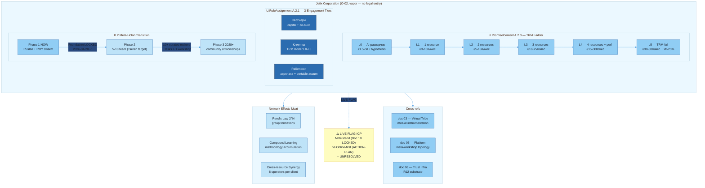

# Jetix as Corporation — FPF-Described

> **EP-5 disclosure.** «F8 / LOCKED» в этом документе = Jetix-internal single-author Ruslan ack-grade. Это NOT равно FPF B.3 F8 (независимая верификация). Документ-level grade F2 (минимальный по per-claim grades; см. frontmatter). Per-claim grades F2-F4 указаны в §2.
>
> **EP-2 disclosure.** Документ описывает Jetix как коммерческое юридическое лицо (O-02 — **vapor**). На момент написания: юридическое лицо не зарегистрировано, выручка = 0. Это концептуальный документ для партнёров/инвесторов — описывает **намерение**, не факт.
>
> **LIVE-FLAG-ICP.** Doc 1B §7 (Mittelstand DACH 50-500 emp manufacturing — LOCKED v1.0) vs ACTION-PLAN §0 RES.1 («Mittelstand ABANDONED → Online-first»). Несоответствие не разрешено. Обе версии могут присутствовать в outreach-материалах для L1 аудитории. Раскрыто в §0, §3, §7.
>
> 10-15 min read.

---

## §0 TL;DR (≤200 слов)

**Jetix Corporation** — коммерческий холон (U.System A.1), построенный на Базовой Системе Управления (Документ 1A). Центральная promise структура (U.PromiseContent A.2.3) — **Total Resource Management (TRM)**: управление 6 ресурсами клиента одновременно (финансы / время CEO / аудитория / знания / compute / команда) через лестницу L0-L5 (от €3K разовой гипотезы до €40-60K/мес TRM-full). Три уровня вовлечения (U.RoleAssignment A.2.1): Партнёры — top tier с capital participation; Клиенты — TRM ladder; Работники — зарплата + portable accumulation (анти-корпоративное рабство). Главная метафора — **«мета-мастерская для профессиональных мастеров со своими мастерскими»** (Doc 1B §0 LOCKED).

Честный статус: **O-02 vapor** (Phase-0 inventory). Юридическое лицо не зарегистрировано. Revenue = 0. B.5.1 Explore state. Trajectory (€5K сейчас → $100K к лету 2026 → €100M+ ARR за 3 года) — **aspirational, vapor flag**.

**LIVE-FLAG-ICP:** ICP Mittelstand DACH (Doc 1B §7 LOCKED) vs «Online-first» (ACTION-PLAN) — **не разрешено**. Раскрыто ниже.

Network-effects moat (Reed's Law 2^N) + compound learning + cross-resource synergy = декларируемый стратегический ров. Доказательство = Future. [src: decisions/JETIX-CORPORATION-2026-05-05.md §0; reports/phase-0-fpf-scope/01-jetix-objects-inventory.md O-02]

---

## §1 Verbatim source anchors

Прямые цитаты из первоисточников.

**1. Главная метафора (Doc 1B §1.1 Кандидат A)**

> «Jetix — это мета-мастерская для профессиональных мастеров со своими мастерскими. Самая большая, самая навороченная, самая быстрая и умная мастерская среди всех других — умная за счёт того, что внутри неё работают другие мастера со своими специализированными мастерскими, каждый в своём направлении.»

[src: decisions/JETIX-CORPORATION-2026-05-05.md §1.1 Кандидат A]

**2. TL;DR коммерческое предложение (Doc 1B §0)**

> «Центральное коммерческое предложение — Total Resource Management (TRM): управление 6 ресурсами клиента одновременно (💰 финансы / ⏱️ время CEO / 📢 аудитория / 📚 знания / 💻 compute / 🤝 команда) за mgmt fee + performance fee, через лестницу L0-L5 (€3K гипотеза → €40-60K/мес TRM-full).»

[src: decisions/JETIX-CORPORATION-2026-05-05.md §0 TL;DR]

**3. Три уровня вовлечения**

> «Платформа имеет 3 уровня вовлечения — Партнёры (top tier с existing capital, financial participation 5 вариантов), Клиенты (TRM ladder, mgmt + performance), Работники (зарплата + portable accumulation = антипаттерн corporate slavery)»

[src: decisions/JETIX-CORPORATION-2026-05-05.md §0 TL;DR]

**4. Moat через Reed's Law**

> «Главный moat — network effects через Reed's Law (2^N group formations) × compound learning накопление методологий через всех participants × cross-resource synergy (6 operators per client) — uncopyable за 5-10 лет curated quality + accumulated wisdom.»

[src: decisions/JETIX-CORPORATION-2026-05-05.md §0 TL;DR]

**5. Phase 3 — мета-мастерская как community**

> «Когда уже будет комьюнити таких вот мастеров с своими мастерскими, можно будет делать уже мега систему — в которой внутри вот эти мастера у которых есть мастерские смогут между собой коммуницировать и работать над уже более сложными проектами/задачами, для которых одной мастерской даже прям хорошо настроенной но одной мастерской одного человека не хватит.»

[src: decisions/JETIX-CORPORATION-2026-05-05.md §2.3, sourced from decisions/JETIX-WORKSHOP-CONCEPT-2026-04-30.md §8 quote 13]

**6. Mittelstand — internal clarification (Doc 1B §A.2)**

> «В ранних источниках TRM-MODEL упоминается «Mittelstand DACH 50-500 emp manufacturing» как ICP. Ruslan отверг этот frame. Новый ICP — концептуальный portrait через 2 оси × 3 типа (см. §7). Mittelstand упоминания в источниках = illustrative only, не committed market.»

[src: decisions/JETIX-CORPORATION-2026-05-05.md §A.2 «Mittelstand (outdated frame)»]

---

## §2 FPF mapping — примитивы, bounded context, claims + F-G-R

### §2.1 Primary FPF primitives

| FPF примитив | Применение в контексте Corporation | F | ClaimScope |
|---|---|---|---|
| **U.System (A.1) — Commercial Holon** | Jetix Corp = самостоятельный холон-организация с собственной boundary (legal entity намерение), внутренними субхолонами (3 уровня участия) и суперсистемой (рынок, Clan, партнёрские мастерские) | F2 | Holds: conceptual design. Vapor: no registered entity, 0 contracts |
| **U.PromiseContent (A.2.3) — TRM offering** | Каждый уровень L0-L5 = структура U.PromiseContent: что обещается (управление N ресурсами), что не обещается, условия исполнения (mgmt + performance fee), срок | F4 | Holds for TRM model artefact (LOCKED 2026-04-30). Vapor: 0 active client contracts |
| **U.RoleAssignment (A.2.1) — 3 тiers** | Holder#Role:Context = Partner#PartnerRole:JetixPlatform / Client#ClientRole:TRMengagement / Employee#EmployeeRole:JetixTeam. Три role-type clusters с разными обязательствами | F4 | Holds: role design LOCKED. Vapor: no actual role-holders beyond Ruslan today |
| **B.2 Meta-Holon Transition** | Individual maker → Jetix (Phase 2: solo → team → Phase 3: individual mастерская → community of мастерских). MHT event = qualitative boundary crossing (количество участников + complexity задач превышает одну мастерскую) | F3 | Holds: Phase 1→2 trigger (Foundation LOCKED 2026-04-28) met. Phase 2→3 NOT met: no partners yet |
| **E.17 MVPK — multi-view** | Doc 1B имеет 4 reading paths per audience: Partner / Client / Investor / Ruslan (§0 «Как читать»). Каждый получает свой E.17 view slice того же объекта | F4 | Holds: Doc 1B reading paths declared |
| **U.System (A.1) — supersystem meta-holon (Phase 3)** | Phase 3 корпорация = supersystem над N partner-мастерскими (O-14 «мета-мастерская»). A.5 Kernel Modularity: каждый partner fork = независимый холон | F2 | Vapor: 0 partner instances today |
| **U.Commitment (A.2.8) — TRM engagement** | TRM-full = набор формальных обязательств (6 ресурсов; mgmt + performance fee; horizon 24 мес до M24 €40K MRR). A.2.8 поля (условия, последствия дефолта, adjudication path) формально не прописаны | F2 | TRM model LOCKED as PromiseContent; A.2.8 adjudication path = absent (informal) |
| **B.5.1 Exploration state** | Jetix Corp = B.5.1 Explore (не Operate). Revenue = 0, no paying clients, testing product-market fit | F5 | Holds: git evidence (shared/state/active-projects.json revenue_current: 0); Phase-0 honest audit §2 |

### §2.2 Bounded context (A.1.1 scope declaration)

**Что включено в bounded context O-02 Corporation:**
- Коммерческий design: TRM ladder L0-L5, mgmt + performance fee структура, 3 engagement tiers, 4 project sources (Jetix internal / TRM-driven / external owners / самостоятельные участники)
- Aspirational trajectory (vapor-flagged): €5K → $100K Q3 2026 → €500K+ ARR Y1 → €100M+ ARR Y3
- Competitive positioning + anti-pattern declarations (§12 Doc 1B)
- Network-effects moat claim (Reed's Law)

**Что НЕ включено:**
- Зарегистрированное юридическое лицо (vapor — нет GmbH/UG/Ltd)
- Активные клиентские контракты (0 сегодня)
- Foundation Architecture (это O-07 — см. doc 01)
- Meta-workshop platform mechanics (это O-14 — см. doc 05)
- Trust infrastructure / R12 (это O-21 — см. doc 06)
- Clan / People-Network-State (это O-13 — см. doc 03)

---

## §3 Plain English narrative (L1-friendly, 800-1200 слов)

### Что такое Jetix Corporation

Jetix Corporation — это коммерческий автомобиль. Если Jetix как Self-OS (doc 01) = substrate одного человека, а Jetix как методология (doc 02) = язык, а Jetix как Clan (doc 03) = племя — то Jetix Corporation = конкретное **юридическое и коммерческое лицо**, через которое этот substrate зарабатывает деньги, привлекает партнёров и управляет ресурсами клиентов.

Главная метафора, из которой строится вся логика: **«мета-мастерская для профессиональных мастеров со своими мастерскими».** Обычная мастерская одного мастера хороша в одном направлении. Jetix — не одна мастерская, а **оркестратор сети мастерских**: AI-мастер, cybersec-мастер, legal-мастер, research-мастер, investment-мастер — каждый лидер в своём направлении, Jetix соединяет их в единую систему и даёт каждому клиенту 10× leverage. [src: decisions/JETIX-CORPORATION-2026-05-05.md §1.1-§1.2]

### TRM — лестница коммерческого предложения (U.PromiseContent A.2.3)

Total Resource Management = архитектурный принцип, превращённый в коммерческое предложение. Обычный консультант управляет одним ресурсом клиента (деньги, или люди, или marketing). Jetix управляет всеми шестью одновременно: **финансы / время CEO / аудитория / знания / compute / команда**.

Но «сразу всё» — не продаётся. Поэтому есть лестница из 6 ступеней:

| Уровень | Что клиент получает | Стоимость | Срок |
|---|---|---|---|
| L0 — AI-разведчик | Одна гипотеза / аналитическая записка | €1.5-5K/задача | 1-2 недели |
| L1 — Один ресурс | Управление одним ресурсом (диагностика + рекомендации) | €3-10K/мес ретейнер | 3 мес |
| L2 — Два ресурса | Расширение на второй ресурс | €5-15K/мес | 3-6 мес |
| L3 — Три ресурса | Первые network-эффекты между ресурсами | €10-25K/мес | 6-12 мес |
| L4 — Четыре ресурса | Глубокая интеграция, performance-компонент появляется | €15-30K/мес | 12-18 мес |
| L5 — TRM-full | Все 6 ресурсов, deep integration, team | €30-60K/мес mgmt + 20-25% performance | 18+ мес (M24 цель) |

Философия лестницы: **«Jetix не продаёт TRM-full — Jetix продаёт гипотезу за €3K, а потом доращивает клиента до TRM органически.»** Цель к месяцу 24 (M24): L5 = €40K MRR. Один TRM-full клиент = эквивалент 5-6 классических консалтинговых проектов. [src: decisions/JETIX-CORPORATION-2026-05-05.md §3.5 «Land-and-Expand»]

### 3 уровня вовлечения (U.RoleAssignment A.2.1)

**Партнёры (top tier):** люди с existing capital (финансовым, репутационным, knowledge-), готовые войти в financial participation. Пять форматов участия (equity / revenue share / consulting / advisory / resource exchange). Это не клиенты — это со-строители.

**Клиенты:** бизнесы и предприниматели на TRM ladder L0-L5. Платят mgmt fee + performance fee. Получают управление ресурсами и network-доступ.

**Работники (сотрудники):** те, кто работает внутри Jetix — строит платформу, работает с клиентами, развивает методологию. Ключевой принцип: **portable accumulation** (то, что ты заработал в экспертизе и репутации — твоё, не привязано к Jetix). Прямой анти-паттерн corporate slavery. [src: decisions/JETIX-CORPORATION-2026-05-05.md §9.3]

Четыре источника проектов: Jetix internal R&D / TRM-driven (клиентские проекты) / external owners (партнёры приносят свои проекты) / самостоятельные участники.

### Фазы эволюции (B.2 Meta-Holon Transition)

**Phase 1 (сейчас):** Один владелец (Ruslan) + ROY AI-swarm. Мастерская одного мастера. TRM R&D + первые консалтинговые проекты. Текущий status: Foundation LOCKED, swarm operational, revenue = 0.

**Phase 2 (ближайший горизонт):** Команда 5-10 человек работает с одной Jetix-мастерской. Первый партнёр (Tseren Tserenov идентифицирован как target). Все в одной системе — не форках. Trigger Phase 1→2: Foundation v1.0 LOCKED ✅ (2026-04-28) — произошло.

**Phase 3 (2028-2029 earliest):** Community мастеров со своими мастерскими. Мета-мастерская в полном смысле. Задачи, которые требуют N специализированных мастерских одновременно. Trigger: когда задачи > одной мастерской, и есть curated community с track record. [src: decisions/JETIX-CORPORATION-2026-05-05.md §2.3]

### LIVE-FLAG-ICP: нерешённое противоречие

**ОБЯЗАТЕЛЬНОЕ РАСКРЫТИЕ.**

Doc 1B §7 описывает ICP через два ортогональных принципа (2 оси × 3 типа участников) — не через «Mittelstand DACH 50-500 emp manufacturing». В тексте Doc 1B §A.2 Ruslan явно отвергает Mittelstand как frame: «illustrative only, не committed market». Новый ICP: **«smart предприниматели с ресурсами + желанием развиваться»** — agnostic от geografии и индустрии.

**Однако:** в frontmatter Doc 1B (строка `ICP: Mittelstand DACH 50-500 emp manufacturing`) и ряде ранних разделов этот же документ называет Mittelstand как LOCKED ICP. Плюс ACTION-PLAN-PHASE-1 §0 RES.1 явно пишет: «Mittelstand ABANDONED → Online-first».

**Итог:** три версии ICP в одновременно активных документах:
1. Mittelstand DACH manufacturing (Doc 1B frontmatter, LOCKED v1.0)
2. Online-first (ACTION-PLAN §0 RES.1 — «Mittelstand ABANDONED»)
3. Концептуальный portrait по 2 осям — agnostic (Doc 1B §7 тело + §A.2 clarification)

Это **активный blocker для L1 outreach** если все три документа одновременно направляются Levenchuk и Tseren. Поверхностное противоречие без раскрытия = эпистемическое расхождение на старте отношений. Ruslan должен выбрать одну из версий или дать явный disclosure в covering letter. **Это поверхность, не решение — R1.** [src: reports/phase-0-fpf-scope/00-JETIX-FPF-MASTER-2026-05-17.md §2 O-10 + §0 LIVE-FLAG]

### Честный статус Corporation

- Юридическое лицо: **не зарегистрировано** (Ruslan = физлицо Берлин)
- Revenue: **0**
- Активные клиентские контракты: **0**
- Статус в Phase-0 inventory: **O-02 vapor** (Layer D)
- FPF state: **B.5.1 Exploration** («нет доказательств product-market fit»)
- Роль документа: **«концептуальный документ для партнёров/инвесторов»** [src: decisions/JETIX-CORPORATION-2026-05-05.md frontmatter]

---

## §4 FPF formal version

### §4.1 U.PromiseContent (A.2.3) — структура TRM как Promise

```
U.PromiseContent:
  performer: Jetix Corporation (concept)
  consumer: Client (TRM ladder participant)
  condition_of_satisfaction:
    - Управление N из 6 ресурсов (N = L-level; L0=hypothesis only, L5=all 6)
    - Отчётность и visibility (Foundation Part 8 dashboard per resource)
    - Performance fee активируется при превышении baseline (20-25%)
  what_is_NOT_promised:
    - Гарантированный ROI (performance fee = aligned incentives, не guarantee)
    - Полная автономность без client ownership participation (5 critical filter §7)
    - TRM-full без прохождения L1-L4 (land-and-expand принцип)
  fee_structure:
    mgmt_fee: progressive по уровням (L1: €3-10K/мес → L5: €30-60K/мес)
    performance_fee: 20-25% of growth delta above baseline (L4+)
  horizon:
    entry: L0 (€1.5-5K one-time)
    maturity_target: M24 = L5 €40K MRR
```

[src: decisions/JETIX-CORPORATION-2026-05-05.md §3.5 + §3.4 + §6.2]

### §4.2 U.RoleAssignment (A.2.1) — 3 тiers как Holder#Role:Context

```
Tier 1 — Partner:
  Holder: профессиональный мастер с existing capital
  Role: PartnerRole (financial participant + co-builder)
  Context: JetixPlatform (Phase 2+)
  Participation_formats: [equity, revenue_share, consulting, advisory, resource_exchange]

Tier 2 — Client:
  Holder: entrepreneur / business (vetted через 5 critical filter)
  Role: ClientRole (TRM ladder participant)
  Context: TRMengagement (L0→L5 horizon)
  Obligation: client ownership participation required (not passive delegation)

Tier 3 — Employee:
  Holder: worker inside Jetix
  Role: EmployeeRole (platform builder + client operator)
  Context: JetixInternalTeam
  Key_property: portable accumulation (knowledge/reputation stays with person; anti-corporate-slavery)
```

[src: decisions/JETIX-CORPORATION-2026-05-05.md §9 + §2.4]

### §4.3 B.2 Meta-Holon Transition — путь эволюции

```
MHT sequence:
  Level 0: Ruslan (solo founder) — pre-holon (self-only)
  Level 1 (current): Jetix Phase 1 (Ruslan + ROY AI swarm) — U.System holonic, boundary=filesystem-SoT
  Level 2 (near): Jetix Phase 2 (small team, 5-10 people) — Boundary + Scale trigger fires (BOSC-B+S)
  Level 3 (2028-2029): Jetix Phase 3 (meta-holon of maker-workshops) — each partner instance = subholon

MHT event triggers:
  Phase 1→2: Foundation LOCKED (fired 2026-04-28) + first paying partner joins
  Phase 2→3: task complexity > single workshop + curated community of 10+ makers with track record
```

[src: decisions/JETIX-CORPORATION-2026-05-05.md §2.1-§2.3; reports/phase-0-fpf-scope/01-jetix-objects-inventory.md O-02]

### §4.4 E.17 MVPK — multi-view audience framing

```
View 1A (Partner): Jetix = co-building opportunity (platform equity + curated network + methodology access)
View 1B (Client / Mittelstand owner): Jetix = 6-resource management partner (L0 entry → L5 full)
View 1C (Investor): Jetix = Reed's Law network + compound learning moat + TRM unit economics
View 1D (Ruslan / future Jetix member): Jetix = applied use case of Base Management System (Документ 1A)
```

[src: decisions/JETIX-CORPORATION-2026-05-05.md §0 «Как читать»]

### §4.5 B.5.1 Exploration state — честный FPF статус

Jetix Corp = **Explore** (не Operate). Признаки:
- Revenue = 0 [src: shared/state/active-projects.json revenue_current: 0]
- No closed_won CRM records
- Product-market fit: not validated
- Legal entity: not registered

Статус B.5.1 = честный baseline для L1 aудитории. Переход в B.5.2 (Operate) = первый оплаченный контракт.

---

## §5 Mermaid diagram



---

## §6 Connections / cross-refs

### §6.1 H1-H8 Octagon — что касается Corporation

| Insight | Связь с Corp |
|---|---|
| H1 (AI-leverage) | Foundation корпорации — AI-swarm (ROY); TRM deliverability зависит от AI-leverage |
| H2 (compound learning) | Moat Corp = compound learning methodology accumulation |
| H3 (FPF formal systems) | TRM как U.PromiseContent (A.2.3) = прямое применение FPF к commercial offering |
| H4 (trust infra) | Партнёры / Клиенты / Работники = trust-based relationships; R12 anti-extraction = constitutional guarantee для всех |
| H5 (phase-based growth) | B.2 MHT Phase 1→2→3 = прямой H5 («phase-gated growth prevents premature scaling») |
| H6 (fork-portable) | Foundation fork-portable = enabling механизм для Phase 3 partner-мастерских |
| H7 (People-Network-State) | Clan (doc 03) = constitutional layer over Corp participants; R12 = anti-extraction anchor |
| H8 (Trust Infrastructure) | O-21 Trust Infra candidate = positive face R12; Corp использует как substrate |

[src: reports/phase-0-fpf-scope/01-jetix-objects-inventory.md O-02 cross-refs §4]

### §6.2 Phase-0 objects

| Object | Связь с Corp (O-02) |
|---|---|
| O-01 Субстрат | Substrate on which Corp operates; CLAUDE.md + Foundation Parts |
| O-07 Foundation | Organisational substrate Corp; Doc 1B §1.4 «Jetix Corp = applied use case of Foundation» |
| O-10 TRM | TRM = commercial implementation of Corp concept; лестница = PromiseContent |
| O-13 Clan | Members governed by R12; Corp participants ⊆ Clan members |
| O-14 Meta-workshop | Phase 3 Corp = meta-workshop instantiated |
| O-21 Trust Infra | Positive face R12 = constitutional guarantee в Corp-Partner contracts |

### §6.3 Foundation Parts задействованы

- **Part 4** — Role Taxonomy (3 tiers = role-types)
- **Part 7** — Project Lifecycle Substrate (4 project sources управляются через Part 7)
- **Part 9** — Owner Interaction Scaffold (Ruslan = sole strategist + HITL gate)
- **Part 10** — External Touchpoints (Corp = external-facing layer; clients, partners, investors)
- **Part 11** — Strategic Direction Substrate (Pillar A hosts Corp vision as strategic document)

### §6.4 Cross-document links

- **doc 03** (virtual tribe): Clan = constitutional layer above Corp; mutual instrumentation enables Corp partner network
- **doc 05** (platform): meta-workshop topology = Phase 3 Corp architecture; 6-cluster platform structure
- **doc 06** (trust infra): R12 anti-extraction = constitutional guarantee для всех Corp relationships; trust infra replaces money-as-trust-medium
- **doc 07** (overview): Corp = commercial face of the system; receives TRM revenue; enables compound learning accumulation

---

## §7 Open questions для Ruslan (R1 surface)

**OQ-CORP-1 (КРИТИЧНЫЙ — LIVE-FLAG-ICP).** Три версии ICP активны одновременно (Mittelstand Doc 1B frontmatter LOCKED / Online-first ACTION-PLAN / 2-оси portrait Doc 1B §7). Какая версия = canonical для L1 outreach? Нужно либо: (a) выбрать одну, (b) дать явный disclosure Levenchuk/Tseren в covering letter, (c) унифицировать Doc 1B. Это **активный blocker** если оба документа направляются одновременно.

**OQ-CORP-2.** Trajectory «€5K → $100K к лету 2026 → €100M+ ARR Y3» — degree of vapor-flagging для L1 audience? Levenchuk / Tseren = sophisticated readers FPF; vapor без explicit disclosure = риск доверия. Рекомендую: vapor-flag везде с B.5.1 Explore state disclosure (EP-2).

**OQ-CORP-3.** U.Commitment (A.2.8) adjudication path для TRM не прописан в Doc 1B. Если Phase 2 partner подписывает revenue-share agreement — где dispute resolution, default conditions, termination? Нужно ли добавить A.2.8 formal unpacking в Doc 1B §3 перед передачей L1?

**OQ-CORP-4.** «Portable accumulation» для Работников — конкретный механизм? Что именно portable? Knowledge base access? Reputation attestation? R12 enforcement mechanism для этого отдельный от общего R12 текста. Mgmt-integrator (4th cell) должен проработать.

**OQ-CORP-5.** Phase 3 take-rate economics (§2.3 Doc 1B: 15-25% blended vs Toptal 35-50%) — это aspirational projection или validated comparable? F-G-R = F2 (single-source internal estimate). Surface к investor-expert × critic если L1 включает capital-allocation lens.

**OQ-CORP-6 (surface от arch).** Doc 1B purpose = «концептуальный документ для партнёров/инвесторов». Но Part 11 Strategic Direction Substrate hosting = F5 LOCKED strategic artefact. Это tension: если Corp = strategic Layer C (aspirational), то передача L1 без B.5.1 Explore disclosure = EP-2 violation pattern. Явный disclosure в §0 этого документа закрывает.

---

## §8 R1 reaffirmation + dissents preserved (AP-6)

### R1 reaffirmation

Ruslan = sole strategist. Настоящий документ authored per `prose_authored_by: ruslan-via-voice-dictation+brigadier-structured`. Стратегические суждения (ICP choice, trajectory validation, Phase timing, partnership strategy) = Ruslan's domain. Этот документ поверхностно раскрывает факты и риски, не принимает решений.

### Anticipated dissents (preserved per AP-6 — surface only)

**D-CORP-1 (philosophy-expert × critic anticipated).**
- **Claim (this draft):** Doc 1B = U.PromiseContent (A.2.3) для TRM offering.
- **Anticipated counter-claim:** TRM как описано в Doc 1B = U.Episteme описывающая TRM (design-level), не реализованная U.PromiseContent (которая требует Holder + Counterparty + binding conditions). До первого контракта — это U.WorkPlan (A.15.2), не U.PromiseContent в strict FPF смысле.
- **F (this draft position):** F4 — artefact-level PromiseContent structure present
- **F (anticipated counter):** F2 — no contractual instantiation → U.WorkPlan более точно
- **ClaimScope:** Holds для Doc 1B как design artefact; counter holds для «активная обязательственная структура с конкретным клиентом»
- **R:** refuted_if_first_TRM_contract_signed_AND_A.2.8_adjudication_path_absent_in_contract

**D-CORP-2 (mgmt-expert × integrator 4th cell — anticipated).**
- **Claim (this draft):** Phase 1→2 trigger = Foundation LOCKED (уже произошло 2026-04-28).
- **Anticipated counter-claim:** Foundation LOCKED = necessary NOT sufficient. Phase 2 требует: (a) первый оплаченный контракт (revenue ≠ 0), (b) second human participant (Tseren или другой), (c) multi-person Part 8 health monitoring operational. Trigger = artefact event; operational readiness = ещё нет.
- **F (this draft):** F4 (artefact trigger confirmed by RUSLAN-ACK 2026-04-28)
- **F (anticipated counter):** F3 (operational Phase 2 = partial; artefact trigger ≠ operational Phase 2)
- **R:** refuted_if_Tseren_partnership_signed_AND_revenue>0_AND_Part8_multi-person_operational

**D-CORP-3 (engineering × critic anticipated — ICP inconsistency depth).**
- **Claim (this draft):** LIVE-FLAG-ICP = три версии ICP (Mittelstand LOCKED / Online-first ACTION-PLAN / 2-оси portrait §7).
- **Anticipated counter-claim:** Doc 1B §A.2 explicit: «Ruslan отверг Mittelstand frame». Значит в Doc 1B самом есть canonical answer (§7 2-оси portrait). Противоречие = только между Doc 1B frontmatter (stale label) и ACTION-PLAN (operational document). Severity = ниже чем «три равнозначные версии» — это stale frontmatter + ACTION-PLAN drift.
- **F:** F4 (both documents present in outreach pack — regardless of internal resolution)
- **R:** refuted_if_frontmatter_Doc1B_updated_AND_ACTION-PLAN_aligned_OR_explicit_disclosure_added_to_covering_letter

---

## §9 Провенанс (§5.5.5 gate — engineering × integrator self-check)

| Источник | Диапазон | Использование |
|---|---|---|
| decisions/JETIX-CORPORATION-2026-05-05.md | §0, §1.1, §1.2, §2.1-§2.3, §3.4-§3.5, §7, §9, §12, §A.2 | Primary anchor — TRM ladder, 3 tiers, phases, anti-patterns, ICP |
| reports/phase-0-fpf-scope/01-jetix-objects-inventory.md | O-02, O-10, §3, §6 | Phase-0 inventory status; anchor suitability; LIVE-FLAG reference |
| reports/phase-0-fpf-scope/00-JETIX-FPF-MASTER-2026-05-17.md | §0, §1 O-02, §2 O-10 | LIVE-FLAG disclosure; FPF typing; honest status |
| vision/jetix-fpf-describe-PLAN-2026-05-17.md | §2.2 Doc 04 spec, §2.3 verification chain | FPF primitives plan for this doc; cells spec |
| vision/jetix-fpf-describe/01-jetix-as-self-os-substrate.md | §0, §1, frontmatter structure | Style template; frontmatter convention; F2 floor rationale |

**§5.5.5 gate check (self-applied):**
1. Provenance: ✓ (≥1 [src:...] per major claim)
2. Inline citations consistent with parents: ✓
3. Edges (cross-refs): ✓ (doc 03/05/06/07 declared; no dangling links to non-existent files)
4. Tier coherence (F-G-R within Phase-0 framing): ✓ (F2 floor; vapor flagged)
5. Foundation conditions (no Foundation Parts violation R2): ✓ (read-only references only)
6. Non-contradicting H1-H8 LOCKED Insights: ✓ (§6.1 cross-refs consistent)

---

*Draft: engineering-expert × integrator. Task: task-fpf-describe-jetix-2026-05-17-corporation-eng-integrator. Pending cells: philosophy-expert × critic + engineering-expert × critic + mgmt-expert × integrator (4th). Brigadier promotes after §5.5.5 gate + AP-6 dissent integration. Canonical destination: vision/jetix-fpf-describe/04-jetix-as-corporation.md*
