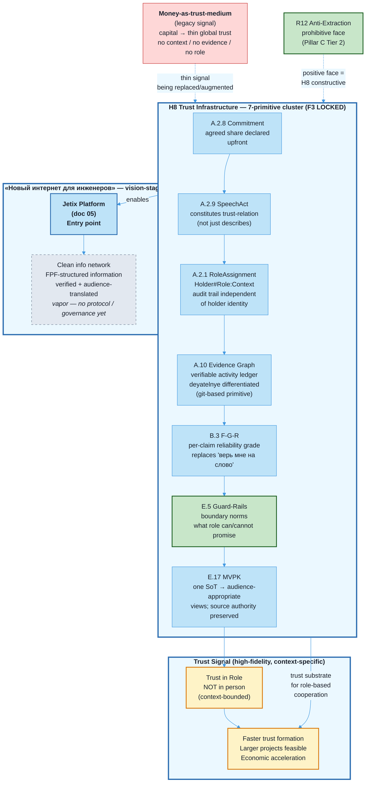

# Jetix as Clean Internet Layer — FPF-Described (Doc 06)

> **EP-5 disclosure.** «F8 / LOCKED» = Jetix-internal single-author Ruslan ack, NOT FPF B.3 F8.
>
> **EP-2 disclosure.** «Новый интернет», «чистый информационный слой», «защищённая сеть для инженеров» — это mention of vision artefact (text_002 Ruslan dictation), NOT operational claim об уже существующей системе. На 2026-05-17: ни один из этих инфраструктурных объектов не существует в operational form.
>
> **INTERNET-STATUS.** Clean internet layer = vision-stage vapor. Operational trust mechanism = primitive (filesystem + git). Описывается архитектурная цель, не текущая реальность.
>
> **H8-CLUSTER-STATUS.** 7-primitive cluster LOCKED как текст (F3, H8 Octagon 8th insight). Механизм = примитивный прототип. «Новый интернет» = vision.
>
> 10-15 min read.

---

## §0 TL;DR (≤200 слов)

Шестой слой Jetix — самый масштабный по замыслу и самый честно-vapor по текущему состоянию.

Тезис Руслана из text_002 (Ruslan verbatim 22:30, 2026-05-17): FPF нужно «использовать в описаниях всех методов, бизнесов, вариантов кооперации» — и в конечном счёте «создать новую систему, новый интернет, где как раз только на таком языке и общаются, сеть для инженеров, защищённую, стабильную». Jetix platform (doc 05) = **точка входа** в этот network.

Механизм этого слоя — **H8 Trust Infrastructure** (Octagon 8-й инсайт, LOCKED 2026-05-17): 7-примитивный кластер заменяет/дополняет money-as-trust-medium. Деньги были thin-signal доверия; FPF + open data + role-attestation дают высокоточный альтернативный сигнал.

**Честный статус:** 7-primitive cluster = F3 текст LOCKED (один автор, 4-источниковая триангуляция). Operational mechanism = primitive (git-based append-only log). «Новый интернет» = vision-stage vapor. Эта архитектура зависит от doc 01 + doc 02 + doc 03 + doc 05 — ни один из них не operational в полную силу.

[src: text_002 ¶1-2 verbatim; H8 LOCK §QR-CARD; vision/00-MASTER-VISION-PLAN-2026-05-17.md §3]

---

## §1 Verbatim source anchors

### §1.1 text_002 — «Новый интернет для инженеров» (Ruslan verbatim 22:30)

> «вот этот вот подход — по FPF общаться — его дальше нужно вот использовать в описаниях всех как бы методов, бизнесов, вариантов кооперации... создать новую систему. Ну или как-то новый интернет, где как раз только на таком языке и общаются друг с другом... сеть для инженеров, защищённая сеть, стабильная.»

[src: raw/voice-memos-2026-05-17-batch/text_002@17-05-2026_22-30.md ¶1-2 verbatim]

### §1.2 text_001 — «Деньги как средство доверия» (Ruslan verbatim 22:00)

> «Деньги как бы вообще не так сильно вызывают доверие, как другие методы — например, хорошо поговорить, или донести суть, или просто показать, что у тебя есть какие-то результаты.»

> «Эта система позволит быстро обмениваться ресурсами и просто улучшает и ускоряет процесс обмена. То есть, во-первых, позволяет более быстро доверять другому человеку либо понимать конкретно, в каком контексте ты ему можешь доверять, в каком не можешь. Или там доверять, например, не человеку, а **роли**, в которой он находится.»

[src: decisions/STRATEGIC-INSIGHT-JETIX-TRUST-INFRASTRUCTURE-2026-05-17.md §1 text_001 verbatim]

### §1.3 audio_672 — FPF как «очиститель от путаницы»

> «У нас должен быть **один source of truth** ... это как раз вот обязательно вот это как раз и наш **очиститель от путаницы** должен быть.»

> «Мы нанимаем звёзд, но при этом даём им **язык кооперации, вот этот FPF** ... все работают над одной базой, которая вот по FPF написана.»

[src: raw/voice-transcripts/audio_672@17-05-2026_18-59-52.txt paraphrase]

### §1.4 audio_673 — Verifiable activity logs как trust substrate

> «Если все записывать, что ты делаешь, ну, короче, это позволяет тоже как бы быть и честным, и **другие люди могут это видеть, что ты реально делаешь**. ... это будет ещё раз **подсвечивать деятельных людей и недеятельных людей**.»

[src: raw/voice-transcripts/audio_673@17-05-2026_19-49-05.txt paraphrase]

---

## §2 FPF mapping — 7-primitive cluster (H8 full unpacking)

### §2.1 A.1.1 BoundedContext declaration

**Glossary:**
- **trust-infrastructure** — capability cluster, NOT one FPF primitive; emergent property of 7 FPF primitives working together (H8 first Jetix insight requiring multi-Part composition)
- **money-as-trust-medium (legacy)** — thin global-reach trust signal; pre-FPF coordination substrate
- **role-attestation** — verifiable context-specific trust signal: Holder#Role:Context token with evidence trail (A.2.1), distinct from person-attestation
- **clean internet layer** — vision-stage concept: a network where information is structured per FPF, verified, and audience-translated; NOT an existing protocol or deployed system
- **deyatelnye** — role-bearers with verifiable activity evidence (audio_673 источник); contrasted with self-claiming non-deyatelnye
- **open-data transparency** — default assumption that activity logs are visible within agreed scope; ground for trust formation without money signal
- **agreed share** — inherited from R12 anti-extraction: the explicit pre-commitment of what can be extracted by each party (A.2.8)

**Invariants:**
- I-1: Trust is role-scoped, NOT person-scoped — «доверяешь роли, не человеку» (text_001 §5); U.RoleAssignment (A.2.1) token carries context
- I-2: Open data + activity logs = verifiable signal ONLY within agreed-share scope (R12 substrate; audio_673 transparency bounded by A.2.8)
- I-3: F-G-R per-claim tagging = explicit reliability signal replacing «верь мне на слово» (B.3 mandatory)
- I-4: Multi-view publication (E.17 MVPK) — one source of truth (audio_672 SoT) + audience-appropriate translations; source authority NOT diluted
- I-5: Guard-rails (E.5) encode role-attestation contracts — what each role can/cannot promise; boundary norms are structural, NOT cultural

**Roles (A.2.1):**
- `trustSeeker#RoleSeeker:network-context` — кто ищет trust-qualified коллаборацию
- `roleBearingParticipant#VerifiedRole:claimedContext` — holder with attestation trail
- `FPF-substrate#ClarityLayer:network-context` — language layer eliminating ambiguity per audio_672
- `evidenceLog#AppendonlyRecord:filesystem` — git-based primitive implementation of A.10

**Bridges:**
- → doc 02 (Methodology): FPF as language substrate enabling trust formation without prior acquaintance
- → doc 03 (Virtual Tribe): role-based mutual instrumentation is what this trust infrastructure enables; doc 03 references doc 06 for primitive-cluster mechanics
- → doc 05 (Platform): Jetix мастерская platform = entry point into this network; access layer
- → H8 LOCK: this doc is the full-unpacking counterpart to the LOCK's §3 primitive table

### §2.2 7-primitive cluster — full unpacking

| FPF primitive | Spec anchor | Роль в trust-infrastructure | Текущий статус в Jetix |
|---|---|---|---|
| **A.2.8 Commitment (U.Commitment)** | FPF Part A §2.8 | Role-attestation ground — agent commits via promise-content; promise is visible + verifiable before party trusts. Agreed share declared upfront eliminates retroactive renegotiation | F4 partial: R12 LOCKED (text); B.3 used in wiki; agreed-share formalization = engineering stub |
| **A.2.9 SpeechAct (U.SpeechAct)** | FPF Part A §2.9 | Open-data sharing = instituting speech act — creates the trust-relation, not merely transmits information. When Ruslan publishes this doc under F-G-R, that publication IS the trust-constituting act, not just a description of trust | F4 partial: used in wiki + Charter; Clan-context policy declared in doc 03 §4.1.4 |
| **A.2.1 RoleAssignment (U.RoleAssignment)** | FPF Part A §2.1 | «Доверяешь не человеку, а роли» — A.2.1 Holder#Role:Context token carries audit trail independent of holder identity. Role-token carves context-specific trust scope. IP-1 Role≠Executor applies as trust-engineering principle here | F4 partial: ROY swarm uses role-tokens; public role-attestation = stub |
| **A.10 Evidence Graph** | FPF Part A §10 | Verifiable activity logs (audio_673 «все записывается что ты конкретно сделал») = Evidence as substrate. Differentiates deyatelnye from non-deyatelnye without money signal. git log = current primitive implementation | F2 primitive: git log functional as evidence ledger; formal Evidence Graph = aspirational |
| **B.3 F-G-R** | FPF Part B §3 | Per-claim Formality / Group-scope / Reliability tagging = explicit reliability signal replacing «верь мне на слово». Every claim carries its F grade, making the epistemic standing of each statement explicit to the reader | F4 partial: F-G-R used throughout Jetix wiki; automated enforcement = stub |
| **E.5 Guard-Rails** | FPF Part E §5 | Role-attestation contracts encode boundary norms — what each role can/cannot promise. Guard-rails are structural: prevent role misuse, out-of-context extraction, unilateral agreed-share modification | F4 schema: Default-Deny table (11 entries) is Jetix analog; Norm-CAL formal encoding = stub |
| **E.17 MVPK** | FPF Part E §17 | Multi-view publication (audio_672 «один SoT → переводы на человеческий»). Same trust-content rendered audience-appropriate without losing source authority. Engineers see FPF formal; L1 partner sees plain narrative; machines communicate on FPF direct | F2 partial: two-view 1A+1B model exists (Doc 1A / Doc 1B); full MVPK bundle = aspirational |

**H8 brigadier note (preserved from LOCK).** «Это capability cluster, не одна FPF Part. H8 = первый Jetix insight требующий мульти-Part composition для FPF mapping.» [src: H8 §3 brigadier note]

### §2.3 Per-claim F-G-R

| # | Claim | F | G | R |
|---|---|---|---|---|
| C-1 | FPF + role-attestation + open data = более высокоточный trust signal, чем деньги (в тех контекстах, где обе стороны FPF-грамотны) | F3 | trust-mechanism-shift | refuted_if_first_L1_or_Clan_interaction_requires_money_as_primary_trust_basis |
| C-2 | Money-as-trust НЕ исчезает — augment claim, не total-replacement | F4 | realistic-framing | refuted_if_treated_as_total_replacement |
| C-3 | Role-attestation > person-attestation для scalable cooperation | F3 | jetix-trust-design | refuted_if_role_attestation_mechanism_evidenced_inoperable_within_90d |
| C-4 | «Новый интернет для инженеров» = vision-stage (NOT operational claim) | F2 | vision-FPF-internet | refuted_if_described_as_existing_deployed_network |
| C-5 | FPF eliminates per-transaction ambiguity negotiation → faster trust formation | F3 | cooperation-efficiency | refuted_if_FPF_onboarding_does_not_demonstrably_reduce_alignment_time |
| C-6 | Jetix platform (doc 05) = entry point to the trust network | F3 | platform-entry | refuted_if_platform_does_not_provide_role_attestation_access |

---

## §3 Plain English narrative (L1-friendly)

### §3.1 Почему деньги — слабый сигнал доверия

Деньги исторически выполняли роль trust-сигнала. Простая логика: если человек заплатил, значит, у него есть что терять, значит, есть skin-in-the-game. Это работало при thin global reach — с незнакомцами, через расстояния, при минимуме общего контекста.

Но это тонкий сигнал. Он говорит только одно: «у этого человека есть капитал». Ничего — о его реальных компетенциях в конкретной роли. Ничего — о том, держит ли он обязательства. Ничего — о контексте, в котором ему можно доверять. И ничего — о том, в каком контексте доверять ему нельзя.

Руслан в text_001: «Деньги вообще не так сильно вызывают доверие, как другие методы — например, хорошо поговорить, или донести суть, или просто показать, что у тебя есть какие-то результаты». [src: H8 §1 text_001]

### §3.2 Что заменяет money-as-trust-medium

H8 Trust Infrastructure описывает три альтернативных сигнала (per text_001 §3 + audio_673):

**Первый — demonstrated results (verifiable evidence).** Не «у него есть деньги», а «у него есть задокументированные результаты, которые можно проверить». audio_673: «все записывается, что ты конкретно делал». git log как примитивная реализация A.10 Evidence Graph. Дейятельные и недеятельные разделяются автоматически.

**Второй — FPF clarity (no ambiguity negotiation).** audio_672: FPF = «очиститель от путаницы». Без общего формального языка каждая trust-транзакция требует заново negotiating what-do-we-actually-mean. FPF выносит эту работу за пределы каждой транзакции → faster trust formation at lower cost.

**Третий — role-attestation (context-specific trust scope).** text_001 §5: «доверяешь не человеку, а роли, в которой он находится». A.2.1 RoleAssignment token: Holder#Role:Context. Левенчук в роли Scholar#системное-мышление:Jetix-L1 — один набор доверия. Тот же Левенчук в роли потенциального клиента — другой. Эти контексты не смешиваются.

Cross-link → doc 03 (Virtual Tribe): role-attestation как trust signal — это то, на чём стоит механизм mutual instrumentation в doc 03. Там описывается что становится возможно; здесь — механизм почему это работает.

### §3.3 Mechanism table — деньги vs FPF-trust

| Money-trust pattern (legacy) | Jetix trust-infrastructure (H8) |
|---|---|
| «У него есть деньги» → доверие к person | «У него есть verifiable results в A.10 Evidence Graph» → доверие к capability |
| «Заплатил → ergo не обманет» | «Open data + FPF disclosure → verifiable promise structure → можно проверить prior to commit» |
| «Он богатый → legitimate в industry» | «Он держит роль X в context Y per A.2.1 attestation chain → доверие к role contract, не к holder» |
| Trust scales с capital | Trust scales с verifiable activity volume + role-attestation density |
| Claim требует «верь мне на слово» | Claim несёт B.3 F-G-R triple → explicit reliability grade видна читателю |
| Multi-view = информация теряется при переводе | E.17 MVPK: один SoT, audience-appropriate views без потери source authority |

### §3.4 Role-attestation как trust signal — детали

Почему role-attestation принципиально отличается от person-attestation? [src: H8 §4]

Человек может быть reliable в одном контексте и unreliable в другом. «Доверять Руслану» — слишком широко. «Доверять Ruslan#FPF-scribe:Jetix-wiki» — точно: есть контекст, есть audit trail, есть verifiable outputs (именно этот файл).

IP-1 Role≠Executor здесь применимо как trust-engineering principle, не только как архитектурный. Executor меняется; роль с её context и promise-content остаётся. Когда следующий executor берёт ту же роль, attestation trail не обнуляется — он наследуется и дополняется.

Практическое следствие для Jetix L1 partnership (Левенчук, Цэрэн): первая trust-формация может происходить через FPF-описание ролей + evidence graph, а не через money-first. Это не означает, что денег нет. Это означает, что их не надо ставить первыми в очереди сигналов.

### §3.5 FPF как язык «очиститель» — механизм снижения friction

audio_672: «один source of truth ... очиститель от путаницы». Каждая cooperation без общего языка предполагает implicit overhead: стороны тратят ресурс на согласование того, что они вообще имеют в виду. Этот overhead платится заново при каждой новой транзакции.

FPF выносит это за скобку. Когда обе стороны FPF-грамотны — U.Role, U.Commitment, F-G-R, Evidence — база согласована заранее через язык. Каждая транзакция начинается с этой базы. Снижение friction → faster trust → more complex projects feasible.

audio_673: «специалисты из разных сфер и ниш быстро между собой сотрудничают... информация в разы быстрее».

E.17 MVPK делает это масштабируемым: FPF SoT переводится на «человеческий язык» для каждой аудитории, не теряя source authority. Машины говорят на FPF напрямую. Люди видят адаптированный view.

### §3.6 «Новый интернет для инженеров» — что это означает и что нет

text_002 (Ruslan): «новый интернет, где только на таком языке и общаются, сеть для инженеров, защищённую, стабильную».

**Что это означает (vision-stage architecture):** сеть, где качество и достоверность информации гарантированы не авторитетом источника и не деньгами, а структурой (F-G-R tagging) + verification chain (FPF-натренированные cells) + role-attestation (A.2.1 evidence). Инженерам доверяют не потому что они дорого стоят, а потому что их activity logs verifiable.

**Что это НЕ означает (EP-2 use-mention discipline):** на 2026-05-17 такой сети не существует. Нет protocol spec. Нет governance для curation/gatekeeping. Нет standards для onboarding не-FPF участников. Нет deployed infrastructure. Текущая реализация = filesystem + git + F-G-R convention внутри Jetix. Это примитивный прообраз, не deployed network.

**Почему честно называть это vision:** потому что описание этого vision сейчас — это и есть часть L0-работы (text_003: «L0 = описать систему по FPF»). Зафиксировать архитектурную цель, чтобы последующие решения (L1 platform, L2 overlays) ей не противоречили.

Cross-link → doc 05 (Platform): Jetix мастерская platform = entry point in this network. Platform не сама является сетью — она точка входа для тех, кто хочет кооперироваться в FPF-substrate.

### §3.7 Связь с R12 anti-extraction — positive face

R12 anti-extraction (Pillar C Tier 2, rule 12) — prohibitive face: что запрещено. H8 Trust Infrastructure — constructive face: что строится вместо запрещённого.

R12 говорит: «нельзя извлекать ценность сверх agreed share». H8 говорит: «вот механизм, который делает это visible и traceable заранее». Вместе R12 + H8 = complete policy:
- Substrate не может unilaterally расширить extraction surface (R12 структурный запрет)
- Участники могут проверить до входа, что extraction surface bounded (H8 transparency)
- Fork-and-leave сохраняется как exit право (Charter §11 + R12)

[src: H8 §5 «R12 = prohibitive face; H8 = constructive face»]

Cross-link → doc 03 (Virtual Tribe §3.4): там R12 как «substrate guard, positive face» разобран в контексте mutual instrumentation. Здесь — в контексте trust network layer.

### §3.8 Честный статус — что работает сейчас

**Работает (primitive level):**
- H8 Strategic Insight LOCKED (F3, 8th Octagon vertex)
- F-G-R per-claim tagging практикуется в Jetix wiki и docs
- git log = A.10 Evidence primitive (append-only activity record)
- R12 LOCKED как Tier-2 substrate rule (text; enforcement = partial)
- doc 03 role-attestation mechanics описаны (architecture)

**Aspirational:**
- role-attestation как public signal = vapor (не развёрнут вне Jetix internal)
- A.10 Evidence Graph формальная = stub (нет schema, нет query interface)
- E.17 MVPK full bundle = aspirational (два view 1A/1B есть; bundle = нет)
- «Новый интернет» = vision-stage vapor (нет protocol, governance, standards)
- FPF onboarding для L1 partners = первый тест pending

**Зависимости:**
- doc 01 (Self-OS) substrate runtime enforcement STUB (7/11 Parts)
- doc 02 (Methodology) fork guide v0 aspirational
- doc 03 (Virtual Tribe) 0 Clan signatories
- doc 05 (Platform) L1 prototype = 2-day intent, не SLA

---

## §4 FPF formal version

### §4.1 Trust-formation без money — формальный механизм

```
TrustFormation(A, B) iff:
  role_scoped: U.RoleAssignment(A, Role_A, Context_C) ∧
               U.RoleAssignment(B, Role_B, Context_C) ∧
  evidence_available: A.10.EvidenceGraph(A, observed_work_trail) ∧
                      A.10.EvidenceGraph(B, observed_work_trail) ∧
  commitment_declared: U.Commitment(A, agreed_share_A) ∧
                       U.Commitment(B, agreed_share_B) ∧
  speech_act_constitutes: U.SpeechAct(A, publish(F_grade, G_scope, R_condition)) ∧
  guard_rails_enforced: E.5.GuardRails(Role_A, Role_B, boundary_norms) ∧
  multi_view_available: E.17.MVPK(SoT → {view_A: audience_A, view_B: audience_B, ...})

MoneyTrust(A, B) iff:
  capital_signal: capital(A) > threshold ∧ ¬(role_scope ∨ evidence ∨ commitment_structure)
  -- thin signal: no context, no evidence trail, no capability grounding
```

**Plain English:** Trust формируется когда обе стороны имеют role-scoped tokens с evidence trails, declared commitments в рамках agreed share, конституирующие speech acts с explicit reliability grades, guard-rails на boundaries, и multi-view перевод без потери source authority. Money-trust = тонкий сигнал: только capital threshold без контекста, evidence или capability structure.

### §4.2 7-primitive composition — системная диаграмма

```
CleanInternetLayer := trust_cluster(
  A.2.8 Commitment     → agreed-share anchor (что именно обещано)
  A.2.9 SpeechAct      → constitutes the trust-relation (не описывает; создаёт)
  A.2.1 RoleAssignment → context-scoped trust token (Holder#Role:Context)
  A.10  EvidenceGraph  → verifiable activity ledger (differentiate deyatelnye)
  B.3   F-G-R          → per-claim reliability signal (explicit epistemic grade)
  E.5   Guard-Rails    → boundary norms (what role can/cannot promise)
  E.17  MVPK           → one SoT, audience-appropriate views (no authority loss)
)

-- Trust scales with:
--   role-attestation density (count A.2.1 tokens with evidence)
-- + activity volume (count A.10 Evidence entries)
-- + F-G-R average grade (sum F_grades / count claims)
-- NOT with: capital(holder)
```

### §4.3 U.BoundedContext bridges (cross-doc)

- **→ doc 02 Methodology** (`U.MethodDescription A.3.2`): FPF language substrate = precondition. Without shared formal language, per-transaction ambiguity negotiation persists. doc 02 provides the substrate; doc 06 depends on it.
- **→ doc 03 Virtual Tribe** (`U.RoleAssignment A.2.1`, `U.Commitment A.2.8`, `Γ_sys B.1.2`): mutual instrumentation (doc 03) operates ON this trust infrastructure. Trust mechanism is the layer that makes role-based cooperation safe and scalable. Cross-ref: doc 03 §4.1.5 Bridges explicitly names doc 06.
- **→ doc 05 Platform** (`U.System A.1`, `E.17 MVPK`): platform provides entry-point UX. This layer is the protocol; platform is the access interface. Without trust infrastructure, platform = collaboration tool (narrow). With it = entry point to trust network (broad).

---

## §5 Mermaid diagram — trust infrastructure mechanism



**Diagram M6.** Trust-infrastructure cluster: 7 FPF primitives working together замещают/дополняют money-as-trust-medium. Outcome = high-fidelity context-specific role-based trust → faster cooperation → larger projects. Jetix platform = entry point в vision-stage clean info network. R12 anti-extraction = prohibitive face; H8 = constructive face. Пунктир = vapor / vision-stage.

---

## §6 Cross-references

### §6.1 Octagon insights H1-H8

| Insight | Связь с doc 06 |
|---|---|
| H1 Foundation Model | Trust infrastructure = one of foundation-model capabilities — substrate внутри H1 |
| H2 Partnership Model | Cross-org partnerships scale when trust forms fast; H8 = enabling mechanism для H2 compounding |
| H3 (R&D Flywheel) | Faster trust → more experiments feasible → R&D acceleration |
| H4 Balaji Network State | NS thesis предполагает shared trust substrate across state-borders; H8 = FPF-version этого substrate |
| H5 Tyson Mentorship | Mentor-protégé trust currently person-based; H8 enables role-attestation для mentor scaling |
| H6 Gamified Platform / Realm | Realm reputation visibility metrics = early H8 signal (activity logs); H8 generalizes |
| H7 People-NS | Clan archetypes (Hunter/Guardian/etc) = role taxonomy; H8 = trust mechanism делающий Clan possible без financial gatekeeping |
| **H8 Trust Infrastructure** | **PRIMARY ANCHOR** — этот документ = full unpacking H8 §3 primitive table; doc 06 = H8 engineering elaboration |

**H8 и все 7 предыдущих.** H8 = enabling infrastructure для H1-H7. Без trust infrastructure все 7 предыдущих insights остаются aspirational — каждый предполагает, что люди cooperate без money-mediated trust при каждой транзакции. H8 = «почему это работает» ответ. [src: H8 §5]

### §6.2 Phase 0 objects

- **O-21 (NC-1 candidate) Trust Infrastructure** — primary anchor этого документа; F3 aspirational; «candidate-pending-architectural-decision» per §9.1 O-21 row в 01-jetix-objects-inventory.md
- **O-09 Hexagon / Octagon insights** — H8 = 8-й vertex Octagon; этот doc = elaboration
- **O-11 R12 Anti-Extraction** — prohibitive face; H8 = constructive face; вместе = complete policy
- **O-01 Operational substrate** — filesystem + git = current primitive trust infrastructure implementation
- **O-13 Clan / People-NS** — trust infrastructure enables Clan activation (0 signatories currently)

### §6.3 Doc series

- ← Doc 02 (Methodology) — FPF language = precondition (без общего языка trust formation requires per-transaction negotiation)
- ← Doc 03 (Virtual Tribe) — mutual instrumentation OPERATES on this trust layer; не дублируем role-attestation primitives, cross-link explicit
- ← Doc 05 (Platform) — platform = entry point; this layer = protocol; platform provides UX access
- → Doc 07 (Overview) — «virtual tribe = emergent property of platform + methodology + trust infra»: synthesis integrating this layer

### §6.4 Foundation cross-refs

- **Pillar C Tier 2 rule 12 (R12)** — prohibitive face; H8 = constructive face; paired policy
- **Part 6a F-G-R schema** — B.3 F-G-R = primitive tagging practice; formal enforcement = Phase B stub
- **Part 6b Guard-Rails / Default-Deny** — E.5 Jetix analog; 11 entries в .claude/config/default-deny-table.yaml
- **JETIX-VISION-FUNDAMENTAL-2026-04-27** — constitutional vision parent; this layer is operational sequencing под Part 11 strategic direction

---

## §7 Open questions for Ruslan (R1 surface)

**OQ-D06-1 (CRITICAL).** «Новый интернет» = отдельный O-22 Phase 0 объект или это extension O-21 Trust Infrastructure? vision/00-MASTER-VISION-PLAN §2 таблица называет NEW: O-22 candidate «Clean info network»; 01-jetix-objects-inventory не содержит этого как separate row. Ruslan decides: O-22 self-standing или sub-aspect O-21?

**OQ-D06-2.** Role-attestation mechanism: текущий primitive (git log + F-G-R tagging) достаточен для L1 trust demonstration (Левенчук + Цэрэн), или нужен более formal mechanism BEFORE first L1 collaboration?

**OQ-D06-3.** Money + FPF trust: в первых L1 partnerships будут обе стороны present? Или hypothesis что FPF-trust достаточен как primary signal для этих конкретных отношений? H8 §6.3 R.1: «реалистично: H8 augments, не заменяет полностью».

**OQ-D06-4.** FPF onboarding «3 часа vs 3-4 недели» (audio_673) — это hypothesis или tested claim? Если hypothesis, на чём её протестировать первым? First Clan cohort? First L1 session с Левенчуком?

**OQ-D06-5.** E.17 MVPK для публичной поверхности: каждый external Jetix artefact должен нести F-G-R triple явно (как этот документ)? Или F-G-R = internal convention, не public surface?

**OQ-D06-6.** Onboarding gate tension (H8 §6.3 R.4): «trust substrate requires shared formal language» — FPF literacy = barrier to entry. Как Jetix onboards non-FPF-literate participants в clean info network? L0 FPF describe documents (этот серия) = ответ? Или нужен отдельный onboarding mechanism?

**OQ-D06-7 (surface, не decide — R1).** R12 + H8 как FPF Part E contribution candidate (OQ-MASTER-6 из H8 §7). Ruslan decides когда это уместно поднять к FPF community.

---

## §8 R1 reaffirmation + dissents preserved (AP-6)

### §8.1 R1 reaffirmation

**prose_authored_by: ruslan-via-voice-dictation+brigadier-structured.**

Этот документ = surface'инг из verbatim Ruslan dictation (text_001, text_002, audio_672, audio_673) + LOCKED canonical (H8 Octagon, R12 Pillar C). FPF структура = brigadier + engineering-expert × integrator. Strategic narrative authored Ruslan.

«Новый интернет» = vision voiced by Ruslan 22:30. AI не авторизует этот vision как strategic claim — он организует voiced content в FPF структуру и честно помечает статус (vapor).

### §8.2 Dissents preserved (AP-6) — 3 entries

**D-DOC06-ENG-1: Trust cluster = single primitive OR multi-primitive composition?**
- *Position (eng × integrator):* H8 = capability cluster, 7-primitive composition. Brigadier note in H8 LOCK: «first Jetix insight requiring multi-Part composition». Engineering cell endorses cluster framing.
- *Counter-position (phil × critic, from H8 §10 D-H8-1):* Single-primitive read possible — U.SpeechAct dominant, others derivative.
- *F:* F3 | *ClaimScope:* FPF mapping frame for H8 | *R:* refuted_if FPF Part authors clarify single-primitive-dominant read
- **Status:** PRESERVED. Cluster framing adopted here per H8 brigadier note; single-primitive alternative carried.

**D-DOC06-ENG-2: «Новый интернет» — vapor or near-term buildable?**
- *Position (eng × integrator):* Vision-stage vapor per EP-2 discipline. No protocol spec, governance, or standards exist. Current implementation = primitive (filesystem + git).
- *Counter-position (possible phil × critic):* text_002 может читаться как near-term design target, не vapor. «Нехуй делать с Claude Code» (text_003) предполагает near-term buildability для platform layer.
- *F:* F2 | *ClaimScope:* text_002 ¶1-2 | *R:* refuted_if L1 platform prototype (doc 05 intent) addresses network layer, not just platform layer
- **Status:** PRESERVED. Doc 06 treats as vapor; near-term interpretation preserved as open dissent pending phil × critic pass.

**D-DOC06-ENG-3: Money-as-trust augment OR replace?**
- *Position (eng × integrator):* Augment claim (H8 §6.3 R.1). Money не исчезнет; FPF provides additional higher-fidelity signal для contexts where both parties FPF-literate.
- *Counter-position (affect-reading of text_001):* text_001 «вообще не так сильно вызывают доверие» может читаться как replacement claim в affect-mode dictation.
- *F:* F3 | *ClaimScope:* text_001 §3 | *R:* refuted_if first L1 partnerships show money-first as irremovable
- **Status:** PRESERVED. Augment framing adopted as more defensible; affect-reading preserved as dissent.

---

## §9 Proposed writes

```yaml
proposed_writes:
  - path: swarm/wiki/drafts/task-fpf-describe-jetix-2026-05-17-internet-eng-integrator.md
    status: written (this file)
    frontmatter: ✓ per template §2.1 jetix-fpf-describe-PLAN-2026-05-17.md
    body_sections: 9 (§0 TL;DR + §1 verbatim + §2 FPF mapping + §3 plain English + §4 formal + §5 mermaid + §6 cross-refs + §7 open questions + §8 R1+dissents)
    primitives_count: 7 (A.2.8 + A.2.9 + A.2.1 + A.10 + B.3 + E.5 + E.17)
    mermaid: ✓ (cool blues palette, color:#1a202c contrast)
    honest_status: ✓ (INTERNET-STATUS + H8-CLUSTER-STATUS disclosures)
    edges_to_add:
      - from: doc 06 this file
        to: decisions/STRATEGIC-INSIGHT-JETIX-TRUST-INFRASTRUCTURE-2026-05-17.md
        type: elaborates (primary anchor)
      - from: doc 06 this file
        to: vision/jetix-fpf-describe/03-jetix-as-virtual-tribe-substrate.md
        type: cross-ref (trust mechanism enables mutual instrumentation)
      - from: doc 06 this file
        to: reports/phase-0-fpf-scope/01-jetix-objects-inventory.md
        type: references (O-21 candidate anchor)
```

---

## §10 Conformance checklist (eng × integrator self-check)

| # | Check | Result | Evidence |
|---|---|---|---|
| 1 | 9 sections present | PASS | §0 TL;DR + §1 verbatim + §2 FPF mapping + §3 plain English + §4 formal + §5 mermaid + §6 cross-refs + §7 OQ + §8 R1+dissents = 9 |
| 2 | ≥7 FPF primitives (full H8 cluster) | PASS | A.2.8 + A.2.9 + A.2.1 + A.10 + B.3 + E.5 + E.17 = 7 |
| 3 | Mermaid present (cool blues, #1a202c) | PASS | §5 diagram M6 |
| 4 | Honest status (INTERNET-STATUS + H8-CLUSTER-STATUS) | PASS | Frontmatter disclosures + §0 + §3.6 |
| 5 | A.1.1 BoundedContext (glossary + invariants + roles + bridges) | PASS | §2.1 full declaration |
| 6 | Cross-links to docs 02, 03, 05 (no duplication) | PASS | §3.2 + §3.4 + §3.5 + §4.3 + §6.3 explicit; role-attestation mechanics NOT duplicated from doc 03 |
| 7 | Dissents preserved (AP-6) | PASS | §8.2 — 3 dissents with (F, ClaimScope, R) triples |
| 8 | EP-5 + EP-2 + R1 disclosures | PASS | Frontmatter mandatory_disclosures + §0 header |
| 9 | Γ_work NOT misused | PASS | Γ_sys + Γ_method used in references to doc 03; not introduced here |
| 10 | Per-claim F-G-R (§2.3) | PASS | 6 claims with F/G/R triples |

---

*Engineering-expert × integrator draft. §5.5.5 gate: provenance ✓ inline [src: citations] / EP-5 ✓ / EP-2 ✓ / R1 ✓ / AP-6 ✓ (3 dissents preserved) / Γ_work misuse ✓ (not used) / H8 7-primitive cluster ✓ / mermaid ✓. Pending: phil × critic + eng × critic passes.*
