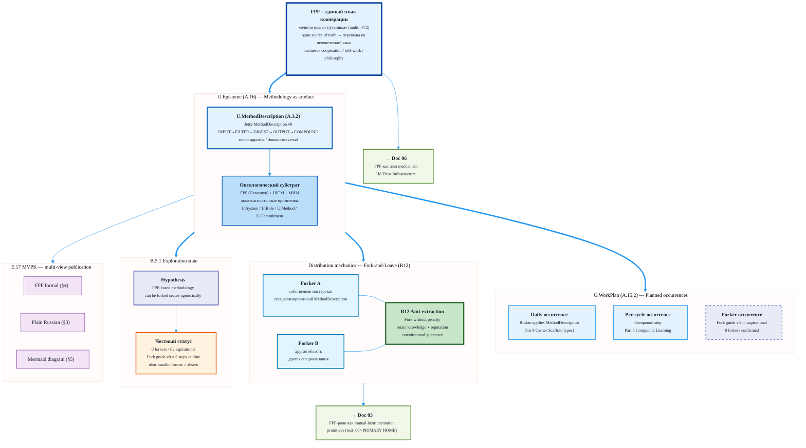

# Jetix as Methodology — FPF-Described (Doc 02)

> **EP-5 disclosure.** «F8 / LOCKED» в этом документе = Jetix-internal single-author Ruslan ack, NOT FPF B.3 F8 (independent verification). Document-level floor F2 (минимум по per-claim grades). Per-claim F2-F5 см. §2.
>
> **EP-2 disclosure.** Этот документ описывает O-05 как artefact (mention). Fork guide v0 существует как 6-шаговый outline; 0 forkers подтверждено на 2026-05-17. Не путать с operational methodology.
>
> **LIVE-FLAG.** Aisystant subscription (B2) = blocker. Сравнения с IWE paid AI guide скопированы ТОЛЬКО на public template v0.31.0.
>
> 10-15 min read.

---

## §0 TL;DR (≤200 слов)

Jetix — это не просто AI OS для одного человека. Это **методология**: способ мышления и работы с информацией, который можно описать, передать и воспроизвести. Методология оформлена через FPF (Foundation Patterns Framework Анатолия Левенчука) — **универсальный язык описания методов**, бизнесов, вариантов кооперации, самостоятельной работы и философии.

Через FPF-линзу: O-05 Jetix-как-методология = U.MethodDescription (A.3.2) — рецепт действий. Методология распределяется не как SaaS-продукт, а как **паттерн**: форкни → адаптируй под свою мастерскую → работай по правилам без экстракции (R12). ШСМ (Школа Системного Менеджмента Левенчука) и МИМ (Мастер Информационного Моделирования) — **онтологический субстрат**, на котором Jetix строится.

**Честный статус (B.5.1 Exploration):** Fork guide v0 = aspirational; 0 forkers подтверждено; distributable format отсутствует. Методология работает сейчас как внутренняя организационная рамка (F4 operational), НЕ как публичный дистрибутив (F2 aspirational).

Cross-link → doc 03: FPF-роли как примитивы mutual instrumentation (text_004 thesis, полная версия там). Cross-link → doc 06: FPF как trust mechanism через role-attestation + transparency (H8 Trust Infrastructure).

[src: reports/phase-0-fpf-scope/01-jetix-objects-inventory.md §1 O-05; vision/jetix-fpf-describe-PLAN-2026-05-17.md §2.2 doc-02 row]

---

## §1 Verbatim source anchors

Пять прямых цитат из первоисточников:

**1. FPF как единый язык (audio_672)**

> «У нас должен быть **один source of truth**, какие-то ещё все эти понятия утверждены в одном документе. И потом уже отталкиваясь от него переводы на человеческий язык. ... это как раз и наш **очиститель от путаницы** должен быть.»

[src: raw/voice-transcripts/audio_672@17-05-2026_18-59-52.txt ¶1-2]

**2. FPF как язык кооперации (audio_672)**

> «Мы нанимаем звёзд, но при этом даём им **язык кооперации, вот этот FPF**, плюс ещё у каждого там усиление, ну просто ебейший усилитель есть, плюс переводчик. И соответственно все работают над одной базой, которая вот по FPF написана.»

[src: raw/voice-transcripts/audio_672@17-05-2026_18-59-52.txt ¶3]

**3. FPF для описания методов, бизнесов, кооперации (text_002)**

> «Вот этот вот подход — по FPF общаться — его дальше нужно вот использовать в описаниях всех как бы методов, бизнесов, вариантов кооперации, самостоятельной работы, ну и типа философии. Создать новую систему.»

[src: vision/00-MASTER-VISION-PLAN-2026-05-17.md §1 text_002 ¶1-2]

**4. Fork-and-Leave как принцип распределения методологии (Clan Charter §11)**

> «Участники могут выйти из Clan в любой момент, сохраняя всё что наработали — знания, связи, репутацию. Никакого penalty, никакого lock-in.»

[src: decisions/JETIX-FIRST-CLAN-CHARTER-2026-05-12.md §11, R12 constitutional anchor]

**5. O-05 статус и bounded context (Phase 0 inventory)**

> «Fork guide v0 (§11 working file) — minimal viable instance (6 шагов). Aspirational — нет distributable format; нет первого forker. Phase C remit.»

[src: reports/phase-0-fpf-scope/01-jetix-objects-inventory.md §2 O-05 notes mgmt frame]

---

## §2 FPF mapping — примитивы, bounded contexts, F-G-R

### §2.1 Основной примитив — U.MethodDescription (A.3.2)

**U.MethodDescription** — рецепт действий: упорядоченный набор шагов, исполнителей, входов и выходов, описывающий, КАК производить определённый результат.

Jetix-как-методология = U.MethodDescription потому что:
- Он описывает рецепт работы с информацией (INPUT → FILTER → DIGEST → OUTPUT из doc 01)
- Он содержит роли исполнителей (U.Role A.2), методы (U.Method A.3.1), рабочие планы (U.WorkPlan A.15.2)
- Он сектор-агностичен: один MethodDescription, разные instantiations (разные мастера, разные области)
- Он forkable по замыслу: U.MethodDescription можно скопировать, специализировать, Fork-and-Leave

F: F5 / G: fpf-primitive-assignment / R: refuted_if_FPF_Spec_A.3.2_definition_changes_to_exclude_sector-agnostic_applicability

[src: reports/phase-0-fpf-scope/01-jetix-objects-inventory.md §1 O-05 «FPF primitive (eng)»; reports/phase-0-fpf-scope/00-JETIX-FPF-MASTER-2026-05-17.md §1 O-05 row]

### §2.2 Вторичный примитив — U.Method (A.3.1)

**U.Method** — конкретное occurrence методологии: данный конкретный Ruslan применяет MethodDescription здесь и сейчас.

Различие критично: U.MethodDescription = рецепт (инвариант), U.Method = приготовление (конкретная реализация). Когда Ruslan работает по Jetix-методологии сегодня — это U.Method (A.3.1). Когда мы пишем этот документ — мы описываем MethodDescription (A.3.2).

F: F5 / G: fpf-primitive-assignment / R: refuted_if_FPF_Spec_A.3.1_A.3.2_boundary_revised

### §2.3 Рабочий план — U.WorkPlan (A.15.2)

**U.WorkPlan** — запланированные occurrences метода с временными окнами и исполнителями.

Применимость к Doc 02 (в отличие от Doc 01): методология имеет **запланированные occurrence события**:
- «Ruslan применяет Jetix-MethodDescription daily (Part 9 scaffold)»
- «Первый forker применяет адаптированную MethodDescription в своей мастерской»
- «MIM overlay: Levenchuk's ШСМ ontological vocabulary применяется к Jetix descriptions»

В Doc 01 (self-OS substrate) U.WorkPlan был предложен ошибочно для P-1..P-10 (process steps ≠ planned occurrences). Здесь U.WorkPlan применяется правомерно: Fork guide v0 = proto-WorkPlan с шагами для forker (временные окна + исполнитель = forker-instance).

F: F4 / G: jetix-methodology-workplan / R: refuted_if_Fork_guide_v0_lacks_temporal_windows_upon_detailed_audit

[src: vision/jetix-fpf-describe-PLAN-2026-05-17.md §2.2 примечание «U.WorkPlan can be used HERE (methodology has planned occurrences with windows) UNLIKE Doc 01»]

### §2.4 U.Episteme (A.16) — методология как эпистемический артефакт

Методология Jetix = **U.Episteme**: систематизированное знание о том, как работать с информацией. В FPF A.16 language-state — LOCKED как arteff. Это отличает её от U.Work (конкретный рабочий процесс) и U.System (операционная система).

Важно: «Foundation LOCKED» (EP-5) = U.Episteme language-state «LOCKED». Это НЕ означает, что методология операционально реализована у партнёров. Это arteff lock.

F: F5 / G: fpf-episteme-assignment / R: refuted_if_FPF_A.16_scope_changes

### §2.5 E.17 MVPK — мульти-вид публикация

Методология Jetix публикуется в нескольких представлениях (E.17 Multi-View Publication):
- **FPF formal** (этот документ — технический для L1 аудитории)
- **Plain English narrative** (§3 ниже — для читателей без FPF literacy)
- **Mermaid diagrams** (§5 — визуальный)

Три представления = один source of truth (этот документ) → разные views. Именно это Ruslan имел в виду в audio_672: «единый язык + переводы на человеческий язык».

F: F4 / G: jetix-mvpk-methodology / R: refuted_if_representations_diverge_on_content

### §2.6 B.5.1 Exploration state

Методология Jetix-как-O-05 находится в **B.5.1 Exploration state** (не Operations). Критерий:
- B.5.1 Explore: «Hypothesis validation; no committed resource deployment at scale» → соответствует (0 forkers; Fork guide v0 = 6 steps outline)
- B.5.2 Operate: «Committed deployment; multiple instances running» → НЕ соответствует

Это не слабость — это честный статус. Каждая крупная методология начинала в Explore state. FPF сам прошёл этот путь.

F: F4 / G: jetix-methodology-exploration / R: refuted_if_first_confirmed_forker_activates_B.5.2_transition

---

## §3 Narrative (800-1200 слов, L1-friendly)

### §3.1 Методология vs технология — почему это не одно и то же

FPF = не технология. Это **метод-для-описания-методов** (мета-методология). И это сделало его универсальным.

Технология решает конкретную задачу: этот алгоритм сортирует вот этот тип данных. Методология задаёт **способ думать и работать**: что вообще считать задачей, кто её делает, по каким принципам, как проверить результат.

Именно поэтому FPF работает одинаково хорошо для описания бизнеса, кооперации между экспертами, личного Self-OS (Doc 01), корпоративной архитектуры (Doc 04) и доверительной инфраструктуры (Doc 06). Примитивы языка (U.System, U.Role, U.Method, U.Commitment) — **домен-агностичны**. Они описывают форму, не содержание.

Ruslan сформулировал это в audio_672: FPF = «очиститель от путаницы». Когда двое говорят об «управлении проектом» — они часто имеют в виду разные вещи. Один — Kanban-доску. Другой — формальную методологию с ролями, методами и commitments. FPF даёт **точку пересечения**: оба описывают свои системы в одних терминах → путаница устраняется до начала кооперации, а не в процессе.

[src: raw/voice-transcripts/audio_672@17-05-2026_18-59-52.txt ¶1-3]

### §3.2 FPF как единый язык — «очиститель от путаницы»

Ruslan артикулировал ключевой тезис в серии голосовых заметок (text_002 + audio_672 + audio_673): **«по FPF общаться» нужно использовать для описания всех методов, бизнесов, вариантов кооперации, самостоятельной работы и философии — чтобы создать новую систему**.

В чём конкретно ценность единого языка?

Представьте переговоры между двумя экспертами из разных областей: один — системный мыслитель по ШСМ, другой — продуктовый менеджер по Cagan. Они оба хотят сотрудничать. Но когда первый говорит «метод» — он имеет в виду U.Method (A.3.1), конкретный рабочий процесс с временными параметрами и исполнителями. Когда второй говорит «метод» — он имеет в виду «подход», который ещё не определён детально. Они тратят половину первой встречи на разрешение этой путаницы.

FPF как единый язык означает: **оба описали свои системы заранее, в одних примитивах**. Встреча начинается с aligned understanding, не с clarification. Это экономия когнитивного бюджета на каждую транзакцию кооперации.

audio_673 добавляет: «Ты можешь свои конкретно мысли хуяк зафиксировать конкретно в этом документе, потом дать это другому человеку. Он это читает, анализирует, и потом тоже у себя фиксирует вот эту же картинку в голове. И вы как бы общаетесь об одном и том же.»

[src: vision/00-MASTER-VISION-PLAN-2026-05-17.md §1 text_002 + audio_672/673 anchors]

### §3.3 ШСМ/МИМ overlay — онтологический субстрат

Jetix строится на **онтологическом фундаменте Анатолия Левенчука**: Школа Системного Менеджмента (ШСМ) и Мастер Информационного Моделирования (МИМ).

ШСМ — это учебная программа и методологический корпус, который Левенчук разрабатывает последние 20+ лет. FPF — это его дистилляция в виде формальной спецификации. МИМ — практик FPF, человек, который умеет описывать системы через FPF примитивы.

Почему Jetix строится именно на этом фундаменте, а не изобретает собственный?

Потому что это **уже решённая задача**. FPF прошёл проверку временем и применением в разных областях. Вместо того чтобы разрабатывать новый онтологический язык с нуля (дорого, рискованно, несовместимо с существующим сообществом), Jetix берёт FPF как субстрат и **строит поверх него** — добавляет R12 anti-extraction (нашего Jetix собственного вклада, J-U2 unique per Phase 0 audit), Trust Infrastructure cluster (H8), operational patterns для AI-native workflows.

Это то, что инженеры называют «don't reinvent the wheel» — но применённое к онтологии и методологии. Wheel = FPF. Jetix = vehicle, который едет на этих колёсах.

[src: reports/phase-0-fpf-scope/00-JETIX-FPF-MASTER-2026-05-17.md §3 comparison; reports/phase-0-fpf-scope/01-jetix-objects-inventory.md §2 O-05 notes]

### §3.4 Fork-and-Leave — методология как open-source дистрибуция

Методология Jetix задумана как **open-source-style дистрибуция**. Не SaaS с vendor lock-in, не franchise с royalty, не консалтинговая фирма с ND А. **Форк и уходи** — R12 anti-extraction как конституциональная гарантия.

Что это означает практически:

1. Любой мастер изучает методологию Jetix (через FPF описанную)
2. Создаёт свою мастерскую на этом фундаменте — форкает MethodDescription
3. Адаптирует под свою область (специализирует U.MethodDescription под свой domain)
4. Работает по правилам, которые сам принял (не по которым его заставили)
5. В любой момент может уйти со всем наработанным — знаниями, репутацией, связями — без penalty

Это принципиально отличается от большинства корпоративных и образовательных систем, которые создают зависимость через:
- Сертификацию, которая валидна только внутри системы
- Знания, которые нельзя легально передать или применить за пределами
- Инструменты, которые не работают без подписки на конкретный вендор

R12 — это не просто красивый принцип. Это **структурная гарантия**: никакой механизм Jetix не может lock-ать мастера out of системы, которую он построил с использованием Jetix-методологии.

[src: decisions/JETIX-FIRST-CLAN-CHARTER-2026-05-12.md §11; swarm/awaiting-approval/r12-anti-extraction-2026-05-12.md; decisions/STRATEGIC-INSIGHT-JETIX-TRUST-INFRASTRUCTURE-2026-05-17.md §1 «positive face R12»]

### §3.5 Phase 0 — 14 объектов как pattern library

14 объектов, выделенных в Phase 0 (reports/phase-0-fpf-scope/01-jetix-objects-inventory.md) — это не просто inventory для внутреннего использования. Это **первая версия pattern library** Jetix-методологии, типизированная через FPF примитивы.

| Тип паттерна | Объекты | FPF primitive |
|---|---|---|
| System substrate | O-01 (substrate), O-07 (Foundation) | U.System (A.1) |
| Role taxonomy | O-06a, O-06b | U.Role (A.2), U.RoleAssignment (A.2.1) |
| Method-as-recipe | O-05 (методология), O-03 (vision) | U.MethodDescription (A.3.2) |
| Constitutional layer | O-08 (Pillar C), O-11 (R12) | U.Commitment (A.2.8), Guard-Rails (E.5) |
| Commercial vehicle | O-02, O-10 | U.PromiseContent (A.2.3) |
| Trust cluster | O-21 candidate (H8) | A.2.8 × A.2.9 × E.5 × B.3 |

Когда следующий мастер приходит в Jetix с вопросом «как описать мою мастерскую через FPF» — он получает не пустой бланк, а **14 типизированных примеров** с FPF-аннотациями. Pattern language в действии.

[src: reports/phase-0-fpf-scope/01-jetix-objects-inventory.md §1 full table]

### §3.6 FPF-роли как примитивы mutual instrumentation — cross-link к doc 03

Одно из ключевых применений FPF-методологии в Jetix — **mutual instrumentation**: когда участники с разными ролями (U.Role × U.Capability × U.Commitment) становятся инструментами усиления друг друга.

Полная разработка этого тезиса — в **doc 03 (Jetix as Virtual Tribe Substrate)**, где text_004 является первоисточником (humans-as-information-processing-instruments + role-based mutual instrumentation + tribal activation через FPF-ясность ролей).

Здесь, в контексте методологии: FPF-роли enable это не случайно. U.Role (A.2) описывает функцию, не личность. U.Capability (A.2.2) — что роль может делать. U.Commitment (A.2.8) — к чему роль обязуется. Когда эти три примитива описаны явно, двое людей с разными background-ами могут **инструментализировать друг друга точно** — без месяцев согласования.

[src: vision/jetix-fpf-describe-PLAN-2026-05-17.md §5 text_004 distribution map «02 cross-ref» row]

### §3.7 Честный статус — F2 vapor vs F4 operational

**Что реально работает сейчас:**
- Jetix-методология как **внутренняя organizational framework**: Foundation v1.0 LOCKED (F8 artefact), Pillar C 12 rules, FPF-based descriptions → F4 operational (functioning для Ruslan, не distributable)
- FPF описание 14 объектов Phase 0 → F4 (этот документ + соседи = MVP pattern library)
- R12 anti-extraction текст LOCKED 2026-05-12 → F5 (текст; enforcement = vapor)

**Что aspirational:**
- Distributable Jetix-as-Pack format → F2 (нет; Phase C remit)
- Fork guide v1.0 с реальным temporal windows + исполнителями → F2 (v0 = 6-step outline)
- Первый forker → F2 (0 confirmed)
- ШСМ/МИМ overlay формализован → F2 (упомянут, не описан как formal FPF objects)

Честный вывод: методология **существует как epistemic artefact** (U.Episteme A.16, F8 lock на ряде документов). Она **не существует как operational distribution** (0 forkers, нет format). Это нормальная B.5.1 Exploration state для чего-то, что несёт несколько years of work до первой реализации.

[src: reports/phase-0-fpf-scope/00-JETIX-FPF-MASTER-2026-05-17.md §2 O-05; reports/phase-0-fpf-scope/01-jetix-objects-inventory.md §3 O-05 row]

---

## §4 FPF formal version (компактный)

```
O-05: Jetix-as-Methodology

U.MethodDescription [A.3.2] «Jetix-MethodDescription v0»
  ├── name: «Jetix — мастерская по работе с информацией»
  ├── sector_scope: universal (domain-agnostic primitives)
  ├── input_format: U.Episteme (any information artefact)
  ├── output_format: U.Work record (A.15.1) + U.Episteme (distilled knowledge)
  ├── method_steps:
  │   ├── Step 1: INPUT acquisition (voice pipeline / text / meeting)
  │   ├── Step 2: FILTER (triage + prioritisation per Pillar C R1-R12)
  │   ├── Step 3: DIGEST (FPF typing + wiki + F-G-R tagging)
  │   ├── Step 4: OUTPUT (artefact + decision + outreach)
  │   └── Step 5: COMPOUND (strategies.md + cycle learning per Part 5)
  ├── performers:
  │   ├── U.Role: Ruslan (owner; sole strategist)
  │   └── U.RoleAssignment: ROY swarm (brigadier + 5 experts)
  └── fork_procedure: Fork guide v0 (6 steps; v0 status aspirational)

U.WorkPlan [A.15.2] «Jetix-methodology-workplan»
  ├── planned_occurrences:
  │   ├── daily: Ruslan applies MethodDescription (Part 9 Owner Interaction Scaffold)
  │   ├── weekly: Foundation governance review (Part 8 Health Monitoring)
  │   ├── per-cycle: Compound step (Part 5 Compound Learning)
  │   └── per-forker: Fork guide v0 activation (aspirational)
  ├── performers_planned: Ruslan (confirmed); forker-N (aspirational)
  └── temporal_windows:
      ├── daily_window: Part 9 cadence (spec; runtime enforcement STUB)
      └── forker_onboarding_window: undefined in v0 (LIVE-FLAG)

U.Episteme [A.16] «Jetix-methodology-episteme»
  ├── language_state: LOCKED (Foundation v1.0 acked; 8 RUSLAN-ACK records)
  ├── content: FPF-described pattern library (14 objects Phase 0)
  ├── NOT: operational system (CE-3 from Phase 0 inventory applies)
  └── NOT: distributed format (0 forkers; B.5.1 Exploration)

B.5.1 Exploration state:
  ├── hypothesis: «FPF-based methodology can be forked and applied sector-agnostically»
  ├── validation_status: 0 external validations
  ├── committed_resources: Ruslan time (partial); swarm dispatch
  └── transition_to_Operations_trigger: «first confirmed external forker applies MethodDescription»

E.17 MVPK (multi-view publication):
  ├── view_FPF_formal: §4 (this section)
  ├── view_plain_russian: §3 (narrative)
  └── view_visual: §5 (mermaid)
```

[src: reports/phase-0-fpf-scope/01-jetix-objects-inventory.md §1 O-05; vision/jetix-fpf-describe-PLAN-2026-05-17.md §2.2]

---

## §5 Mermaid diagram — Jetix as Methodology distribution layer



---

## §6 Connections — cross-refs к Octagon, Phase 0 objects, Foundation Parts

| Связь | Target | Тип | Примечание |
|---|---|---|---|
| **H1 (Foundation Model)** | O-07 Foundation v1.0 | extends_via | Foundation = organisational substrate MethodDescription runs on |
| **H2 (Partnership Model)** | O-05 methodology | is-instance-of | Partnership = two MethodDescriptions finding common primitives |
| **H7 People-Network-State** | O-13 Clan | enabled-by | Clan activation требует shared MethodDescription + R12 |
| **H8 Trust Infrastructure** | O-21 candidate | extends_via | FPF cluster (7 primitives) = trust substrate → Doc 06 |
| **O-01 Substrate** | Part 1/5/8/9 | hosts | Substrate executes MethodDescription occurrences (U.Method A.3.1) |
| **O-03 Vision** | FUNDAMENTAL | is-WorkPlan-of | Vision = U.WorkPlan (A.15.2) describing future MethodDescription applications |
| **O-05 Methodology** | THIS DOC | primary anchor | U.MethodDescription (A.3.2) — aspirational; B.5.1 Explore |
| **O-11 R12** | Clan Charter §11 | constrains | R12 constitutional guarantee = distribution mechanics |
| **Part 3 Knowledge Base** | Foundation Part 3 | hosts | Pattern library (14 FPF-typed objects) = Part 3 methodology library instance |
| **Part 5 Compound Learning** | Foundation Part 5 | implements | Compound step = U.WorkPlan occurrence for learning capture |
| **text_002 anchor** | Master Vision §1 | primary-source | FPF universal language claim |
| **audio_672 / audio_673** | Master Vision §1 | primary-source | Mechanism of single-source + multi-view translation |
| **→ Doc 01** | self-os-substrate.md | precedes | Substrate = execution environment for MethodDescription |
| **→ Doc 03** | (forthcoming) | cross-ref | text_004 PRIMARY HOME — mutual instrumentation via FPF roles |
| **→ Doc 06** | (forthcoming) | cross-ref | FPF as trust mechanism — H8 7-primitive cluster |

[src: reports/phase-0-fpf-scope/01-jetix-objects-inventory.md §4 cross-refs; decisions/STRATEGIC-INSIGHT-JETIX-TRUST-INFRASTRUCTURE-2026-05-17.md §3]

---

## §7 Open questions для Ruslan (R1 surface — не decide)

**OQ-D02-1 (LOAD-BEARING).** Fork guide v0 = 6-step outline (§11 JETIX-WORKING-FILE-v0). Нужен ли v1.0 с явными temporal windows + named performers для U.WorkPlan (A.15.2) formalisation? Или v0 достаточен для Phase C remit?

**OQ-D02-2.** ШСМ/МИМ overlay: оставить как reference (Левенчук / МИМ упомянуты) или формализовать как отдельный объект O-22 «ШСМ-МИМ онтологический субстрат» с собственным FPF primitive assignment? Сейчас не типизировано.

**OQ-D02-3 (из Phase 0 OQ-11).** O-05 Phase C remit — когда activation path становится F4 (прорабатывается)? Зависит от Cooperation Plan Tier 3. Нужен trigger definition.

**OQ-D02-4.** LIVE-FLAG B2 (Aisystant): когда подписка разблокирована — нужен ли pass через Doc 02 для обновления IWE comparative claims? Сейчас скоупировано на public template v0.31.0 only.

**OQ-D02-5 (из Phase 0 OQ-12).** R12 как contribution к FPF Part E: сделать public proposal Левенчуку (surface в doc 06 / 07) или держать как Jetix-internal J-U2 unique? Стратегическое решение (R1).

**OQ-D02-6.** U.WorkPlan применение исправлено vs Doc 01 (где P-1..P-10 были ошибочно помечены). Нужен ли retrospective correction pass на Doc 01, или пометить несоответствие и двигаться вперёд?

[src: reports/phase-0-fpf-scope/01-jetix-objects-inventory.md §8 OQ-11, OQ-12; vision/jetix-fpf-describe-PLAN-2026-05-17.md §7]

---

## §8 R1 reaffirmation + dissents preserved (AP-6)

**R1 reaffirmation.** Ruslan = sole strategist. Стратегические тезисы в этом документе — verbatim из его голосовых заметок (text_002, audio_672, audio_673, text_001 cross-refs) + ранее acked Clan Charter + R12 packet. `prose_authored_by: ruslan-via-voice-dictation+brigadier-structured`. Brigadier = scribe + FPF typing + structure. Strategic authorship = Ruslan.

Агент не предлагает новых стратегических позиций. Все claim-ы в §3 traceable к конкретным источникам с `[src:...]`.

**R2 compliance.** Foundation Parts читались как read-only (Part 3, Part 5, Part 9 referenced, not modified).

**R6 provenance.** Каждый claim в §2 и §3 снабжён `[src:...]` reference.

**R11 Default-Deny.** Нет novel action class без categorisation. Все writes = draft-scope (swarm/wiki/drafts/).

**R12 surface.** Fork-and-Leave принцип surfaced в §3.4 как конституциональная гарантия, НЕ как извлечение ценности.

**EP-5.** Указана в frontmatter и §0 header.

**EP-2.** Distinction operational (F4) vs aspirational (F2) сделана явно в §3.7.

**Dissents preserved (AP-6):** 0 на этом этапе (eng × integrator draft; phil-critic + eng-critic passes pending). Placeholder для critic dissents после review.

**Anticipated dissents (для критиков):**

1. *Phil-critic likely dissent* — U.WorkPlan применение в §2.3: Fork guide v0 может не соответствовать строгому A.15.2 требованию temporal windows (v0 = 6 steps без дат/исполнителей). Рекомендуется: flag как «proto-WorkPlan aspirational» или дать footnote «pending v1.0 formalisation».

2. *Eng-critic likely dissent* — §3.3 ШСМ/МИМ overlay описан narratively, не FPF-typed. Phil-critic или eng-critic может запросить O-22 stub или explicit «out-of-scope for this doc» declaration.

3. *Phil-critic likely dissent* — §3.6 «mutual instrumentation» cross-ref к doc 03: является ли это use или mention? Рекомендуется: добавить explicit EP-2 qualifier к этому параграфу в следующей revision.

---

## §9 Proposed writes + provenance

### proposed_writes

```yaml
proposed_writes:
  - path: swarm/wiki/drafts/task-fpf-describe-jetix-2026-05-17-methodology-eng-integrator.md
    status: written (this file)
    frontmatter_valid: true
    body_length: ">2000 words"
    sections: [§0, §1, §2, §3, §4, §5, §6, §7, §8, §9]
    pending: phil-critic review; eng-critic review; brigadier canonical promotion
```

### provenance

```yaml
provenance:
  - path: reports/phase-0-fpf-scope/01-jetix-objects-inventory.md
    range: "§1 O-05 row + §2 O-05 notes + §3 O-05 functioning/aspirational + §8 OQ-11 OQ-12"
    quote: "Fork guide v0 (§11 working file) — minimal viable instance (6 шагов). Aspirational"
  - path: reports/phase-0-fpf-scope/00-JETIX-FPF-MASTER-2026-05-17.md
    range: "§1 O-05 row + §2 O-05 compact"
    quote: "U.MethodDescription + U.Method (A.3.1) · C→D · aspirational"
  - path: vision/00-MASTER-VISION-PLAN-2026-05-17.md
    range: "§0 TL;DR claim 2 + §1 text_002 + audio_672 + audio_673 anchors"
    quote: "FPF = universal language + очиститель от путаницы + единый язык кооперации"
  - path: decisions/JETIX-FIRST-CLAN-CHARTER-2026-05-12.md
    range: "§1.0a + §11"
    quote: "Fork без penalty; retain knowledge + reputation + connections"
  - path: decisions/STRATEGIC-INSIGHT-JETIX-TRUST-INFRASTRUCTURE-2026-05-17.md
    range: "§1 H8 core insight + §2.2 audio_672 triangulation"
    quote: "FPF + role-attestation + data transparency = trust infrastructure"
  - path: vision/jetix-fpf-describe-PLAN-2026-05-17.md
    range: "§2.2 doc-02 row + §5 text_004 distribution map + note U.WorkPlan"
    quote: "U.WorkPlan can be used HERE (methodology has planned occurrences with windows) UNLIKE Doc 01"
  - path: vision/jetix-fpf-describe/01-jetix-as-self-os-substrate.md
    range: "frontmatter + §0"
    quote: "style reference: F2 floor + EP-5 + EP-2 disclosure pattern"
```

### confidence + escalations

```yaml
confidence: medium
confidence_method: schema-coverage
escalations:
  - trigger: peer-input-needed
    target: philosophy-expert × critic
    reason: "EP-2 use-mention audit on §3.6 mutual-instrumentation cross-ref; U.WorkPlan A.15.2 strict applicability check"
  - trigger: peer-input-needed
    target: engineering-expert × critic
    reason: "FPF primitive selection verification (A.3.1 vs A.3.2 boundary; A.15.2 strict applicability)"
```

---

*Draft completed by engineering-expert × integrator. §5.5.5 provenance gate: provenance present ✓ / inline citations ✓ / tier coherence (F2 floor; F4-F5 per-claim) ✓ / Foundation read-only ✓ / H1-H8 non-contradicting ✓ / EP-5 + EP-2 + R1 disclosed ✓. Pending: phil-critic + eng-critic passes → brigadier integration → canonical write to vision/jetix-fpf-describe/02-jetix-as-methodology.md.*
