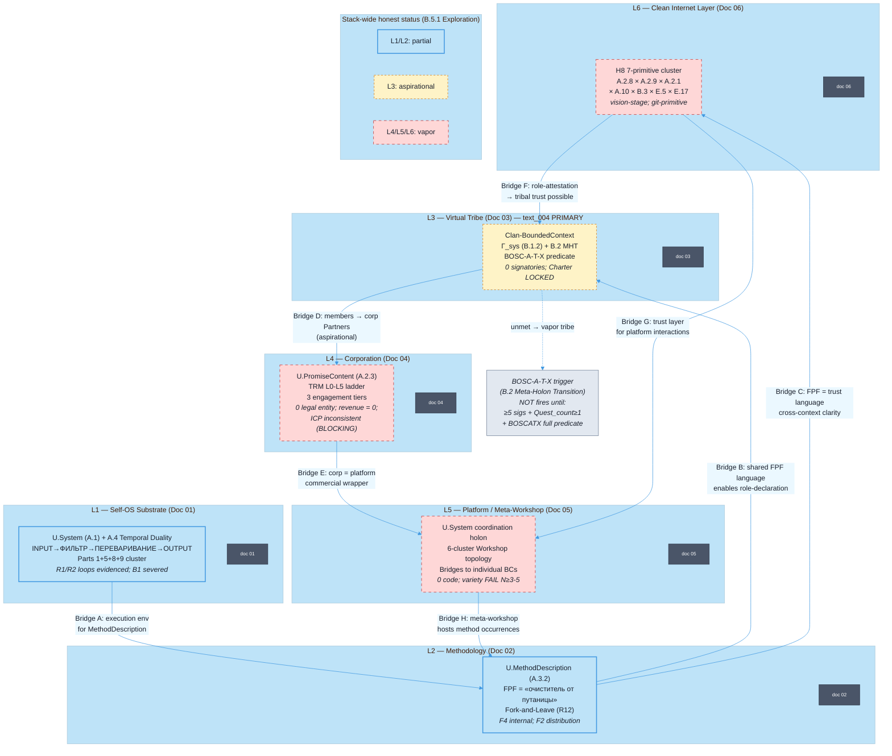

# Jetix End-to-End Overview — FPF-Described (Doc 07)

> **EP-5 disclosure.** «F8 / LOCKED» = Jetix-internal single-author Ruslan ack, NOT FPF B.3 F8.
>
> **EP-2 disclosure.** Верхние слои стека (Corp / Platform / Internet) = концептуальные artefacts. Revenue = 0. Legal entity = 0.
>
> **OQ-1 (Phase 0).** Какой из 6 uses «Jetix» = PRIMARY? Кандидаты: O-01 (операционный субстрат), O-04 (работающий продукт), O-03 (vision), O-02 (corporation). Вопрос открыт — поверхностно здесь (§8), решает Ruslan.
>
> 15-20 min read (entry-point doc).

---

## §0 TL;DR (≤300 слов)

Этот документ — финальная точка в серии из 6 FPF-описаний Jetix. Его задача — дать L1-читателю архитектурную карту целого, чтобы потом можно было нырять в детали любого слоя.

Jetix через FPF-линзу = **U.System (A.1)**: голонная система, одновременно целая сама по себе и часть большего. Внутри — **6 вложенных контекстов (A.1.1 BoundedContext)**, соединённых через явные Bridges:

```
L6  [Clean Internet Layer]  — trust infrastructure для professional cooperation
L5  [Platform / Meta-Workshop]  — entry point для makers + мастерских
L4  [Corporation]  — коммерческое vehicle + TRM
L3  [Virtual Tribe]  — emergent property Clan (aspirational)
L2  [Methodology]  — FPF как единый язык + рецепт работы
L1  [Self-OS Substrate]  — individual info-processing pipeline
```

**E.17 MVPK:** 7 документов серии — это не 7 разных систем. Это 7 views одной системы с разных точек наблюдения (A.6.3 EpistemicViewing). Читать можно bottom-up (полный mental model) или entry-point-first (doc 07 → нужный слой).

**text_004 synthesis (1 параграф):** «Виртуальное племя — это emergent property: оно становится возможным только когда substrate одного человека (L1) стабилен, методология (L2) даёт общий язык, trust infrastructure (L6) позволяет доверять роли а не личности, а platform (L5) создаёт пространство встречи. Это не сумма, а фазовый переход.»

**Честный статус:** L1 (substrate) = partial operational; L2 (methodology) = operational-as-internal-framework; L3 (tribe) = aspirational (0 signatories); L4 (corp) = vapor (0 legal entity, revenue = 0); L5 (platform) = vapor (0 code); L6 (internet) = vision-stage.

[src: vision/jetix-fpf-describe-PLAN-2026-05-17.md §1; docs 01-06 §0 TL;DR convergence]

---

## §1 Verbatim source anchors (synthesis)

Сводка ключевых verbatim якорей из всех 6 docs, на которых строится synthesis.

**1. Substrate первопринцип (Doc 01 ← Doc 1A)**

> «Всё, с чем работает мастерская — это информация.»

[src: decisions/BASE-MANAGEMENT-SYSTEM-2026-05-04.md §3.1 — процитировано в doc 01 §1]

**2. FPF как единый язык (Doc 02 ← audio_672)**

> «У нас должен быть один source of truth... это как раз и наш очиститель от путаницы должен быть.»

[src: raw/voice-transcripts/audio_672@17-05-2026_18-59-52.txt ¶1-2 — процитировано в doc 02 §1]

**3. Mutual instrumentation thesis (Doc 03 ← text_004 verbatim)**

> «Что люди — это вот машины. Люди такие вот инструменты по переработке информации... на фундаменте вот доверия, уважения друг другу, там ответственного подхода.»

[src: raw/voice-memos-2026-05-17-batch/text_004@17-05-2026_23-30.md ¶1 + ¶3a — процитировано в doc 03 §1]

**4. Meta-workshop (Doc 04+05 ← Doc 1B)**

> «Мета-мастерская для professional makers с собственными мастерскими»

[src: decisions/JETIX-CORPORATION-2026-05-05.md §1 — процитировано в docs 04 + 05]

**5. New internet layer (Doc 06 ← text_002)**

> «Вот этот вот подход — по FPF общаться — его дальше нужно вот использовать... Создать новую систему.»

[src: vision/00-MASTER-VISION-PLAN-2026-05-17.md §1 text_002 — процитировано в doc 06 §1]

**6. Tribe outcome (Doc 03 ← text_004 verbatim, hedge preserved)**

> «...то это вот реально претендент на создание нового такого вот виртуального сообщества, виртуального племени, **скажем так**. Новый уровень объединения обезьян.»

[src: text_004 ¶3b — hedge «скажем так» preserved per phil-critic doc-03 R1-C]

---

## §2 FPF mapping — U.System composite holon

### §2.1 Стек как A.1.1 BoundedContext federation

Каждый слой = **separate U.BoundedContext** со своим Glossary + Invariants + Bridges. Они НЕ nested (BC-2 invariant — нет containment); они связаны через typed Bridges.

| Layer | BoundedContext | Primary FPF primitive | Operational status | Bridge to adjacent |
|---|---|---|---|---|
| **L1 Self-OS** | `Self-OS-substrate-BoundedContext` | U.System (A.1) + A.4 Temporal Duality | partial (R1/R2 loops; B1 severed) | → L2: execution env for MethodDescription |
| **L2 Methodology** | `Jetix-methodology-BoundedContext` | U.MethodDescription (A.3.2) | partial-internal (F4 internal; F2 distribution) | ← L1: runs on substrate; → L3: enables shared language; → L6: FPF = trust language |
| **L3 Virtual Tribe** | `Clan-BoundedContext` | U.Role (A.2) + Γ_sys (B.1.2) + B.2 MHT | aspirational (0 signatories; BOSC-A-T-X unmet) | ← L1: individual substrate = atomic unit; ← L2: shared MethodDescription; → L6: trust mechanism |
| **L4 Corporation** | `JetixCorp-BoundedContext` | U.PromiseContent (A.2.3) + U.RoleAssignment (A.2.1) | vapor (0 legal entity; revenue = 0; ICP inconsistent) | ← L3: members as Partners; → L5: corp = platform's commercial wrapper |
| **L5 Platform** | `Platform-coordination-BoundedContext` | U.System (A.1 coordination holon) + Bridges to workshops | vapor (0 code; variety FAIL at N=3-5) | ← L4: commercial wrapper; ← L2: methodology hosted; → Bridges to individual workshop BCs |
| **L6 Trust Infra** | `Trust-Infrastructure-BoundedContext` | H8 7-primitive cluster: A.2.8 × A.2.9 × A.2.1 × A.10 × B.3 × E.5 × E.17 | vision-stage (git-based primitive; formal ledger aspirational) | ← L2: FPF language; → L3: role-attestation enables tribal trust; → L5: trust layer for platform |

### §2.2 E.17 MVPK — 7 docs = 7 views of one U.System

Per E.17 (Minimum Viable Perspectives Kernel): одна система может быть честно описана с нескольких точек наблюдения без потери авторитета источника. Все 7 документов серии — это views of Jetix-as-U.System:

| Doc | View | Primary audience | FPF viewpoint (A.6.3) |
|---|---|---|---|
| 01 | Substrate / Self-OS | Ruslan + future «деятель» | Owner-perspective (internal coherence) |
| 02 | Methodology | Partners + MIM practitioners | Method-author perspective |
| 03 | Virtual Tribe | Clan-candidates + people-network thinkers | Tribal-pattern perspective |
| 04 | Corporation | Investors + partners + clients | Commercial-structure perspective |
| 05 | Platform | Makers + workshop builders | Architecture perspective |
| 06 | Clean Internet | Engineers + privacy-economy | Trust-infrastructure perspective |
| **07** | **End-to-end** | **L1 time-constrained reader** | **Synthesis (A.6.3 integrative)** |

Source-pin: canonical = individual docs 01-06; this doc 07 = synthesis view, derives from them.

### §2.3 Per-claim F-G-R (synthesis-level)

| # | Claim | F | G | R |
|---|---|---|---|---|
| C-1 | Jetix = U.System (A.1) composite holon с 6 BoundedContexts connected via Bridges | F3 | jetix-fpf-describe-series | refuted_if_any_sibling_doc_revises_primary_BC_assignment_on_its_layer |
| C-2 | Bottom-up stack L1→L6 = correct pedagogical reading order (substrate → internet) | F4 | brigadier-decomposition | refuted_if_Ruslan_rejects_ordering_OR_L1_reader_cannot_build_mental_model |
| C-3 | 7 docs = E.17 MVPK views of same source (not 7 separate systems) | F4 | fpf-series-design | refuted_if_sibling_docs_describe_incompatible_systems |
| C-4 | text_004 synthesis: virtual tribe = emergent property of L1+L2+L6+L5 operational | F2 | aspirational (0 signatories; 0 platform code) | refuted_if_Clan_operational_10_members_no_coherence_signal |
| C-5 | Cross-doc consistency: no H1-H8 contradictions identified в synthesis pass | F3 | cross-doc-audit | refuted_if_explicit_contradiction_found_between_any_two_sibling_docs_claims |

---

## §3 Centerpiece Mermaid — Jetix as inter-context Bridge system



**Diagram D07-MAIN.** Jetix как federation of 6 A.1.1 BoundedContexts, connected via typed Bridges (A..H). Нет containment (BC-2 invariant); только Bridges. Bottom 2 layers (L1/L2) = частично операционные (синий). L3 (tribe) = aspirational (жёлтый пунктир). L4/L5/L6 = vapor (красный пунктир). B.2 MHT predicate (BOSC-A-T-X) пока не выполнен.

---

## §4 text_004 — 1-paragraph synthesis

> **text_004 synthesis (EP-2: mention only — full thesis = doc 03 §1-§3).**

Виртуальное племя — «скажем так» (text_004 hedge preserved) — это не организационная форма, которую можно учредить волевым решением. Это **emergent property**: фазовый переход, который становится структурно возможен только когда одновременно выполнены условия в трёх других слоях — substrate одного человека (L1) достаточно стабилен, чтобы быть надёжным role-bearer; shared methodology (L2) даёт FPF-язык для объявления capabilities и commitments; trust infrastructure (L6) делает доверие к роли измеримым без необходимости долгих personal relationships. Platform (L5) создаёт физическое пространство встречи. Когда всё это работает вместе — «новый уровень объединения обезьян» (text_004 verbatim) становится не метафорой, а архитектурным паттерном, воспроизводимым в любой области.

[src: raw/voice-memos-2026-05-17-batch/text_004@17-05-2026_23-30.md + docs 01/02/03/06 §0 TL;DR convergence + vision/jetix-fpf-describe-PLAN-2026-05-17.md §5 distribution map]

---

## §5 Phase 0 — 14 objects audit table

Каждый из 14 Phase-0 объектов (+ O-21 candidate) → mapped to ≥1 doc серии.

| Phase-0 object | FPF primitive (Phase 0 inventory) | Primary doc | Secondary docs | Status reminder |
|---|---|---|---|---|
| **O-01** Оперативный субстрат | U.System (A.1) + U.BoundedContext (A.1.1) | **Doc 01** | Doc 07 §2.1 | partial-functioning |
| **O-02** Юрлицо / корпорация | U.PromiseContent (A.2.3) + U.RoleAssignment (A.2.1) | **Doc 04** | Doc 07 §2.1 L4 | vapor |
| **O-03** Vision / задумка | U.WorkPlan (A.15.2) | **Doc 04** (framing) | Doc 07 §8 OQ-1 | aspirational-locked |
| **O-04** Работающий продукт | U.Work (A.15.1) + U.Capability (A.2.2) | cross-cut 01+02 | Doc 07 §5 honest-status | partial (revenue=0) |
| **O-05** Методология | U.MethodDescription (A.3.2) + U.Method (A.3.1) | **Doc 02** | Doc 07 §2.1 L2 | aspirational-distributable; F4-internal |
| **O-06a** 12 role-types | U.Role set (A.2) type-level | Doc 04 (3 tiers) | Doc 03 (6 archetypes) | partial (4 of 12 active) |
| **O-06b** Executor-bindings | U.RoleAssignment (A.2.1) token-level | Doc 04 + Doc 06 | Doc 07 §2.1 L4/L6 | partial (ROY swarm active) |
| **O-07** Foundation v1.0 | U.System (A.1) + U.Mechanism (A.6.1) | **Doc 01** (Parts cluster) | Doc 07 §5 | F8-artefact / F2-F4-operational |
| **O-08** Pillar C (12 rules) | U.Commitment (A.2.8) + E.5 Guard-Rails | Doc 03 (R12) + Doc 06 (E.5) | Doc 07 §2.1 | F8-text / partial-enforcement |
| **O-09** Strategic Insights Hexagon | U.Work (A.15.1) + Abductive Loop (B.5.2) | Doc 07 §6 (H1-H8 synthesis) | cross-cut all docs | partial (6 LOCKED; cadence informal) |
| **O-10** Бизнес-модель Phase 1 (TRM) | U.PromiseContent (A.2.3) + Γ_work (B.1.6) | **Doc 04** | Doc 07 §5 L4 | aspirational (revenue=0; ICP BLOCKING) |
| **O-11** R12 Anti-extraction | U.Commitment (A.2.8) + E.5 Guard-Rails | Doc 03 (substrate guard) + Doc 06 (trust face) | Doc 02 (Fork-and-Leave) | F5-text / F2-enforcement |
| **O-12** Бренд / публичный слой | U.PromiseContent (A.2.3) + E.17 MVPK | Doc 04 + Doc 05 | Doc 07 §2.2 (7-docs MVPK) | partial |
| **O-13** People-NS / Clan | U.System (A.1 meta-holon) + B.2 MHT | **Doc 03** | Doc 07 §4 text_004 | F5-charter / F2-realisation |
| **O-14** Meta-workshop | U.System (A.1 supersystem) + A.3.1 Method hosting | **Doc 05** | Doc 04 (corp frame) | vapor |
| **O-21** Trust Infrastructure | H8 7-primitive cluster (A.2.8×A.2.9×A.2.1×A.10×B.3×E.5×E.17) | **Doc 06** | Doc 03 (tribe dependency) | aspirational-candidate |

**Audit verdict:** Все 14 Phase-0 объектов + O-21 candidate mapped to ≥1 doc серии. Gap: O-04 (работающий продукт) и O-07 (Foundation) cross-cut первые два docs и не имеют dedicated doc — это корректно per Phase-1 plan §1.1 (они = substrate-level, не separate layers).

---

## §6 H1-H8 Octagon — overall positioning + per-doc relevance

**Octagon naming resolved:** OQ-MASTER-8 resolved по H8 LOCK 2026-05-17 → Octagon (8 insights) canonical.

| Insight | Суть (1 строка) | Primary doc | Cross-refs | Stack layer |
|---|---|---|---|---|
| **H1** Foundation Model | Jetix = система производства знаний, не сервис | Doc 01 (substrate) | Doc 07 §5 O-07 | L1-L2 |
| **H2** Partnership | Cooperation через shared methodology + FPF | Doc 02 (methodology) | Doc 03 (mutual instrumentation) | L2-L3 |
| **H3** R&D Flywheel | Quests = compound knowledge cycles | Doc 03 (Γ_method Quest) | Doc 01 (Part 5 DRR) | L1-L3 |
| **H4** Balaji Network State | People-NS = scaled Clan (L3+) | Doc 03 (O-13 mapping) | Doc 07 §4 text_004 | L3 |
| **H5** Tyson Mentorship | Scholar archetype = asymmetric mutual instrumentation | Doc 03 (6 archetypes) | Doc 04 (Partners tier) | L3-L4 |
| **H6** Gamified Platform | 6 archetypes = role taxonomy + platform Realm | Doc 05 (platform topology) | Doc 03 (archetypes) | L3-L5 |
| **H7** People-Network-State | Clan at scale = new social formation | Doc 03 (O-13 + B.2 MHT) | Doc 07 §4 | L3 |
| **H8** Trust Infrastructure | 7-primitive cluster replacing money-as-trust-medium | **Doc 06** (primary) | Docs 03/05/07 | L6 |

**H1-H8 consistency check (synthesis pass):** Без явных противоречий между Octagon insights и docs серии. Потенциальное напряжение: H4 (People-NS) требует L3 operational, которое зависит от L6 (trust) и L2 (methodology) — оба aspirational. Это не contradiction, это dependency ordering.

---

## §7 Честный статус — operational vs aspirational по стеку

### §7.1 Stack-wide truth table

| Layer | Doc | Что работает (evidenced) | Что аспирационально | Что vapor |
|---|---|---|---|---|
| **L1 Substrate** | 01 | Voice pipeline (11 reviews); wiki 551 rec; git 571 commits/month; R1/R2 loops | Self-OS daily-log (absent); Part 8 health monitoring (STUB) | Part 9 monthly reflection cadence |
| **L2 Methodology** | 02 | FPF as internal framework F4; 14-object pattern library; R12 text LOCKED | Fork guide v0 (6 steps); ШСМ/МИМ overlay | First external forker; distributable format |
| **L3 Tribe** | 03 | Clan Charter LOCKED (F5); R12 substrate text; H8 cluster LOCKED text | Role-attestation mechanism (git-primitive) | 0 signatories; 0 completed Quests |
| **L4 Corp** | 04 | Doc 1B conceptual LOCKED; TRM model LOCKED; Doc 1A charter | ICP canonical declaration (BLOCKING — 3 conflicting versions) | Legal entity; paying clients |
| **L5 Platform** | 05 | Workshop Concept vocabulary LOCKED (F5) | 2-day CC prototype (INTENT not SLA) | Platform code; partner instances |
| **L6 Trust Infra** | 06 | H8 LOCKED (F3 text); B.3 F-G-R operational (this series) | Formal role-attestation ledger | Evidence Graph infrastructure; trust-ledger |

### §7.2 Aggregate B.5.1 state

Стек в целом = **B.5.1 Exploration** (first of four: Exploration → Shaping → Evidence → Operation).

Transition trigger (stack-level): First external forker + first paying client + first Clan signature + platform code = combined evidence that would push stack → Shaping.

**Critical path dependencies:**
1. ICP canonical declaration → unblocks L4 (Corp) sales execution
2. Tseren/Levenchuk partnership → unblocks L1 substrate validation + L3 candidate activation  
3. Part 8 Phase B calibration → closes B1 loop in L1, enabling reliable L3-L6 build
4. S2+S3 platform pre-design → unblocks L5 at N=2 scale (variety ceiling at N=3-5)

---

## §8 OQ-1 Phase 0 — Primary referent для «Jetix»

**Per reports/phase-0-fpf-scope/01-jetix-objects-inventory.md §8 OQ-1 (MOST LOAD-BEARING):**

> «Какой из 6 uses of «Jetix» = PRIMARY described entity для FPF scope definition? Candidates: O-01 (information-management system), O-04 (working product as-is), O-03 (vision), O-02 (corporation).»

Этот synthesis doc не разрешает OQ-1 (R1 — Ruslan decides). Поверхностно для Ruslan:

| Candidate | Что даёт как primary | Что теряется | Рекомендованный frame для ЭТОЙ СЕРИИ |
|---|---|---|---|
| **O-01** (substrate) | Честный operational anchor | Invisibilizes vision + commercial layer | Stack layer L1 |
| **O-04** (working product) | Most epistemically rigorous | May confuse — «product» implies external-facing deliverable | Cross-cut L1+L2 |
| **O-03** (vision) | Motivating; future-state anchoring | Conflates artefact with system per CE-3 | Background (O-03 is the North Star, not the primary described entity) |
| **O-02** (corporation) | Commercial-facing clarity | Vapor per Phase-0 inventory | Far future anchor |

**Synthesis pass finding (F3):** Для ЭТОЙ DOC SERIES контекст L1 читателей (Anatoly + Tseren + MIM) — им важно понять **Jetix как систему в целом** (O-01 + O-04 комбо: «это и substrate, и то что уже работает»). E.17 MVPK позволяет держать оба view одновременно без выбора. Но если надо одно слово — **O-01** = primary FPF anchor (наиболее формально грounded как U.System A.1).

**OQ-1 surfaced. Ruslan decides.**

[src: reports/phase-0-fpf-scope/01-jetix-objects-inventory.md §8 OQ-1; vision/jetix-fpf-describe-PLAN-2026-05-17.md §7 OQ-5]

---

## §9 L1 Entry Path (quick-paths для time-constrained reader)

### §9.1 Маршруты по серии

| Аудитория | Время | Маршрут | Что получает |
|---|---|---|---|
| **Полный mental model** | 90-120 min | 00-INDEX → 01 → 02 → 03 → 04 → 05 → 06 → 07 | Bottom-up substrate → синтез |
| **Стратегический обзор** | 25-30 min | **07 (этот)** → 03 (text_004) → 06 (H8) | Зачем Jetix существует |
| **Технический партнёр** | 20-25 min | 07 → 01 (substrate) → 02 (methodology) | Как устроен substrate |
| **Инвестор / коммерческий** | 15-20 min | 07 → 04 (corp) → 06 (trust) | Бизнес-модель + trust infra |
| **Clan candidate** | 20-25 min | 07 → 03 (tribe) → 06 (trust) | Mutual instrumentation + R12 |
| **5-min skim** | 5 min | §0 (этого документа) + §3 mermaid | Архитектурная карта |

### §9.2 Drill-down по проблемному вопросу

| Вопрос | Иди в |
|---|---|
| «Как работает substrate одного человека?» | Doc 01 §3 + §4.4 (multi-timescale loops) |
| «Что такое FPF и зачем?» | Doc 02 §3.1-§3.2 + §4.2 |
| «Что такое mutual instrumentation?» | Doc 03 §3.1-§3.3 (text_004 PRIMARY) |
| «Как устроена бизнес-модель?» | Doc 04 §3.2 (TRM) + §3.3 (3 tiers) |
| «Что такое мета-мастерская?» | Doc 05 §3.1 + §3.2 (6 clusters) |
| «Как будет работать trust infra?» | Doc 06 §3.2 (H8 cluster) + §3.4 (money vs FPF) |
| «Что уже работает?» | Doc 07 §7 (honest status table) + Doc 01 §4.6 |
| «Что vapor?» | Doc 07 §7.1 + любой doc §0 EP-2 disclosure |

---

## §10 Cross-doc consistency audit

Этот раздел = явный audit на противоречия между docs 01-06. Формат: claim pair + verdict.

| Claim (Doc A) | Claim (Doc B) | Verdict | Note |
|---|---|---|---|
| Doc 01 C-7: Foundation LOCKED = A.16 language-state, NOT operational | Doc 04 C-1: TRM ladder = F4 (conceptual-doc-1B-LOCKED) | **Consistent** | Both use «LOCKED» for artefact-state, not operational-state |
| Doc 02 §3.4: Fork-and-Leave = R12 constitutional guarantee | Doc 03 §3.3: R12 substrate = substrate-level guard (human-level gap) | **Consistent** | Both acknowledge substrate-level guarantee; doc 03 explicitly adds human-level gap |
| Doc 03 §4.2: Γ_method for capability composition (corrected per FAIL-1) | Doc 01 §4.4: R2 Compound loop (Part 5 DRR) | **Consistent** | Different levels: Γ_method = Quest-level composition; R2 = individual compound; no conflict |
| Doc 05 §3.1: Platform BCs = Bridges only (no containment per BC-2) | Doc 02 §4.1: Bridges: Jetix-methodology ↔ Forker-instance | **Consistent** | Both respect BC-2 invariant; Bridge-only cross-context |
| Doc 04 LIVE-FLAG: THREE ICP versions (Mittelstand / Online-first / 2-axis) | Doc 01 §4.5 VSM: S2 most acute gap | **Related gap (not contradiction)** | Different layers; both surface honest gaps independently |
| Doc 06 C-3: Money-as-trust = augment NOT replace | Doc 03 §3.4: R12 positive face = substrate-level guard | **Consistent** | Both frame H8/R12 as additive, not replacement |
| Doc 01 F2 floor | Doc 02 F2 floor | All docs 01-06 F2 floor | **Consistent** | Each doc inherited F2 from most-aspirational claims; no grade inflation |

**H1-H8 consistency pass (additional):**

| H-insight | Potential cross-doc tension | Verdict |
|---|---|---|
| H8 Trust Infra (Doc 06) | Doc 03 also references trust; Doc 06 = primary | No contradiction — Doc 03 inherits from Doc 06; cross-refs explicit |
| H7 People-NS (Doc 03) | Doc 04 Corp mentions Clan members as Partners | No contradiction — Corp = commercial layer; Clan = tribal layer; separate BCs |
| H1 Foundation Model (Doc 01) | All docs reference Foundation; partial operational | Consistent — CE-3 (artefact vs operational) acknowledged в каждом |

**Audit verdict (F3):** Явных противоречий между docs 01-06 в этом synthesis pass не обнаружено. Потенциальные tensions (ICP inconsistency в Doc 04; B1 severed в Doc 01; variety FAIL в Doc 05) — это честно задокументированные gaps, не межdoc contradictions.

---

## §11 Open questions для Ruslan (R1 surface)

Сводка load-bearing OQ из всей серии. **Ruslan decides.**

**OQ-SERIES-1 (= Phase 0 OQ-1, MOST LOAD-BEARING).** Primary referent «Jetix» в этой серии — O-01 / O-04 / O-03 / O-02? Влияет на маркетинг + FPF formal anchor selection.

**OQ-SERIES-2 (Doc 04 BLOCKING).** THREE ICP versions — Mittelstand DACH / Online-first / 2-axis agnostic. Canonical ICP declaration required для Phase 2 sales execution.

**OQ-SERIES-3 (Doc 03 OQ-D03-1, NON-AUTO).** text_004 thesis = H9 Strategic Insight или H8 extension? Promotion requires Ruslan ack.

**OQ-SERIES-4 (Doc 03 OQ-D03-6).** Founder asymmetry (Charter §6 veto) vs «mutual» mutual instrumentation framework — temporary founder epoch или structural feature?

**OQ-SERIES-5 (Doc 01 OQ-DOC01-6).** Daily-log directory materialisation (S2 most acute gap) — когда? Unblocks B3 loop → enables reliable L3-L6 build.

**OQ-SERIES-6 (Doc 05 sys-integrator).** S2+S3 platform pre-design required before N=2 scale. Timeline + ownership?

**OQ-SERIES-7 (Doc 02 OQ-D02-2).** ШСМ/МИМ overlay — remain as reference или formalize как O-22 с FPF typing?

---

## §12 R1 reaffirmation + dissents preserved (AP-6)

### §12.1 R1 attribution

**prose_authored_by: ruslan-via-voice-dictation+brigadier-structured.**

- Verbatim Ruslan (text_002, text_004, audio_672, audio_673, Doc 1B one-liner) — inherited from sibling docs §1 anchors; preserved via [src:] chains
- Strategic prose = Ruslan-authored via voice dictation + locked decisions
- AI-structural: FPF primitive assignment synthesis, consistency audit, stack architecture, mermaid
- Brigadier-structured: cross-doc integration, AP-6 dissents, F-G-R grades

Никакого agent-pending strategic prose. OQ-SERIES-1..7 BLOCKING для дальнейшей promotion.

### §12.2 Dissents preserved (AP-6) — 4 entries

**D-DOC07-1: O-01 vs O-04 as primary anchor (eng-integrator self-dissent)**

- *Position (eng-integrator):* O-01 (U.System substrate) = более formalmente grounded FPF anchor для этой серии.
- *Counter:* O-04 (working product) = more epistemically rigorous per Phase-0 §6 «most rigorous stable anchors» finding.
- *F:* F3 | *ClaimScope:* FPF formal section anchor selection | *R:* refuted_if Ruslan declares O-04 as primary; accepted while OQ-SERIES-1 open
- **Status:** PRESERVED — §8 presents both; Ruslan decides

**D-DOC07-2: «Virtual tribe = emergent property» formality**

- *Position (eng-integrator):* «emergent property» = conceptually accurate но F2 aspirational; cannot assert B.2 transition without evidence.
- *Counter (inherited from doc-03 D-DOC03-PHIL-2):* «Emergent» = aspirational claim; B.2 transition formality requires evidence.
- *F:* F2 | *ClaimScope:* §4 text_004 synthesis | *R:* refuted_if Clan operates 10 members с coherence signal
- **Status:** PRESERVED — §4 explicitly labels F2 aspirational; «скажем так» hedge maintained

**D-DOC07-3: Cross-doc consistency audit depth**

- *Position:* This pass checked structural consistency (FPF primitive assignment, F-G-R floors, BC-2 invariant, H1-H8 refs). Deep claim-level consistency (every per-claim F-G-R in docs 01-06 checked against each other) not performed.
- *Counter:* Full per-claim cross-check would require additional cell pass (phil × critic on docs 01-06 simultaneously).
- *F:* F3 | *ClaimScope:* §10 consistency audit scope | *R:* refuted_if phil-critic deep pass finds contradiction
- **Status:** PRESERVED — §10 audit explicitly scoped to structural + H-insight level; deep per-claim pass = pending

**D-DOC07-4: Stack ordering (bottom-up vs architecture-first)**

- *Position (brigadier plan):* Bottom-up (L1→L6) = pedagogically correct for L1 reader building mental model.
- *Counter (inherited from Phase-0 D-PHIL-SCOPE-1):* Ontological type-ordering first per A.1 may be more formally correct; narrative ordering risks embedding conflations.
- *F:* F4 | *ClaimScope:* Reading order selection | *R:* refuted_if L1 reader feedback (Anatoly/Tseren) shows bottom-up order does NOT aid comprehension
- **Status:** PRESERVED — both acknowledged; §9 provides multiple entry paths for different readers

### §12.3 R1 final reaffirmation

Ruslan = sole strategist. OQ-SERIES-1..7 BLOCKING для promotion. Brigadier surfaces; не resolves autonomously.

---

*Brigadier integration: eng-expert × integrator draft (this). Pending: phil-expert × critic + sys-expert × integrator. §5.5.5 gate pending full 3-cell chain. Cross-doc consistency audit F3 (structural pass). 4 dissents preserved AP-6. Mermaid: cool blues + color:#1a202c contrast per series convention.*
