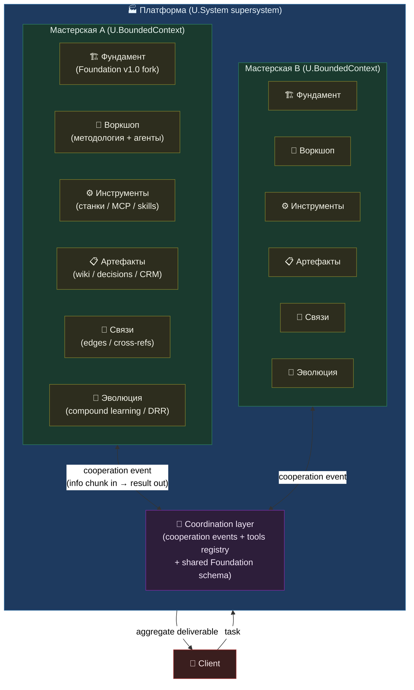
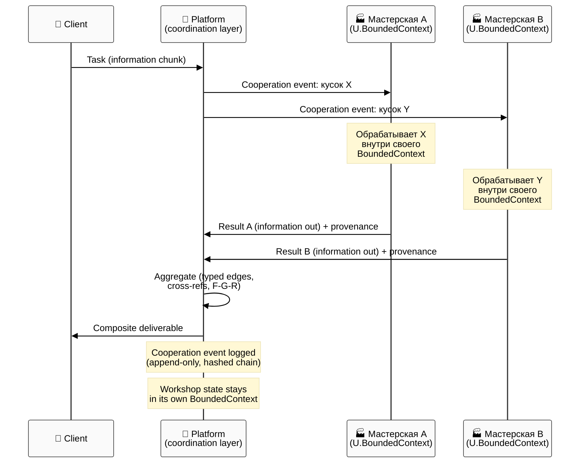

# Jetix as Platform — FPF-Described (Doc 05)

> **EP-5 disclosure.** «F8 / LOCKED» = Jetix-internal ack, NOT FPF B.3 F8 (independent verification).
>
> **EP-2 disclosure.** Platform = conceptual artefact. No platform code today. O-14 status = «задумка» (vapor). This doc describes the concept, not a deployed system.
>
> **EP-3 disclosure (critical).** «2 дня с Claude Code» = voiced intent estimate (text_003 ¶2: «нехуй делать, буквально можно за пару дней это сделать»). **NOT SLA. NOT commitment. NOT scope-locked plan.** Realistic range = 1–30 days depending on scope decisions. Actual L1 build requires AWAITING-APPROVAL packet + Ruslan gate (constitutional R2). This disclosure is MANDATORY in §0, §3, §7.
>
> 10-15 min read.

---

## §0 TL;DR (≤200 слов)

**Jetix-как-платформа = мета-мастерская для professional makers**, каждый из которых приходит со своей мастерской. Если doc 03 описывает tribe (люди как mutual instruments), doc 04 — corporation (commercial vehicle), то doc 05 = **интерфейсный слой**: инфраструктура, через которую отдельные мастерские коммуницируют, обмениваются методологией и работают над задачами, непосильными для одной мастерской.

FPF frame: платформа = **U.System (A.1 supersystem)**, составленный из участника U.BoundedContext (A.1.1), хостящий **U.Method (A.3.1)** — методологические occurrences каждого мастера. MVPK (E.17): три view — developer, partner, client.

Workshop Concept (LOCKED 2026-04-30) даёт 6-cluster topology мастерской: Фундамент / Воркшоп / Инструменты / Артефакты / Связи / Эволюция. Эти кластеры = building blocks любой мастерской на платформе; платформа = их shared substrate + coordination layer.

**Честный статус (B.5.1 Exploration):** Platform Phase B+ = vapor. Today = ad-hoc (никакого platform-кода нет). L1 prototype = voiced intent («2 дня CC» — **EP-3: NOT SLA**). Ruslan gate required перед любым build.

[src: decisions/JETIX-WORKSHOP-CONCEPT-2026-04-30.md §0; reports/phase-0-fpf-scope/01-jetix-objects-inventory.md §O-14; vision/07-prototype-platform-2-days-cc.md §0; vision/jetix-fpf-describe-PLAN-2026-05-17.md §2.2 doc 05 row]

---

## §1 Verbatim source anchors

**1. Мета-мастерская — Phase 3 vision (Workshop Concept §6)**

> «Когда уже будет комьюнити таких вот мастеров с своими мастерскими можно будет делать уже мега систему в которой внутри вот эти мастера у которых есть мастерские смогут между собой коммуницировать и работать над уже более сложными проектами задачами для которых одной мастерской даже прям хорошо настроенной но одной мастерской одного человека не хватит.»

[src: decisions/JETIX-WORKSHOP-CONCEPT-2026-04-30.md §6 verbatim Ruslan quote]

**2. Платформа = цель community-фазы (Workshop Concept §6)**

> «Платформа как раз для этого. Phase 3 = «community of workshops» — не просто люди, а люди со своими мастерскими, и инфраструктура для координации между мастерскими.»

[src: decisions/JETIX-WORKSHOP-CONCEPT-2026-04-30.md §6 authored gloss]

**3. L1 prototype voiced intent (text_003 ¶2 via vision/07 §1)**

> «Нехуй делать с Claude Code, буквально можно за пару дней это сделать.»

[src: vision/07-prototype-platform-2-days-cc.md §1; original raw/voice-memos-2026-05-17-batch/text_003]

**4. Base working interface intent (text_003 ¶1 via vision/07 §1)**

> «И потом уже платформу под это сделать. Ну куда тоже базовую вот именно рабочую — интерфейс для работы с этим всем делом, тоже вот как-то базового зафиксировать хотя бы, ну и сделать прототип».

[src: vision/07-prototype-platform-2-days-cc.md §1]

**5. Мастерская = information in, information out (Workshop Concept §4 + §6)**

> «Человек по сути берет один кусок какого то сложного проекта несет к себе в мастерскую разбирает приносит одну деталь качественную второй человек точно также взял какую-то деталь другую взял тоже принес проект качественную по сути это что это тоже информация взяли информацию по какой то задачи принесли информацию виде какого то результата.»

[src: decisions/JETIX-WORKSHOP-CONCEPT-2026-04-30.md §8 canonical Ruslan quote]

**6. O-14 object definition (inventory §O-14)**

> «Meta-workshop для профессиональных мастеров (Phase B target)» — Doc 1B framing «Jetix = мета-мастерская для профессиональных мастеров со своими мастерскими»

[src: reports/phase-0-fpf-scope/01-jetix-objects-inventory.md §O-14 row]

---

## §2 FPF mapping

### §2.1 Primitives

| FPF primitive | Роль в платформе |
|---|---|
| **U.System (A.1 supersystem)** | Платформа как composite holon: целое (платформа) и часть (supersystem по отношению к участвующим мастерским). Каждая мастерская — sub-holon внутри. |
| **U.BoundedContext (A.1.1)** | Platform-scope vs individual-workshop-scope. Граница: что принадлежит платформе (shared substrate, coordination protocol) vs что принадлежит мастерской (Owner's RUSLAN-LAYER, domain specialization). BoundedContext формализует где кончается платформа и начинается мастерская. |
| **U.Method (A.3.1) — Method hosting** | Платформа хостит method occurrences: каждый мастер приносит свою methodology (свой способ работы с информацией). Платформа обеспечивает infrastructure for hosting + coordination между methods — не навязывает единый method. |
| **E.17 MVPK** | Multi-view publication platform: developer view (filesystem-as-SoT + CLI tools), partner view (Workshop interface + FPF CRUD), client view (deliverables + workflow results). Три аудитории видят разные facets одного supersystem. |
| **U.System composition** | Платформа = sum of bounded contexts участвующих мастерских. Composition semantics: shared Foundation (fork-portable) + RUSLAN-LAYER per мастерская. Платформа не merge'ит мастерские — она создаёт coordination channel между ними. |
| **B.5.1 Exploration state** | Platform = «задумка» / Exploration. No platform code. No partner instances. No deployed coordination protocol. Current mode: ad-hoc (Ruslan + agents solo). |
| **A.6.1 U.Mechanism** | L1 prototype MVPK = mechanism draft: 5 components (FPF CRUD / Translation hook / Cooperation log / Role declaration / Tools registry). Не production mechanism; EP-3 caveat applies. |

### §2.2 A.1.1 BoundedContext — полный разбор (Glossary + Invariants + Roles + Bridges)

Per brief requirement: A.1.1 full treatment consistent with doc 03/04 pattern.

**Glossary (термины внутри платформы):**

| Term | Definition | Source |
|---|---|---|
| **Платформа** | Shared substrate + coordination layer для network мастерских. Не single SaaS, а ecosystem of connected workshops. | Workshop Concept §6 |
| **Мастерская** | Bounded unit = owner + agents + tools + methodology; один U.BoundedContext. | Workshop Concept §1-§3 |
| **Фундамент мастерской** | Foundation v1.0 = fork-portable substrate (Parts 1-11); structural layer общий для всех мастерских на платформе. | CLAUDE.md §Foundation Architecture |
| **Станок** | Любой tool, skill, MCP integration, agent capability внутри мастерской. | Workshop Concept §1 |
| **Cooperation event** | Атомарный интеракт между мастерскими: мастер берёт кусок задачи → обрабатывает → возвращает результат. | Workshop Concept §6 |
| **Method occurrence** | Конкретное применение methodology в конкретной мастерской. Хостится платформой; владеет мастерская. | FPF A.3.1 |
| **Platform-scope** | Что принадлежит платформе: shared protocol, Foundation kernel, coordination event log, tools registry schema. | vision/07 §3 |
| **Workshop-scope** | Что принадлежит мастерской: RUSLAN-LAYER specialization, domain knowledge, private state, owner-role assignments. | Workshop Concept §5 |

**Invariants (что должно быть истиной внутри этого BoundedContext):**

1. **Filesystem-as-SoT preserved.** Платформа не заменяет filesystem; она layer поверх него. Нарушение = Tier 2 RUSLAN-LAYER override violation.
2. **Method ownership stays with workshop.** Платформа хостит method, но не присваивает. Owner мастерской = author method occurrence. R12 anti-extraction applies.
3. **Workshop isolation.** Мастерские не имеют прямого доступа к внутренним state друг друга без explicit cooperation event (BoundedContext boundary).
4. **Foundation fork-portability.** Любая мастерская на платформе использует Foundation v1.0 fork или явно документирует deviation (per Pillar C Tier 2).
5. **No single-point-of-failure.** Если платформа (coordination layer) недоступна, мастерские продолжают работать автономно (их BoundedContext self-contained).

**Roles (внутри платформы):**

| Role | FPF assignment | Phase status |
|---|---|---|
| **Platform Owner** | U.RoleAssignment (A.2.1): Ruslan#PlatformOwner:Jetix | Phase A = sole owner |
| **Workshop Owner** | U.RoleAssignment: Мастер#WorkshopOwner:OwnBoundedContext | Phase B+ (first partner workshops) |
| **Client** | U.RoleAssignment: Client#Recipient:JetixPlatform | Phase A = clients of individual workshops |
| **Platform Steward** | U.Role (A.2) type: maintains coordination protocol + Foundation updates | Phase B+ design |
| **Tool Provider** | U.RoleAssignment: ThirdParty#ToolProvider:ToolsRegistry | Phase B+ (MCP providers etc.) |

**Bridges (пересечения с другими BoundedContexts):**

| Bridge | Direction | Mechanism | Status |
|---|---|---|---|
| Platform ↔ Corp (doc 04) | Bidirectional | Corp = commercial wrapper of platform. Platform delivers method-coordination; Corp delivers commercial promise (TRM). | Conceptual (both vapor) |
| Platform ↔ Tribe (doc 03) | Platform hosts tribe coordination | Tribe = social substrate; Platform = technical coordination layer. Clan Charter §11 Realms → Platform cooperation events. | Conceptual |
| Platform ↔ Methodology (doc 02) | Platform hosts method occurrences | FPF methodology = language across platform. Method distribution = platform function. | Aspirational |
| Platform ↔ Self-OS (doc 01) | Composition | Each Self-OS instance (мастерская) = one bounded context on platform. | Partial (Ruslan's instance operational) |

### §2.3 Per-claim F-G-R

| # | Claim | F | G | R |
|---|---|---|---|---|
| C-1 | Платформа = U.System supersystem, hosting individual workshop U.BoundedContexts | F4 | workshop-concept-LOCKED | refuted_if_workshop_6cluster_topology_falsified_under_real_multiparty_use |
| C-2 | 6-cluster topology (Фундамент/Воркшоп/Инструменты/Артефакты/Связи/Эволюция) = structural building blocks | F5 | ruslan-dictated-LOCKED | refuted_if_Ruslan_revises_cluster_structure |
| C-3 | Method hosting: платформа хостит method occurrences, не навязывает единый method | F4 | fpf-a31-operational-convention | refuted_if_platform_forces_uniform_method |
| C-4 | L1 prototype scope: 5 components (CRUD / Translation / EventLog / RoleDecl / ToolsRegistry) | F2 | voiced-intent-draft (EP-3) | refuted_if_Ruslan_approves_different_scope_OR_first_genuine_attempt_proves_scope_impossible_in_<30d |
| C-5 | «2 дня CC» = voiced intent estimate, NOT SLA | F2 | ep-3-fidelity-flag | refuted_if_estimate_proved_accurate_within_±50%_after_genuine_attempt |
| C-6 | Platform today = ad-hoc (no platform code, no partner instances) | F4 | honest-status-b51 | refuted_if_platform_code_exists_in_repo_today |
| C-7 | Foundation fork-portability = enabling condition for platform composition | F5 | foundation-arch-v1-LOCKED | refuted_if_Foundation_Parts_1-11_not_portable_without_RUSLAN-LAYER |
| C-8 | E.17 MVPK: 3 views (developer/partner/client) describe same supersystem | F3 | multi-view-convention | refuted_if_views_produce_contradictory_platform_definitions_not_reconcilable_by_BoundedContext_discipline |

---

## §3 Plain English narrative (L1-friendly)

### §3.1 Что такое платформа в контексте мастерской

**Представь мастерскую (Workshop-Phase-1):** Ruslan + AI-агенты + инструменты. Вход = информация, выход = переработанная информация ценная форма. Это работает сейчас.

**Workshop-Phase-2** — несколько людей работают с одной системой (командой). Мастерская расширяется.

**Workshop-Phase-3 = платформа** — много мастеров, у каждого своя мастерская. Задачи становятся слишком большими для одного. Нужна инфраструктура: как мастер А передаёт кусок задачи мастеру Б, как результаты агрегируются, как методологии не конфликтуют, как каждый мастер сохраняет ownership своей мастерской.

**Платформа = этот coordination layer.** Не SaaS-продукт сверху. Не управляющая компания. Shared substrate + coordination protocol между автономными мастерскими.

### §3.2 6-cluster topology мастерской

Workshop Concept (LOCKED 2026-04-30) описывает любую мастерскую через 6 кластеров. Это — building blocks: у каждой мастерской они есть; платформа обеспечивает shared версию каждого кластера для coordination.



**Кластер 1 — Фундамент мастерской (стены, освещение, инфраструктура).** Foundation v1.0 = fork-portable основа (Parts 1-11 + Pillar A + Pillar C). Каждая мастерская на платформе держит свой fork; платформа обеспечивает shared schema для federation без merge. Соответствие Workshop Concept §10: «Подвал → Фундамент мастерской».

**Кластер 2 — Воркшоп (рабочие столы + станки + workflow).** Основная работа: coordination protocol, agent dispatch, Part 4/5/7 host. На платформе: каждая мастерская держит свой workflow; платформа coordination layer не вмешивается в внутренний процесс.

**Кластер 3 — Инструменты (станки / MCP integrations / agent skills).** Capability expansion mechanism: мастерская быстро добавляет новые «станки». На платформе: tools registry = shared каталог инструментов; мастерские могут reuse tools друг друга с explicit permission.

**Кластер 4 — Артефакты (склад материалов и чертежей).** Wiki + decisions + CRM + Foundation output. На платформе: artefacts остаются в своём BoundedContext; coordination layer обеспечивает typed edges между artefacts разных мастерских без смешения ownership.

**Кластер 5 — Связи (типизированные рёбра + cross-refs).** Typed edges между artefacts, roles, и cooperation events. На платформе: Связи = cross-BoundedContext edges с явным провенансом. Каждый edge = cooperation event (кто → что → кому → зачем).

**Кластер 6 — Эволюция (compound learning / DRR / capability accumulation).** Мастерская становится лучше с каждым проектом. На платформе: meta-evolution = сумма DRR всех мастерских; shared patterns могут подниматься в Platform Foundation (через explicit AWAITING-APPROVAL).

### §3.3 Как индивидуальные воркшопы (doc 03) составляют платформу

Doc 03 (Virtual Tribe): люди как instruments, каждый с capability + role. Doc 05 (Platform): **инфраструктурный слой**, в котором эти инструментальные отношения технически реализованы.

Если Анатолий и Цирен (L1 из doc 03) — mutual instruments, то платформа даёт им:
- Shared Foundation (одни правила игры)
- Cooperation event log (кто что сделал, с каким результатом, с каким провенансом)
- Tools registry (я вижу что у тебя есть, ты видишь что есть у меня)
- Role declaration surface (lightweight: «я беру кусок X в своей мастерской»)

Это корреспондирует с doc 04 (Corporation): Corporation = **commercial vehicle** поверх Platform. Platform = техническая инфраструктура; Corporation = коммерческое обещание (TRM, engagement tiers). Платформа не предполагает юр. лицо; Corporation предполагает.

### §3.4 L1 prototype — voiced intent (EP-3 — NOT SLA)

**Важнейший disclaimer этой секции:** следующие абзацы описывают voiced intent estimate. «2 дня с Claude Code» = оценка Ruslan'а в голосовом memo (text_003 ¶2). **НЕ SLA. НЕ commitment. НЕ scope-locked plan.** Реальный диапазон = 1–30 дней в зависимости от scope decisions. Любой actual build требует отдельного AWAITING-APPROVAL + Ruslan gate per конституциональное правило R2.

Vision/07 поверхностно набрасывает MVPK draft (не authoritative):

| Component | Что | Реализует кластер |
|---|---|---|
| **C1: FPF artefact CRUD** | Read/write/search FPF artefacts через interface (filesystem-aware) | Артефакты |
| **C2: Translation invocation** | Hook Human→FPF→Human (reuse brigadier-scribe pattern) | Воркшоп |
| **C3: Cooperation event log** | Append-only events.jsonl: {actor, role, action, artefact, timestamp} | Связи |
| **C4: Role declaration surface** | Lightweight roles.md per participant (no crypto identity) | Воркшоп |
| **C5: Workshop tools registry** | tools/inventory.md — список активных «станков» | Инструменты |

**Out of scope для MVP (vision/07 §3.3):** federation / governance UI / billing / identity crypto / deployment infra / public web UI / mobile / performance optimization.

**Pre-conditions (конституциональные):**
- PRE1: L0 FPF describe = acked (этот doc = часть L0)
- PRE2: AWAITING-APPROVAL packet filed по L1 build
- PRE3: Ruslan gate passed

Failure modes: scope creep / filesystem-SoT bypass / «production thinking» на MVP stage. [src: vision/07-prototype-platform-2-days-cc.md §3.5]

---

## §4 FPF formal version

```
Object: Jetix_Platform
  type: U.System (A.1 supersystem)
  composition: set_of(WorkshopBoundedContext_N)  // N = partner count; N=1 today (Ruslan solo)
  method_hosting: A.3.1  // platform hosts method occurrences; ownership stays with workshop
  exploration_state: B.5.1.Explore  // no platform code today

BoundedContext: WorkshopBoundedContext
  defined_by: A.1.1
  elements: [Foundation_fork, Voiceshop_workflow, Tools_registry_local,
             Artefacts_local, Typed_edges_local, Evolution_DRR_local]
  invariants:
    - filesystem_SoT_preserved
    - method_ownership_stays_with_workshop  // R12 anti-extraction
    - workshop_isolation_default  // no cross-BoundedContext read without cooperation event
    - foundation_fork_portable  // or explicit deviation documented

Platform_scope:
  owns: [shared_Foundation_schema, coordination_protocol, tools_registry_global,
         cooperation_event_log, cross_workshop_typed_edges]
  does_NOT_own: [workshop_internal_state, RUSLAN-LAYER_per_workshop, domain_specialization]

Method_hosting (A.3.1):
  platform_role: infrastructure_for_method_occurrence
  workshop_role: method_author + occurrence_owner
  not: platform_does_NOT_impose_single_method

MVPK (E.17):
  developer_view: filesystem-as-SoT + CLI tools + /ingest /search-kb /lint
  partner_view: FPF CRUD + cooperation_event_log + role_declaration_surface
  client_view: deliverable_output + workflow_results + tools_capabilities_of_workshop

L1_prototype_intent (EP-3):
  voiced_estimate: ~2 days CC (text_003 ¶2)
  ep3_fidelity: intent NOT SLA
  realistic_range: [1d, 30d]
  sla_status: NONE
  pre_conditions: [L0_acked, AWAITING_APPROVAL_filed, Ruslan_gate_passed]
  components_draft: [C1_FPF_CRUD, C2_translation_hook, C3_event_log,
                     C4_role_decl, C5_tools_registry]
  out_of_scope: [federation, hosting, governance_UI, billing, crypto_identity,
                 deployment_infra, public_web_UI, mobile, perf_opt]
```

---

## §5 Mermaid diagram — 6-cluster workshop topology

Diagram выше в §3.2 является основным. Supplementary sequence diagram для cooperation event flow между мастерскими:



Palettes per Variant A convention (cool blues, `color:#1a202c` contrast):

```
classDef platform fill:#1e3a5f,stroke:#2d6a9f,color:#e8f4fd
classDef workshop fill:#1a3a2e,stroke:#2d7a5f,color:#e8f5ef
classDef cluster fill:#2d2d1e,stroke:#7a7a2d,color:#f5f5e8
classDef coord fill:#2d1e3a,stroke:#7a2d9f,color:#f5e8fd
classDef external fill:#3a1e1e,stroke:#9f2d2d,color:#fde8e8
```

---

## §6 Connections / cross-refs

### §6.1 Phase 0 objects

| Object | Connection |
|---|---|
| **O-14** | Primary anchor: «Meta-workshop для профессиональных мастеров». This doc = FPF description of O-14. |
| **O-01** | Platform's sole current instance (Ruslan's solo мастерская = O-01). N=1 edge case of N-instance platform. |
| **O-05** | Methodology (forkable pattern): platform hosts method occurrences from O-05 fork. |
| **O-12** | Brand / Workshop metaphor: Workshop Concept (LOCKED) = canonical vocabulary anchor for this doc. |
| **O-13** | Clan / People-NS: doc 03 tribe = social substrate that platform technically coordinates. |
| **O-02** | Corporation (doc 04): Corp = commercial wrapper of Platform. TRM ladder delivered via Platform coordination. |

### §6.2 Foundation Parts

| Part | Platform role |
|---|---|
| Part 1 (System State Persistence) | Фундамент кластер: git-as-SoT carried into Platform Foundation schema |
| Part 2 (Signal Ingestion & Triage) | Input filter per мастерская: each workshop runs its own Part 2 |
| Part 3 (Knowledge Base & Methodology Library) | Артефакты кластер: wiki + decisions per BoundedContext; cross-workshop typed edges via Platform |
| Part 4 (Role Taxonomy & Coordination Protocol) | Воркшоп кластер: roles declared per workshop + platform roles (Workshop Owner, Platform Steward) |
| Part 5 (Compound Learning) | Эволюция кластер: DRR per workshop; meta-evolution = platform-level pattern promotion |
| Part 10 (External Touchpoints) | Связи кластер: cross-workshop cooperation events = Part 10 analogue at inter-workshop level |
| Part 11 (Strategic Direction Substrate) | Platform-scope: strategic direction stays with Ruslan (Pillar A) + per-workshop direction stays with workshop owner |

### §6.3 H1-H8 Strategic Insights cross-refs

| Insight | Cross-ref |
|---|---|
| H7 People-Network-State | Platform = technical substrate for People-NS activation (Workshop-Phase-3 = community of workshops) |
| H8 Trust Infrastructure | Platform coordination = trust protocol enablement: cooperation events carry provenance + F-G-R; R12 anti-extraction enforced at platform level |
| H3 Foundation v1.0 | Platform = Foundation fork-distribution mechanism (fork-portability realised at scale) |

### §6.4 Sibling docs

| Doc | Relation |
|---|---|
| Doc 01 (Self-OS) | Each мастерская = O-01 self-OS instance; Platform = composition of them |
| Doc 02 (Methodology) | Platform hosts FPF method occurrences; methodology = language enabling cross-workshop cooperation |
| Doc 03 (Virtual Tribe) | Tribe = social substrate; Platform = technical coordination layer for tribal cooperation |
| Doc 04 (Corporation) | Corp = commercial vehicle **above** Platform; Platform enables TRM delivery without owning commercial promise |
| Doc 06 (Clean Internet Layer) | Platform = local instance; Clean Internet Layer = vision of what Platform becomes at scale (network layer) |
| Doc 07 (Overview) | Platform = layer 4 of 6 in end-to-end Jetix architecture |

---

## §7 Open questions for Ruslan (R1 surface — не decide)

1. **A.1.1 BoundedContext formalization (OQ-4 from Phase 0).** Workshop = U.BoundedContext = engineering anchor. Phil-critic (doc 03/04 precedent) raised: Workshop = «brand / public-facing layer» без A.1.1 формального статуса. **Ruslan decides:** является ли Workshop formally U.BoundedContext с Glossary + Invariants + Roles + Bridges (как предложено в §2.2 этого doc), или это остаётся brand-layer только?

2. **L1 prototype: Component priority.** Vision/07 называет 5 components. Все 5 одновременно или sequential (C1 first, потом C3, потом C4)? Требует AWAITING-APPROVAL + Ruslan gate перед любым build — **NOT SLA, NOT commitment** (EP-3). Только surface.

3. **Platform vs Self-OS boundary.** Когда мастерских N>1: что ровно «платформа» обеспечивает, а что каждая мастерская держит сама? §2.2 BoundedContext Bridges = draft answer. Ruslan validates boundary.

4. **Workshop-Phase-3 activation trigger.** Clan Charter активирует social substrate (doc 03). Что активирует Platform-coordination-layer? Предположительно: первый successful cooperation event между двумя мастерскими. Ruslan decides trigger.

5. **Tech stack для L1 prototype.** Python (existing tools/) / Claude SDK app / bash CLI? В scope этого doc = не decide; defer per EP-3.

6. **Tools registry: open vs permissioned?** Мастерская B видит инструменты мастерской A: по умолчанию открыто или по explicit permission? R12 anti-extraction imposes: «no extraction beyond agreed share». Default = permissioned (R12-compliant). Ruslan validates default.

7. **EP-3 clarification for L1.** «2 дня» voiced in text_003 = focused CC days или calendar days? С каким scope (C1 only или все 5)? Surface для Ruslan ack — не choose.

---

## §8 R1 reaffirmation + dissents preserved (AP-6)

### §8.1 R1 reaffirmation

Ruslan = sole strategist. Eng-integrator (this cell) surfaces FPF structure, sources, mapping. Strategic prose `prose_authored_by: ruslan-via-voice-dictation+brigadier-structured`. Этот draft = первый шаг verification chain (3+ cells per plan §2.3). Phil-critic + eng-critic + sys-integrator reviews pending.

### §8.2 Anticipated dissents (AP-6 — preserved, not averaged)

**D-PLAT-1 (eng-integrator anticipates phil-critic dissent):**
- Cell: philosophy-expert × critic (anticipated)
- Claim: Workshop A.1.1 BoundedContext formalisation = legitimate architectural assignment (this doc §2.2)
- Phil alternative (from doc 03/04 precedent): Workshop = brand/public-facing layer, NOT A.1.1 without explicit Ruslan ack per OQ-4
- F (eng position): F4 (operational convention — workshop = BoundedContext = enabling engineering anchor)
- F (phil alternative): F2 (open question — OQ-4 unresolved from Phase 0 inventory)
- ClaimScope (eng): holds если платформа строится с BoundedContext discipline; ambiguous если Workshop remains brand-only
- ClaimScope (phil): holds в любом случае — brand-layer IS a valid architecture position
- R: {refuted_if: «Ruslan acks Workshop = brand-layer ONLY (no A.1.1 discipline)», accepted_if: «Ruslan acks Workshop = U.BoundedContext (OQ-4 closure)»}
- **NOT averaged.** Both preserved per AP-6.

**D-PLAT-2 (eng-integrator anticipates phil-critic on Exploration state):**
- Cell: philosophy-expert × critic (anticipated)
- Claim (this doc §2.1 C-6): Platform today = ad-hoc (B.5.1 Exploration). Assessment: accurate honest status.
- Phil alternative (consistent с doc 03/04 pattern): Jetix F8 ≠ FPF B.3 F8; «Platform» concept LOCKED ≠ «Platform» operational. A.16 language-state vs A.4 operational enactment distinction must be explicit in §0 and §3.
- F: F2 (eng) — operational honest; F5 (phil on the A.16/A.4 distinction) — codified FPF rule
- ClaimScope: both hold; phil добавляет structural precision
- R: {refuted_if: «§0 language conflates concept-LOCKED с operational platform», accepted_if: «§0 explicit B.5.1 Explore + EP-2 disclosure present (which it is)»}
- **Integrated:** EP-2 disclosure in §0 addresses phil position. Dissent preserved for critic review.

**D-PLAT-3 (eng-integrator flags systems-integrator area):**
- Cell: systems-expert × integrator (4th cell, pending dispatch)
- Claim (this doc §3.2 Cluster 5 Связи): cross-BoundedContext typed edges = coordination mechanism
- Sys alternative (anticipated per systems expert's cybernetic lens): typed edges = feedback loop substrate; platform viability depends on feedback loop architecture (Meadows leverage points); this doc insufficient на systems-dynamics level
- F (eng): F3 (multi-source informal — typed edges from wiki architecture + FPF)
- F (sys): F4 (operational convention for feedback-loop-bound systems)
- ClaimScope (eng): holds for artefact/provenance layer; sys scope = developer-feedback loop dynamics (shared with sys per FPF L1003-1006 dual-own resolution)
- R: {refuted_if: «sys × integrator draft surfaces leverage-point analysis showing §3.2 Cluster 5 is insufficient for coordination», accepted_if: «sys × integrator confirms typed edges sufficient OR proposes explicit feedback-loop supplement»}
- **Not resolved.** Awaiting 4th cell dispatch. Engineering owns artefact-layer; systems owns cybernetic-layer.

---

## Frontmatter validation

- [x] YAML frontmatter present with all required fields
- [x] F: F2 floor consistent with O-14 «задумка» status + EP-3 voiced intent
- [x] G: jetix-fpf-describe-platform (scoped)
- [x] R: falsifiable predicate (refuted_if_meta-workshop_concept_abandoned...)
- [x] cells_dispatched with pending status for review cells
- [x] mandatory_disclosures EP-5 + EP-2 + EP-3 all present
- [x] prose_authored_by: ruslan-via-voice-dictation+brigadier-structured

---

## §9 Provenance summary

| Source | Usage | Sections |
|---|---|---|
| decisions/JETIX-WORKSHOP-CONCEPT-2026-04-30.md | Primary anchor — 6 clusters + мастерская metaphor + Ruslan verbatim quotes | §1, §2, §3.1, §3.2 |
| reports/phase-0-fpf-scope/01-jetix-objects-inventory.md §O-14 | O-14 FPF primitive assignment + BoundedContext definition + honest status | §0, §1, §2 |
| vision/07-prototype-platform-2-days-cc.md | L1 prototype intent scope + EP-3 fidelity discussion + out-of-scope list | §3.4, §4 |
| vision/jetix-fpf-describe-PLAN-2026-05-17.md §2.2 | Doc 05 spec: FPF primitives, cells, verification chain | §0, frontmatter |
| vision/jetix-fpf-describe/04-jetix-as-corporation.md | Sibling doc — corp as commercial wrapper of platform; dissent pattern reuse | §3.3, §6.4 |
| decisions/JETIX-WORKSHOP-CONCEPT-2026-04-30.md §13 | Phase namespace clarification (Workshop-Phase-N vs Commercial-Phase-N) | §3.1 terminology |
