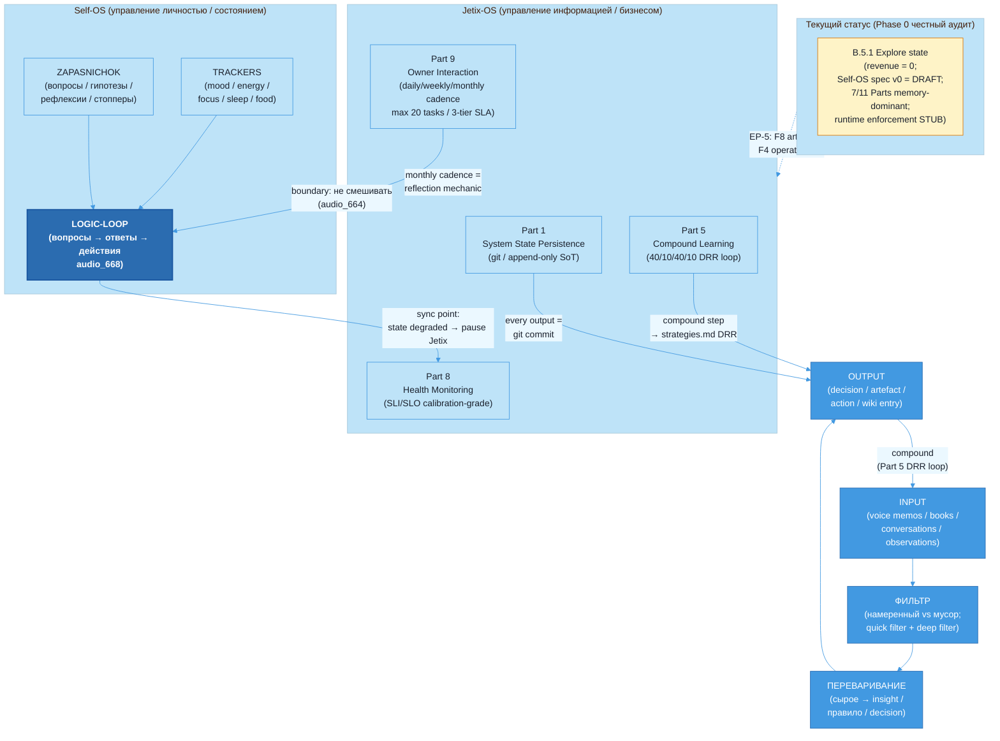

# Jetix as Self-OS Substrate — FPF-Described

> **EP-5 disclosure.** «F8 / LOCKED» в этом документе = Jetix-internal single-author Ruslan ack ≠ FPF B.3 F8 (independent verification). F-grade здесь — F3 (multi-source informal, один автор).
>
> **EP-2 disclosure.** Данный документ описывает substrate как artefact (mention). Operational claims о том что Self-OS «работает» — flagged там, где применимо, с явным разделением aspirational vs runtime per Phase 0.
>
> 10-15 min read.

---

## §0 TL;DR (≤200 слов)

Jetix начинается не с корпорации и не с платформы — он начинается с одного человека, который работает с информацией. Этот слой называется Self-OS substrate: персональная система управления вниманием, состоянием, знаниями и действиями конкретного «деятеля» (deyatel) — в данном случае Руслана.

Через FPF-линзу: Jetix-OS = U.System (A.1), оперирующая на информации по четырём фазам — INPUT → ФИЛЬТР → ПЕРЕВАРИВАНИЕ → OUTPUT. Substrate существует в двух режимах одновременно (A.4 Temporal Duality): design-face — это Foundation v1.0 LOCKED (11 Parts + Pillar C), run-face — это живые cycles, голосовые заметки, wiki-записи, рефлексии. Четыре Foundation Parts образуют substrate cluster: Part 1 (System State Persistence — append-only ground truth), Part 5 (Compound Learning — каждый цикл умнее предыдущего), Part 8 (Health Monitoring — сигналы о состоянии системы), Part 9 (Owner Interaction Scaffold — ежедневный / еженедельный / ежемесячный ритм взаимодействия).

**Честный статус:** substrate aspirational — 7 из 11 Parts memory-dominant, runtime enforcement STUB. Self-OS spec v0 = DRAFT. Ценность документа — архитектурная ясность о том, КАКИМ должен быть этот слой, не о том, что он уже полностью работает. [src: reports/phase-0-fpf-scope/01-jetix-objects-inventory.md §0]

---

## §1 Verbatim source anchors

Пять прямых цитат из первоисточников с `[src:file:§section]`:

**1. Базовый принцип информационной обработки (Doc 1A)**

> «Всё, с чем работает мастерская — это информация. Соответственно у всего есть вход (откуда инфа берётся) и выход (куда уходит после переработки).»

[src: decisions/BASE-MANAGEMENT-SYSTEM-2026-05-04.md §3.1 «Базовый принцип»]

**2. Определение Self-OS из голосовых заметок Руслана**

> «Две сущности их надо будет ещё сегодня детально описать и вместе собрать. С одной стороны — система по управлению обезьяной, по рефлексии (управление состоянием / мотивацией / интересом). С другой — управление процессами / ресурсами / информацией. Не смазывать в одно.»

[src: decisions/SELF-MANAGEMENT-SYSTEM-SPEC-v0-2026-05-16.md §1.1, audio_667]

**3. Logic-loop: вопросы → ответы → действия**

> «Логика такая: задавать определённые вопросы, фиксировать эти вопросы, искать на них ответы — чтобы так мозг работал, эту структуру натянуть в мозге.»

[src: decisions/SELF-MANAGEMENT-SYSTEM-SPEC-v0-2026-05-16.md §2.4, audio_668]

**4. Externalize — освобождает башку (P-3)**

> «Когда у тебя в памяти держать ничего не надо — насколько легче думать. Бошку освобождает.»

[src: decisions/SELF-MANAGEMENT-SYSTEM-SPEC-v0-2026-05-16.md §3.4, audio_98]

**5. Part 5 — compound loop closure**

> «Part 5 closes the R2 reinforcing loop (Senge): every cycle's execution becomes input to the next cycle's improved execution. Without Part 5, the system executes brilliantly once and re-derives the same lessons next cycle — knowledge does not compound across cycles.»

[src: swarm/wiki/foundations/part-5-compound-learning-methodology-capture/architecture.md §0]

---

## §2 FPF mapping (primitives + bounded contexts + claims + F-G-R)

### §2.1 Примитивы

| FPF primitive | Что представляет в Jetix Self-OS | Статус применения |
|---|---|---|
| **U.System (A.1)** | Jetix-OS как голонная система индивидуальной информационной обработки — Ruslan = owner-holon; Foundation Parts = sub-holons | Используется как основная рамка: O-01 в Phase 0 inventory |
| **A.4 Temporal Duality** | Два лица substrate: design (Foundation v1.0 LOCKED = архитектурный замысел) vs run (active cycles = фактическое исполнение, 571 commit/month) | Явный — ключевое различие для EP-5 / CE-3 |
| **U.System composition** | Foundation Parts 1+5+8+9 = четыре sub-holons substrate cluster: State / Learning / Health / Interaction | Используется для структурирования §3 narrative |
| **B.5.1 Explore/Operate state** | Текущее состояние Self-OS substrate = Explore (revenue = 0; spec aspirational; runtime enforcement STUB; Self-OS spec v0 = DRAFT) | Явный — предотвращает operational overclaim |
| **U.WorkPlan (A.15.2)** | Self-OS P-1..P-10 principles как work plan substrate — «recipe» для владельца системы | P-1..P-10 поверхнуты из voice Руслана; выступают как U.WorkPlan для Self-OS |
| **B.3 F-G-R** | F3 grade (multi-source informal, one-author synthesis) для всех claims в этом документе | Явный в frontmatter; per-claim в §2.2 ниже |

### §2.2 Per-claim F-G-R

| # | Claim | F | G | R |
|---|---|---|---|---|
| C-1 | Jetix-OS = U.System (A.1) оперирующая на информации по pipeline INPUT→ФИЛЬТР→ПЕРЕВАРИВАНИЕ→OUTPUT | F4 | jetix-operational (O-01) | refuted_if_pipeline_absent_from_system_design_OR_Doc1A_§3.1_deprecated |
| C-2 | Foundation Parts 1+5+8+9 = substrate cluster (State/Learning/Health/Interaction) | F5 | jetix-foundation-canonical | refuted_if_any_of_4_Parts_removed_from_Foundation_v1.0_OR_RUSLAN-ACK_withdrawn |
| C-3 | Self-OS и Jetix-OS разделены (не смешивать личность с бизнесом), но имеют 4 sync points | F3 | self-os-spec-v0-applied-now | refuted_if_Ruslan_collapses_two_systems_explicitly_OR_Self-OS_spec_v0_rejected |
| C-4 | Logic-loop «вопросы → ответы → действия» = primary management tool для внимания | F3 | self-os-spec-v0-applied-now | refuted_if_audio_668_transcription_misrepresents_Ruslan_intent_OR_spec_rejected |
| C-5 | Текущее состояние = B.5.1 Explore; 7 из 11 Parts memory-dominant; runtime enforcement STUB | F4 | jetix-honest-audit | refuted_if_operational_audit_shows_all_11_Parts_operationally_evidenced |
| C-6 | P-3 (externalize всё что можно в систему, не в голове) = primary gain Self-OS | F3 | self-os-spec-v0-applied-now | refuted_if_Ruslan_rejects_principle_OR_audio_98_misquoted |

---

## §3 Plain English narrative (L1-friendly)

### §3.1 Почему всё начинается с отдельного человека

Когда Анатолий Левенчук, Цэрэн и другие партнёры смотрят на Jetix — они видят систему управления бизнесом, мастерскую, корпорацию. Но у любой системы есть substrate — фундаментальный слой, на котором всё остальное стоит. В случае Jetix этот substrate — не сервер и не облако. Это один конкретный человек: Руслан, который каждый день работает с информацией.

FPF называет это U.System (A.1) — голонная система, одновременно являющаяся целым (сама по себе, со своей логикой) и частью (компонентом большей системы — Jetix-корпорации, сети мастерских). Этот нижний слой — Self-OS substrate — определяет качество всего, что строится выше. [src: reports/phase-0-fpf-scope/01-jetix-objects-inventory.md §1 O-01]

### §3.2 Базовый принцип: всё есть информация

Doc 1A (BASE-MANAGEMENT-SYSTEM) формулирует первый принцип предельно просто:

> «Всё, с чем работает мастерская — это информация.»

[src: decisions/BASE-MANAGEMENT-SYSTEM-2026-05-04.md §3.1]

Это не метафора. Любое решение — информация. Любой разговор — информация. Любое состояние (усталость, энергия, фокус) — сигнал, то есть информация о системе. Когда принимается такая рамка, сразу появляется четырёхфазный pipeline:

```
INPUT  →  ФИЛЬТР  →  ПЕРЕВАРИВАНИЕ  →  OUTPUT
```

- **INPUT** — что попадает в систему: книги, голосовые заметки, разговоры, события, наблюдения. Правило Руслана: input должен быть намеренным, не случайным. Случайный input = мусор по умолчанию. [src: BASE-MANAGEMENT-SYSTEM §3.1 «Фаза 1»]
- **ФИЛЬТР** — что пропускаем дальше. Беспощадный: лучше пропустить полезное, чем утонуть в обработке нерелевантного. [src: BASE-MANAGEMENT-SYSTEM §3.1 «Фаза 2»]
- **ПЕРЕВАРИВАНИЕ** — превращаем сырое в усвоенное. «Прочитал книгу» ≠ «узнал что-то». Переваривание = отдельная фаза, требующая отдельного времени. [src: BASE-MANAGEMENT-SYSTEM §3.1 «Фаза 3»]
- **OUTPUT** — наружу что-то выходит: решение зафиксировано, артефакт создан, сообщение отправлено. [src: BASE-MANAGEMENT-SYSTEM §3.1 «Фаза 4»]

Именно этот pipeline — не технология — является ядром Jetix-OS.

### §3.3 Два параллельных слоя: Self-OS и Jetix-OS

Руслан провёл критическую границу в голосовых заметках (audio_664, audio_667): нельзя смешивать ресурсы личности и ресурсы бизнеса «в одной каше в башке». Это не тактическое решение — это архитектурный принцип. [src: decisions/SELF-MANAGEMENT-SYSTEM-SPEC-v0-2026-05-16.md §1.2]

| | Self-OS | Jetix-OS |
|---|---|---|
| Объект управления | Личность, состояние, тело, внимание | Проекты, клиенты, знания, процессы |
| Вход | Эмоции, физ. сигналы, сон, питание | Voice memos, решения, CRM, wiki |
| Выход | Решения о привычках, здоровье, границах | Решения, публикации, артефакты |
| Метрики | Mood, energy, focus-depth | KM lifecycle, SG-N, финансы |

[src: decisions/SELF-MANAGEMENT-SYSTEM-SPEC-v0-2026-05-16.md §1.3 table]

При этом у двух систем есть четыре точки синхронизации (sync points):
1. State degraded → auto-pause critical Jetix decisions
2. Identity update → may inform RUSLAN-LAYER overrides
3. Quarterly review → personal trajectory informs business direction
4. Habit cluster recognition → adapt Jetix cadence

[src: decisions/SELF-MANAGEMENT-SYSTEM-SPEC-v0-2026-05-16.md §6.3]

Обе системы используют общий substrate: filesystem = source of truth, markdown + YAML frontmatter, append-only logs, Pillar C constitutional principles. [src: decisions/SELF-MANAGEMENT-SYSTEM-SPEC-v0-2026-05-16.md §6.4]

### §3.4 Четыре Foundation Parts как sub-holons substrate cluster

Foundation v1.0 содержит 11 Parts. Для Self-OS substrate критически важны четыре — они образуют «кластер субстрата»:

**Part 1 — System State Persistence.** Всё, что не зафиксировано в git — не существует как canonical state. Это append-only, content-addressable substrate: 571 commit/month как показатель активного использования. Каждый коммит несёт [area] + verb + what + optional why. Голосовая заметка → транскрипт → структурированный item → wiki-запись → git commit — вся цепочка от сырого наблюдения до зафиксированного знания проходит через Part 1. [src: swarm/wiki/foundations/part-1-system-state-persistence/architecture.md §0]

**Part 5 — Compound Learning & Methodology Capture.** Ключевой reinforce-loop (Senge R2): каждый цикл исполнения → input для следующего цикла с улучшенным исполнением. Без Part 5 система «одинаково умна» каждый цикл — знание не накапливается. Формула 40/10/40/10 (Plan / Work / Review / Compound) — конституциональный принцип из FUNDAMENTAL §2.2. Compound step создаёт DRR-записи в agents/*/strategies.md — база знаний о том «что сработало». [src: swarm/wiki/foundations/part-5-compound-learning-methodology-capture/architecture.md §0]

**Part 8 — Health Monitoring & System Integrity.** Система должна знать о своём состоянии. SLI/SLO calibration parameters для Phase A: не production-grade, а starter values. Роль Part 8 — audit lead (Part 6a = audit support, Part 6b = enforcement arm). Для Self-OS это означает: dashboard состояния, alert routing при деградации, weekly review с health signals. [src: swarm/wiki/foundations/part-8-health-monitoring-system-integrity/architecture.md frontmatter tradeoff_01_split]

**Part 9 — Owner Interaction Scaffold.** Закрывает attention loop владельца. Структура: утреннее намерение → dispatch cycles → вечерняя рефлексия зафиксирована. Еженедельный review с draft-disposition table. Ежемесячная стратегическая рефлексия. Attention budget capped: max 20 active tasks (RUSLAN-LAYER value). 3-tier SLA taxonomy: L1 (стратегический, same-session) / L2 (тактический, weekly batch) / L3 (рутинный, auto-log). [src: swarm/wiki/foundations/part-9-owner-interaction-scaffold/architecture.md §0]

### §3.5 Reflection mechanic: logic-loop вопросы → ответы → действия

Self-OS spec v0 §2.4 описывает ключевой механизм рефлексии — не просто self-check, а структурированная работа с вниманием и мышлением:

> «Задавать определённые вопросы, фиксировать эти вопросы, искать на них ответы — чтобы так мозг работал, эту структуру натянуть в мозге.»

[src: decisions/SELF-MANAGEMENT-SYSTEM-SPEC-v0-2026-05-16.md §2.4, audio_668]

Два класса вопросов:
- **Category A (self-check):** «Как ты себя чувствуешь?», «На что тратил время?», «Где compound, где утечка?»
- **Category B (focus-holders):** «Как можно сделать вот это?», «Как может работать это с этим?», «Что я не понимаю про X?»

Workflow: система задаёт Category A по расписанию → Ruslan добавляет Category B ad-hoc → вопросы записываются → ответы ищутся (voice pipeline / wiki / research) → закрытие с cross-ref в источник. [src: decisions/SELF-MANAGEMENT-SYSTEM-SPEC-v0-2026-05-16.md §2.4 Workflow 1-6]

Part 9 monthly cadence = institutional rhythm этого loop на уровне Foundation.

### §3.6 Граница Self-OS ↔ Jetix-OS и sync points

Принцип P-3 (Externalize всё что можно в систему): «Когда у тебя в памяти держать ничего не надо — насколько легче думать». [src: decisions/SELF-MANAGEMENT-SYSTEM-SPEC-v0-2026-05-16.md §3.4, audio_98]

Это shared substrate для обеих систем. Ни Self-OS, ни Jetix-OS не живут в голове — они живут в filesystem. Обе используют git как SoT, оба следуют Pillar C (12 constitutional rules), обе используют append-only logs.

Ключевое ограничение (CE-3 из Phase 0): «Foundation v1.0 LOCKED» = language-state документов (A.16), НЕ подтверждение операционной системы (A.4). 7 из 11 Parts = memory-dominant substrate, не fully operational enforcement. Self-OS spec v0 статус = DRAFT F2. [src: reports/phase-0-fpf-scope/01-jetix-objects-inventory.md §5 CE-3]

**Это честная картина текущего состояния:** архитектура спроектирована и задокументирована; execution = aspiration, не факт.

---

## §4 FPF formal version

**Системная декларация (компактная).**

Jetix Self-OS substrate = **U.System(A.1)** с:
- **U.BoundedContext(A.1.1):** single-owner = Ruslan Berlin; filesystem = SoT; canonical carrier = git DAG (Part 1)
- **A.4 Temporal Duality:** design face = Foundation v1.0 LOCKED (11 Parts + Pillar C; artefact F8); run face = active cycles + voice pipeline + wiki + ROY swarm (operational F2-F4)
- **B.5.1 state = Explore:** revenue = 0; Self-OS spec v0 = DRAFT; runtime enforcement STUB
- **Sub-holon composition:**
  - Part 1 (State Persistence) — append-only evidence substrate; falsifier: «no canonical state outside git»
  - Part 5 (Compound Learning) — R2 reinforcing loop; falsifier: DRR entries absent across consecutive cycles
  - Part 8 (Health Monitoring) — SLI/SLO calibration-grade starter values; falsifier: TRADEOFF-01 audit split violated
  - Part 9 (Owner Interaction) — daily/weekly/monthly cadence; attention cap 20 tasks; 3-tier SLA
- **U.WorkPlan (A.15.2):** P-1..P-10 Self-OS principles surfaced from Ruslan voice as work plan substrate (surface'инг — not Ruslan-decided shape yet; shape = Ruslan authority per R1)
- **B.3 F-G-R:** F3 · G: jetix-fpf-describe-self-os-substrate · R: refuted_if_individual_substrate_inoperable_within_90d_OR_Self-OS_spec_v0_rejected

**Dependencies:**
- Part 6b (Human Gate): AWAITING-APPROVAL packets for foundation-level writes
- Part 6a (Provenance Officer): F-G-R tagging on promoted claims
- Pillar C: 12 Tier-2 rules apply to both Self-OS и Jetix-OS uniformly

**Runtime evidence vs aspirational:**
- Runtime (evidenced): voice pipeline (11 reviews active); wiki 551 records; git active; Part 1 commit interface
- Aspirational: Self-OS daily-log directory absent; Part 9 monthly reflection cadence = spec-only; Self-OS dashboard = не реализован; Part 5 compound-application-rate metric = unstated

---

## §5 Mermaid diagram



---

## §6 Connections / cross-refs

### §6.1 Phase 0 объекты (из 01-jetix-objects-inventory.md)

| Object | Связь с этим документом |
|---|---|
| **O-01** Jetix оперативный субстрат | PRIMARY anchor — U.System (A.1) + U.BoundedContext (A.1.1); этот doc = primary FPF-described view O-01 |
| **O-07** Foundation Architecture v1.0 | SECONDARY anchor — Foundation Parts 1+5+8+9 cluster; A.4 Temporal Duality: design (LOCKED) vs run (cycles); D-2 dispute preserved (U.System vs U.Episteme) |
| **O-13** People-Network-State / Clan | Cross-link: individual substrate (этот doc) = prerequisite для tribal layer (doc 03). Clan члены = отдельные деятели каждый со своим Self-OS substrate |
| **O-04** Работающий продукт | Voice pipeline + wiki 551 records + git = evidenced runtime components Self-OS substrate; честный anchor per §6 Phase 0 |

### §6.2 H1-H8 Octagon Strategic Insights (relevance)

| Insight | Relevance к этому doc |
|---|---|
| **H1** (substrate anchor — ссылка на information management) | Substrate layer = foundation H1. Individual info-processing pipeline = практическое воплощение H1 substrate |
| **H6** (gamified layer / dopamine engineering) | Self-OS P-6 «hyper-stimulate в полезном направлении» (audio_666); gamification = способ motive-alignment на уровне substrate [src: SELF-MANAGEMENT-SYSTEM-SPEC-v0 §3.7] |
| **H7** People-Network-State | Individual substrate = atomic unit People-NS. R12 anti-extraction применяется symmetrically к self-substrate: AI = scribe; Ruslan = owner; система не extracts beyond agreed share [src: SELF-MANAGEMENT-SYSTEM-SPEC-v0 §8.2] |
| **H8** Trust Infrastructure | Trust начинается с individual commitment integrity — logic-loop вопросы → ответы = committment execution. Честный audit своего состояния = trust substrate base layer |

### §6.3 Foundation Parts cluster (этот документ)

- **Part 1** — State Persistence [src: swarm/wiki/foundations/part-1-system-state-persistence/architecture.md §0]
- **Part 5** — Compound Learning [src: swarm/wiki/foundations/part-5-compound-learning-methodology-capture/architecture.md §0]
- **Part 8** — Health Monitoring [src: swarm/wiki/foundations/part-8-health-monitoring-system-integrity/architecture.md frontmatter]
- **Part 9** — Owner Interaction [src: swarm/wiki/foundations/part-9-owner-interaction-scaffold/architecture.md §0]

### §6.4 Cross-links к другим docs серии

| Doc | Как связан |
|---|---|
| **02 Jetix as Methodology** | Self-OS substrate = individual deyatel, использующий method как рабочий инструмент; U.MethodDescription применяется к Self-OS P-1..P-10 principles как recipe |
| **03 Jetix as Virtual Tribe** | Individual substrate (этот doc) → tribe formation происходит через mutual instrumentation individual deyatels; Self-OS integrity = precondition для tribal trust |
| **04 Jetix as Corporation** | Corporation layer rides on top of this substrate. Healthy individual substrate = precondition для устойчивых business commitments |
| **05 Jetix as Platform** | Meta-workshop topology = composition individual workshops, каждая с own substrate layer |
| **06 Jetix as Clean Internet Layer** | Individual commitment integrity (P-3 externalize, P-4 value-assignment) = atomic unit trust infra H8 |
| **07 End-to-End Overview** | Этот doc = Layer 0 в end-to-end stack |

---

## §7 Open questions для Ruslan (R1 surface)

Surfaced из Phase 0 OQs + Self-OS spec gaps + Foundation Parts execution evidence gap. НЕ auto-resolve — Ruslan решает.

**OQ-DOC01-1. Граница Self-OS ↔ Jetix-OS: где именно hard cutoff?**

[src: decisions/SELF-MANAGEMENT-SYSTEM-SPEC-v0-2026-05-16.md §9.Q1]

Surface: audio_664 — «бизнес для здоровья ради жизни» (P-1); audio_94 — «моя жизнь = служение Jetix». Apparent tension: «Jetix служит мне» vs «я служу Jetix». Какой принцип precedence когда конфликт? Вопрос не решён в spec v0.

**OQ-DOC01-2. Self-OS cadence: какие реально выполнимы?**

[src: decisions/SELF-MANAGEMENT-SYSTEM-SPEC-v0-2026-05-16.md §9.Q2]

Surface: daily morning (audio_104) + daily evening + weekly (audio_98 — пропускал) + monthly (implied) + quarterly identity (D8). Wishful vs реально соблюдаемые? Part 9 spec декларирует структуру; Self-OS spec не декларирует реалистичную cadence.

**OQ-DOC01-3. CE-3 execution gap — когда 7/11 memory-dominant Parts станут operational?**

[src: reports/phase-0-fpf-scope/01-jetix-objects-inventory.md §5 CE-3]

Surface: Foundation v1.0 LOCKED как artefact F8; operational level F2-F4 для 7 из 11 Parts. Конкретный milestone / trigger для движения от memory-dominant к operational enforcement? Part 9 daily-log directory absent; Part 5 compound-application-rate metric unstated. Что minimum viable operational evidence?

**OQ-DOC01-4. Self-OS P-1..P-10 как U.WorkPlan — это финальная нумерация?**

[src: decisions/SELF-MANAGEMENT-SYSTEM-SPEC-v0-2026-05-16.md §3 P-1..P-9 + §10.Q1-Q10]

Surface: SELF-MANAGEMENT-SYSTEM-SPEC-v0 contains P-1..P-10 (counts include P-8 morning affirmation и P-9 gratitude). Spec status = ai-draft (prose_authored_by: ai-draft). Ruslan не ack'нул финальный список principles. До ack — они = surfaced candidates, не confirmed U.WorkPlan. Требует Ruslan review.

**OQ-DOC01-5. Identity doc (identity.md) — public/private/quasi?**

[src: decisions/SELF-MANAGEMENT-SYSTEM-SPEC-v0-2026-05-16.md §9.Q8]

Surface: «моё отношение к себе же — кто я / что я / почему — где-то ещё отдельно зафиксировать» (audio_664). Вопрос: identity.md gitted (public-ish) или local-only (private/)? Implications для Jetix open-source vs personal boundary. R12: если gitted — AI-scribe scope над личной идентичностью требует explicit ack.

---

## §8 R1 reaffirmation + dissents preserved (AP-6)

### §8.1 R1 attribution

**prose_authored_by: ruslan-via-voice-dictation+brigadier-structured.**

Этот документ = surface'инг из первоисточников (голосовые заметки Руслана, Doc 1A, Self-OS spec v0, Phase 0 inventory) + engineering-integrator structuring. Стратегические тезисы принадлежат Руслану (audio_664..audio_668; audio_87..audio_104). Структура, FPF-mapping, F-G-R triples, mermaid diagram = brigadier-structured surface'инг. Никакого agent-pending strategic prose.

**Что НЕ authored AI автономно:** границы Self-OS/Jetix-OS, принципы P-1..P-10, приоритеты sync points, identity decisions — всё это Ruslan-voice, AI = scribe.

### §8.2 Dissents placeholder (AP-6)

На данном этапе (engineering-integrator draft) dissents отсутствуют — это первый cell в цепочке. Brigadier заполнит dissents после получения phil × critic и eng × critic review.

Ожидаемые zones of disagreement (surface для следующих cells):

**D-DOC01-A (anticipate from phil × critic):** «Self-OS P-1..P-10 как U.WorkPlan» — phil может оспорить: U.WorkPlan требует formal declared intent; surfaced voice-принципы без Ruslan explicit ack = U.Episteme (surface'инг тезисов), не U.WorkPlan (declared plan). Разрешение: Ruslan ack требуется для promotion до U.WorkPlan.

**D-DOC01-B (anticipate from sys × integrator):** Граница Self-OS / Jetix-OS может оказаться сложнее чем статичный sync-table — systems-expert может предложить feedback loop framing (Meadows), где два system не просто sync, а взаимомодулируют через multi-timescale loops. Preservation: обе rамки (sync-table из Self-OS spec + cybernetic-loop из systems-expert) сохраняются с их (F, ClaimScope, R) trig без averaging.

**D-DOC01-C (anticipate from eng × critic):** FPF-primitive coverage — engineering critic может обнаружить gaps в применении primitives. Например: A.15 Role-Method-Work alignment для Self-OS roles (owner / AI-scribe) не декларировано явно в §2. Preservation: gap flagged как missing primitive claim, не silently resolved.

---

*Engineering-expert × integrator draft complete. Draft path: `swarm/wiki/drafts/task-fpf-describe-jetix-2026-05-17-self-os-eng-integrator.md`. Next cells: phil × critic + eng × critic (parallel) → sys × integrator (4th) → brigadier integration → §5.5.5 gate → canonical write.*
