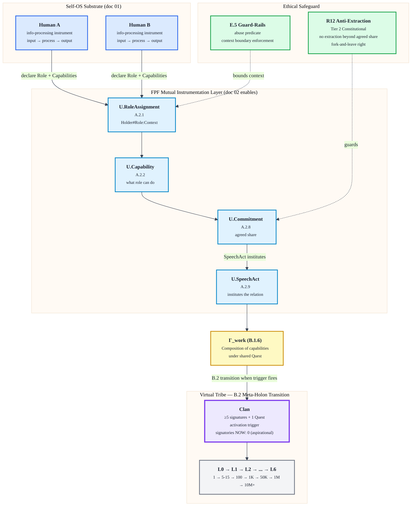

# Jetix as Virtual Tribe Substrate — FPF-Described (Doc 03)

> **EP-5 disclosure.** «F8 / LOCKED» = Jetix-internal single-author Ruslan ack, НЕ FPF B.3 F8 (который требует независимой верификации). Document-level grade F2; per-claim F3-F5 в §2.
>
> **EP-2 disclosure.** Этот документ описывает virtual tribe и Clan как artefact (mention). Clan Charter LOCKED; signatories = 0 подтверждено на 2026-05-17. Tribal layer = aspirational. Не путай design-face с operational state.
>
> **TRIBE-STATUS.** Виртуальное племя — это архитектурная цель, не текущая реальность. Честность об этом — часть R12 anti-extraction discipline.
>
> 12-18 min read (primary doc — extended concept space).

---

## §0 TL;DR (≤250 слов)

Третий слой Jetix — самый амбициозный: если Self-OS (doc 01) описывает одного человека, работающего с информацией, а Methodology (doc 02) даёт язык передачи метода, то этот документ описывает **что происходит, когда таких людей много** и между ними выстроена правильная инфраструктура.

Тезис Руслана из голосовой заметки text_004 (2026-05-17, 23:30): **люди — это инструменты по переработке информации**. Не в смысле abuse. В смысле точной онтологии: информация входит → обрабатывается → выходит. Следствие: через FPF-роли (не через личность) можно instrumentalize друг друга — делиться способностями, ресурсами, положением — взаимовыгодно, на фундаменте trust + respect + ответственного подхода. **Это не шутки, серьёзно.**

Через FPF-линзу: mutual instrumentation = композиция U.Capability через U.Commitment + U.SpeechAct, собранная в Γ_work. Этический предохранитель = R12 anti-extraction (Tier 2 конституциональное правило) + E.5 Guard-Rails. Граница между abuse и cooperation — явно объявленный agreed share + fork-and-leave right.

Outcome этой инфраструктуры: **виртуальное племя** — новый уровень объединения обезьян. Не DAO с токеномикой. Не корпоративная иерархия. Clan как первая инстанция — конкретная активационная форма.

**Честный статус:** Clan = 0 подписей. Tribal layer = aspirational. Этот документ — архитектурная ясность о том, каким должен стать слой, не описание его текущего состояния. Зависит от doc 01 (substrate integrity), doc 02 (FPF shared language), doc 06 (trust mechanism operational).

[src: raw/voice-memos-2026-05-17-batch/text_004@17-05-2026_23-30.md §core-claims; vision/jetix-fpf-describe-PLAN-2026-05-17.md §1.1 doc-03 row; decisions/JETIX-FIRST-CLAN-CHARTER-2026-05-12.md §11]

---

## §1 Verbatim source anchors

Прямые цитаты из первоисточников — PRIMARY HOME для text_004.

**1. Главный тезис — люди как инструменты по переработке информации (text_004 verbatim)**

> «Что люди — это вот машины. Люди такие вот инструменты по переработке информации, ну в целом, от системы, которые имеют какую-то информацию, которые производят какую-то информацию, и в целом, что их можно назвать вот инструментами тоже. То есть что человек — это просто инструмент по переработке информации. То есть информация это в голову попадает, что там происходит, потом попадает на выход. Ну или блять, интеллект — это хуйня по переработке информации.»

[src: raw/voice-memos-2026-05-17-batch/text_004@17-05-2026_23-30.md verbatim ¶1]

**2. Следствие: instrumentation через роли (text_004 verbatim)**

> «...тогда вот если так на это всё смотреть, то получается я понимаю — это могу использовать других людей как инструменты. И, ну то есть, если я знаю, какие у них есть инструменты, какие у них есть ресурсы и так далее, то я могу этих людей вот, то что прям на этих людей, но возможно роли этих людей там до, либо нахождение этих людей в обществе и так далее, я могу это вот использовать в своём вот бизнесе, проекте, жизни и так далее.»

[src: raw/voice-memos-2026-05-17-batch/text_004@17-05-2026_23-30.md verbatim ¶2]

**3. Не abuse-mode: фундамент доверия (text_004 verbatim)**

> «И то есть как раз, ну Jetix, FPF поможет вот это вот как бы открыть, раскрыть, показать и так далее. Снова-таки, ну не в таком прямо абьюзивном до смысле, а вот как-то это всё на фундаменте вот доверия, уважения друг другу, там ответственного подхода и так далее.»

[src: raw/voice-memos-2026-05-17-batch/text_004@17-05-2026_23-30.md verbatim ¶3a]

**4. Outcome — виртуальное племя (text_004 verbatim)**

> «Но если так вот получится сделать, до что люди смогут друг друга вот как инструменты использовать, плюс делиться своими инструментами, плюс вот реально как-то взаимовыгодно это делать, то это вот реально претендент на создание нового такого вот виртуального сообщества, виртуального племени, скажем так. Новый уровень объединения обезьян. Вот.»

[src: raw/voice-memos-2026-05-17-batch/text_004@17-05-2026_23-30.md verbatim ¶3b]

**5. На полном серьёзе — стратегическая фиксация (text_004 verbatim)**

> «Ну то есть ещё раз, на полном серьёзе, не смеюсь, поэтому вот это тоже надо будет как-то зафиксировать и уже сейчас вот в этом направлении смотреть.»

[src: raw/voice-memos-2026-05-17-batch/text_004@17-05-2026_23-30.md verbatim ¶4]

**6. Роль, а не человек — trust через контекстный token (text_001 H8)**

> «Эта система позволит быстро обмениваться ресурсами и просто улучшает и ускоряет процесс обмена. То есть, во-первых, позволяет более быстро доверять другому человеку либо понимать конкретно, в каком контексте ты ему можешь доверять, в каком не можешь. Или там доверять, например, не человеку, а **роли**, в которой он находится.»

[src: decisions/STRATEGIC-INSIGHT-JETIX-TRUST-INFRASTRUCTURE-2026-05-17.md §1 text_001 §4-§5]

---

## §2 FPF mapping — primitives + bounded contexts + per-claim F-G-R

### §2.1 Primitive map

| FPF primitive | Роль в mutual instrumentation | Bounded context |
|---|---|---|
| **U.Role (A.2)** | Функция, а не личность. Два человека могут instrumentalize друг друга только через declared role — не через личностные ожидания | Действует внутри Clan (L1-L6); вне Clan — личная роль человека без FPF-attestation |
| **U.RoleAssignment (A.2.1)** | Holder#Role:Context — standard token. Доверяешь не Руслану-человеку, а Ruslan#FPF-scribe:Jetix-OS. Токен несёт audit trail независимо от holder identity | Bounded: контекст должен быть явно объявлен; cross-context instrumentation требует нового RoleAssignment |
| **U.Capability (A.2.2)** | Что роль умеет — её instruments. Capability = то, что человек реально вносит через свою роль: методология / аудитория / сеть / compute / знание / капитал | Capabilities нельзя агрегировать без явного U.Commitment (иначе — abuse-mode) |
| **U.Commitment (A.2.8)** | Что роль обязуется — agreed share. Без Commitment instrumentation = exploitation. Mutual instrumentation = mutual commitment: я раскрываю свои capabilities под конкретные обязательства, ты — свои | Commitment bounded: content + deadline + condition. Нарушение Commitment = R12-violation escalation |
| **U.SpeechAct (A.2.9)** | Акт объявления роли / вступления в committed relationship / выхода. SpeechAct institutes the tribal relation — не просто информирует, а СОЗДАЁТ социальный факт | Requires witness (Clan context) или logged evidence (filesystem, git) для verifiability |
| **Γ_work (B.1.6)** | Композиция capabilities: несколько role-bearers объединяют свои instruments в Γ_work. Виртуальное племя = aggregate Γ_work множества role-bearing humans | Γ_work bounded: конкретный Quest / Season / project scope |
| **E.5 Guard-Rails** | R12 anti-extraction как guard-rail: устанавливает что запрещено (extraction beyond agreed share). E.5 family = boundary norms каждого role contract | Constitutional — не операционное правило. Cannot be temporarily suspended |
| **B.2 Meta-Holon Transition** | Переход: individual deyatel (doc 01 substrate) → Clan (meta-holon). Clan = целостная единица, чьи части = individual role-bearers; как часть — Clan участвует в L2+ federation | Transition triggered by ≥5 Charter signatures + 1 совместный Quest (Clan activation) |

[src: raw/voice-memos-2026-05-17-batch/text_004@17-05-2026_23-30.md §FPF-primitive-candidates; decisions/STRATEGIC-INSIGHT-JETIX-TRUST-INFRASTRUCTURE-2026-05-17.md §3; vision/jetix-fpf-describe-PLAN-2026-05-17.md §2.2 doc-03 row]

### §2.2 Per-claim F-G-R

| Claim | F | G | R |
|---|---|---|---|
| C-1: Humans = information-processing instruments (text_004 ontological claim) | F4 | ontology-jetix-internal (Ruslan dictation verbatim) | refuted_if: claim contradicted by peer-reviewed cognitive science framework that Ruslan adopts as canonical; accepted_if: Ruslan retains framing after peer review |
| C-2: Mutual instrumentation через FPF roles — ethical if founded on trust + R12 | F3 | jetix-clan-design (aspirational + H8 F3 precedent) | refuted_if: first real Clan interaction demonstrates instrumentation-without-trust is structural (not edge case); accepted_if: L1 activation data shows role-based cooperation produces lower conflict rate than person-based |
| C-3: Virtual tribe as emergent property (substrate + method + trust + R12) | F2 | jetix-clan-design (aspirational) | refuted_if: Clan operational at 10 members and no tribe-coherence signal emerges; accepted_if: ≥3 cross-role Quests completed within Season 1 without breakdown |
| C-4: R12 anti-extraction = ethical safeguard sufficient to prevent abuse-mode | F4 | tier-2-constitutional | refuted_if: R12 mechanism found legally unenforceable OR first real Clan exit involves asset dispute R12 fails to resolve; accepted_if: first fork-and-leave proceeds per §8 Charter without legal escalation |
| C-5: Clan Charter first activation at ≥5 signatures | F5 | clan-charter-locked | refuted_if: Ruslan rejects Clan model after first L1 outreach; refuted_if: 60d without first signature |

---

## §3 Нарратив — длинный (1500-2000 слов)

### §3.1 Почему люди — это инструменты по переработке информации

Начать надо с жёсткой онтологии, которую Руслан зафиксировал вечером 17 мая в 23:30 и сразу добавил: «на полном серьёзе, не смеюсь».

Человек — это машина по переработке информации. Информация приходит снаружи (события, тексты, разговоры, сигналы). Внутри что-то происходит — то, что мы называем мышлением, опытом, интуицией, методологией. На выходе — решения, тексты, действия, артефакты. Интеллект в этом смысле и есть «хуйня по переработке информации» (verbatim).

Это не редукционизм ради редукционизма. Это точный язык для описания того, что происходит, когда люди кооперируются. Когда ты просишь Анатолия Левенчука проревьюить твою методологию — ты используешь его как инструмент обработки информации: его экспертиза (накопленная processing capability) обрабатывает твой input и выдаёт output, который ты не можешь произвести сам. Когда ты привлекаешь Оскара Хартманна к оценке сделки — то же самое: его инвестиционный опыт = specialized processing hardware.

FPF даёт этому точный язык: U.Capability (A.2.2) — то, что роль умеет делать. Не что умеет человек вообще, а что умеет конкретная роль в конкретном контексте. Левенчук в роли Scholar#системное-мышление:Jetix-L1 несёт одни capabilities. Тот же Левенчук в роли личного друга — другие. Путать их = путать инструменты.

[src: raw/voice-memos-2026-05-17-batch/text_004@17-05-2026_23-30.md ¶1; decisions/STRATEGIC-INSIGHT-JETIX-TRUST-INFRASTRUCTURE-2026-05-17.md §4 «role-attestation > person-attestation»]

### §3.2 Роль ≠ личность — ключевое различие FPF

Здесь FPF делает что-то нетривиальное. Большинство систем кооперации работают на личностном уровне: «я доверяю Ивану, потому что знаю его давно». Это дорого масштабируется — нужно личное знакомство для каждой новой связи. И это ненадёжно — Иван надёжен в одном контексте и полностью непредсказуем в другом.

FPF предлагает переключиться с личности на роль. U.RoleAssignment (A.2.1) создаёт токен: Holder#Role:Context. Этот токен — не Иван-как-человек, а Иван#финансовый-аналитик:Series-A-сделки. Токен несёт audit trail: что роль сделала, какие commitments выполнила или нарушила, какие capabilities продемонстрировала. Ты доверяешь токену, подкреплённому evidence. Не человеку как таковому.

Как говорит Руслан в text_001: «Из-за того, что ты снова-таки как бы доверяешь роли, а не самому человеку, люди смогут более быстро и эффективно ... обмениваться ресурсами». Это не просто красивая метафора — это engineering specification того, как строится cooperation на масштабе. [src: decisions/STRATEGIC-INSIGHT-JETIX-TRUST-INFRASTRUCTURE-2026-05-17.md §1 + §4]

Для mutual instrumentation это критично. Когда ты instrumentalize другого человека через его роль — ты операционализируешь конкретные capabilities, связанные конкретными commitments, в конкретном context. Ты не эксплуатируешь человека. Ты входишь в FPF-опосредованный контракт с role-token.

Cross-link → doc 02 (Methodology): FPF-роли как mutual-instrumentation enabling primitives подробно разобраны через U.Role × U.Capability × U.Commitment в doc 02. Здесь фокус на том, что из этого вырастает.

### §3.3 Взаимная инструментализация: где граница между abuse и кооперацией

Это самый важный вопрос, и его нельзя замести под ковёр. Руслан намеренно поставил флаг: «не в таком прямо абьюзивном смысле». Что отличает abuse от cooperation в этой системе?

**Abuse-mode (что запрещено E.5 Guard-Rails + R12):**

- Использование capabilities человека без его ведома или согласия
- Извлечение ценности сверх agreed share — даже если человек «не заметил»
- Использование role-token за пределами объявленного context (Holder#финансист:Series-A ≠ Holder#финансист:всё-подряд)
- Удержание человека в кооперации через social lock-in или fear — без explicit ongoing commitment
- Смена agreed-share в одностороннем порядке после того, как человек уже вложился

**Cooperation-mode (что описывает text_004):**

- Capabilities раскрыты явно и добровольно через U.SpeechAct (A.2.9) — роль объявляется, не присваивается извне
- Commitments взаимны: я раскрываю свои instruments под конкретные обязательства, ты — свои
- Agreed share зафиксирован заранее и защищён R12 конституционально: «AI / substrate не может извлекать ценность из участников сверх согласованной доли» [src: decisions/JETIX-FIRST-CLAN-CHARTER-2026-05-12.md §4.1]
- Fork-and-leave: любой участник уходит без штрафа, забирая свои данные и артефакты. Это structural impossibility для abuse — невозможно держать человека в extraction-режиме, если он может уйти без последствий
- Взаимность: instrumentation идёт в обе стороны. Не «я использую тебя», а «мы используем друг друга как instruments» — в рамках наших ролей, на фундаменте trust

[src: decisions/JETIX-FIRST-CLAN-CHARTER-2026-05-12.md §2 (три конституциональных гарантии) + §4.1 R12; swarm/awaiting-approval/r12-anti-extraction-2026-05-12.md]

Практический тест: если participation is not exit-able without penalty — это abuse-mode по определению. Если agreed-share изменяется без explicit renegotiation — это R12 violation. Если role-capabilities используются за пределами объявленного context — это IP-1 violation (роль ≠ person, context ≠ all contexts).

R12 здесь работает как guard-rail в E.5 смысле: не как post-hoc punishment, а как structural constraint на contract formation. Нельзя войти в Clan-соглашение с R12-violating terms — они буквально неvalidны в системе.

### §3.4 R12 — этический предохранитель и positive face

R12 anti-extraction принято обсуждать как запрет. Но у него есть positive face, и это важно. H8 (Trust Infrastructure) описывает его так: [src: decisions/STRATEGIC-INSIGHT-JETIX-TRUST-INFRASTRUCTURE-2026-05-17.md §5]

> «R12 + H8 = единая anti-extraction-and-trust-substrate Pillar C contribution. R12 = prohibitive face (что запрещено). H8 = constructive face (что Jetix строит вместо).»

В контексте mutual instrumentation: R12 — это то, что делает instrumentation безопасным для всех сторон. Без R12 любая capabilities-exchange может деградировать в extraction. С R12:

- Каждая стороны явно знает, сколько ценности из неё могут извлечь (agreed share)
- Substrate (Jetix как платформа) сам связан R12 — он не может unilaterally расширить свою extraction surface
- Fork-and-leave право гарантирует, что participation — это ongoing choice, не lock-in

Это позволяет mutual instrumentation масштабироваться без деградации в exploitation. Чем больше people в системе, тем больше потенциальных capabilities-matches — и R12 гарантирует, что scale не превращается в power-asymmetry.

Cross-link → doc 06 (Clean Internet Layer): trust mechanism mechanics (role-attestation как trust signal, verifiable activity logs, F-G-R as reliability signal) подробно разобраны в doc 06. Здесь мы опираемся на итог: H8 7-primitive cluster создаёт инфраструктуру, внутри которой mutual instrumentation возможен. [src: vision/jetix-fpf-describe-PLAN-2026-05-17.md §5 doc-06 cross-ref]

### §3.5 Виртуальное племя как emergent property

Если всё вышеописанное работает — substrate integrity (doc 01) + FPF shared language (doc 02) + role-based trust (doc 06, H8) + R12 safeguard + Clan Charter activation — что получается на выходе?

Руслан называет это «виртуальным племенем» и «новым уровнем объединения обезьян». Через FPF это описывается через B.2 Meta-Holon Transition: множество individual deyatelей (каждый = Self-OS substrate из doc 01) переходят в meta-holon — Clan как целостную единицу.

Clan не является суммой своих членов. Clan = новое качество: коллективная Γ_work (B.1.6) — композиция capabilities через commitments. Когда Scholar#методология + Hunter#продажи + Architect#системный-дизайн объединяют свои capabilities под shared Quest — это не просто «три человека работают вместе». Это Γ_work, который ни один из них не мог бы произвести по отдельности.

Именно поэтому Руслан называет это «новым уровнем объединения обезьян» — не метафорически, а онтологически. Существующие форматы объединения:

- **Корпорация** — объединяет через контракт + деньги + иерархию. Extraction-prone. Lock-in structural. IP остаётся у корпорации.
- **DAO с токеномикой** — объединяет через token + governance vote. Speculation-prone. Social dynamics часто toxic.
- **Неформальные сети** — объединяют через личные знакомства. Не масштабируется. Favour economy = неявный extraction.
- **Jetix Clan** — объединяет через FPF-roles + R12 + fork-and-leave + reputation ledger + shared methodology. Role-based trust. Exit без penalty. Agreed share защищён.

Это структурно другой паттерн. «Новый уровень» — не гипербола, а описание нового режима cooperation mechanism.

[src: raw/voice-memos-2026-05-17-batch/text_004@17-05-2026_23-30.md ¶3b; decisions/JETIX-FIRST-CLAN-CHARTER-2026-05-12.md §1.2 (почему status quo не работает) + §4.2 (game-theory grounded cooperation)]

### §3.6 Clan Charter как конкретная активационная форма

Виртуальное племя — это не абстракция. Clan Charter — это его первая конкретная инстанция.

Charter (F5 LOCKED 2026-05-12) описывает:

- **9 L1 candidates** — конкретные люди с конкретными role-profiles (Scholar-архетипы: Левенчук / Брагинский / Тарасов; Architect: Руслан / Гиренко; Merchant: Хартманн / Цэрэн; Creator: Дмитрий / Федорив; aspirational anchor: Дуров) [src: decisions/JETIX-FIRST-CLAN-CHARTER-2026-05-12.md §3.2]
- **6 архетипов** (Hunter / Guardian / Scholar / Creator / Architect / Merchant) — это FPF U.Role taxonomy в прикладной форме
- **R12 три конституциональные гарантии** (no extraction beyond agreed share / fork-and-leave right / constitutional barrier против future extraction drift)
- **L0→L6 ladder** (1 → 5-15 → 100 → 1K → 10K-50K → 100K-1M → 10M+ humans) — масштаб mutual instrumentation
- **L1 activation trigger** = ≥5 Charter signatures + 1 первый совместный Quest

Активация — это момент, когда U.SpeechAct (A.2.9) «signing» институирует tribal relation. До подписи — это архитектура. После — живая Γ_work.

Сейчас: 0 signatories. Charter LOCKED (F5). Первый outreach к L1 candidates — следующий шаг.

[src: decisions/JETIX-FIRST-CLAN-CHARTER-2026-05-12.md §11 + §3.2 + §2 + §1.7]

### §3.7 «Не шутки, серьёзно» — стратегическая ставка

Руслан закончил text_004 словами: «на полном серьёзе, не смеюсь». Это стратегическая фиксация — не просто интересная идея.

Почему это deserves strategic-level attention:

**Первое.** Если mutual instrumentation через FPF работает, это решает одну из ключевых проблем масштабирования cooperation: как выйти за пределы личного знакомства без деградации в formalized-but-soulless корпоративный режим. Ни Clan Charter, ни H8 Trust Infrastructure не претендуют на «решение» — но они предлагают конкретный механизм, который можно тестировать.

**Второе.** R12 + fork-and-leave = структурная защита от самого распространённого failure mode cooperation-систем: деградации в extraction со временем. Когда substrate (организация / платформа) становится достаточно мощной, она начинает извлекать ценность из своих участников. R12 делает это конституционально запрещённым — не «мы надеемся, что так не будет», а «система не может это сделать без explicit amendment».

**Третье.** «Новый уровень объединения обезьян» — это не про Jetix First Clan. Это про архитектурный паттерн, который Jetix может распространять. Если pattern работает на L1 (5-15 людей), его можно масштабировать на L2 (100), L3 (1K), и далее. Каждый новый Clan = новая инстанция mutual instrumentation substrate.

**Четвёртое.** text_004 thesis требует фиксации на стратегическом уровне именно сейчас, в Phase 0, потому что от него зависят архитектурные решения: что такое Clan (role-composition или community?), как работает R12 (формально или через культуру?), что значит «виртуальное племя» (B.2 meta-holon или нечто другое?). Без фиксации — drift.

[src: raw/voice-memos-2026-05-17-batch/text_004@17-05-2026_23-30.md ¶4; decisions/JETIX-FIRST-CLAN-CHARTER-2026-05-12.md §1.5 (100-year ambition)]

### §3.8 Честный статус — tribal layer aspirational

Будет честным: на 2026-05-17 virtual tribe существует как архитектурный design и как Charter-document, но не как operational reality.

**Что работает сейчас:**
- Clan Charter LOCKED (F5) — конституциональный документ существует [src: decisions/JETIX-FIRST-CLAN-CHARTER-2026-05-12.md status: LOCKED]
- R12 anti-extraction LOCKED (Tier 2 constitutional) — ethical safeguard формализован [src: swarm/awaiting-approval/r12-anti-extraction-2026-05-12.md]
- H8 Trust Infrastructure LOCKED (F3) — trust mechanism описан [src: decisions/STRATEGIC-INSIGHT-JETIX-TRUST-INFRASTRUCTURE-2026-05-17.md]
- 9 L1 candidate profiles существуют (deep profiles, 17.3K слов)

**Что пока аспирационально:**
- 0 signatories Charter
- 0 completed Quests
- Role-attestation mechanism = filesystem + git (primitive substrate; Phase B+ ledger)
- Virtual tribe = design goal, не measured reality

**Зависимость от параллельных слоёв:**
- Doc 01 (Self-OS substrate) — individual substrate должен работать прежде чем Clan coordination имеет смысл. Статус: 7 из 11 Parts memory-dominant, runtime enforcement STUB.
- Doc 02 (Methodology) — FPF shared language должен быть понятен участникам. Статус: Fork guide v0 = aspirational, 0 forkers.
- Doc 06 (Trust mechanism) — role-attestation + reputation ledger должны работать. Статус: primitive (git-based).

Tribal layer = emergent property этих трёх слоёв. Когда все три operational — tribe возможен. Сейчас — строим substrate.

[src: reports/phase-0-fpf-scope/01-jetix-objects-inventory.md §0 honest state + 4-layer table (Layer D = «vapor»)]

---

## §4 FPF формальная версия

### §4.1 Cooperation graph — formal

```
Cooperation(A#Role_A:ctx, B#Role_B:ctx) iff:
  SpeechAct(A, declare(Role_A, Capability_set_A, Commitment_A)) ∧
  SpeechAct(B, declare(Role_B, Capability_set_B, Commitment_B)) ∧
  agreed_share(A, B) := (Commitment_A × Commitment_B) ∩ GuardRails(E.5, R12) ∧
  Γ_work := Capability_set_A ∪ Capability_set_B  [when compositions active under shared Quest]

VirtualTribe(Clan) := B.2_MetaHolon_Transition(
  {∀ member_i: member_i#Role_i:Clan_context},
  trigger = (|signatures| ≥ 5 ∧ Quest_count ≥ 1)
)
```

**Plain English:** два role-bearer кооперируются iff оба явно объявили свою роль + capabilities + commitments через SpeechAct, agreed share защищён R12 + E.5, и их capabilities композируются в Γ_work. Виртуальное племя (Clan) = B.2 meta-holon transition: fires при ≥5 подписях + 1 первый Quest.

### §4.2 Abuse predicate (E.5 Guard-Rails formal)

```
Abuse(A, B) iff:
  extract(A, B.capabilities) > agreed_share(A, B)
  ∨ context(use(B.Capability_set)) ⊄ declared_context(B#Role_B)
  ∨ ¬exit_without_penalty(B)
  ∨ unilateral_change(agreed_share)
```

R12 violation: любой из четырёх условий. Grade F8, halt_log_alert, Part 6b §I.2 enforcement.

[src: decisions/JETIX-FIRST-CLAN-CHARTER-2026-05-12.md §4.1; swarm/awaiting-approval/r12-anti-extraction-2026-05-12.md §2]

---

## §5 Mermaid diagram — cooperation graph



**Diagram M1** — Cooperation graph: от individual info-processing instruments через FPF mutual instrumentation layer → Γ_work → B.2 Meta-Holon Transition → Virtual Tribe (Clan). Ethical safeguard (R12 + E.5) bounds all capability-sharing. [src: text_004 §core-claims; H8 §3; Charter §4]

---

## §6 Cross-references + Connections

### §6.1 По Octagon insights (H1-H8)

| Insight | Связь с doc 03 |
|---|---|
| **H1 Foundation Model** | Substrate под Clan cooperation — Foundation v1.0 LOCKED = prerequisite для role-attestation mechanics |
| **H2 Partnership Model** | Partnerships = первая форма mutual instrumentation (L1 bilateral); H2 = B2B instance; Clan = многосторонний instance |
| **H3 R&D Flywheel** | Clan Quests = R&D cycles; capabilities compound через repeated Γ_work composition |
| **H4 Balaji Network State** | People-NS = масштабированный Clan (L3+); H4 Network State предполагает shared substrate — Clan = его первый instance |
| **H5 Tyson Mentorship** | Mentor-архетипы в L1 (Левенчук / Брагинский / Тарасов) = specific RoleAssignment patterns; mentorship = asymmetric mutual instrumentation |
| **H6 Gamified Platform** | 6 архетипов Clan = role taxonomy Realm; Realm Season = механизм делать Γ_work visible + rewarded |
| **H7 People-Network-State** | H7 = Clan масштабированный до People-NS; L0→L6 ladder = growth path от First Clan до H7 |
| **H8 Trust Infrastructure** | H8 = инфраструктура, внутри которой mutual instrumentation работает. Doc 03 extends_via H8: H8 описывает trust-as-mechanism, doc 03 описывает что этот mechanism enables |

[src: decisions/STRATEGIC-INSIGHT-JETIX-TRUST-INFRASTRUCTURE-2026-05-17.md §5 «Relationship to existing 7 insights»]

### §6.2 По Phase 0 objects

- **O-13 Clan / People-NS** — primary anchor object для этого документа. Clan = virtual tribe activation pattern.
- **O-11 R12 anti-extraction** — ethical foundation под instrumentation. R12 = конституциональный предохранитель.
- **O-09 H8 Trust Infrastructure** — role-attestation + transparency as trust mechanism. Doc 03 extends.
- **O-21 NC-1 Trust Infrastructure candidate** — light concept entry (wiki/concepts/trust-infrastructure-positive-signaling.md); role-attestation extends.

[src: reports/phase-0-fpf-scope/01-jetix-objects-inventory.md §O-13 + §O-11 entries]

### §6.3 По doc series

- **← doc 01** (Self-OS substrate) — prerequisite. Individual substrate должен работать. Честный статус: runtime enforcement STUB. Tribal layer зависит от individual layer.
- **← doc 02** (Methodology) — FPF shared language prerequisite. Mutual instrumentation предполагает, что участники говорят на одном языке (FPF). Doc 02 описывает distribution mechanics. Roles enabling mutual instrumentation подробно в doc 02 §2-§3.
- **→ doc 06** (Trust mechanism / Clean Internet Layer) — механика trust. H8 7-primitive cluster (A.2.8 + A.2.9 + A.2.1 + A.10 + B.3 + E.5 + E.17) подробно разобрана в doc 06. Не дублируем здесь — cross-link.
- **→ doc 07** (End-to-end overview) — synthesis point. «Virtual tribe = emergent property of platform + methodology + trust infra + R12» — 1 параграф synthesis в doc 07.

---

## §7 Открытые вопросы для Руслана (surface-only — R1)

> **R1 discipline:** AI = scribe, surfaces вопросы. Ruslan = sole strategist, принимает решения. Ни один вопрос ниже не pre-decided.

**OQ-D03-1.** Является ли text_004 thesis отдельным H9 Strategic Insight («Mutual Instrumentation Tribe») или это extension H8? [src: text_004 §open-questions «NEW H9 candidate?»; vision/jetix-fpf-describe-PLAN-2026-05-17.md §5 + §7 item 2]. **Default (brigadier): defer, NOT auto-promote H9.** Surface для Ruslan ack.

**OQ-D03-2.** «Virtual tribe» vs «Clan» — один concept или разные слои? Clan = конкретная operational form (5-15 людей, Charter signed). Virtual tribe = aspirational meta-holon (B.2, любой масштаб). Стоит ли явно разделить термины или использовать как synonyms? [src: text_004 §open-questions]

**OQ-D03-3.** Где enforcement abuse prevention достаточен? R12 + E.5 Guard-Rails + fork-and-leave = достаточно для первых 5-15 L1 людей? Или нужен дополнительный механизм (например, formal conflict resolution protocol до Part 6b stage_gate)? Clan Charter §9 описывает escalation ladder — достаточно ли? [src: text_004 §open-questions «где enforcement abuse prevention?»]

**OQ-D03-4.** «Новый уровень объединения обезьян» — как это позиционируется относительно существующих coordination frameworks? DAO, cooperative, guild, network organisation. Что именно делает Clan структурно другим? FPF-claim достаточно или нужен comparative argument? [src: text_004 ¶3b]

**OQ-D03-5.** Mutual instrumentation = слово в FPF или Jetix-specific concept? Если Jetix-specific — стоит ли вынести в wiki/concepts/ как NC-2? Или подождать до первого L1 signatory для валидации концепции? [src: text_004 §object-mappings NC-1 reference]

**OQ-D03-6.** Является ли Charter §6 «Decision-Making Process» (Ruslan retained constitutional authority) совместимым с полноценным mutual instrumentation (где все равны через roles)? Это tension — Ruslan as founder holds asymmetric veto. Нужно ли явно описать эту асимметрию как feature (founder epoch) или как technical debt (democratize later)? [src: decisions/JETIX-FIRST-CLAN-CHARTER-2026-05-12.md §6]

---

## §8 R1 reaffirmation + dissents preserved

### §8.1 R1 reaffirmation

**Ruslan = sole strategist.** Этот документ = brigadier-scribed draft на основе verbatim Ruslan dictation (text_004 23:30 + text_001 22:00) + LOCKED canonical docs (H8, Charter). Strategic narrative authored through Ruslan voice; AI = scribe + FPF structure. `prose_authored_by: ruslan-via-voice-dictation+brigadier-structured`.

Ни один открытый вопрос §7 не pre-decided этим документом. Все = surface-only per R1.

H9 candidacy (OQ-D03-1) — explicitly NOT auto-promoted. Requires Ruslan ack.

### §8.2 Dissents preserved (AP-6)

**D-DOC03-ENG-1 (this draft, eng-integrator self-dissent).** Abuse vs cooperation boundary в §3.3 — достаточно ли R12 + E.5 как единственного safeguard механизма? Eng-integrator: «R12 constitutional + E.5 formal predicate достаточны для structural protection; cultural layer (trust + respect) = not formalizable, treated as non-engineering». Phil-critic (pending): может предложить epistemic objection к «достаточности» formalized safeguards без cultural enforcement. Dissent preserved; phil-critic pass will surface.
- F: F3
- ClaimScope: holds for formal-structural analysis; unknown for behavioral compliance without enforcement mechanism
- R: refuted_if: first Clan conflict escalates beyond Part 6b stage_gate without R12 mechanism catching it; accepted_if: first 3 Clan interactions without R12-violation

**D-DOC03-ENG-2 (this draft, eng-integrator self-dissent).** «Новый уровень объединения обезьян» — достаточно ли этот claim отличён от DAO/cooperative паттернов? Eng-integrator: «структурная differentiator — FPF role-attestation + R12 constitutional + fork-and-leave = комбинация, которой нет в известных DAO-implementations». OQ-D03-4 surfaces this. Eng-critic (pending): должен проверить этот claim против FPF Spec.
- F: F2
- ClaimScope: holds within Jetix FPF-described context; comparative analysis against DAO literature = not performed
- R: refuted_if: DAO implementation found with equivalent (role-attestation + constitutional R12 + fork-and-leave); accepted_if: OQ-D03-4 comparison shows structural differentiation

**D-DOC03-ENG-3 (this draft, eng-integrator).** Clan activation trigger (≥5 signatures) — достаточно или нужны дополнительные FPF predicates? Charter says «≥5 + 1 Quest». FPF B.2 Meta-Holon Transition не специфицирует численный threshold. Eng-integrator treated Charter threshold as B.2 trigger predicate. Phil-critic (pending): может флагнуть что B.2 transition не сводится к count. Pending.
- F: F3
- ClaimScope: holds for Clan Charter operational definition; FPF B.2 formal condition = open question
- R: refuted_if: B.2 requires additional conditions beyond count + Quest

---

## §9 Filing

| Куда | Почему |
|---|---|
| `swarm/wiki/drafts/task-fpf-describe-jetix-2026-05-17-tribe-eng-integrator.md` (этот файл) | eng-integrator draft; pending phil-critic + eng-critic |
| `vision/jetix-fpf-describe/03-jetix-as-virtual-tribe-substrate.md` | Canonical destination после brigadier §5.5.5 gate + dissent integration |
| `vision/jetix-fpf-describe/diagrams/03-cooperation-graph.md` | Mermaid diagram (M1) — отдельный файл для diagram series |
| `decisions/STRATEGIC-INSIGHT-JETIX-TRUST-INFRASTRUCTURE-2026-05-17.md` | Append `extends_via:` comment в frontmatter (R2 — no overwrite; minimal touch) |
| H8 OQ-D03-1 surface | В SUMMARY-FOR-RUSLAN + §7 этого документа — не auto-promote |

---

*Eng-integrator draft per task-fpf-describe-jetix-2026-05-17-tribe-eng-integrator. 8 FPF primitives mapped. 9 sections present. Pending: phil-critic (epistemic integrity + EP-2 + R1) + eng-critic (FPF primitive selection vs FPF-Spec.md). Brigadier integrates after both critic passes.*
