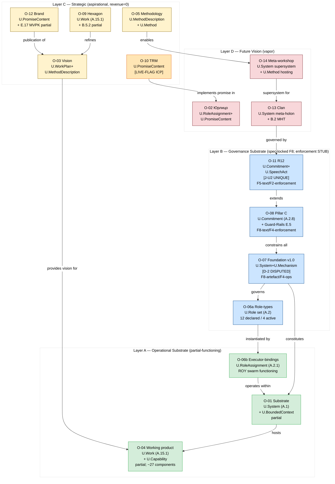

# Diagram 01 — Objects Cluster (FPF primitives + 4 layers)

14 объектов сгруппированы по (1) FPF primitive cluster и (2) management layer (A/B/C/D).
Цвет/форма = layer. Внутри cluster = объекты одного типа.

**Reading key:**
- Green (A) = operational, partial-functioning
- Blue (B) = governance, spec-locked F8 artefact / enforcement STUB
- Yellow (C) = strategic, aspirational (revenue = 0)
- Orange = LIVE-FLAG (ICP inconsistency unresolved)
- Red (D) = future vision, vapor

**[D-2]** O-07 Foundation typing disputed: U.System+U.Mechanism (eng) vs U.Episteme language-state (phil).
**[J-U2]** O-11 R12 = Jetix-unique; no direct FPF analogue confirmed Phase B.
