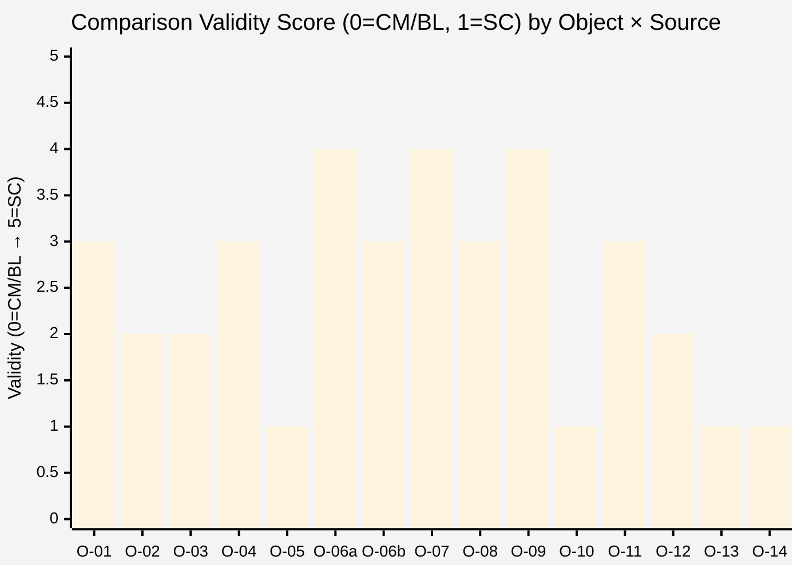

# Diagram 02 — Comparison Matrix Visual (heatmap-style)

Validity legend: SC = structural correspondence / MSL = matching-scope-limited / MG = mechanism-gap / SD = structural-divergence / CM = categorical-mismatch / BL = BLOCKED

```mermaid
%%{init: {'theme':'base', 'themeVariables': {'primaryTextColor':'#000000','textColor':'#000000','lineColor':'#333333','primaryBorderColor':'#333333','primaryColor':'#fafafa','noteTextColor':'#000000','noteBkgColor':'#fff8d5','edgeLabelBackground':'#ffffff'}}}%%
quadrantChart
    title Comparison Validity: Jetix Objects vs L1 Sources
    x-axis "Low comparison validity (vapor/CM)" --> "High comparison validity (SC/MSL)"
    y-axis "Low source access (BLOCKED/B-blocker)" --> "High source access (vendored)"
    quadrant-1 High validity + High access (most tractable)
    quadrant-2 Low validity + High access (CM/SD documented)
    quadrant-3 Low validity + Low access (hypothetical only)
    quadrant-4 High validity + Low access (blocked potential)
    O-07 vs C1 FPF: [0.80, 0.90]
    O-08 vs C1 FPF: [0.75, 0.90]
    O-09 vs C1 FPF: [0.65, 0.90]
    O-04 vs C1 FPF: [0.60, 0.90]
    O-06a vs C1 FPF: [0.70, 0.90]
    O-11 vs C1 FPF: [0.55, 0.90]
    O-01 vs C2 IWE: [0.65, 0.80]
    O-04 vs C2 IWE: [0.55, 0.80]
    O-06a vs C2 IWE: [0.60, 0.80]
    O-08 vs C2 IWE: [0.50, 0.80]
    O-02 vs C1 FPF: [0.30, 0.90]
    O-03 vs C1 FPF: [0.40, 0.90]
    O-05 vs C2 IWE: [0.20, 0.80]
    O-10 vs C1 FPF: [0.25, 0.90]
    O-13 vs C2 IWE: [0.15, 0.80]
    O-07 vs C3 IWE-paid: [0.70, 0.10]
    O-04 vs C4 Levenchuk: [0.45, 0.25]
    O-09 vs C4 Levenchuk: [0.40, 0.25]
```

**Supplementary heatmap table (detailed):**



**Reading notes:**

| Score | Meaning | Flag codes |
|---|---|---|
| 5 SC | Direct structural correspondence | SC |
| 4 MSL | Match within scoped qualification | MSL + SQ |
| 3 MG | Concept present; implementation gap | MG |
| 2 SD | Structurally divergent (different subject-kinds) | SD / CM-partial |
| 1 CM | Categorical mismatch (N/A) or BLOCKED | CM / BL |

**BLOCKED sources (C3 IWE paid, C5 ШСМ):** ALL comparisons hypothetical = score 0 (not shown).

**12 explicit categorical mismatches (CM-01..CM-12):**
CM-01 O-02 × IWE System / CM-02 O-05 × IWE Pack / CM-03 O-06b × Levenchuk / CM-04 O-10 × Levenchuk Method / CM-05 O-13 × IWE System / CM-06 O-07 × FPF Parts (different subject-kinds) / CM-07 O-04 outcome chain not closed / CM-08 O-11 × FPF (unique) / CM-09 O-11 × IWE (unique) / CM-10 O-10 ICP inconsistency / CM-11 Workshop × A.1.1 / CM-12 Jetix F8 vs FPF B.3 F8 (EP-5).

[src: 03-comparison-matrix §4 §5 §12]
