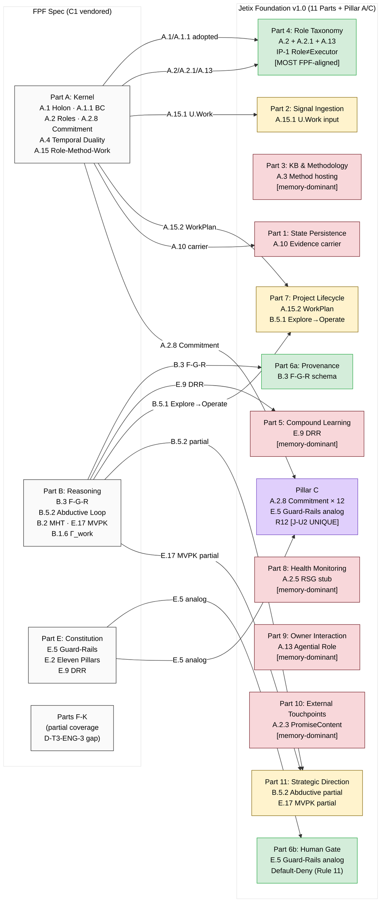

# Diagram 03 — FPF Layers vs Jetix Foundation Mapping

**Critical note (D-2 / CM-06):** Foundation 11 Parts ≠ FPF Parts A-K isomorphism. Different subject-kinds: Jetix = org substrate; FPF = epistemological framework. This diagram maps «which FPF primitives are ADOPTED IN which Foundation Parts» — NOT «Part N = FPF Part N».

**Adoption summary:**

| Foundation Part | FPF primitive | Adoption depth | Note |
|---|---|---|---|
| Part 1 State Persistence | A.10 Evidence carrier concept | memory-dominant | filesystem = A.10 carrier; not U.System |
| Part 2 Signal Ingestion | A.15.1 U.Work input shape | partial | voice pipeline operational |
| Part 3 KB & Methodology | A.3 Method hosting | memory-dominant | distribute.py.bak; manual |
| **Part 4 Role Taxonomy** | **A.2 + A.2.1 + A.13 + IP-1** | **FPF-derivative (most aligned)** | RSG A.2.5 = STUB |
| Part 5 Compound Learning | E.9 DRR | memory-dominant | strategies.md pattern; no cadence enforced |
| **Part 6a Provenance** | **B.3 F-G-R** | **FPF-derivative** | per-artefact; per-claim = inconsistent |
| **Part 6b Human Gate** | **E.5 Guard-Rails analog** | **FPF-derivative** | different domain-application; Rule 11 only machine |
| Part 7 Project Lifecycle | A.15.2 + B.5.1 | partial | WorkPlan shape; Explore→Operate informal |
| Part 8 Health Monitoring | A.2.5 RSG stub | memory-dominant | — |
| Part 9 Owner Interaction | A.13 Agential Role | memory-dominant | daily-log dir absent |
| Part 10 External Touchpoints | A.2.3 PromiseContent | memory-dominant | 0 outreach replies confirmed |
| Part 11 Strategic Direction | B.5.2 partial + E.17 partial | partial | Hexagon = outputs; process informal |
| **Pillar C** | **A.2.8 × 12 + E.5 analog + R12** | **FPF-derivative + extends** | R12 = J-U2 Jetix-unique; no FPF analogue |

Green = FPF-derivative / Yellow = partial / Red = memory-dominant / Purple = extends (unique).

[D-T3-ENG-3: Parts F-K coverage gap — full Spec read may surface more adoption rows]
