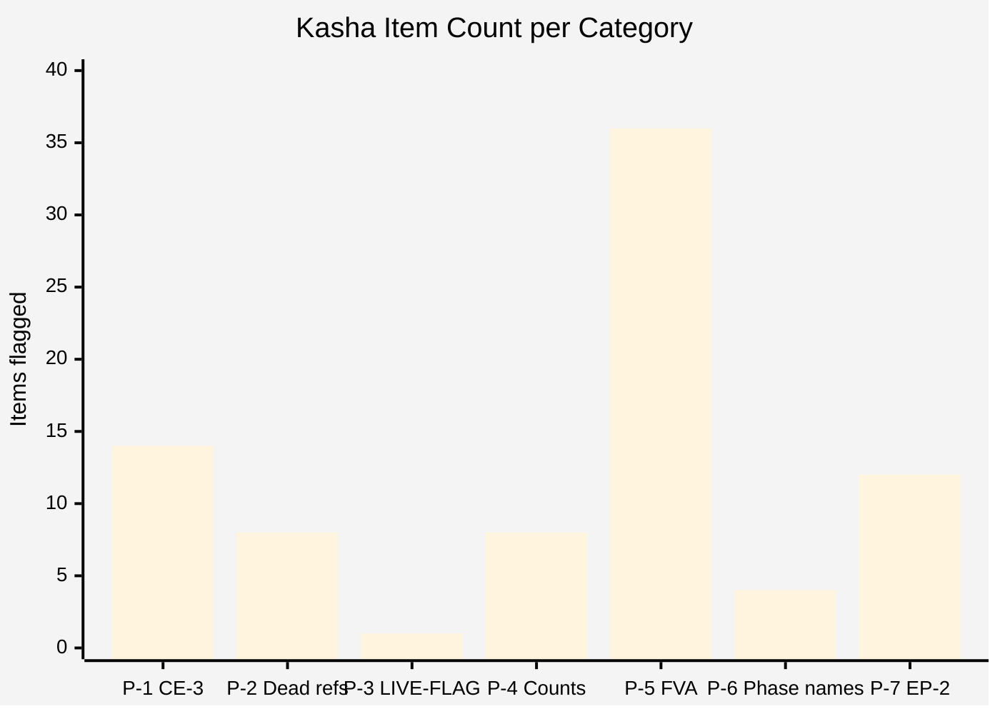

# Diagram 04 — Kasha Heatmap (7 categories × severity)

~80 unique stale items de-duplicated from ~120 flagged across 3 cells.
R1: surface only. Ruslan ack'ает actions.

```mermaid
%%{init: {'theme':'base', 'themeVariables': {'primaryTextColor':'#000000','textColor':'#000000','lineColor':'#333333','primaryBorderColor':'#333333','primaryColor':'#fafafa','noteTextColor':'#000000','noteBkgColor':'#fff8d5','edgeLabelBackground':'#ffffff'}}}%%
quadrantChart
    title Kasha Severity vs Volume (7 categories)
    x-axis "Low volume (few items)" --> "High volume (many items)"
    y-axis "Low severity (cosmetic)" --> "High severity (L1 reader impact)"
    quadrant-1 HIGH severity + HIGH volume (most critical)
    quadrant-2 HIGH severity + LOW volume (targeted fixes)
    quadrant-3 LOW severity + LOW volume (defer)
    quadrant-4 LOW severity + HIGH volume (batch cleanup)
    P-1 LOCKED-as-operational CE-3: [0.85, 0.92]
    P-2 Dead refs design/JETIX-FPF: [0.65, 0.75]
    P-3 LIVE-FLAG ICP fork: [0.15, 0.98]
    P-4 Count inconsistencies: [0.70, 0.55]
    P-5 FVA Status inflation: [0.90, 0.65]
    P-6 Phase namespace collision: [0.45, 0.50]
    P-7 Use-mention EP-2 slips: [0.75, 0.70]
```

**Severity breakdown table:**



**Critical items requiring immediate attention (CR-01..CR-12):**

```mermaid
%%{init: {'theme':'base', 'themeVariables': {'primaryTextColor':'#000000','textColor':'#000000','lineColor':'#333333','primaryBorderColor':'#333333','primaryColor':'#fafafa','noteTextColor':'#000000','noteBkgColor':'#fff8d5','edgeLabelBackground':'#ffffff'}}}%%
flowchart TD
    CR01["CR-01 LIVE-FLAG\nDoc 1B §7 Mittelstand\nvs ACTION-PLAN Online-first\n[CRITICAL for L1 outreach]"]
    CR07["CR-07 EP-5 F-grade\nsemantic drift\n[CRITICAL for L1 audience]"]
    CR02["CR-02 design/JETIX-FPF.md\ndead path (13 Foundation Parts)"]
    CR03["CR-03 AUDIT-CURRENT-STATE\ndead link в CLAUDE.md L73"]
    CR04["CR-04 MASTER-PLAN-BRIEF\ndead link в CLAUDE.md L72"]
    CR05["CR-05 Strategic Council\n7-day window elapsed\n0 confirmed contacts"]
    CR06["CR-06 Tseren+Levenchuk\n24-48h elapsed 7 дней\noutreach NOT sent"]
    CR08["CR-08 «12 agents»\nIP-1 conflict CLAUDE.md"]
    CR09["CR-09 active-projects.json\nstale 33d + 1 vs 8"]
    CR10["CR-10 TRM resource names\nworking file ≠ canonical"]
    CR11["CR-11 Default-Deny count\n3-way: 11/11/12"]
    CR12["CR-12 Hexagon vs Heptagon\n6 vs 7 insights"]

    CR01 --> |"urgent: both в L1 outreach pack"| CR07
    CR02 --> |"systemic: 13 Foundation Parts"| CR03
    CR05 --> |"overdue"| CR06

    classDef critical fill:#f8d7da,stroke:#721c24
    classDef high fill:#fff3cd,stroke:#856404
    classDef medium fill:#d4edda,stroke:#28a745

    class CR01,CR07 critical
    class CR02,CR05,CR06,CR08 high
    class CR03,CR04,CR09,CR10,CR11,CR12 medium
```



**7 kasha category definitions:**

| # | Pattern | Examples | Count | Severity |
|---|---|---|---|---|
| P-1 | CE-3 LOCKED-as-operational conflation | Foundation LOCKED / Pillar C LOCKED / Insights LOCKED | 14+ | HIGH |
| P-2 | Dead refs to archived docs | design/JETIX-FPF.md × 13 Sources; AUDIT-CURRENT-STATE | 8+ | HIGH |
| P-3 | LIVE-FLAG ICP inconsistency | Doc 1B Mittelstand vs ACTION-PLAN Online-first | 1 | CRITICAL |
| P-4 | Count contradictions | 11 vs 23 agents; 10 vs 11 Parts; 11/11/12 Default-Deny | 8 | MEDIUM |
| P-5 | FVA Status inflation (Functioning vs Aspirational) | «8 active projects» / «12 agents» / Halt-Log-Alert STUB | 36 | MEDIUM-HIGH |
| P-6 | Phase namespace collision | Workshop Phase 1/2 vs ACTION-PLAN Phase 1 vs CLAUDE.md Phase 1-4 vs Phase A/B/C | 4 | MEDIUM |
| P-7 | Use-mention EP-2 slips | Workshop / Clan / Meta-workshop / «Foundation operational» | 12 | HIGH |

[src: 04-kasha-cleanup-flags §0 §1 §2]
