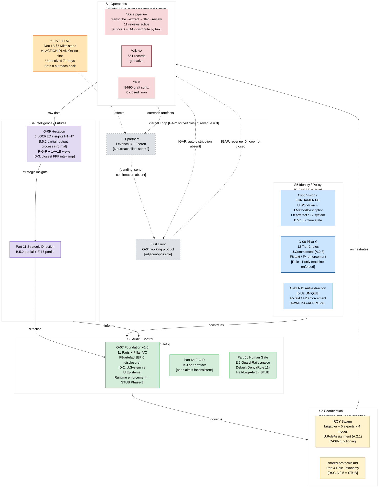
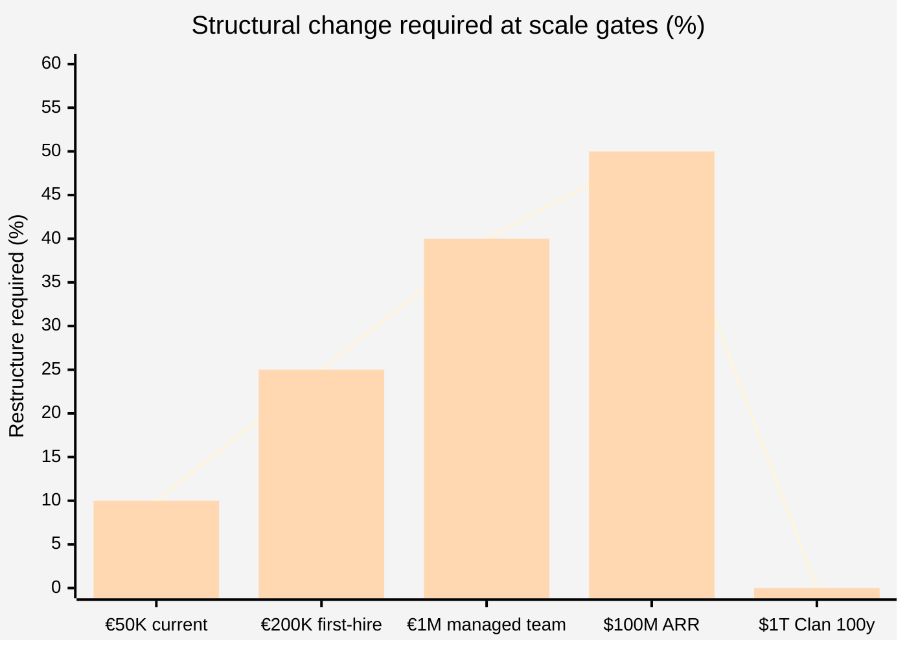

# Diagram 05 — Master TL;DR Architecture (L1-friendly)

Честное представление Jetix для L1 аудитории: что работает, что STUB, что vapor.

**Honest gaps annotated:**

| Gap | Location | Impact | Adjacent-possible? |
|---|---|---|---|
| Auto-KB distribution | S1 (distribute.py.bak archived) | voice loop не closes | YES (one automation step) |
| External loop closure | S1 → Client | revenue = 0; Loop B (internal complexity) dominates | YES (O-04 first client) |
| Halt-Log-Alert | S3 Part 6b | F8/F4/F2 violations not halted within SLA | Phase B stub |
| RoleStateGraph A.2.5 | S2 Part 4 | brigadier sees 2 states per role at 10× dispatch | Phase B stub |
| NQD-CAL in Hexagon | S4 | echo chamber risk at 10× decisions | YES (one process step) |
| LIVE-FLAG ICP | S3/outreach | contradiction reaches L1 partners today | Ruslan decision |
| Runtime enforcement 11/12 Pillar C rules | S5 | S5 richness = spec-only without S3 blocking | Phase B materialization |

**VSM verdict:** S5/S3 richest; S1 weakest = inversion. Pre-operations = hazard. Post-operations (first client) = advantage. [src: 03-comparison-matrix §6 F-6 D-SYS-NEW-1]

**Scalability at 10× (fragile threshold):**

30% = antifragility threshold. Gates €1M and $100M both above threshold = FRAGILE. [src: 03-comparison-matrix §7 F-7]

**5 adjacent-possible activations (one step each):**
- O-01 auto-KB: close voice→wiki loop
- O-04 first client: highest variety impact, closes ALL loops
- O-09 NQD-CAL: add alternatives portfolio to Hexagon
- O-10 ICP fix: resolve Doc 1B vs ACTION-PLAN contradiction
- O-11 R12 ack: AWAITING-APPROVAL packet resolution

[src: 03-comparison-matrix §7 F-8 + SYS-OQ-1]
