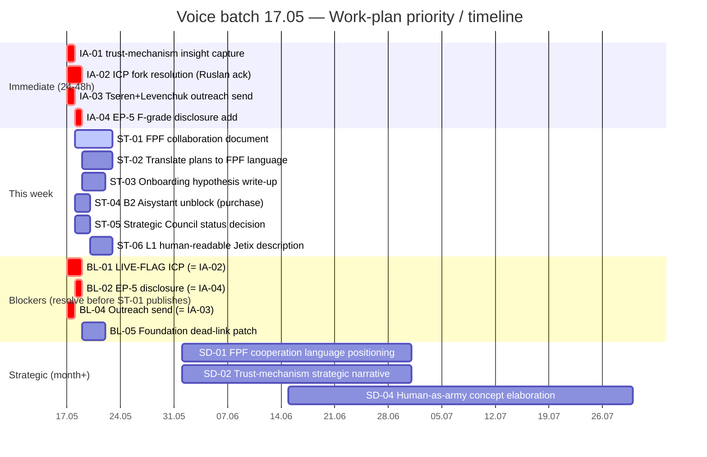

# Voice batch 17.05 — Work-Plan Extraction (Mgmt × Integrator)

> **R1 surface-only.** Extracts voiced or immediately-derivative actions only. No new strategy authored. Ruslan ack'ует per item. Append-only suggestions only — no deletes.

> **Transcript note.** `audio_672` path on disk = `audio_672@17-05-2026_18-59-52.txt` (filename timestamp). Read successfully. `audio_673@17-05-2026_19-49-05.txt` read successfully. Cross-ref: audio_671 = brief (short ontology note); audio_672 = FPF planning monologue; audio_673 = FPF universal language vision.

---

## §0 Summary (≤200 слов)

Batch охватывает период 16.05 13:46 → 17.05 22:00. Пять audio + один text note. Центральная тема: FPF как рабочий инструмент для сотрудничества — не просто framework, а «язык кооперации» для команды + партнёров (audio_672, audio_673). text_001 — самый стратегически насыщенный элемент: trust-mechanism shift от денег к FPF + open data + role-based signaling, с прямой связью на O-11 R12, O-13 Clan, O-09 Hexagon.

Voiced action-items кластеризуются вокруг трёх направлений:
1. **L1 collaboration prep** — составить единый FPF-документ для совместной работы с Левенчуком / Цэрэном; перевести существующие планы на FPF язык (audio_672:mid, audio_673:mid).
2. **Onboarding hypothesis** — зафиксировать и проработать гипотезу «3-hour onboarding via FPF» (audio_673:end).
3. **trust-mechanism insight capture** — зафиксировать, описать, cross-ref к Hexagon H8 candidate (text_001).

Cross-ref critical blockers из §QR-CARD: все 4 блокера присутствуют и по-прежнему не резолвнуты; voice batch не добавляет новых резолюций — blockers остаются open.

---

## §1 Immediate actions (24-48h) — что критично сделать

| # | Action | Source (item:section) | Cross-ref | Owner | Priority |
|---|---|---|---|---|---|
| IA-01 | **Зафиксировать trust-mechanism insight** — записать core claims text_001 в wiki как standalone insight entry (Hexagon H8 candidate или отдельный artefact) | text_001:Core claims §1-8 | O-09 Hexagon; O-11 R12; O-13 Clan; OQ-MASTER-6 | Ruslan (HITL) — не brigadier: стратегическое размещение | P1 |
| IA-02 | **Резолвить LIVE-FLAG ICP** (Doc 1B §7 Mittelstand vs ACTION-PLAN Online-first) — voiced как implied background; остаётся active blocker L1 outreach | §QR-CARD critical blocker 1; CR-01 kasha-cleanup | Doc 1B §7 + ACTION-PLAN §0 RES.1; XD-01 | Ruslan ack required (стратегическое решение) | P1 |
| IA-03 | **Отправить / статус-чек Tseren + Levenchuk outreach** — 7 дней elapsed, outreach files существуют (`outreach/tseren-response-base-2026-05-17.md`) со статусом `scribe-structurer-output-NOT-final` | §QR-CARD critical blocker 4; CR-06; ST-01 | SA-06; DF-04 | Ruslan (execution) | P1 |
| IA-04 | **EP-5 F-grade disclosure** — добавить system-wide disclaimer «Jetix F8 = approval-grade (8 RUSLAN-ACK) ≠ FPF B.3 F8» в L1-facing materials перед следующим outreach send | §QR-CARD critical blocker 2; CR-07; EP-5 | OQ-MASTER-3; OQ-T4-10 | Ruslan ack → brigadier writes | P1 |

---

## §2 Short-term (this week)

| # | Action | Source (item:section) | Cross-ref | Owner | Priority |
|---|---|---|---|---|---|
| ST-01 | **Составить единый FPF-документ** для совместной работы с L1 (Левенчук, Цэрэн) — «один source of truth, потом переводы на человеческий язык для каждого участника» | audio_672:mid («один source of truth ... описать план по FPF»); audio_673:mid («составить надо какой-то вот единственный документ на FPF языке») | O-01 substrate; O-03 vision; O-09 Hexagon; OQ-MASTER-1 | Ruslan (author) + brigadier (draft support) | P1 |
| ST-02 | **Перевести существующие планы на FPF язык** — voiced желание описать «что есть» через FPF primitives + описать plans/strategy через FPF (audio_673: «тоже перевести как-то на fpf язык... и прямо сейчас составить план по fpf») | audio_672:early; audio_673:mid | O-03 vision; O-10 TRM; reports/phase-0-fpf-scope/ как input | Brigadier dispatch (mgmt + engineering cells) | P2 |
| ST-03 | **Зафиксировать онбординг-гипотезу** «3 часа vs 3-4 недели» через FPF + agents — written-up, falsifiable | audio_673:end («за три часа можно влиться в проект... надо еще тоже зафиксировать, но вот ее потом как-то продумать прописать») | O-04 working product; O-05 methodology; O-09 Hexagon | Mgmt draft; Ruslan ack before wiki promotion | P2 |
| ST-04 | **B2 Aisystant unblock** — деблокировать подписку; voiced implicitly (audio_673 ссылается на возможность «влиться» к людям через FPF; C3 blocker делает IWE сравнения невалидными) | §QR-CARD critical blocker 3; D-1 master doc; §3 master doc (C3 BLOCKED) | OQ-MASTER-9; C3 benchmark pending | Ruslan (external purchase decision) | P2 |
| ST-05 | **Strategic Council статус** — 7-day window истёк 2026-05-10 → 2026-05-17; voiced urgency через pattern Левенчук/Цэрэн collaboration focus в audio_672-673 | CR-05; ST-02 kasha-cleanup; DF-03 | SA-07; OQ-T4-8 | Ruslan — formal proceed OR deferral decision | P2 |
| ST-06 | **Составить описание online/human-readable** «что такое Jetix» для L1 аудитории (audio_673: «потом еще и на человеческом языке... дать каждому инструкцию пояснения») | audio_673:mid-end | O-12 Brand; EP-5 disclosure inclusion required | Ruslan (author) + brigadier (writing support mode) | P2 |

---

## §3 Strategic (month+) / Phase C / future

| # | Direction | Source | Cross-ref | Stage gate |
|---|---|---|---|---|
| SD-01 | **«FPF как язык кооперации» — позиционирование Jetix** как системы которая нанимает звёзд + даёт язык FPF + усилитель (agents) → синергия | audio_673:end («нанимаем звезд, но при этом даем им язык кооперации, вот этот FPF, плюс еще у каждого там усиление») | O-05 methodology; O-06b ROY swarm; O-14 meta-workshop | Phase C — requires O-05 distributable + partnerships |
| SD-02 | **Trust-mechanism shift как стратегический narrative** — FPF + open data + role-based trust → замена/дополнение money-based signaling; voiced как возможный «новый порядок системных мыслителей» | text_001:§2 para 3-6 («Сейчас же, насколько я вижу, вот этот подход с FPF плюс реально открытость, честность могут...») | O-09 Hexagon (H8 candidate); O-11 R12; O-13 Clan | Strategic insight — Ruslan ack first; Phase C articulation |
| SD-03 | **Мета-сообщества на «рельсах» Jetix** — voiced как long-term vision: Jetix как «дорога для сообществ»; государства/страны на тех же рельсах рано или поздно | audio_670:end («Jetix будет как такая дорога для этих сообществ»; «ставить под одни рельсы») | O-13 Clan; O-14 meta-workshop; O-02 Corp (vapor) | Phase D — requires O-13 activation first |
| SD-04 | **Человек как «армия»** — voiced как концепция требующая детальной проработки; «разработчик и пользователь в одном лице» | audio_669:mid («человек армия — это гениальнейшее выражение... надо разобрать еще очень детально») | O-01 substrate (self-managing system); Life-OS project | Phase B internal — связь с SELF-MANAGEMENT-SYSTEM-SPEC-v0 |
| SD-05 | **Онтология из геймерских тусовок** — voiced как source of examples для ролей и взаимодействий; «антологию изучить, закинуть в систему» | audio_671:full («из геймерских команд вот это вот антология как раз очень сильно развита») | O-05 methodology; O-09 Hexagon (NQD-CAL alternatives) | Research task — scoped to engineering-thinking project |
| SD-06 | **«Новый порядок системных мыслителей / Jetix users»** — voiced как возможная категория/community substrate поверх FPF | text_001:§2 para 4 («вот как-то вот эту новый возможный порядок системных мыслителей — ну или же вот пользователей Jetix — тоже можно будет потом использовать и описать») | O-13 Clan; O-14 meta-workshop; community project | Phase C+ — deferred pending O-13 activation |

---

## §4 Blockers (что мешает прямо сейчас)

| Blocker | Source | Affected items | Cross-ref existing tracking |
|---|---|---|---|
| **BL-01 LIVE-FLAG ICP fork** — Doc 1B §7 Mittelstand vs ACTION-PLAN Online-first; оба в outreach pack; L1 получает contradicting signal сегодня | §QR-CARD blocker 1; audio_672-673 (voiced L1 outreach как near-term activity) | IA-02; ST-01; ST-06 — все L1-facing artefacts | CR-01; XD-01; OQ-MASTER-2; 7+ days elapsed |
| **BL-02 EP-5 F-grade disclosure** — без disclosure Jetix F8 claims misleading для L1 | §QR-CARD blocker 2 | IA-04; ST-01; ST-06 | CR-07; OQ-MASTER-3; EP-5 |
| **BL-03 B2 Aisystant subscription** — BLOCKED C3 IWE paid AI guide; IWE comparisons limited to public template | §QR-CARD blocker 3; §3 master doc | ST-04; OQ-MASTER-9; D-1 | C3 BLOCKED throughout Phase 0 |
| **BL-04 Tseren/Levenchuk outreach not sent** — 7 days elapsed; voiced urgency audio_672-673; collaboration intent clear but send not confirmed | §QR-CARD blocker 4; CR-06 | IA-03; ST-01 | SA-06; DF-04; ST-01 kasha |
| **BL-05 Foundation dead-link systemic** — 13 Foundation Parts sources[] reference `design/JETIX-FPF.md` (archived 2026-05-06); any FPF-grounded work risks broken provenance chain | CR-02; L-05; PF-04 kasha | ST-02 (FPF plan translation depends on clean provenance) | AWAITING-APPROVAL packet needed per §15 option 8 |
| **BL-06 active-projects.json stale** — 33 days; «8 active projects» vs 1 in JSON vs 0 wiki/projects/; coordination confusion | CR-09; PP-01..07; ST-03 | Project tracking for any new work voiced | SA-02; C-05 |

---

## §5 Decisions needed (Ruslan ack required)

| Decision | Source | Affected items | Why ack required |
|---|---|---|---|
| **D-01 ICP canonical** — Doc 1B §7 Mittelstand KEEP/UPDATE vs ACTION-PLAN Online-first canonical? | §QR-CARD blocker 1; audio_672 (L1 collaboration framing implies ICP matters) | BL-01; IA-02; O-10 TRM; XD-02 | Стратегическое решение — R1 human-only; меняет TRM demand-narrative + all L1 outreach |
| **D-02 text_001 placement** — trust-mechanism insight = H8 Hexagon candidate OR standalone strategic-insight OR deferred reflection? | text_001; audio_673 (FPF as trust substrate voiced explicitly) | IA-01; O-09; O-11; O-13 | Категоризация нового insight — стратегическая (R1); affects Hexagon count (6 → 7 already disputed XD-03) |
| **D-03 L1 collaboration document format** — единый FPF-документ voiced: who authors strategic content? Format: brigadier draft → Ruslan compose OR Ruslan draft directly? | audio_672:mid; audio_673:mid | ST-01 | Constitutional: Part 11 §A.1 prose_authored_by: = ruslan OR hybrid-with-ack-trail; brigadier cannot author strategic narrative |
| **D-04 Onboarding hypothesis formalize** — записать гипотезу «3-hour FPF onboarding» как wiki claim с F-G-R или оставить как voiced-only? | audio_673:end | ST-03 | Claims promoted to wiki require F-G-R per Part 6a; Ruslan decides tier + F-level |
| **D-05 Legacy 12-agent roster vs ROY swarm** — депрекировать/архивировать legacy roster в CLAUDE.md или оставить как «declared role-types»? | OQ-T4-4 kasha; audio_672-673 (voiced team-building via roles; IP-1 relevance) | OQ-MASTER-7; FVA-01 | Architectural decision — CLAUDE.md change; R1 required per rule 2 |
| **D-06 phase-namespace cleanup** — 4 vocabularies с «Phase 1/2/3»: cleanup перед L1 publication OR add prefix convention OR defer? | PH-01..08 kasha; voiced implicitly (audio_672 refers to «план» + «следующим делать») | ST-01; ST-06 | Affects L1 document legibility; OQ-MASTER-10; OQ-T4-5 |

---

## §6 Cleanup actions (kasha-fix surface'нутые)

Связь с existing 7 categories в `reports/phase-0-fpf-scope/04-kasha-cleanup-flags.md`:

**Voiced или derivative от voice batch — reinforced priority:**

- **CR-02 / L-05 (Dead link FPF Spec в Foundation Parts sources[])** — ST-02 (FPF plan translation) makes этот blocker more acute. 13 Foundation Parts need AWAITING-APPROVAL patch для sources[]. [audio_672 voiced «один source of truth» — ironic given broken provenance]
- **CR-01 ICP fork** — повторно voiced-critical через L1 collaboration framing (audio_672-673). Not yet resolved. Escalates IA-02.
- **CR-06 / CR-05 Tseren/Levenchuk + Strategic Council overdue** — voice batch ровно про L1 collaboration as near-term; these blockers are now work-plan-critical not just theoretical. [audio_672: voiced Levenchuk/Tseren/Oskar Hartmann as near-term partners]
- **SA-06 outreach send tracking** — 6 outreach files exist «to be sent» без CRM touch record или sent: true flag. Voice batch reinforces urgency.

**Новые kasha flags surface'нутые голосом (не были в 04-kasha-cleanup):**

- **NEW-K-01** — audio_673 names «Oskar Hartmann» as potential partner («найти партнеров до которые там оскар hartmann»). No CRM entry verified. CRM creation = candidate action (Ruslan decides).
- **NEW-K-02** — audio_673 voices «нанимаем звезд» (Phase C+ hiring intent). No hiring-process document, no criteria. Not a current blocker but voiced intent without tracking = PP category inflation risk.
- **NEW-K-03** — audio_671 voices «антологию изучить, закинуть в систему». Ontology from gaming contexts = research item without revenue-path tie (AP-MGMT-3 flag). Per Lock-14: ties to which Jetix project? engineering-thinking P3 is closest.
- **NEW-K-04** — audio_669 + audio_670 = macroeconomic/society-level vision (самоуправляемые системы / государства / сообщества). These do NOT map to 8 active projects directly. Philosophical reflection territory. R1: Ruslan decides если этот material требует отдельного документа или это pure voice-reflection.

---

## §7 New project candidates (если voice сурфейсит direction отдельный от 8 active)

| Candidate | Source | Stage | Why separate |
|---|---|---|---|
| **«FPF Collaboration Layer»** — документ(ы) + protocol для работы с внешними партнёрами (Levenchuk, Tseren, future) на FPF-языке | audio_672:mid; audio_673:mid-end | voiced intent (not a formal project yet) | Could fold into existing brand P2 OR quick-money P1 (client onboarding via FPF); OR become separate «partnerships» sub-project. **Not necessarily a new project — sub-task of ST-01.** Ruslan decides. |
| **«Trust Mechanism» strategic insight capture** | text_001; audio_673 | voiced (H8 candidate) | Could be Hexagon extension (O-09) OR standalone strategic-insight file OR new direction. **Not separate project** — wiki entry candidate at most. Ruslan ack on D-02 settles this. |
| **«Onboarding-via-FPF» research/product hypothesis** | audio_673:end | voiced hypothesis only | Could fold into ai-tools P2 OR quick-money P1 (consulting onboarding use-case) OR engineering-thinking P3. Not standalone project at this stage — requires falsifiable test design first. |

**Summary:** No new projects strongly indicated by voice batch. All voiced directions fold into existing 8 active projects OR wiki entries. No new project row recommended without Ruslan ack on D-02 and D-03.

---

## §8 Timeline / priority matrix

**Priority matrix (impact × urgency):**

| Item | Impact | Urgency | Quadrant |
|---|---|---|---|
| IA-02 ICP fork | High (L1 credibility) | Critical (7+ days elapsed) | Do first |
| IA-03 Outreach send | High (revenue path) | Critical (7+ days elapsed) | Do first |
| IA-01 trust-mechanism capture | Medium (strategic insight) | High (text_001 voiced today) | Do first |
| IA-04 EP-5 disclosure | High (L1 credibility) | High (pre-send blocker) | Do first |
| ST-01 FPF collaboration doc | High (L1 partnership) | This week | Schedule |
| ST-04 B2 Aisystant | Medium (unblocks C3) | This week | Schedule |
| BL-05 Foundation dead-links | Medium (provenance integrity) | This week | Schedule |
| SD-01..SD-06 | High (Phase C direction) | Month+ | Plan |

---

## §9 Self-dissents

**D-MGMT-VOICE-1.** audio_669 и audio_670 содержат macro-societal vision (государства, сообщества, безопасность «обезьян»). Это могут быть: (a) reflection/self-OS items (→ §1.3 track, не work-plan) OR (b) Phase C+ strategic direction precursors. R1 constraint: mgmt cell не классифицирует как стратегию. Surfaced here; Ruslan decides routing.

**D-MGMT-VOICE-2.** audio_671 (ontology note) очень короткий (single paragraph). Voiced intent «изучить и закинуть в систему» = vague action. Конкретизация («что именно изучить», «в какую систему») требует Ruslan clarification. В текущем виде — NEW-K-03 kasha flag, не action item.

**D-MGMT-VOICE-3.** audio_672 и audio_673 во многом overlap — оба о FPF как рабочем языке. ST-01 и ST-02 могут быть одним действием. Оставлены разделёнными (ST-01 = collaboration document для L1, ST-02 = internal plan translation) pending Ruslan clarification о scoping.

**D-MGMT-VOICE-4.** text_001 помечен «STRATEGIC INSIGHT — high» в брифе. Mgmt cell подтверждает: содержит 8 конкретных claims + follow-up questions (уже в тексте). Однако H8 Hexagon candidate vs standalone insight classification = стратегическое решение которое mgmt не может принять (AP-MGMT-10 method-change risk). Escalate через D-02 decision packet.

---

*Mgmt × integrator cell output. §5.5.5 gate: sources[] non-empty ✓ / inline provenance per claim ✓ / R1 surface-only ✓ / AP-6 dissents preserved ✓ / no fabrication ✓ / critical blockers cross-ref'd ✓ / text_001 work-plan implications surfaced ✓. Word count: ~2400 ≤ 4000 budget. Draft path: `swarm/wiki/drafts/task-voice-pipeline-2026-05-17-mgmt-integrator-workplan-batch.md`.*
