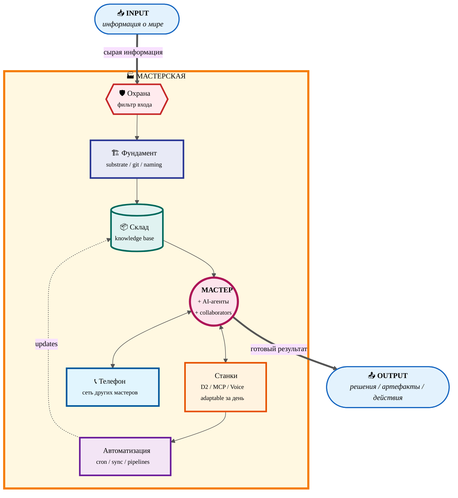

# 🏭 Мастерская — 7 базовых элементов

> Скелет любой мастерской. Каждый мастер обвешивает скелет своими специфическими станками и процессами.
> Главный принцип — **всё, с чем работаем, это информация**.

---

## 📖 7 элементов — что каждый делает

| # | Элемент | Функция в системе |
|---|---------|-------------------|
| 1 | 🏗 **Фундамент** | substrate — где живут данные, единый язык (даты / naming / тэги). Без него мастерская развалится за неделю |
| 2 | 🛡️ **Охрана** | фильтр на входе — спам, низкокачественные источники, отвлечения отсекаются |
| 3 | 📦 **Склад** | сырьё (источники) + полуфабрикаты (drafts) + готовые изделия. Структурированный, найти за секунды |
| 4 | 🔧 **Станки** | adaptable инструменты под конкретные операции. Главное свойство — добавляются за день, удаляются без боли |
| 5 | 👤 **Мастера** | владелец + AI-агенты + human collaborators. Многостаночник по ролям |
| 6 | 🤖 **Автоматизация** | sync pipelines / cron jobs / scheduled reviews. Мастер занимается мастерством, рутина платится минимально |
| 7 | 📞 **Телефон** | связь с другими мастерами. Не строй с нуля — запроси у того, у кого уже есть |

---

## 🔗 Source

- [decisions/BASE-MANAGEMENT-SYSTEM-2026-05-04.md §1.3](../../../../decisions/BASE-MANAGEMENT-SYSTEM-2026-05-04.md) — Документ 1A LOCKED v1.0
- [decisions/JETIX-WORKSHOP-CONCEPT-2026-04-30.md §3](../../../../decisions/JETIX-WORKSHOP-CONCEPT-2026-04-30.md) — Workshop concept LOCKED canonical
