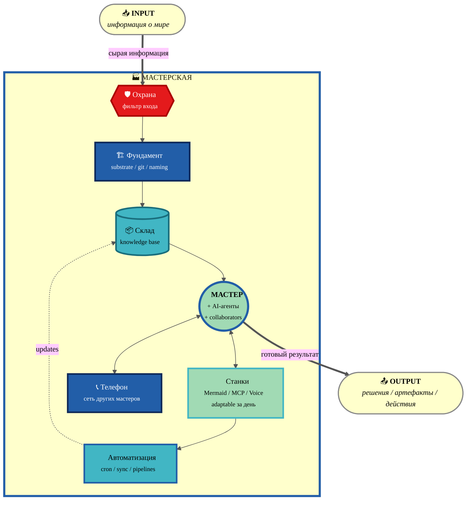

# 🏭 Variant A — Cool Blues (YlGnBu sequential)

> Палитра ColorBrewer YlGnBu — sequential от светло-жёлтого до тёмно-синего.
> Глубина = "глубже элемент → темнее цвет". Foundation самый темный (как фундамент дома), Cloud INPUT/OUTPUT самые светлые.

---

## Цветовая семантика Variant A

| Элемент | Цвет | Значение |
|---|---|---|
| INPUT / OUTPUT | `#ffffcc` светло-жёлтый | граница системы, самый "лёгкий" слой |
| GUARD | `#e41a1c` red | accent — фильтр опасности (как roads на ColorBrewer maps) |
| FOUNDATION | `#225ea8` deep blue | глубочайший слой — substrate |
| STORAGE | `#41b6c4` turquoise | средняя глубина — knowledge layer |
| MASTER | `#a1dab4` light green | live центр — действующее лицо |
| TOOLS | `#a1dab4` light green (lighter stroke) | extension мастера |
| AUTO | `#41b6c4` turquoise | автоматический pipeline |
| PHONE | `#225ea8` deep blue | внешняя сеть, deep как foundation |

**Vibe:** профессиональный / спокойный / "data viz" / cool tones / good for B2B Mittelstand.
