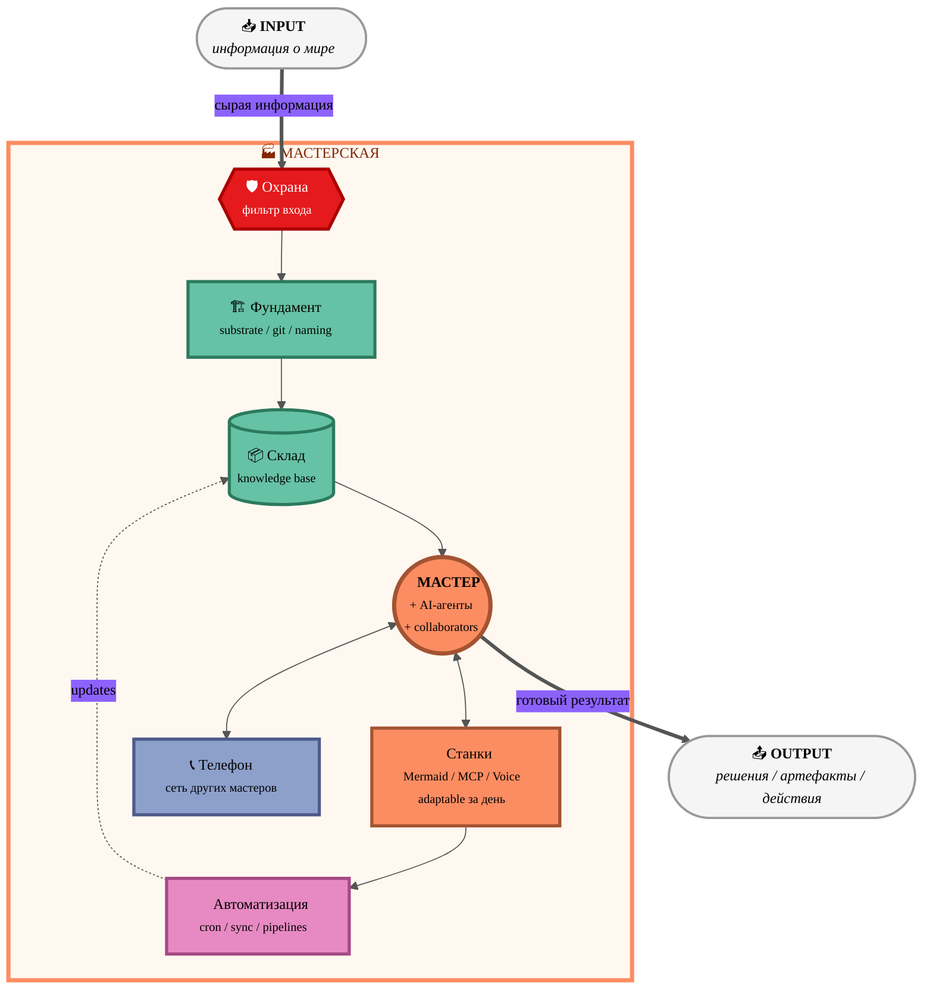

# 🏭 Variant B — Pastel Warm (Set2 qualitative)

> Палитра ColorBrewer Set2 — 4 distinct pastel category colors.
> Каждая функциональная группа имеет свой цвет: Substrate = green, Work = orange, Network = blue-lavender, Automation = pink.

---

## Цветовая семантика Variant B

| Элемент | Цвет | Значение |
|---|---|---|
| INPUT / OUTPUT | `#f5f5f5` light grey | нейтральная граница системы |
| GUARD | `#e41a1c` red | accent — фильтр опасности (как roads на ColorBrewer maps) |
| FOUNDATION + STORAGE | `#66c2a5` green | базовый слой — substrate + knowledge |
| MASTER + TOOLS | `#fc8d62` orange | центр работы — live actor + extensions |
| AUTO | `#e78ac3` pink | автоматизация — non-human pipelines |
| PHONE | `#8da0cb` blue-lavender | внешняя сеть |

**Vibe:** тёплый / friendly / pastel / "people-first" / good for founder pitch / human storytelling.
