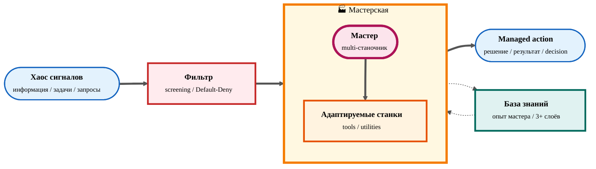

# 🔄 Test Flow — информационный поток Базовой Системы Управления

> **Хаос на входе → managed action на выходе.** Между ними: фильтр, мастерская (мастер + адаптируемые станки), накапливаемая база знаний.

---

## 📖 Описание элементов

| # | Element | Function | Anchor в источнике |
|---|---------|----------|--------------------|
| 1 | **Хаос сигналов** | Поток сырой информации, задач, запросов — то, что обычно вызывает overload | 1B §1 (проблематика) |
| 2 | **Фильтр** | Screening на релевантность; Default-Deny для всего uncategorized | 1B §1.13 + §3.2 (управление вниманием) |
| 3 | **Мастер** | Владелец-многостаночник: один человек, перемещающийся между станками | 1B §2.5 |
| 4 | **Адаптируемые станки** | Tools и утилиты, настраиваемые под конкретного мастера; ключевое свойство — adaptability, не готовый дом | 1B §2.4 + §2.6 |
| 5 | **База знаний** | Слой накопления "опыта мастера" — feedback loop с мастерской | 1B §3.5 |
| 6 | **Managed action** | Outputs системы: осмысленные решения и результаты, не reactive шум | 1B §3 (принципы intgrate) |

**Direction of edges:**
- `==>` (thick) — primary information flow: chaos → filter → workshop → action
- `-.->` (dashed bidirectional) — knowledge feedback: workshop пишет в KB; KB питает workshop next iteration

---

## 🔗 Source

- [`decisions/BASE-MANAGEMENT-SYSTEM-2026-05-04.md`](../../../decisions/BASE-MANAGEMENT-SYSTEM-2026-05-04.md) — Базовая Система Управления (1B), концептуальный документ. §1 проблематика → §2 мастерская → §3 принципы → §3.5 knowledge accumulation.

---

## 📝 Notes

- **Status:** draft (для review с Ruslan)
- **Render verify:** GitHub UI + Notion subpage перед finalize
- **Style guide:** [`mermaid-style-guide-2026-05-07.md`](../../operations/mermaid-style-guide-2026-05-07.md) — palette §1.1, init §4, naming §5, validation §9
- **Artifact slot:** 99 (out-of-sequence) — не путать с планируемыми #2 TRM / #3 L0-L5 / #4 Collaboration. Этот файл — verification of `/mermaid-create` skill, не часть видео-палитры для Цэрэна. Можно удалить после verification ack.
