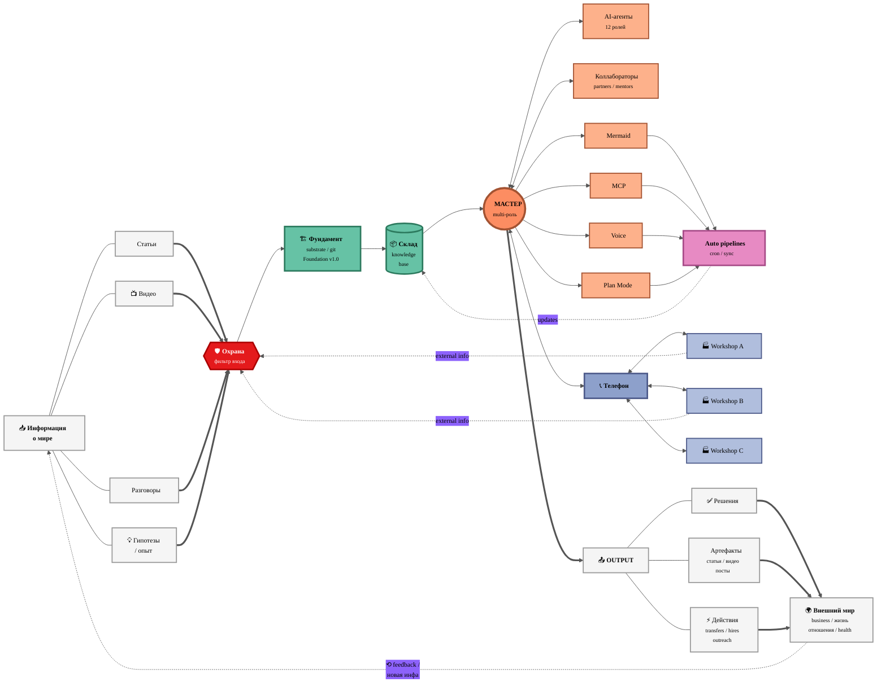

# 🏭 Workshop Information Flow — v1 Detailed

> **Версия 1 — Detailed.** Все nodes explicit, full LR layout, максимум detail.
> INPUT источники — каждый отдельной нодой. People / Tools — отдельные ноды.
> Network sidecar + feedback loop bottom.

---

## v1 — что показывает

- **Полный flow:** info sources (4 типа) → GUARD → Substrate → People + Tools + Auto → Output (3 типа) → World
- **Network sidecar:** Phone + 3 Other workshops, info from external workshops back through GUARD
- **Feedback loop:** World → новая инфа → INFO (closing circle)
- **Subgraph не используется** — все nodes на одном уровне

**Pros:** видно всё что в системе. Полная картина.
**Cons:** density — много nodes, может перегружать. Layout LR может вытянуться wide.
