# 🏭 Workshop Information Flow — v2 Clustered

> **Версия 2 — Clustered.** Тот же flow что v1, но nodes grouped в **visual subgraph boxes**:
> Information Sources / Substrate / People / Tools / Automation / Network / Output / World.
> Cleaner visual, easier scan.

```mermaid
%%{init: {'theme':'base', 'themeVariables': {'primaryColor':'#fc8d62', 'primaryTextColor':'#000', 'primaryBorderColor':'#a35332', 'lineColor':'#555', 'fontFamily':'Inter, system-ui, sans-serif', 'fontSize':'13px'}}}%%
flowchart LR

    %% ═══ INPUT cluster ═══
    subgraph SOURCES ["📥 Информация о мире"]
        ARTICLES["📰 Статьи"]:::cloud
        VIDEOS["📺 Видео"]:::cloud
        TALKS["💬 Разговоры"]:::cloud
        HYPO["💡 Гипотезы / опыт"]:::cloud
    end

    %% ═══ GUARD ═══
    GUARD{{"🛡️ <b>Охрана</b><br/><small>фильтр входа</small>"}}:::guard

    SOURCES ==> GUARD

    %% ═══ Workshop core ═══
    subgraph WORKSHOP ["🏭 МАСТЕРСКАЯ"]
        direction LR

        subgraph SUBSTRATE ["Substrate"]
            FOUNDATION["🏗 Фундамент"]:::foundation
            STORAGE[("📦 Склад")]:::foundation
        end

        subgraph PEOPLE ["People"]
            MASTER(("👤 <b>МАСТЕР</b>")):::master
            AGENTS["🤖 AI-агенты"]:::agent
            COLLAB["👥 Коллабораторы"]:::agent
        end

        subgraph TOOLS_BOX ["🔧 Tools (станки)"]
            T_MERMAID["Mermaid"]:::tools
            T_MCP["MCP"]:::tools
            T_VOICE["Voice"]:::tools
            T_PLAN["Plan Mode"]:::tools
        end

        AUTO["🤖 Auto pipelines<br/><small>cron / sync</small>"]:::auto

        FOUNDATION --> STORAGE
        STORAGE --> MASTER
        MASTER <--> AGENTS
        MASTER <--> COLLAB
        MASTER --> TOOLS_BOX
        TOOLS_BOX --> AUTO
        AUTO -.->|updates| STORAGE
    end

    GUARD --> FOUNDATION

    %% ═══ Network sidecar ═══
    subgraph NETWORK ["📞 Network"]
        PHONE["📞 Телефон"]:::phone
        OW1["🏭 Workshop A"]:::other_workshop
        OW2["🏭 Workshop B"]:::other_workshop
        OW3["🏭 Workshop C"]:::other_workshop
        PHONE <--> OW1
        PHONE <--> OW2
        PHONE <--> OW3
    end

    MASTER <--> PHONE
    NETWORK -.->|external info| GUARD

    %% ═══ Output ═══
    subgraph OUTPUT ["📤 OUTPUT"]
        O_DECISIONS["✅ Решения"]:::cloud
        O_ARTIFACTS["📄 Артефакты<br/>(статьи / видео)"]:::cloud
        O_ACTIONS["⚡ Действия"]:::cloud
    end

    MASTER ==> OUTPUT

    %% ═══ External world ═══
    WORLD["🌍 <b>Внешний мир / жизнь</b><br/><small>business / отношения<br/>health / финансы</small>"]:::cloud

    OUTPUT ==> WORLD

    %% ═══ Feedback ═══
    WORLD -.->|"⟲ feedback / новая инфа"| SOURCES

    %% ═══ Style ═══
    classDef cloud fill:#f5f5f5,stroke:#999,stroke-width:2px,color:#000
    classDef guard fill:#e41a1c,stroke:#a00,stroke-width:3px,color:#fff
    classDef foundation fill:#66c2a5,stroke:#2c7a5e,stroke-width:3px,color:#000
    classDef master fill:#fc8d62,stroke:#a35332,stroke-width:4px,color:#000
    classDef agent fill:#fdb18b,stroke:#a35332,stroke-width:2px,color:#000
    classDef tools fill:#fdb18b,stroke:#a35332,stroke-width:2px,color:#000
    classDef auto fill:#e78ac3,stroke:#a64a87,stroke-width:3px,color:#000
    classDef phone fill:#8da0cb,stroke:#4d5a8a,stroke-width:3px,color:#000
    classDef other_workshop fill:#b0bedd,stroke:#4d5a8a,stroke-width:2px,color:#000
```

---

## v2 — что показывает

- **Same logic как v1**, но visual structure через subgraphs:
  - SOURCES (input cluster)
  - WORKSHOP container
    - SUBSTRATE (Foundation+Storage)
    - PEOPLE (Master+Agents+Collab)
    - TOOLS (multi stations)
    - AUTO (separate)
  - NETWORK (Phone + Other workshops)
  - OUTPUT (Decisions + Artifacts + Actions)
- Каждый cluster имеет visual border → easier mental grouping
- Feedback loop из WORLD к SOURCES bottom

**Pros:** clean visual, легко scan на 2-3 секунды, понятная иерархия.
**Cons:** subgraph rendering в Mermaid может быть quirky на больших диаграммах (rare overlap).
