# 🏭 Workshop Information Flow — v3 Circular (Closed Loop)

> **Версия 3 — Circular.** Главный акцент — **замкнутый цикл**.
> Workshop работает не как линейный pipeline, а как **circulation system** —
> мир → мастерская → действия → мир → новая инфа → мастерская.
> Feedback loop emphasized BOLD внизу.

```mermaid
%%{init: {'theme':'base', 'themeVariables': {'primaryColor':'#fc8d62', 'primaryTextColor':'#000', 'primaryBorderColor':'#a35332', 'lineColor':'#555', 'fontFamily':'Inter, system-ui, sans-serif', 'fontSize':'13px'}}}%%
flowchart LR

    %% ═══ INPUT cluster ═══
    subgraph SOURCES ["📥 Информация о мире"]
        ARTICLES["📰 Статьи"]:::cloud
        VIDEOS["📺 Видео"]:::cloud
        TALKS["💬 Разговоры"]:::cloud
        HYPO["💡 Гипотезы / опыт"]:::cloud
    end

    %% ═══ GUARD ═══
    GUARD{{"🛡️ <b>Охрана</b>"}}:::guard
    SOURCES ==>|raw| GUARD

    %% ═══ Workshop core ═══
    subgraph WORKSHOP ["🏭 МАСТЕРСКАЯ"]
        direction TB

        FOUNDATION["🏗 Фундамент"]:::foundation
        STORAGE[("📦 Склад")]:::foundation

        MASTER(("👤 <b>МАСТЕР</b>")):::master

        subgraph PEOPLE_CLUSTER [" "]
            AGENTS["🤖 AI-агенты"]:::agent
            COLLAB["👥 Коллабораторы"]:::agent
        end

        subgraph TOOLS_CLUSTER ["🔧 Tools"]
            T1["Mermaid"]:::tools
            T2["MCP"]:::tools
            T3["Voice"]:::tools
            T4["Plan Mode"]:::tools
        end

        AUTO["🤖 Auto<br/><small>cron / sync</small>"]:::auto

        FOUNDATION --> STORAGE
        STORAGE --> MASTER
        MASTER <--> PEOPLE_CLUSTER
        MASTER --> TOOLS_CLUSTER
        TOOLS_CLUSTER --> AUTO
        AUTO -.->|updates| STORAGE
    end

    GUARD --> FOUNDATION

    %% ═══ Network sidecar ═══
    subgraph NETWORK ["📞 Network"]
        PHONE["📞 Телефон"]:::phone
        OW1["🏭 Workshop A"]:::other_workshop
        OW2["🏭 Workshop B"]:::other_workshop
        PHONE <--> OW1
        PHONE <--> OW2
    end
    MASTER <--> PHONE
    NETWORK -.->|external info| GUARD

    %% ═══ Output ═══
    subgraph OUTPUT ["📤 OUTPUT"]
        O_DECISIONS["✅ Решения"]:::cloud
        O_ARTIFACTS["📄 Артефакты"]:::cloud
        O_ACTIONS["⚡ Действия"]:::cloud
    end
    MASTER ==> OUTPUT

    %% ═══ External world ═══
    WORLD["🌍 <b>Внешний мир / жизнь</b>"]:::cloud
    OUTPUT ==> WORLD

    %% ═══ FEEDBACK LOOP — bold emphasis ═══
    WORLD ==>|"<b>⟲ FEEDBACK</b><br/>новая инфа /<br/>результаты действий"| SOURCES

    %% ═══ Style ═══
    classDef cloud fill:#f5f5f5,stroke:#999,stroke-width:2px,color:#000
    classDef guard fill:#e41a1c,stroke:#a00,stroke-width:3px,color:#fff
    classDef foundation fill:#66c2a5,stroke:#2c7a5e,stroke-width:3px,color:#000
    classDef master fill:#fc8d62,stroke:#a35332,stroke-width:4px,color:#000
    classDef agent fill:#fdb18b,stroke:#a35332,stroke-width:2px,color:#000
    classDef tools fill:#fdb18b,stroke:#a35332,stroke-width:2px,color:#000
    classDef auto fill:#e78ac3,stroke:#a64a87,stroke-width:3px,color:#000
    classDef phone fill:#8da0cb,stroke:#4d5a8a,stroke-width:3px,color:#000
    classDef other_workshop fill:#b0bedd,stroke:#4d5a8a,stroke-width:2px,color:#000

    %% ═══ Feedback edge styling — bold ═══
    linkStyle default stroke-width:1.5px
```

---

## v3 — что показывает

- **Тот же flow + clusters как v2**, но:
  - **Feedback loop ⟲** — НЕ pointed line, а **thick emphasized edge** с label «⟲ FEEDBACK / новая инфа»
  - Visually doминирует над flow — глаз сразу видит **closed-loop nature**
  - WORLD → SOURCES — главный educational message

**Pros:** клиент / Цэрэн **сразу видит главную идею** — мастерская не stand-alone pipeline, она circulation system. Powerful storytelling.
**Cons:** меньше detail в people/tools (упрощено для emphasis на cycle).
