# 🏭 Workshop Information Flow — v4 System Boundary

> **v4 — System Boundary explicit.** Чётко видна граница: что **внутри мастерской**
> (substrate + people + tools + auto), что **снаружи** (sources / phone+network / output / world).
> Меньше стрелочек — sources collapsed в один input cluster, output collapsed.

```mermaid
%%{init: {'theme':'base', 'themeVariables': {'primaryColor':'#a1dab4', 'primaryTextColor':'#000', 'primaryBorderColor':'#225ea8', 'lineColor':'#444', 'fontFamily':'Inter, system-ui, sans-serif', 'fontSize':'13px'}}}%%
flowchart LR

    %% ═══ OUTSIDE LEFT — Information sources cluster ═══
    subgraph SOURCES ["📥 Информация о мире"]
        ARTICLES["📰 Статьи"]:::cloud
        VIDEOS["📺 Видео"]:::cloud
        TALKS["💬 Разговоры"]:::cloud
        HYPO["💡 Гипотезы / опыт"]:::cloud
    end

    %% ═══ INSIDE SYSTEM — Workshop ═══
    subgraph WORKSHOP ["🏭 МАСТЕРСКАЯ (внутри системы)"]
        direction TB

        GUARD{{"🛡️ <b>Охрана</b><br/><small>фильтр входа</small>"}}:::guard

        FOUNDATION["🏗 Фундамент"]:::foundation
        STORAGE[("📦 Склад")]:::storage

        MASTER(("👤 <b>МАСТЕР</b>")):::master

        subgraph PEOPLE [" "]
            AGENTS["🤖 AI-агенты"]:::tools_node
            COLLAB["👥 Коллабораторы"]:::tools_node
        end

        subgraph TOOLS_BOX ["🔧 Tools"]
            T1["Mermaid"]:::tools_node
            T2["MCP"]:::tools_node
            T3["Voice"]:::tools_node
            T4["Plan Mode"]:::tools_node
        end

        AUTO["🤖 Auto pipelines"]:::auto

        GUARD --> FOUNDATION
        FOUNDATION --> STORAGE
        STORAGE --> MASTER
        MASTER <--> PEOPLE
        MASTER --> TOOLS_BOX
        TOOLS_BOX --> AUTO
        AUTO -.->|updates| STORAGE
    end

    %% ═══ OUTSIDE TOP — Network ═══
    subgraph NETWORK ["📞 Сеть мастерских (снаружи)"]
        PHONE["📞 Телефон"]:::phone
        OW1["🏭 Workshop A"]:::other_workshop
        OW2["🏭 Workshop B"]:::other_workshop
        OW3["🏭 Workshop C"]:::other_workshop
        PHONE <--> OW1
        PHONE <--> OW2
        PHONE <--> OW3
    end

    %% ═══ OUTSIDE RIGHT — Output ═══
    subgraph OUTPUT ["📤 OUTPUT (снаружи)"]
        O_DECISIONS["✅ Решения"]:::cloud
        O_ARTIFACTS["📄 Артефакты<br/><small>статьи / видео</small>"]:::cloud
        O_ACTIONS["⚡ Действия"]:::cloud
    end

    %% ═══ OUTSIDE FAR RIGHT — World ═══
    WORLD["🌍 <b>Внешний мир / жизнь</b><br/><small>business / отношения<br/>health / финансы</small>"]:::cloud

    %% ═══ Connections ═══
    SOURCES ==> GUARD
    MASTER <--> PHONE
    NETWORK -.->|info from outside| GUARD
    MASTER ==> OUTPUT
    OUTPUT ==> WORLD
    WORLD -.->|"⟲ feedback / новая инфа"| SOURCES

    %% ═══ Style ═══
    classDef cloud fill:#ffffcc,stroke:#888,stroke-width:2px,color:#000
    classDef guard fill:#e41a1c,stroke:#a00,stroke-width:3px,color:#fff
    classDef foundation fill:#225ea8,stroke:#0d2858,stroke-width:3px,color:#fff
    classDef storage fill:#41b6c4,stroke:#1a6e7d,stroke-width:3px,color:#000
    classDef master fill:#a1dab4,stroke:#225ea8,stroke-width:4px,color:#000
    classDef tools_node fill:#a1dab4,stroke:#41b6c4,stroke-width:2px,color:#000
    classDef auto fill:#41b6c4,stroke:#225ea8,stroke-width:3px,color:#000
    classDef phone fill:#225ea8,stroke:#0d2858,stroke-width:3px,color:#fff
    classDef other_workshop fill:#41b6c4,stroke:#225ea8,stroke-width:2px,color:#000

    style WORKSHOP fill:#fffacd,stroke:#225ea8,stroke-width:5px
    style SOURCES fill:#fffff5,stroke:#888,stroke-width:1px
    style NETWORK fill:#fffff5,stroke:#888,stroke-width:1px
    style OUTPUT fill:#fffff5,stroke:#888,stroke-width:1px
```

---

## v4 — что показывает

- **Жёлтый container `WORKSHOP`** — тёплый фон с толстой синей границей = граница системы. Глаз сразу видит «вот это внутри».
- **3 outside containers** (SOURCES / NETWORK / OUTPUT) с тонкой grey границей = снаружи системы.
- **WORLD** — отдельная single node справа.
- **Stream:** SOURCES ⟹ GUARD ⟹ inside system ⟹ MASTER ⟹ OUTPUT ⟹ WORLD ⟹ feedback dashed back to SOURCES (closed loop bottom).
- **Network info → GUARD** — внешняя info (Workshop A/B/C через phone) тоже фильтруется через GUARD (consistent rule).

**Pros:** explicit system boundary visualisation, чистая иерархия, минимум arrow noise.
**Cons:** Network sidecar расположен top-left — может пересекаться визуально с Sources на узких экранах.
