# 🏭 Workshop Information Flow — v5 Network Top

> **v5 — Network Top.** Phone + Other Workshops визуально **сверху** (как antenna).
> Main horizontal flow LR: SOURCES → SYSTEM → OUTPUT → WORLD.
> Network sidecar — visually elevated, словно "наружу к небу".

```mermaid
%%{init: {'theme':'base', 'themeVariables': {'primaryColor':'#a1dab4', 'primaryTextColor':'#000', 'primaryBorderColor':'#225ea8', 'lineColor':'#444', 'fontFamily':'Inter, system-ui, sans-serif', 'fontSize':'13px'}}}%%
flowchart LR

    %% ═══ NETWORK TOP DOCK ═══
    subgraph NETWORK ["📞 Сеть мастерских (снаружи системы)"]
        direction LR
        OW1["🏭 Workshop A"]:::other_workshop
        OW2["🏭 Workshop B"]:::other_workshop
        OW3["🏭 Workshop C"]:::other_workshop
        PHONE["📞 Телефон"]:::phone
        OW1 <--> PHONE
        OW2 <--> PHONE
        OW3 <--> PHONE
    end

    %% ═══ OUTSIDE LEFT — Information sources ═══
    subgraph SOURCES ["📥 Информация о мире"]
        ARTICLES["📰 Статьи"]:::cloud
        VIDEOS["📺 Видео"]:::cloud
        TALKS["💬 Разговоры"]:::cloud
        HYPO["💡 Гипотезы / опыт"]:::cloud
    end

    %% ═══ INSIDE SYSTEM ═══
    subgraph WORKSHOP ["🏭 МАСТЕРСКАЯ (внутри системы)"]
        direction TB

        GUARD{{"🛡️ <b>Охрана</b><br/><small>фильтр входа</small>"}}:::guard

        FOUNDATION["🏗 Фундамент"]:::foundation
        STORAGE[("📦 Склад")]:::storage

        MASTER(("👤 <b>МАСТЕР</b>")):::master

        subgraph PEOPLE [" "]
            AGENTS["🤖 AI-агенты"]:::tools_node
            COLLAB["👥 Коллабораторы"]:::tools_node
        end

        subgraph TOOLS_BOX ["🔧 Tools"]
            T1["Mermaid"]:::tools_node
            T2["MCP"]:::tools_node
            T3["Voice"]:::tools_node
            T4["Plan Mode"]:::tools_node
        end

        AUTO["🤖 Auto pipelines"]:::auto

        GUARD --> FOUNDATION
        FOUNDATION --> STORAGE
        STORAGE --> MASTER
        MASTER <--> PEOPLE
        MASTER --> TOOLS_BOX
        TOOLS_BOX --> AUTO
        AUTO -.->|updates| STORAGE
    end

    %% ═══ OUTSIDE RIGHT — Output ═══
    subgraph OUTPUT ["📤 OUTPUT (снаружи)"]
        O_DECISIONS["✅ Решения"]:::cloud
        O_ARTIFACTS["📄 Артефакты"]:::cloud
        O_ACTIONS["⚡ Действия"]:::cloud
    end

    %% ═══ OUTSIDE FAR RIGHT — World ═══
    WORLD["🌍 <b>Внешний мир / жизнь</b>"]:::cloud

    %% ═══ Connections ═══
    SOURCES ==> GUARD
    PHONE <-->|reach out / pull in| MASTER
    NETWORK -.->|info from outside<br/>через фильтр| GUARD
    MASTER ==> OUTPUT
    OUTPUT ==> WORLD
    WORLD -.->|"⟲ feedback / новая инфа"| SOURCES

    %% ═══ Style ═══
    classDef cloud fill:#ffffcc,stroke:#888,stroke-width:2px,color:#000
    classDef guard fill:#e41a1c,stroke:#a00,stroke-width:3px,color:#fff
    classDef foundation fill:#225ea8,stroke:#0d2858,stroke-width:3px,color:#fff
    classDef storage fill:#41b6c4,stroke:#1a6e7d,stroke-width:3px,color:#000
    classDef master fill:#a1dab4,stroke:#225ea8,stroke-width:4px,color:#000
    classDef tools_node fill:#a1dab4,stroke:#41b6c4,stroke-width:2px,color:#000
    classDef auto fill:#41b6c4,stroke:#225ea8,stroke-width:3px,color:#000
    classDef phone fill:#225ea8,stroke:#0d2858,stroke-width:3px,color:#fff
    classDef other_workshop fill:#41b6c4,stroke:#225ea8,stroke-width:2px,color:#000

    style WORKSHOP fill:#fffacd,stroke:#225ea8,stroke-width:5px
    style SOURCES fill:#fffff5,stroke:#888,stroke-width:1px
    style NETWORK fill:#e6f0fa,stroke:#225ea8,stroke-width:2px,stroke-dasharray:5
    style OUTPUT fill:#fffff5,stroke:#888,stroke-width:1px
```

---

## v5 — что показывает

- **Network top dock** — Phone + Workshop A/B/C сверху системы, как антенна на крыше мастерской
- **Network имеет свой dashed-border** = "часть нашей сети, но снаружи системы"
- **Main flow LR (sources→system→output→world)** не нарушается — Network эффект "сверху вниз" к Master
- Same logic для остального как v4

**Pros:** топологически intuitive — phone "торчит наружу" к сети. Hierarchy visible.
**Cons:** Phone выглядит чуть отдельно от main horizontal flow — может казаться decoration.
