# 🏭 Workshop Information Flow — v6 Radial Circular

> **v6 — Radial Circular.** МАСТЕРСКАЯ — центр; Sources / Network / Output / World — radially around.
> Cycle WORLD → SOURCES highlighted bold внизу. Idea: workshop = живой центр circulation.

```mermaid
%%{init: {'theme':'base', 'themeVariables': {'primaryColor':'#a1dab4', 'primaryTextColor':'#000', 'primaryBorderColor':'#225ea8', 'lineColor':'#444', 'fontFamily':'Inter, system-ui, sans-serif', 'fontSize':'13px'}}}%%
flowchart LR

    %% ═══ LEFT — Sources ═══
    subgraph SOURCES ["📥 Информация о мире"]
        ARTICLES["📰 Статьи"]:::cloud
        VIDEOS["📺 Видео"]:::cloud
        TALKS["💬 Разговоры"]:::cloud
        HYPO["💡 Гипотезы / опыт"]:::cloud
    end

    %% ═══ TOP — Network ═══
    subgraph NETWORK ["📞 Сеть мастерских"]
        PHONE["📞 Телефон"]:::phone
        OW1["🏭 Workshop A"]:::other_workshop
        OW2["🏭 Workshop B"]:::other_workshop
        OW3["🏭 Workshop C"]:::other_workshop
        PHONE <--> OW1
        PHONE <--> OW2
        PHONE <--> OW3
    end

    %% ═══ CENTER — Inside system ═══
    subgraph WORKSHOP ["🏭 МАСТЕРСКАЯ"]
        direction TB

        GUARD{{"🛡️ <b>Охрана</b>"}}:::guard

        FOUNDATION["🏗 Фундамент"]:::foundation
        STORAGE[("📦 Склад")]:::storage
        MASTER(("👤 <b>МАСТЕР</b>")):::master

        subgraph WORK_INNER [" "]
            AGENTS["🤖 AI-агенты"]:::tools_node
            COLLAB["👥 Коллабораторы"]:::tools_node
            T1["🔧 Mermaid"]:::tools_node
            T2["🔧 MCP"]:::tools_node
            T3["🔧 Voice"]:::tools_node
            T4["🔧 Plan Mode"]:::tools_node
        end

        AUTO["🤖 Auto<br/><small>cron / sync</small>"]:::auto

        GUARD --> FOUNDATION
        FOUNDATION --> STORAGE
        STORAGE --> MASTER
        MASTER <--> WORK_INNER
        WORK_INNER --> AUTO
        AUTO -.-> STORAGE
    end

    %% ═══ RIGHT — Output ═══
    subgraph OUTPUT ["📤 OUTPUT"]
        O_DECISIONS["✅ Решения"]:::cloud
        O_ARTIFACTS["📄 Артефакты"]:::cloud
        O_ACTIONS["⚡ Действия"]:::cloud
    end

    %% ═══ FAR RIGHT — World ═══
    WORLD["🌍 <b>Внешний мир / жизнь</b><br/><small>business · отношения<br/>health · финансы</small>"]:::cloud

    %% ═══ Radial connections ═══
    SOURCES ==>|raw| GUARD
    PHONE <-->|reach| MASTER
    NETWORK -.->|external info<br/>через фильтр| GUARD
    MASTER ==>|produces| OUTPUT
    OUTPUT ==>|влияет| WORLD

    %% ═══ FEEDBACK — bold cycle ═══
    WORLD ==>|"<b>⟲ FEEDBACK</b><br/>новая инфа /<br/>результаты действий"| SOURCES

    %% ═══ Style ═══
    classDef cloud fill:#ffffcc,stroke:#888,stroke-width:2px,color:#000
    classDef guard fill:#e41a1c,stroke:#a00,stroke-width:3px,color:#fff
    classDef foundation fill:#225ea8,stroke:#0d2858,stroke-width:3px,color:#fff
    classDef storage fill:#41b6c4,stroke:#1a6e7d,stroke-width:3px,color:#000
    classDef master fill:#a1dab4,stroke:#225ea8,stroke-width:4px,color:#000
    classDef tools_node fill:#a1dab4,stroke:#41b6c4,stroke-width:2px,color:#000
    classDef auto fill:#41b6c4,stroke:#225ea8,stroke-width:3px,color:#000
    classDef phone fill:#225ea8,stroke:#0d2858,stroke-width:3px,color:#fff
    classDef other_workshop fill:#41b6c4,stroke:#225ea8,stroke-width:2px,color:#000

    style WORKSHOP fill:#fffacd,stroke:#225ea8,stroke-width:5px
    style SOURCES fill:#fffff5,stroke:#888,stroke-width:1px
    style NETWORK fill:#e6f0fa,stroke:#225ea8,stroke-width:2px
    style OUTPUT fill:#fffff5,stroke:#888,stroke-width:1px
```

---

## v6 — что показывает

- **WORKSHOP в центре** (highlighted heavy yellow background + thick blue border) — фокус глаза немедленно туда
- **Все остальные clusters снаружи** — Sources / Network / Output / World явно вне системы
- **Bold feedback edge** WORLD ⟹ SOURCES — главный message «closed loop circulation»
- Mermaid не делает true radial layout, но визуально — system at center, satellites around

**Pros:** **самый powerful storytelling** — clear «system at center, world circulates around». Идеален для opening slide видео.
**Cons:** Mermaid LR layout не truly radial (это flowchart, не radial chart). Network top + Sources left + Output/World right даёт "почти-radial" feel.
