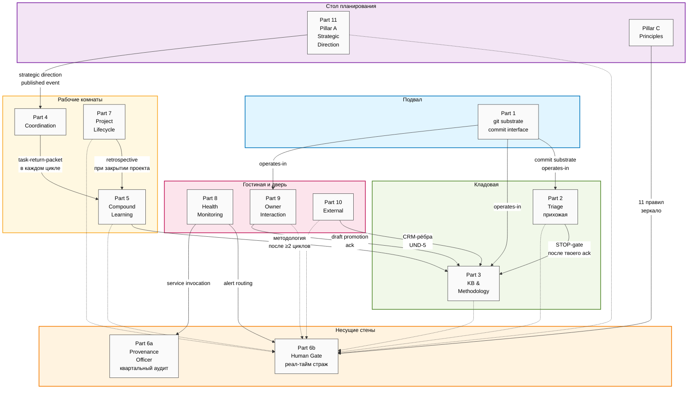

# Foundation Architecture v1.0 — Что у нас получилось

## §0 Что такое Foundation v1.0 в одном абзаце

**Jetix Foundation — это операционная система для одного человека,
который работает с огромными объёмами информации, ведёт несколько
проектов одновременно и хочет, чтобы AI был усилителем мозга, а не
автопилотом за рулём его жизни.** Под капотом — git как источник
истины, одиннадцать структурных «частей» (substrate / governance /
knowledge / interaction / strategy), ритуалы compound-обучения раз в
цикл, и одна железная конституция: AI не принимает стратегических
решений, не делает архитектурные изменения без разрешения, не
накапливает память о тебе без твоего ведома, не имитирует тебя
снаружи. Версия 1.0 закрыта 28 апреля 2026 — теперь это твёрдый
фундамент, на котором можно строить Phase B.

---

## §1 Метафора системы — это **дом**, а не «облако» и не «оркестр»

Я долго выбирал метафору. Оркестр звучал бы поэтично — но у оркестра
один дирижёр и музыканты, которые играют по нотам; у Jetix, наоборот,
человек-владелец задаёт направление, а агенты — это инструменты.
Город — слишком большой; организм — слишком биологический.

**Дом** — точная метафора, потому что:

- У дома есть **фундамент** (Part 1 — git substrate), без которого ничего не стоит. Если фундамент трещит, всё падает.
- У дома есть **несущие стены** (Parts 6a + 6b — governance), без которых внутренние перегородки разъезжаются под собственной тяжестью.
- У дома есть **кладовые** (Part 3 — knowledge base, Part 10 — CRM), куда складывается то, что нужно сохранить.
- У дома есть **прихожая** (Part 2 — signal ingestion), где новенькое сначала фильтруется и только потом попадает внутрь.
- У дома есть **рабочие комнаты** (Part 4 — coordination, Part 5 — compound learning, Part 7 — project lifecycle), где собственно делается работа.
- У дома есть **датчики** (Part 8 — health monitoring), которые ловят дым и протечки до того, как пожар.
- У дома есть **гостиная** (Part 9 — owner interaction), где владелец сидит и думает.
- У дома есть **дверь и почтовый ящик** (Part 10 — external touchpoints), через которые контакт с внешним миром.
- У дома есть **архив с принципами** (Pillar C — principles), который ты пишешь сам, для себя; и **планы на год** (Part 11 — strategic direction), которые ты тоже пишешь сам.

**Главное свойство этого дома — он построен из материала, который
переживёт владельца.** git существует 19 лет, использует ~100 миллионов
разработчиков, бесплатный, без проприетарных рисков. Если завтра
исчезнет любой облачный сервис, любая SaaS-компания, любая модель — дом
останется стоять. Каждое канонические событие в системе — это git
commit; каждый commit имеет криптографический hash; история
неизменяемая, дописываемая, проверяемая через 10 лет.

---

## §2 Одиннадцать частей простым языком

### Part 1 — Подвал, где всё лежит (System State Persistence)

**Что делает.** Принимает каждое изменение в системе и пишет его в git
как commit. Это единственный способ, которым что-либо становится
«официальным». Если факта нет в git — его нет в системе. Notion — это
красивая витрина, но не источник истины; источник истины — git.

**Зачем нужно.** Без подвала всё зависает в воздухе. Без append-only
дисциплины (всё дописывается, ничего не стирается) — теряется история;
становится невозможно понять, что и когда решили. Без UTF-8 plain-text
правила — становится невозможно открыть файл через 10 лет без
специального инструмента.

**Как связано с соседями.** Каждая из остальных десяти частей пишет
свои данные сюда. Каждый файл, каждое решение, каждое сообщение между
агентами — всё проходит через интерфейс commit'а. Единственное правило:
коммит должен иметь правильный формат, не содержать секретов, и не
ломать ни одной схемы.

**Особенность.** Нельзя `--amend`, нельзя `--no-verify`, нельзя
`force-push` — отмена через `git revert`, который создаёт новый commit
с описанием отмены. История всегда дописывается, никогда не
переписывается.

**За 30 дней:** 571 commit. За 10 лет проекта: ~71,000 commit'ов —
полная реконструируемая история всех решений.

### Part 2 — Прихожая с фильтром (Signal Ingestion & Triage)

**Что делает.** Когда тебе приходит новое — голосовая запись, ссылка,
PDF, email, заметка из буфера обмена — оно сначала попадает сюда. Проходит
через пайплайн (transcribe → extract → filter → review-report) и
останавливается на **STOP-gate**: ты сам читаешь отчёт и решаешь, что
дальше.

**Зачем нужно.** Без фильтра в систему попадает мусор. Без STOP-gate
система начинает «знать» вещи, которые ты не одобрял — а это путь к
тому, что система начинает диктовать тебе твою же реальность. Garbage in =
garbage out, и хуже — silent garbage in.

**Как связано с соседями.** Получает сырые сигналы из внешнего мира.
Передаёт прошедшие STOP-gate черновики в Knowledge Base (Part 3) — но
только после того, как ты явно одобрил. Использует ворота (Part 6b) для
эмиссии запросов на одобрение.

**Железное правило.** Ничто не попадает в KB без поля `human_acked_at:`
во frontmatter. Это структурное правило, не поведенческое — даже если
агент захочет «срезать угол для тривиального случая», он физически не
сможет: проверка стоит на схеме на входе в KB. Никакие будущие
оптимизации это не обойдут.

### Part 3 — Кладовая знаний (Knowledge Base & Methodology Library)

**Что делает.** Хранит всё, что система знает: концепты, идеи,
эксперименты, claims, methodology — как набор маленьких атомных файлов,
связанных типизированными рёбрами в графе. Когда задаёшь вопрос
(`/ask`), система ищет → синтезирует → отвечает с цитатами.

**Зачем нужно.** Без кладовой каждый цикл начинается с нуля. С
кладовой — каждое новое знание добавляется к уже накопленному; через 6
месяцев wiki становится твоим вторым мозгом, через 2 года — основным
интеллектуальным капиталом проекта.

**Как связано с соседями.** Получает черновики из прихожей (Part 2).
Получает методологии из compound-фазы (Part 5). Принимает CRM-рёбра из
Part 10. Выдаёт синтезированные ответы всем, кто спрашивает.

**Особенность.** В каталог `wiki/methodology/` попадают только паттерны,
которые сработали ≥ 2 раз в разных циклах — это «институциональная
память». Один раз — наблюдение, ≥ 2 раза в разных контекстах — паттерн,
которому можно доверять.

**Цель плотности связей:** ≥ 2.0 рёбер на entity. Сейчас — 1.05
(577 рёбер на 552 entity). Без перекрёстных ссылок wiki превращается в
папку с разрозненными заметками.

### Part 4 — Рабочая комната координатора (Role Taxonomy & Coordination Protocol)

**Что делает.** Описывает, какие роли есть в системе (бригадир, эксперт
по engineering, эксперт по management, и т.д.) — но не конкретных
агентов, а **архетипы ролей**. Конкретный агент (claude-opus-4-7,
sonnet-4-6) — это RUSLAN-LAYER, твой выбор; роль — это Foundation,
fork-portable.

**Зачем нужно.** Если завтра ты переедешь на другую модель — роль
останется, executor поменяется. Это IP-1 — Role≠Executor, конституциональный
принцип.

**Топология.** Hub-and-spoke. Бригадир — единственный диспетчер; ячейки
никогда не вызывают друг друга напрямую. Если ячейке нужны данные от
другой — она объявляет escalation, бригадир дозвался до peer'а, и
исходная ячейка получает результат через wiki. Это предотвращает
multi-agent failure modes (information withholding, ignored peer input).

**Как связано с соседями.** Маршрутизирует задачи всем; принимает
эскалации в Part 6b (human gate); пишет task-return-packet'ы для
compound-фазы Part 5.

**Цель variety:** ≥ 20 разных правил маршрутизации (по Ashby — закон
requisite variety). У нас 5 экспертов × 4 mode = 20 базовых клеток + 10
триггеров эскалации + 4 task-shape + rate-limiter — больше чем
достаточно.

### Part 5 — Comparative reflection room (Compound Learning & Methodology Capture)

**Что делает.** После каждого цикла работы — собирает уроки. Что
сработало? Что не сработало? Какие паттерны повторяются? Записывает в
DRR-формате (Decision / Reasoning / Result / Review) в файлы
`agents/<id>/strategies.md`. Когда паттерн валидируется в ≥ 2 циклах —
повышается до канонической методологии в `wiki/methodology/`.

**Зачем нужно.** Без compound-фазы система блестяще выполняет один цикл
и забывает уроки к следующему. С compound-фазой — каждый цикл лучше
предыдущего; через 50 циклов накапливается institutional memory, через
200 — система знает, что работает в её домене.

**Цикл 40/10/40/10.** Plan 40% / Work 10% / Review 40% / Compound 10%.
Plan и Review — самые тяжёлые фазы; Work делегируется агентам; Compound
небольшой, но **некомпонент-пропускной**: пропустишь — обнулишь
накопление.

**Как связано с соседями.** Читает task-return-packet'ы из Part 4.
Читает `agents/<id>/strategies.md`. Эмитит методологию-кандидатов в
Part 6b на одобрение. Получает retrospective-packet'ы от Part 7 при
закрытии проектов.

**Тест на необходимость прошёл.** Был серьёзный вопрос: может ли Part 5
раствориться в Parts 3 + 4 без потерь? Wave D показала: за 3 цикла
Bundle 3 + Bundle 4 + Wave D накопилось **6.5 операций**, которые
остальные части не могут выполнить — это в 2.2 раза больше порога 3.
Часть остаётся.

### Part 6a — Иммунная система памяти (Provenance Officer)

**Что делает.** Раз в квартал делает аудит знаний. Проверяет: каждое
утверждение в wiki несёт F-G-R-ярлык (Formality / ClaimScope /
Reliability)? Все цитаты разрешаются (нет битых ссылок)? Нет ли
cargo-cult цитат (декоративных, без реального источника)? Нет ли
«инфляции F-уровня» (когда автор сам поднял Formality без оснований)?

**Зачем нужно.** Без Part 6a wiki незаметно деградирует: F5
(подтверждённое правило) сливается с F1 (одна заметка); cargo-cult
цитаты распространяют ложный кредит; через 15 циклов невозможно
понять, на что опереться. F-G-R — это GAAP для знаний, как
бухгалтерские стандарты для денег.

**Как связано с соседями.** Получает черновики на проверку от Part 6b
(перед каждым продвижением). Эмитит сигналы в Part 8 (статус здоровья
F-G-R). Хранит approval-log — append-only лог всех одобрений.

**VSM Beer-S3 audit lead.** Это retrospective audit; квартальный.
Реал-тайм enforcement делает Part 6b.

### Part 6b — Несущая стена (Human Gate)

**Что делает.** Реал-тайм страж. Каждое потенциально рискованное
действие (commit в `wiki/`, внешняя запись, изменение схемы, новый
класс действия) проходит через ворота. Если действие в whitelist — ОК.
Если не в whitelist — **Default-Deny**: остановка + лог + alert
владельцу.

**Зачем нужно.** Без Part 6b агенты могут «творчески интерпретировать»
ситуации, которых раньше не было. С Part 6b — никакой творческой
интерпретации: либо явно одобрено, либо escalate. Это конституциональный
принцип, не поведенческий.

**Halt-Log-Alert.** Когда обнаружено нарушение (например, попытка вывести
защищённую характеристику контакта из подписи в email):
- ≤ 1 секунда — остановиться (non-maleficence)
- ≤ 5 секунд — записать (transparency)
- ≤ 60 секунд — уведомить владельца (corrigibility)

Этот порядок не случайный. Если уведомить без остановки — вред уже
нанесён. Если остановить без записи — невозможно учиться. Если записать
без уведомления — владелец не может вмешаться.

**Corrigibility (Askell HHH).** «Никакой механизм не может lock'ать
владельца от управления системой». Ты всегда можешь сделать `git revert`,
переопределить любое решение агента, остановить любой процесс. Это
непреложный принцип.

**Как связано с соседями.** Все части эмитят AWAITING-APPROVAL-пакеты
сюда. Pillar C даёт 11 «никогда не делай» (constitutional_never_list)
для Default-Deny. Part 8 эмитит alert'ы сюда.

### Part 7 — Цех проектов (Project Lifecycle Substrate)

**Что делает.** Каждый проект проходит через 5 состояний: `scoped →
staged → activated → under-review → closed | archived`. Каждое
переход — через ворота с одобрением (кроме activated → under-review,
который автоматический по событию закрытия цикла). Каждый закрытый
проект эмитит retrospective-packet в Part 5.

**Зачем нужно.** Без Part 7 проекты висят в подвешенном состоянии:
«активный», пока кто-то не заметит, что он давно мёртв. Аппетит
(сколько недель готов потратить) превращается из ограничения в оценку,
из оценки — в бесконечное растяжение.

**Аппетит — это constraint, не estimate (Singer 2019 Shape Up).** Если
проект превысил аппетит — выбирай из двух: re-shape (переформулируй и
запускай заново с новым аппетитом) или archive (сохрани провенанс,
выведи из активных). **Расширить нельзя.** Это структурно — оценки
плывут, ограничения нет.

**Cadence — event-driven, не календарная.** Переходы происходят на
событиях (закрытие цикла, ack одобрения, обновление scope-record), а не
на «каждую неделю проверим». Это снимает throughput-ceiling, который
был бы при календарной cadence.

**Как связано с соседями.** Использует ворота (Part 6b) для
stage-gate'ов. Эмитит retrospective в Part 5. Эмитит сигналы здоровья в
Part 8. Получает направление от Part 11 (Pillar A) для alignment.

### Part 8 — Датчики дома (Health Monitoring & System Integrity)

**Что делает.** Собирает сигналы от всех остальных частей в единый
канонический формат, складывает в weekly health snapshot, ежеквартально
запускает immune audit. Эмитит alert'ы по 4 уровням (Tier 0 = halt
немедленно; Tier 1 = ack в эту сессию; Tier 2 = ack на этой неделе;
Tier 3 = silent log).

**Зачем нужно.** Без датчиков — silent degradation. Один день KB не
обновляется → через неделю никто не заметит → через месяц вся wiki
устарела. С датчиками — alert на 6× burn-rate за 6 дней до того, как
пробьёшь error-budget.

**Phase A scope: SPECIFY AND STUB.** Сейчас задеклaрирована схема и ≥ 8
starter-SLI; конкретные пороги настраиваются на 2-3 месяцев
operational data в Phase B (нет смысла угадывать пороги, не имея
данных).

**Как связано с соседями.** Читает сигналы от всех. Эмитит alert'ы в
Part 6b (enforcement arm). Сервис-вызов в Part 6a для F-G-R compliance
check во время immune audit.

**TRADEOFF-01 split.** Part 8 = audit LEAD (что мерять, кадены).
Part 6a = audit SUPPORT (F-G-R compliance check service). Part 6b =
ENFORCEMENT ARM (alert routing). Это решает классический Beer VSM
oscillation pattern: если бы один узел делал и аудит, и реал-тайм
enforcement, начинаются задержки в обоих.

### Part 9 — Гостиная владельца (Owner Interaction Scaffold)

**Что делает.** Структурирует твоё взаимодействие с системой:

- **Утром** — `/plan-day`: читаешь контекст, пишешь intent (своими руками, не AI), 1-3 leverage-задачи
- **Днём** — drafts area, deep work, batched inbox
- **Вечером** — `/close-day`: что сделал система, что сделал ты, что завтра
- **В пятницу** — weekly review: разбор накопленных drafts (accept / iterate / discard), retrospective, методологии-кандидаты
- **Раз в месяц** — strategic reflection: длинная заметка о направлении

**Зачем нужно.** Без Part 9 твоё внимание расщепляется на ad-hoc
сюрфейсинг от разных частей; drafts накапливаются без диспозиции;
weekly retrospection не происходит; cap на attention-budget (20
активных задач) теряется.

**IP-7 writing-as-thinking.** Стратегические prose-поля
(daily-log/morning_intent, monthly-reflection) **должны быть написаны
тобой**. Агент может предзаполнить frontmatter, но не сам текст.
Проверка через `git blame` — если строка зафиксирована commit'ом
агента, она отвергается. Иначе исчезает «мышление через письмо» —
главный механизм externalization когнитивного процесса.

**SLA 3-tier.** L1 (стратегическое) — same-session ack ≤4ч; L2
(тактическое) — batch на пятничной неделе ≤7д; L3 (рутина) — auto-log
без ворот.

### Part 10 — Дверь и почтовый ящик (External Touchpoints & Network Interface)

**Что делает.** Граница с внешним миром: CRM (24 контакта-skill / 35
unit-test / 10 `/crm-*` команд / 4 schema), интеграционные адаптеры
(RT-1 read-only intelligence: HN, sub-Reddits, newsletter; RT-2
write-ack action: Linear, GitHub, Slack/email), 4 структурных приватных
инварианта.

**Зачем нужно.** Внешний мир — где живёт реальная жизнь. Без Part 10
система отрезана. Но без 4 приватных инвариантов и Default-Deny — она
начинает экстрактить, накапливать, отправлять, что не должна.

**4 STRUCTURAL privacy invariants** (не поведенческие, а схема + lint
+ Default-Deny):

1. **Consent** — `consent_recorded_at:` поле в frontmatter; без него — нельзя.
2. **Forget-request** — `/crm forget` с Reversal-Transactions (новый redacted entry, а не удаление; история сохранена).
3. **Encryption at rest** — substrate-level precondition.
4. **No protected-characteristic inference** — попытка вывести расу / религию / здоровье / политику = Tier 0 hard halt.

**RT-1 read-only / RT-2 write-ack.** Read-only трекеры пишут только в
`/ingest` через Part 2; ничего наружу. Write-ack — каждое внешнее
действие (отправка email, создание Linear-тикета) проходит через ворота
с явным ack.

**Phase A inbound = Phase B work.** Сейчас Part 10 не реагирует
автоматически на входящие webhook'и или email'ы; ты сам триггеришь
через `/ingest <url>` или `/crm-add`. Phase B activation: Phase A
operational ≥ 3 месяцев + Tier 0 events < 1/квартал + ≥ 10 F5
methodologies.

### Part 11 + Pillar B — Стол стратегического планирования (Strategic Direction Substrate)

**Part 11 (Pillar A — system-wide strategic direction).** Хранит 6
типов стратегических документов: Lock Entry / North Star / Strategic
Insight / Direction Card / Phase Plan / Strategic Reflection. Каждый
LOCKED-документ имеет цикл review (Direction Card — quarterly; North
Star — annual + quarterly soft).

**Pillar B (Bundle 5 supplement to Part 7).** Project-level стратегия;
project-strategy-published event консьюмится Part 11 для
alignment-cascade.

**UC-A.4 — Decisions DB и recall.** Когда возникает новый вопрос,
система ищет похожее уже-принятое решение и спрашивает: «Помнишь, ты
решил X 3 месяца назад? Применить, пересмотреть, или это другое?»
Предотвращает «20 одинаковых решений».

**Главное правило.** **Стратегическую прозу пишет владелец.**
`prose_authored_by:` поле во frontmatter; ставится либо `ruslan`, либо
`hybrid-with-ack-trail`. Если стоит `agent-draft-pending-ack` — pre-commit
lint отвергает promotion в LOCKED состояние. Это структурное
enforcement-я FPF IP-7 + Pillar C Tier-2 правило #1 + FUNDAMENTAL
§6.1.1.

---

## §3 Pillar C — конституция системы

**Pillar C — это не Part, это под-система,** которая хранит принципы.
Двухуровневая:

### Tier 1 — Manager / Owner principles (твои ценности)

Это твои принципы как человека: «развитие общества», «честность»,
«long-term thinking», «AI учит, не выполняет за человека». Они хранятся
у тебя; ты их пересматриваешь раз в месяц на monthly reflection.
Система их **не enforce'ит** — это твоя самодисциплина. Но напоминает
о cadence.

### Tier 2 — System / Agent principles (правила для AI)

Здесь два под-уровня:

**Foundation generic — 11 hard rules** (зеркало FUNDAMENTAL §6.1):

1. AI **не** принимает стратегических решений
2. AI **не** делает архитектурных изменений без ворот
3. AI **не** определяет направление skill-acquisition
4. AI **не** претендует на персональную identity (только `acting_as` роль)
5. AI **не** претендует на skin-in-the-game / собственность / последствия
6. AI **не** аккумулирует unstructured long-term память (только через явные artefact paths)
7. Агенты **не** разрешают противоречия автономно (только через human gate)
8. Агент **не** оценивает другого агента без human review
9. AI **не** self-modify в runtime (system.md / strategies.md правки — только через gated cycle outputs)
10. AI **не** имитирует человека снаружи без disclosure
11. **Никаких** действий без blast-radius classification + Default-Deny

Эти 11 — конституционные. Их зеркало `.claude/config/default-deny-table.yaml`
constitutional_never_list, который Part 6b использует для каждого
runtime-check. Lint следит, что зеркало не разъезжается с canonical.

**RUSLAN-LAYER overrides — твои инстанс-специфичные правила:**

- Filesystem = source of truth (Notion = view, not authoritative)
- API keys NEVER в файлах
- Russian для контента; English для кода
- A/B тесты — всегда awaiting_approval, никогда auto-deploy
- `private/`, `~/.ssh/`, `.env` — не трогать
- Voice-pipeline DRAFT-only: не auto-overwrite production records
- Manager attention budget: max 20 active tasks
- Hub-and-spoke: subagents → department Lead → Manager

**Sync invariant.** Pillar C принципы ↔ CLAUDE.md §4 inline ↔ Part 6b
config — все три синхронизируются через lint hash-match. Если
расходятся — fail-loud per FUNDAMENTAL §5.5. Никаких silent drifts.

### Почему так

Один CLAUDE.md перегружен: он одновременно operational config (paths,
agent rosters, project list, skills) и принципы. Принципы и
operational имеют разные cadence (принципы пересматриваются раз в год;
operational обновляется каждый sprint), разные authoring authority,
разные sync invariants. Pillar C делает split: principles —
canonical в `principles/`; operational — остаётся в CLAUDE.md;
boot-context — derived inline в CLAUDE.md §4.

---

## §4 Архитектурная диаграмма — поток одной задачи

Здесь основная диаграмма (top 15-20 рёбер из 52 в системе; цветовое
кодирование):

**Цвета:**

- **Голубой** = substrate (фундамент)
- **Оранжевый** = governance (несущие стены)
- **Зелёный** = knowledge (кладовая)
- **Жёлтый** = work (рабочие комнаты)
- **Розовый** = interaction (гостиная и дверь)
- **Фиолетовый** = strategy (стратегический стол)

**Сплошные стрелки** = потоки контента (что куда передаётся).
**Пунктирные стрелки** = потоки одобрений (запросы на ack в ворота).

---

## §5 Поток одной задачи end-to-end

Возьмём конкретный пример — ты говоришь системе:

> «Проанализируй mentor-call от вчера и предложи стратегию для
> Direction Card "AI Consulting DACH" на Q2 2026.»

Что происходит шаг за шагом:

**Шаг 1 — Прихожая (Part 9 + Part 2).**
Ты записываешь голосовую запись звонка через mobile app в `inbox/`.
Утром ты открываешь Claude Code, делаешь `/plan-day` (Part 9). В morning
intent ты пишешь сам: «Сегодня хочу понять, что сказал mentor про DACH
focus». Это IP-7 — **prose написана тобой**, agent не имеет права
писать в это поле.

**Шаг 2 — Pipeline + STOP-gate (Part 2).**
Ты запускаешь `tools/run_pipeline.sh`. Голос → Whisper → транскрипт в
`raw/transcripts/2026-04-29-mentor-call.md`. Extractor выделяет
items. Filter дедупит. Review-report генерируется в
`reports/review_2026-04-29.md`.

**STOP**. Pipeline останавливается. Ты читаешь отчёт. AWAITING-APPROVAL
packet с `gate_class: stop_gate` лежит в `swarm/awaiting-approval/`.

**Шаг 3 — Human Gate (Part 6b).**
Ты решаешь: 3 item'а из 5 — accept (полезные insights); 1 — iterate
(нужно уточнение); 1 — discard (не релевантно). Ты пишешь ack-файл.
Halt-Log-Alert не срабатывает (это не constitutional violation, это
обычный gate).

**Шаг 4 — Промоция в KB (Part 3).**
Accepted items получают `human_acked_at:` и `para_tier: Project`.
Promote в `wiki/concepts/dach-mentor-insight-2026-04-29.md`. Edge
добавляется в `wiki/graph/edges.jsonl` (типизированный, A.14).

**Шаг 5 — Provenance (Part 6a).**
F-G-R стампится: F4 (mentor-derived insight; multi-source informal),
ClaimScope = DACH consulting, R = refuted_if надёжный mentor сменил
позицию. Provenance chain (raw_source → transcript → draft → ack →
wiki) логируется в `swarm/approvals/log.jsonl`. Через 3 месяца
квартальный immune audit может ре-проверить F-G-R.

**Шаг 6 — Pillar A consultation (Part 11).**
Ты сам, в Strategic Reflection cadence, садишься и пишешь Direction
Card для Q2 2026. Используешь `/ask "DACH mentor insights"` (Part 3),
который синтезирует с цитатами; читаешь existing Direction Card
(если есть); консультируешься с Pillar C principles_compliance.

**Pillar A invariant:** prose_authored_by должен быть `ruslan` или
`hybrid-with-ack-trail`. Pre-commit lint проверяет.

**Шаг 7 — Стратегический ack (Part 6b).**
LOCKED promotion Direction Card → `gate_class: stage_gate` или
`stop_gate` (если это constitutional revision FUNDAMENTAL §6.1
mirror — но обычно stage_gate). Ты ack'аешь.

**Шаг 8 — Cascade (Part 11 → Part 4).**
LOCKED Direction Card эмитит `strategic-direction-published` event.
Part 4 читает `affected_role_archetypes[]` (e.g., sales-lead,
mgmt-expert) и записывает контекст в их routing. Следующий цикл
работы они начнут с этим направлением в head.

**Шаг 9 — Health-сигналы (Part 8).**
Strategic-doc-staleness SLI обновился (Direction Card LOCKED today =
свежее). Decision-recurrence-rate SLI обновился (новое решение в
decisions DB).

**Шаг 10 — Compound (Part 5).**
В конце цикла, в compound-фазе, бригадер делает DRR entry:
- Decision: «Direction Card DACH AI Consulting Q2 LOCKED».
- Reasoning: «mentor insight from 2026-04-29 + existing capability + Pillar C principles».
- Result: «strategic alignment cascade fired; affected roles updated».
- Review: «через 4 недели — quarterly Direction Card review».

**Шаг 11 — Кладовая истории (Part 1).**
Каждое из 10 шагов выше — это commit'ы:
- `[ingest] add transcript: 2026-04-29-mentor-call`
- `[ingest] promote: dach-mentor-insight (after STOP-gate)`
- `[wiki] add edge: dach-mentor-insight derives-from mentor-2026-04-29`
- `[strategic] direction-card lock dach-q2-2026: mentor insight + existing capability`
- `[health] strategic snapshot: direction-card-staleness 0d`
- `[strategy] add: drr dach-q2-2026-direction (compound entry)`

Через год ты можешь сделать `/knowledge-diff --since=2026-04-29
--until=2026-05-29` и увидеть всё, что произошло за месяц вокруг этого
направления.

---

## §6 Что дальше — Phase B priorities

Foundation v1.0 LOCKED — это законченный архитектурный фундамент. Phase
B — это 17 операционных задач, которые делают его живым.

**Семь главных приоритетов** (из 17 Phase B operational items):

1. **Schema validation toolchain.** jsonschema Python lib в `swarm/lib/`. Сейчас валидация — это author discipline; Phase B это будет blocking lint check на каждом коммите. (OQ-B1-2 / OQ-B1-4 / OQ-B2-C)

2. **Citation scanner материализация.** `swarm/lib/lint-check-citations.sh` — bare-claim detection / cargo-cult detection / broken-citation detection. Сейчас advisory; Phase B — blocking pre-commit для канонических путей.

3. **Калибровка SLI/SLO порогов.** Сейчас 8 starter-SLI с label `calibration-grade`; Phase B — 2-3 месяца сбора operational data, потом замена placeholder'ов на калиброванные пороги. После калибровки — Part 8 alert'ы становятся actionable.

4. **30+ SLI/SLO inventory expansion.** FUNDAMENTAL §3 называет 30+ пар; Bundle 3 закрыл 8. Phase B — расширение через accumulating data.

5. **Live integration adapters (UC-G.1 + UC-L.1/L.2/L.3).** RT-1 read-only intelligence (HN, niche newsletters); RT-2 write-ack action (Linear / GitHub / Slack / email); messenger (Telegram). Архитектурный pattern LOCKED; Phase B — implementation после ≥ 3 месяцев Phase A operational maturity + Tier 0 events < 1/квартал + ≥ 10 F5 methodologies.

6. **Privacy operational refinements.** Part 2 / Part 3 / Part 9 explicit privacy schema fields. Сейчас Default-Deny + Part 10 STRUCTURAL backstop. Phase B — explicit privacy invariants на каждом promotion path.

7. **Layer 2 RUSLAN-LAYER content authoring.** Pillar C Tier 1 manager principles (твои ценности — 5-10 принципов); Tier 2 ruslan_layer_overrides (5-10 instance rules); CLAUDE.md migration scattered → canonical Pillar C.

**Phase C+ deferred** (4 items) — multi-owner / scale-dependent: F.9
Bridge spec authoring, multi-tenant security split, Tier 2 batch
sub-grouping algorithm at ≥ 500 packets/week.

**Когда Phase A → Phase B перехода ожидать.** Trigger predicate per
Part 10 §A.2: Phase A operational ≥ 3 месяцев + Tier 0
health-integrity events < 1/квартал + methodology library ≥ 10 entries
F5. Сейчас (28 апреля 2026) — день LOCKED tag; trigger ожидается
~июль-август 2026.

---

**Тебе нужно знать только это.** Foundation v1.0 — это структурная
гарантия, что:

- AI не делает за тебя стратегических решений (rule 1 / 2 / 3 / 6 / 9)
- Каждое канонические событие — git commit; история переживёт всё (Part 1)
- Каждое канонические promotion проходит через ack — нет silent drift'ов (Part 6b)
- Каждое утверждение в KB carries provenance — нет кредитного смешения (Part 6a)
- Privacy — это структурное, не поведенческое (Part 10 + Part 6b 4 STRUCTURAL invariants)
- Ты всегда можешь сделать `git revert` — corrigibility непреложна (Askell HHH)

И что fork-portable: завтра придёт другой owner с другой нишей, другим
бизнесом — он скопирует Foundation, заменит RUSLAN-LAYER на
medical-researcher-LAYER (или любую другую) и поедет дальше. Foundation
это **the structure all instances share**.

`tag: foundation-architecture-locked-2026-04-28`
