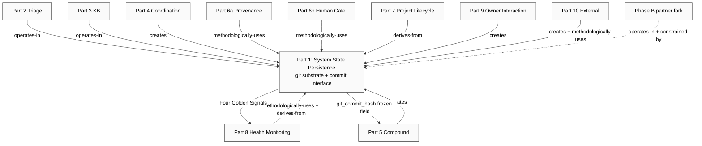
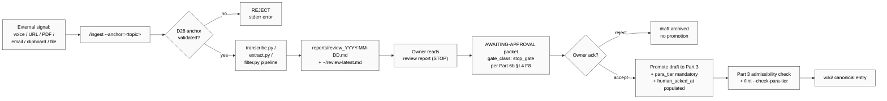
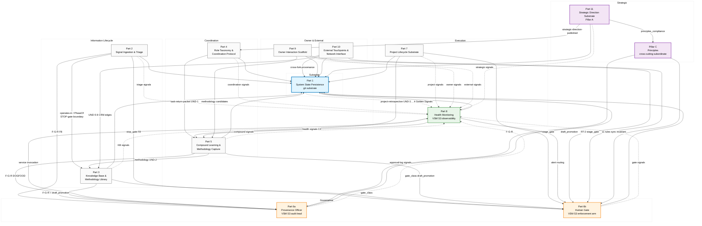

# Foundation Architecture v1.0 — Technical Deep Master Overview

## §0 Executive Summary

**Jetix Foundation Architecture v1.0 LOCKED.** On 2026-04-28 the cycle
`cyc-foundation-build-2026-04-28` reached Wave E LOCKED tag —
`foundation-architecture-locked-2026-04-28` — after Wave D Integration
Report verified six M-gates (M-D-1 through M-D-6) all PASS [src:swarm/wiki/cycles/cyc-foundation-build-2026-04-28/wave-d/INTEGRATION-REPORT.md:§0]. The
deliverable is **eleven LOCKED architecture documents + one Pillar C
sub-system + one Bundle 5 Pillar B supplement**, all canonical at
`swarm/wiki/foundations/`, ratified by **eight Ruslan ack records** in
`decisions/RUSLAN-ACK-WAVE-*` and `RUSLAN-ACK-STRATEGIC-LAYER-*`.

The architecture answers the question posed by FUNDAMENTAL Vision LOCKED
v1.0 (`decisions/JETIX-VISION-FUNDAMENTAL-2026-04-27.md`) — *what should
the Jetix system be in vacuum, generic, sector-agnostic?* — with a
structurally complete material substrate that maps every one of 35
constitutional use-cases (UC-A.1 through UC-L.3) to a Foundation Part
and structurally enforces every one of 62 anti-scope items from
FUNDAMENTAL §6.1-§6.7 [src:swarm/wiki/cycles/cyc-foundation-build-2026-04-28/wave-d/D-4-fundamental-coherence.md:§3]. The architecture is
**fork-portable by construction**: every Part declares its `§X
Foundation vs RUSLAN-LAYER` boundary, with FINAL CLOSURE for OQ-MERGED-3
verified at Bundle 4 ack across Parts 7, 9, 10 [src:swarm/wiki/cycles/cyc-foundation-build-2026-04-28/wave-d/D-1-coverage-matrix.md:CC-4].

### §0.1 Bijection statement

The Foundation Architecture is bijectively coherent with the
FUNDAMENTAL Vision: every UC has ≥1 Foundation Part hosting it, every
constitutional anti-scope item has ≥1 structural enforcement mechanism,
every inter-Part edge is producer-consumer aligned at the schema level.

**Cardinalities verified (Wave D):**
- 35 UC items → 31 ✅ FULLY-MAPPED + 4 🟡 stub-Phase-B = **100% routed** (≥95% threshold met) [src:wave-d/D-4-fundamental-coherence.md:§1]
- 62 anti-scope items → **62/62 (100%) ENFORCED** structurally via Default-Deny F8 / lint signals / schema constraints / §F declarations / Corrigibility F8 / Privacy STRUCTURAL F8 / Halt-Log-Alert L9 F8 [src:wave-d/D-4-fundamental-coherence.md:§2]
- 52 inter-Part edges → **51 ✅ verified (98.1%) + 1 🟡 watch-item** (OQ-WAVE-D-EDGE-TYPE-50, cosmetic edge-type label) [src:wave-d/D-2-contracts-matrix.md:§3]
- 5 cross-cutting concerns × 11 parts = 55 cells → **49 ✅ + 3 🟡 + 3 N/A** (the D-1 file's stated 50/41/4/5 was a count miscount; correct: 55/49/3/3, verdict-integrity unchanged) [src:wave-d/INTEGRATION-REPORT.md:§1.3]
- 8 system-wide scenarios traversing 4-9 parts → **8/8 PASS** (M-D-3) [src:wave-d/D-3-extended-scenarios.md:§1]
- Dissolve-test 3-cycle window (Bundle 3 + Bundle 4 + Wave D): cumulative **6.5 entries ≥ threshold 3 (margin 2.2×)** → STANDALONE PRESERVED, Part 5 retained [src:wave-d/D-6-dissolve-test-verdict.md:§3]

### §0.2 Vision → 11 Parts + Pillar C → LOCKED tag

The structural answer to FUNDAMENTAL §1's 35 UC question, organised
by Foundation block of mission:

| Foundation block | Parts | UCs hosted (anchor) |
|---|---|---|
| **Substrate (commit ground-truth)** | Part 1 (System State Persistence) | UC-H.1 Company-as-Code [src:foundations/part-1-system-state-persistence/architecture.md:§0] |
| **Information lifecycle** | Part 2 (Signal Ingestion & Triage) → Part 3 (Knowledge Base & Methodology Library) | UC-B.1 / UC-B.2 / UC-B.3 / UC-B.4 / UC-B.5 [src:wave-d/D-4-fundamental-coherence.md:§1] |
| **Coordination protocol** | Part 4 (Role Taxonomy & Coordination Protocol) | UC-E.1 / UC-E.3 [src:foundations/part-4-role-taxonomy-coordination-protocol/architecture.md:§0] |
| **Compound learning** | Part 5 (Compound Learning & Methodology Capture) | UC-C.1 / UC-C.2 / UC-C.3 / UC-E.2 [src:foundations/part-5-compound-learning-methodology-capture/architecture.md:§0] |
| **Governance (dual VSM S3)** | Part 6a (Provenance Officer — quarterly retrospective) + Part 6b (Human Gate — real-time enforcement) | UC-H.2 / UC-H.5 / UC-I.4 [src:foundations/part-6a-provenance-officer/architecture.md:§0; src:foundations/part-6b-human-gate/architecture.md:§0] |
| **Project lifecycle** | Part 7 (Project Lifecycle Substrate) + Bundle 5 Pillar B supplement | UC-D.1 / UC-D.2 [src:foundations/part-7-project-lifecycle-substrate/architecture.md:§0] |
| **Health monitoring** | Part 8 (Health Monitoring & System Integrity) | UC-H.4 / UC-I.1 [src:foundations/part-8-health-monitoring-system-integrity/architecture.md:§0] |
| **Owner interaction** | Part 9 (Owner Interaction Scaffold) | UC-J.1 / UC-J.2 / UC-J.3 / UC-I.2 / UC-I.3 / UC-F.1 / UC-F.2 [src:foundations/part-9-owner-interaction-scaffold/architecture.md:§0] |
| **External boundary** | Part 10 (External Touchpoints & Network Interface) | UC-K.1 / UC-K.2 / UC-K.3 / UC-L.1 / UC-L.2 / UC-L.3 [src:foundations/part-10-external-touchpoints-network-interface/architecture.md:§0] |
| **Strategic direction (Pillar A)** | Part 11 (Strategic Direction Substrate) | UC-A.1 / UC-A.2 / UC-A.3 / UC-A.4 [src:foundations/part-11-strategic-direction-substrate/architecture.md:§0] |
| **Principles (Pillar C, cross-cutting subordinate)** | `principles/` Foundation sub-system, Tier 1 manager + Tier 2 system | Constitutional governance for FUNDAMENTAL §6.1 11 hard rules; consumed by Parts 6a/6b/7/9/11 + CLAUDE.md [src:foundations/principles/architecture.md:§0] |

**The structural completeness claim.** Every Foundation Part declares
the eight canonical sections §A through §X (Inputs / Outputs /
Side-effects / Dependencies typed A.14 / Boundary L/A/D/E / Anti-scope
/ F-G-R Tagging / Code interfaces / Data schemas / Operational rituals
/ Failure modes / Work-list / Wisdom Application / Provenance) plus the
`§X Foundation vs RUSLAN-LAYER` strict-separation block. Every cross-cut
(provenance / gating / append-only / fork-separation / privacy) is
addressed structurally — schema field, lint signal, Default-Deny entry,
or Halt-Log-Alert primitive — not behaviorally as prose convention.

### §0.3 The four constitutional invariants

Cutting across all 11 parts, four invariants are declared at F8
(constitutional, FUNDAMENTAL Vision lock-class) and structurally
enforced:

1. **F-G-R DOGFOOD.** Every promoted artefact carries Formality / ClaimScope / Reliability per `shared/schemas/f-g-r.json` F8 schema (Part 6a §I.1) [src:foundations/part-6a-provenance-officer/architecture.md:§I.1]. No exceptions; quarterly immune audit verifies compliance (Part 6a §J).
2. **Default-Deny on novel actions.** Per FUNDAMENTAL §6.1 rule 11: "якщо action не categorized — default deny + escalate, не creative interpretation." Materialised at `.claude/config/default-deny-table.yaml` constitutional_never_list (11 entries derived from Pillar C Tier 2 foundation_generic) [src:foundations/part-6b-human-gate/architecture.md:§0; src:foundations/principles/architecture.md:§A.1].
3. **Halt-Log-Alert L9 ordering.** ≤1s halt / ≤5s log / ≤60s alert on every constitutional violation per FUNDAMENTAL §6.7 [src:foundations/part-6b-human-gate/architecture.md:§0]. Strict ordering prevents racy log-write before halt; addresses non-maleficence + transparency + corrigibility simultaneously.
4. **Corrigibility (Askell HHH Appendix E.2 verbatim).** "NO mechanism exists by which any agent, any Part, or any automation may lock the human owner out." Owner can resume / modify / permanently reject any agent action; `git revert` always available; data exportable [src:raw/books-md/anthropic/askell-2021-hhh.md:Appendix E.2; src:foundations/part-6b-human-gate/architecture.md:§E Law L9].

These four invariants are the load-bearing structural guarantees on
which Phase B onboarding (partner forks; multi-owner; live integration
adapters) will rest. Nothing in Phase B may erode them; F.9 Bridge
constitutional events (≥35% structural change) are required for any
modification.

### §0.4 What was achieved vs what was deferred

**Achieved at LOCKED tag (F5/F8 frozen, claude/jolly-margulis-915d34
head 236fefc + supplements):**
- All 11 architecture documents F5+ LOCKED
- 8 RUSLAN-ACK records (Bundle 1-4 + supplement-1 + supplement-2 + Wave D + Bundle 5)
- 5 cross-cutting concerns × 11 parts = 55 cells classified (49 ✅ + 3 🟡 Phase B + 3 N/A)
- 52 inter-Part edges verified producer-consumer aligned
- 38 OQ debt fully routed (8 to Wave E ack-time, 17 to Phase B operational, 4 to Phase C+, 9 closed-already)
- Dissolve-test STANDALONE PRESERVED (Part 5 retained as canonical)

**Deferred to Phase B operational backlog (per OQ-MERGED-5
specify-and-stub discipline):**
- 4 🟡 PARTIAL UC mappings (UC-G.1 messenger; UC-L.1/L.2/L.3 external integrations) — schema declared, live integration is Phase B substantive
- 3 🟡 PARTIAL CC-5 privacy cells (P2/P3/P9) — Default-Deny + Part 10 STRUCTURAL backstop active; explicit privacy schema fields are Phase B
- Calibrated SLI/SLO thresholds (Bundle 3 ships ≥8 starter SLI entries with `starter_value_label: "calibration-grade"`; remaining ≥22 plus calibrated values are Phase B 2-3 month operational data)
- Live partner-fork import (cross-fork-provenance.json v1.1.0 schema-level coherence verified; first live import is Phase B)
- F.9 Bridge spec (multi-owner Phase C+ — `design/F-9-Bridge-multi-owner-spec.md` not yet authored; tied to OQ-B4-3)
- Layer 2 RUSLAN-LAYER content (Tier 1 manager principles + Tier 2 ruslan_layer_overrides + CLAUDE.md migration; Bundle 5 architectural placement complete, content authoring next sprint)

The bijection is structurally complete; what is deferred is parameter
calibration and live materialisation — not architectural substance.

---

## §1 Vision ↔ Architecture Bridge

### §1.1 The two-layer pattern (FUNDAMENTAL §0)

JETIX-VISION-FUNDAMENTAL-2026-04-27.md LOCKED v1.0 declares a **two-layer pattern** [src:decisions/JETIX-VISION-FUNDAMENTAL-2026-04-27.md:§0]:

- **Layer 1 (FUNDAMENTAL):** generic, sector-agnostic, person-agnostic substrate. Works in any niche (AI consulting / медицина / e-commerce / научный research / преподавание). Fork-portable.
- **Layer 2 (RUSLAN-LAYER):** instance-specific overlay (DACH Mittelstand / AI consulting / Phase 1 €50K / 11 archetypes / Korp-Startup positioning). Replaceable per fork.

The Foundation Architecture v1.0 implements Layer 1: **every Part is
authored at the Foundation generic level, with a strict `§X` boundary
declaring what is RUSLAN-LAYER**. This is OQ-MERGED-3 FINAL CLOSURE,
verified at Bundle 4 ack across Parts 7, 9, 10 with explicit DACH /
GDPR / auth-token / contact-list / r/Berlin / 24-src-35-tests-10-skills
examples in §X declarations [src:wave-d/INTEGRATION-REPORT.md:§1.2 CC-4 row summary; src:foundations/part-10-external-touchpoints-network-interface/architecture.md:§0].

### §1.2 The 35 UC → 11 Parts mapping (D-1 coverage matrix)

The full UC × Part mapping table from Wave D Phase D-4 [src:wave-d/D-4-fundamental-coherence.md:§1]:

| UC | Foundation Part(s) | Status |
|---|---|---|
| **A.1** Multi-level strategic doc hosting | Part 11 (Strategic Direction Substrate) + Part 3 (`wiki/foundations/`) + Part 1 (commit substrate) + Part 9 (owner authoring per IP-7) | ✅ |
| **A.2** Strategic doc creation assistance | Part 3 (admissibility predicate) + Part 9 (IP-7 owner authors; agents extract structurally) + Part 6b (draft_promotion gate) | ✅ |
| **A.3** Strategic alignment enforcement | Part 11 (`pillar-a-direction-event` + `pillar_a_anchor:` ref) + Part 6b (Default-Deny on misalignment) + Part 7 (project-state machine consults strategy) + Part 4 (routing-table.yaml derives from strategy) | ✅ |
| **A.4** Decisions tracking & recall & governance | Part 11 (decisions-DB section §I; semantic similarity recall) + Part 1 (`decisions/` substrate; F-G-R envelope per Part 6a) + Part 6a (approval-log) + Part 3 (decision entries in `wiki/decisions/`-style entity-type) | ✅ |
| **B.1** Selective inbox with filters | Part 2 (STOP-gate; PARA-tier; anchor-mandatory; 6 input types — voice/URL/PDF/email/clipboard/file) | ✅ |
| **B.2** Multi-wiki KB storage | Part 3 (`wiki/` 9 entity-types + `wiki-roots.yaml` for client namespaces) | ✅ |
| **B.3** Source preservation (raw + processed) | Part 3 (provenance discipline; `sources:` mandatory) + Part 6a (F-G-R + immune audit) + Part 1 (raw layer commits append-only) | ✅ |
| **B.4** Synthesis on demand | Part 3 (`/ask` accessor in `swarm/lib/`; cited synthesis discipline per C1 Joint Design Variant A) | ✅ |
| **B.5** Rapid ingestion pipeline | Part 2 (`/ingest` 6 types) + Part 3 (admit per admissibility predicate) | ✅ |
| **C.1** System self-improvement (Compound Engineering) | Part 5 (compound ritual; UND-2 methodology promotion pipeline F5) | ✅ |
| **C.2** Skills acquisition under strategic direction | Part 2 (ingest pipeline) + Part 3 (KB sub-area) + Part 5 (methodology library) + Part 4 (role manifests) | ✅ |
| **C.3** Methodology library (reusable patterns) | Part 3 (`wiki/methodology/` entity-type) + Part 5 (UND-2 pipeline writes) | ✅ |
| **D.1** Project lifecycle management | Part 7 (5-state IP-5 past-participle state machine; appetite-as-CONSTRAINT; project-retrospective-packet) | ✅ |
| **D.2** Resource budgeting & monitoring | Part 8 (canonical health-signal schema F5; SLI/SLO; resource-budget signals) + Part 9 (attention-budget cap = 20 RUSLAN-LAYER) | ✅ |
| **E.1** Multi-agent coordination | Part 4 (routing-table.yaml; role manifests; message schema v2.0.0; brigadier hub-and-spoke) | ✅ |
| **E.2** Agent self-learning (strategies.md) | Part 5 (compound phase reads `agents/<id>/strategies.md`) + Part 9 (weekly review surfaces methodology candidates) | ✅ |
| **E.3** Agent communication discipline (Левенчук) | Part 4 (message schema v2.0.0 with `acting_as:`; escalation_taxonomy in routing-table.yaml; mailbox JSONL) | ✅ |
| **F.1** Persistent memory across sessions | Part 9 (daily-log + weekly-review + monthly-reflection memory) + Part 1 (commit substrate) | ✅ |
| **F.2** Cross-context continuity | Part 9 (afternoon execution section; afternoon ack mechanic) + Part 4 (routing-table dispatch context) | ✅ |
| **G.1** Messenger access (Telegram + основные) | Part 10 §I.4 RT-1+RT-2+L.1/L.2/L.3 stub-as-Phase-B-work | 🟡 PARTIAL — Phase B operational per OQ-MERGED-5 |
| **G.2** CLI / desktop primary access | Part 1 (commit interface; git-native) + Part 9 (cli accessors `/plan-day` `/close-day`) + Part 4 (cli skill dispatch) | ✅ |
| **H.1** Company-as-Code (git-based system state) | Part 1 (D25 substrate; commit-format-tokens.json) | ✅ |
| **H.2** Provenance & audit trail | Part 6a (F-G-R F8 schema; approval-log) + Part 3 (sources discipline) + Part 1 (commit history audit trail) | ✅ |
| **H.3** Reversibility & safe experimentation | Part 1 (no `--amend`, no `--no-verify`, no force-push; Reversal Transactions) + Part 6b (Corrigibility F8) | ✅ |
| **H.4** Health monitoring & alerting | Part 8 (canonical health-signal schema F5; SLI/SLO; alert-routing through Part 6b TRADEOFF-01) | ✅ |
| **H.5** Quality gates (stage-gated approval) | Part 6b (gate_class enum F8; stage-gates.yaml; AWAITING-APPROVAL packet F8) + Part 7 (per-project stage-gates) | ✅ |
| **I.1** Periodic system health checkups | Part 8 (weekly health snapshot; quarterly immune audit) + Part 6a (quarterly F-G-R compliance check service) + Part 9 (weekly review consumes Part 8 dashboard) | ✅ |
| **I.2** Periodic owner self-reflection prompts | Part 9 (weekly-review.json with reflection prompts; monthly-reflection schema; IP-7 writing-as-thinking) | ✅ |
| **I.3** Recommendation engine ("показывает куда смотреть") | Part 9 (daily-log "look here" surface) + Part 8 (anomaly surface) + Part 6b (Default-Deny on auto-execute) | ✅ |
| **I.4** System self-preservation & integrity checks | Part 8 (quarterly immune audit; integrity SLOs) + Part 6a (F-G-R compliance) + Part 1 (K15+K18 fsck failure modes) | ✅ |
| **J.1** Daily working page | Part 9 (daily-log.json schema F4; morning_intent + afternoon_execution + evening_reflection) | ✅ |
| **J.2** Draft → review → promote/archive workflow | Part 9 (draft-disposition table) + Part 6b (gate_class: draft_promotion) + Part 3 (KB admit) | ✅ |
| **J.3** Weekly draft review & integration | Part 9 (weekly-review.json with draft-disposition table) | ✅ |
| **K.1** Multi-context relationship tracking | Part 10 (CRM canonicalisation 24 src / 35 tests / 10 skills / 4 schemas; privacy STRUCTURAL F8) | ✅ |
| **K.2** Interaction history + relationship state | Part 10 (CRM history.md append-only per crm/README.md §11; voice integration via crm/_scripts/voice_router.py) | ✅ |
| **K.3** Multi-purpose CRM (sales/partners/mentors/community) | Part 10 (24 roles in 6 groups; 13 pipeline statuses; 6 offers + 6 asks strategy hooks) | ✅ |
| **L.1** Secure external service connections | Part 10 (RT-1+RT-2+L.1/L.2/L.3 integration adapter pattern; specify-and-stub Phase B operational) | 🟡 PARTIAL |
| **L.2** Read-only intelligence trackers | Part 10 (RT-1 read-only adapter stub) + Part 2 (digest aggregation route via /ingest) | 🟡 PARTIAL |
| **L.3** Action coordinators | Part 10 (RT-2 write-ack pattern; Default-Deny on novel external actions per Part 6b §I.3) | 🟡 PARTIAL |

**The 4 🟡 PARTIAL items.** UC-G.1 messenger access + UC-L.1 Integration Hub + UC-L.2 read-only intelligence trackers + UC-L.3 action coordinators all reside in FUNDAMENTAL §1 Categories G + L. **Foundation Architecture provides for each:** schema-level declaration (Part 10 §I.4 RT-1/RT-2/L.1/L.2/L.3 architectural pattern is LOCKED); Default-Deny enforcement on novel external action classes (Part 6b §I.3 forbids any external write the schema doesn't recognise); Privacy STRUCTURAL F8 inheritance (every Part 10 adapter inherits the 4 STRUCTURAL invariants — transparency / no-PII-aggregation / no-data-sharing / forget-request-via-Reversal). Phase B implementation cannot accidentally bypass gate; every new adapter must declare its action class and pass through Part 6b. **Foundation is constitutionally complete with respect to these UC items at the schema + architectural-pattern level** [src:wave-d/D-4-fundamental-coherence.md:§4.5].

### §1.3 Anti-scope enforcement (62/62 = 100%)

Per Wave D Phase D-4 §2 [src:wave-d/D-4-fundamental-coherence.md:§2]:

| Anti-scope sub-section | Item count | Enforcement mechanism |
|---|---|---|
| §6.1 AI/agents constitutional limits | 11 items | Part 6b §I.3 Default-Deny F8 + Part 9 §X IP-7 + Part 4 §I (acting_as field) — 11/11 ✅ |
| §6.2 Founder agency preservation | 10 items | Part 6b §E Corrigibility + Part 9 §X IP-2 + IP-7 owner-only authoring — 10/10 ✅ |
| §6.3 Engagement-economy & dark patterns | 14 items | Part 8 §F (no engagement SLI) + Part 9 §F + Part 6b §I.3 Default-Deny `manipulative-default-recommendation` + `surveillance-expansion` + `ab-testing-owner-without-ack` — 14/14 ✅ |
| §6.4 Privacy & data ethics | 6 items | Part 10 §I.5 4 STRUCTURAL invariants F8 + Part 6b §I.3 `protected-characteristic-inference` Default-Deny F8 — 6/6 ✅ |
| §6.5 Scope creep prevention | 7 items | Part 10 §F + Part 7 §F anti-scope + Part 9 §X IP-2 single-owner bounded + Part 6b §I.3 `feature-drift-without-review` — 7/7 ✅ |
| §6.6 Honest limit promises | 7 items | §X / §F honest declarations + Part 1 §K K15+K18 failure-mode acknowledgements + Part 8 SLI/SLO with explicit error budget — 7/7 ✅ |
| §6.7 Boundary violation triggers + responses | 7 items | Part 6b §E L9 Halt-Log-Alert F8 + Default-Deny + AWAITING-APPROVAL packet + Part 5 compound-phase sycophancy detection + Part 6a quarterly audit — 7/7 ✅ |

**Total: 62/62 items (100%) structurally enforced.** No item enforced
only by behavioral framing prose; every item maps to a schema field, a
lint signal, a Default-Deny entry, or a Halt-Log-Alert primitive
[src:wave-d/D-4-fundamental-coherence.md:§3].

### §1.4 Privacy STRUCTURAL F8 (Bundle 4 ack)

Privacy is by-design centralised at Part 10 (the boundary, with 4
STRUCTURAL F8 invariants per §I.5 + §H.7 + §F per Bundle 4 ack §6.7) +
Part 6b (the gate, with 38 Default-Deny F8 entries) [src:wave-d/D-1-coverage-matrix.md:§2 CC-5 row summary]. Non-boundary parts (Parts 1/5/6a) are N/A
for direct privacy enforcement — they have no PII surface — and
non-boundary parts that do have PII surface (Parts 2/3/9) inherit
privacy via Default-Deny propagation. The 3 🟡 cells (P2 PII redaction
implicit; P3 admissibility predicate doesn't check `privacy:`
frontmatter; P9 weekly-review draft-disposition no explicit redaction)
are routable to Phase B per OQ-WAVE-D-PRIVACY-P2/P3/P9; **0 silent
privacy gap; Foundation has architectural backstop**.

### §1.5 IP-1 Role≠Executor

Per FPF IP-1 + Bundle 1 D-1 anti-conflation [src:design/JETIX-FPF.md:§5.1 IP-1; src:CLAUDE.md:§4 Pillar C boot context]: Foundation roles =
U.Episteme abstract role-types (manager, strategist, sales-lead,
brigadier, etc.); executor bindings (specific agents like
`claude-opus-4-7`, `sonnet-4-6`) = RUSLAN-LAYER per
`shared/schemas/executor-binding.yaml.template`. **Foundation parts MUST
NOT name executor instances; Part 6b enforces.** Compliance rate
target: 100%, audited quarterly by Part 6a. This invariant is what
makes the Foundation fork-portable: a Phase B partner adopts the role
manifests verbatim and substitutes their own executor bindings.

### §1.6 Two-pillar layered authoring (Bundle 5)

Bundle 5 introduced the Strategic Layer Foundation extension via three
structural innovations [src:decisions/RUSLAN-ACK-STRATEGIC-LAYER-BUNDLE-5-2026-04-28.md]:

- **Pillar A (Part 11):** system-wide strategic direction — 6 strategic-doc types (Lock Entry / North Star / Strategic Insight / Direction Card / Phase Plan / Strategic Reflection); UC-A.1/A.2/A.3/A.4 hosting; Decisions DB.
- **Pillar B (Part 7 supplement):** project strategy slot — bet-pitch absorption; project-strategy-published events; alignment cascade with Pillar A.
- **Pillar C (`principles/` Foundation sub-system):** two-tier (Tier 1 manager + Tier 2 system) with `foundation_generic` + `ruslan_layer_overrides` per tier; canonical source for Part 6b `constitutional_never_list` (11 entries derived from FUNDAMENTAL §6.1) and CLAUDE.md §4 inline boot context.

Pillar C is **NOT a numbered Part** — it is a cross-cutting subordinate
sub-system consumed by 5+ parts (6a, 6b, 7, 9, 11) plus CLAUDE.md;
numbering would imply peer-status with Parts 1-11 [src:foundations/principles/architecture.md:§F.9].

---

## §2 Part 1 — System State Persistence

### §2.1 Purpose

Part 1 is the **append-only, version-controlled ground-truth substrate**
on which every other Foundation part stores its committed state. It is
not the most intellectually complex Foundation part; it is the most
durably valuable [src:foundations/part-1-system-state-persistence/architecture.md:§0]. Every wiki entry, every governance decision, every
agent-produced artefact, every CRM record — all canonical state in the
Jetix system either exists as a git commit or does not exist at all
[src:wave-a/interface-cards/part-1-system-state-persistence.md:§E
"no canonical state outside git"].

**Substrate thesis (one sentence).** Git is 19+ years old, used by ~100
million developers, FLOSS with zero proprietary risk, and is the only
currently available substrate that is simultaneously Lindy-confirmed,
content-addressable (cryptographic hash as proof-of-existence),
append-only by structural design (DAG), and offline-first. No
alternative — not Notion, not a proprietary event-store, not an
in-memory state machine — passes the 10-year durability test at Jetix's
cost basis [src:foundations/part-1-system-state-persistence/architecture.md:§0;
src:wave-b/consultants/capital-allocation-antifragility.md:§3 Taleb Lindy].

**Headline operational baseline.** 571 commits in 30 days as of
2026-04-27; at run rate ~570/month, ~71,820 commits over 10-year
horizon, each hash-verified [src:decisions/AUDIT-CURRENT-STATE-2026-04-27.md:§0].

### §2.2 Inputs / Outputs (typed)

**Inputs:**
- Committed file writes from all Parts 2-10 (YAML/JSON/Markdown at repo-rooted paths)
- Part 6 governance promotion artefacts (frontmatter `status: acked`, `acked_by: ruslan`, `acked_at: <ISO-8601>`)
- `CLAUDE.md` + `.claude/config/*.yaml` (config-input boot)
- `shared/schemas/*.json` (validation schema reference)
- `tools/git-hooks/pre-commit-format.sh` (P1.2 hook for commit-message format validation)
- Cross-fork import (D27 Phase B; `cross-fork-provenance.json` v1.1.0 per Bundle 1 supplement-2)

**Outputs:**
- Durable committed artefact (primary; SHA-stable path in `git log`)
- Git history as audit trail (Young 2010 event-log pattern — append-only ordered immutable)
- `/company-status` snapshot (≤80 lines, zero network calls — Law L-3)
- `/knowledge-diff` delta report (zero network — Law L-3)
- **Four SRE Golden Signals** to Part 8: `commit-latency-p95` (target ≤3000ms), `commit-cadence-per-day` (informational), `hook-failure-rate` (SLO ≤2%/week), `repo-growth-rate-MB-per-day` (target ≤10MB/day) [src:foundations/part-1-system-state-persistence/architecture.md:§B.1 Google SRE Book Ch.6 Four Golden Signals]
- Repo-integrity output (`git fsck` weekly cron; result written to `shared/state/system-health.json` under `git_integrity` key)
- **`raw-task-return-packet` frozen field** `git_commit_hash: <sha>` — LOAD-BEARING for Part 5 DRR verification [src:foundations/part-1-system-state-persistence/architecture.md:§B.2]

### §2.3 Laws / invariants (constitutional defects on violation)

Per FPF A.6.B L/A/D/E lane separation [src:foundations/part-1-system-state-persistence/architecture.md:§E]:

- **L-1 (Meadows-L2 paradigm).** No canonical state outside git. Every canonical state change is a committed file. Filesystem = single source of truth per D17.
- **L-2 (Meadows-L5 rules).** `^\[(area)\] (verb) (subject)( \(why\))?$` commit format with `area` from `shared/schemas/commit-format-tokens.json` enum. (Phase A: log-only Deontic; Phase B: blocking hard invariant per philosophy-expert category note.)
- **L-3 (Meadows-L5 rules).** `/company-status` and `/knowledge-diff` make ZERO network calls. `tools/tests/test-offline-guarantee.sh` intercepts a network syscall via `strace -e trace=network` (OQ-B1-7 Wave D ack: `unshare -n` not available on prod; strace fallback path confirmed).
- **L-4 (Meadows-L5).** Notion is read-display only; never in the write path (D17 violation).
- **L-5 (Meadows-L2 paradigm + L5).** No `--amend`, no `--no-verify`, no force-push on canonical branch. `git revert` is the ONLY undo per Young 2010 Reversal Transactions.
- **L-6 (Meadows-L5).** UTF-8 plain text only; binary files require HITL ack and Git LFS tracking. Per Anthropic CAI transparency requirement.

### §2.4 Integration points



Part 1 is the substrate root: zero upstream Part dependencies. All
Parts 2-10 depend on Part 1; the dependency graph is acyclic at the
schema-reference level [src:wave-d/INTEGRATION-REPORT.md:§2.5].

### §2.5 Data schemas owned by Part 1

- `shared/schemas/commit-format-tokens.json` (4 + Bundle 1 supplement-1 added [swarm-lib]+[health]+[methodology] → 7 area tokens) [src:decisions/RUSLAN-ACK-WAVE-C-BUNDLE-1-supplement-2026-04-28.md]
- `shared/schemas/cross-fork-provenance.json` v1.1.0 (Bundle 1 supplement-2 promoted `approvals_reconciliation_strategy` to top-level field with 5-strategy enum: `merge-prefer-local | merge-prefer-foreign | merge-manual-resolve | decline-import | defer-decision`) [src:decisions/RUSLAN-ACK-WAVE-C-BUNDLE-1-supplement-2-2026-04-28.md]
- `shared/schemas/awaiting-approval.json` (existing; consumed)
- `shared/schemas/raw-task-return-packet` frozen-field interface (Part 5 LOAD-BEARING)

### §2.6 Sources

- Books: `raw/books-md/event-sourcing/young-cqrs-2010.md` (Reversal Transactions); `raw/books-md/sre/google-sre-book.md` Ch.6 (Four Golden Signals); `raw/books-md/anthropic/bai-2022-cai.md` (transparency requirement); Taleb Antifragile (Lindy substrate).
- Wave B consultant cards: `wave-b/consultants/event-sourcing-cqrs.md`; `wave-b/consultants/sre-observability.md`; `wave-b/consultants/clean-code.md` (Ousterhout deep-modules); `wave-b/consultants/anthropic-constitutional-ai.md`; `wave-b/consultants/unix-philosophy.md` (each tool one thing well); `wave-b/consultants/capital-allocation-antifragility.md`.
- Bundle 1 cells: `wave-c/bundle-1/cells/part-1/{engineering,investor,systems,philosophy,mgmt}-expert-*.md` (5 expert lenses).

---

## §3 Part 2 — Signal Ingestion & Triage

### §3.1 Purpose

Part 2 is the **pipeline that converts external raw signals into
provenance-tagged, anchor-linked draft candidates ready for KB
promotion — gated by a structural human STOP** [src:foundations/part-2-signal-ingestion-triage/architecture.md:§0]. Voice memos, URLs, PDFs,
book excerpts, email forwards, clipboard captures all enter through one
interface (`/ingest --anchor=<topic>`) and exit through one gate (the
human-acked review report). Between intake and exit, every stage
produces a committed file. Nothing is ephemeral.

**The constitutional bargain.** Ingestion velocity (~2-3 minutes per
pipeline run per AUDIT §6 cycle 11) traded for canonical integrity
(zero unreviewed signals in the KB). Nothing reaches `wiki/` (Part 3)
without `human_acked_at:` populated in the draft frontmatter
[src:wave-a/interface-cards/part-2-signal-ingestion-triage.md:§E Laws].

### §3.2 The STOP gate is structural, not behavioural

A future agent **cannot** "decide to skip review for trivial cases" —
no admissibility predicate of Part 3 (§E A1) accepts a draft without
`human_acked_at:`, and Part 6b §E Law L9 Halt-Log-Alert fires on any
attempted bypass. The gate is enforced by Part 6b's
`awaiting-approval-packet.json` F8-LOCKED schema (RUSLAN-ACK Bundle 1
Decision #5): every Part 2 STOP submission carries `gate_class:
stop_gate` from the canonical enum `[stop_gate, stage_gate,
draft_promotion]` [src:foundations/part-6b-human-gate/architecture.md:§I.4]. **UND-4 binding satisfied at this contract level.**

### §3.3 Bundle 2 structural deltas (P2.1, P2.2, P2.3)

1. **P2.1 — STOP gate packet emission spec:** Part 2 emits packets conforming exactly to Part 6b §I.4 F8 schema with `gate_class: stop_gate` (full schema enforcement).
2. **P2.2 — PARA-tier mandatory frontmatter:** `para_tier: Project|Area|Resource|Archive` becomes a non-negotiable frontmatter field. `/ingest` rejects drafts without it. `/lint --check-para-tier` flags any orphan canonical entry lacking the field. PARA discipline (Tiago Forte *Building a Second Brain*) is enforced at the structural boundary, not as a soft convention.
3. **P2.3 — Multi-owner STOP gate stub:** Phase A is single-owner; Phase B is multi-owner. Architecture declares F.9 Bridge fields and delegation predicate (`owner_count > 1`) so Phase B partners do not re-discover the design intent.

### §3.4 Inputs / Outputs (typed)

**Inputs:**
- External world (owner-supplied raw signal: `.ogg`, `.mp3`, `.txt`, URL, `.pdf`, clipboard, `.eml`)
- D28 anchor parameter (mandatory `--anchor=<topic|project|question>`)
- Part 1 git substrate via `[ingest]` or `[raw]` commit tokens
- Part 3 wiki/index.md (read-only at ingest for anchor-suggestion)
- FUNDAMENTAL §1 UC-B.1 strategy-aware filters (declarative YAML; specific contents RUSLAN-LAYER per §X)
- Part 6b `awaiting-approval-packet.json` F8 LOCKED schema
- Part 6a `f-g-r.json` F8 LOCKED schema

**Outputs:**
- Owner: `reports/review_YYYY-MM-DD.md` + `~/review-latest.md` (review report; STOP gate)
- Part 6b: AWAITING-APPROVAL packet with `gate_class: stop_gate` (UND-4 binding)
- Part 3: promoted draft candidate (`pipeline: ingested`, `anchor:`, `para_tier:` mandatory, `human_acked_at:`, `ack_packet_id:`, `sources:` provenance ≥1)
- Part 1: committed transcript / draft / report (`raw/transcripts/<slug>.md`, `inbox/<slug>-DRAFT.md`, `reports/review_<date>.md`)
- Part 6a: provenance chain `(raw_source_path → transcript_path → draft_path → ack_packet_id → human_ack_timestamp → wiki_promotion_path)`
- Part 8 (Phase B): ingest-rate / STOP-gate-latency / rejection-rate-by-reason metrics

### §3.5 Laws (Boundary L/A/D/E)

- **L1.** STOP gate is structural, not behavioural. No draft reaches `wiki/` without `human_acked_at:` AND `ack_packet_id:` referencing a Part 6b §I.4-conforming packet.
- **L2.** D28 anchor is mandatory at ingest boundary. Signal without `--anchor=` is REJECTED by pipeline (stderr error citing violation).
- **L3.** Every pipeline stage output is a committed file (FPF IP-3).
- **L4.** `para_tier:` field is mandatory in every promoted-draft frontmatter (Bundle 2 P2.2).
- **L5.** Notion NEVER appears in the write path.
- **L6.** Append-only on raw artefacts. `raw/transcripts/<slug>.md` corrections produce NEW file `raw/transcripts/<slug>-v2.md` with `supersedes:` per Young 2010.
- **L7.** Halt-Log-Alert (Part 6b §E Law L9) applies to STOP gate failures: ≤1s halt / ≤5s log / ≤60s alert.
- **L8.** Corrigibility (Askell HHH Appendix E.2 verbatim).

### §3.6 Internal flow diagram



### §3.7 Sources

- Books: `raw/books-md/event-sourcing/young-cqrs-2010.md` (Reversal Transactions p.31); `raw/books-md/anthropic/bai-2022-cai.md` (transparency / write-ack); `raw/books-md/anthropic/askell-2021-hhh.md` (Corrigibility Appendix E.2).
- Wave B: `consultants/knowledge-management-karpathy-luhmann-matuschak.md` (Forte PARA P4); `consultants/levenchuk-shsm-fpf.md` (IP-3 + IP-7); `consultants/event-sourcing-cqrs.md`.

---

## §4 Part 3 — Knowledge Base & Methodology Library

### §4.1 Purpose

Part 3 is the **dual accumulation layer** of the Jetix system: the
curated, queryable, provenance-linked **wiki KB** (atomic entity files,
typed graph edges, niche slices, 9 entity-types) and the reusable
**methodology library sub-layer** (`wiki/methodology/` — patterns,
templates, workflows promoted from Part 5 compound phase) [src:foundations/part-3-knowledge-base-methodology-library/architecture.md:§0].

**The wiki bargain.** Every consumer queries via `/ask` and gets cited
synthesis; every methodology pattern accumulates into a compound asset
that pays back across cycles; every promotion is gated by Part 6b
human ack and tagged by Part 6a F-G-R; every entity is anchored (D28)
and PARA-tagged (Bundle 2 P2.2) before admission; every typed edge in
`wiki/graph/edges.jsonl` is A.14-canonical and append-only.

**U.Episteme content vs U.System accessor (FPF A.1 boundary).** The
wiki is U.Episteme content. The accessor pipeline (`/ingest`, `/ask`,
`/consolidate`, `/build-graph`, `/lint`) is U.System — separate holon,
separate ownership. Per C1 Joint Design (Bundle 2; Ruslan-acked
2026-04-27 Variant A), the accessor scripts live in `swarm/lib/` shared
infrastructure; **Part 3 is named LEAD owner** with Part 4 ADVISORY
owner; modifications gate through AWAITING-APPROVAL `gate_class:
stage_gate` per Part 6b §I.4 F8 schema. **Part 3 §I REFERENCES
`swarm/lib/README.md`** (DRY enforcement; no duplication).

### §4.2 Bundle 2 structural deltas (P3.1, P3.2, P3.3, P3.4)

1. **P3.1 — C1 accessor pipeline ownership resolution (BLOCKING):** §I REFERENCES `swarm/lib/README.md` for canonical answer; §F Anti-scope explicitly disowns scripts to `swarm/lib/`; routing-table.yaml (Part 4 P4.1) lists which roles invoke which accessor skills via `accessor_skills_invocable:`.
2. **P3.2 — Methodology library sub-layer materialisation:** `wiki/methodology/` chosen as canonical entity-type. Promotion pipeline from Part 5 → Part 3 declared in §A Inputs + §E Admissibility with explicit predicate (≥1 DRR `result: validated` from ≥2 distinct cycles + `rule_slug:` + F-level rises to F5 post-promotion per OQ-B1-1 anchor wording).
3. **P3.3 — CRM edge validation schema (UND-5 binding):** §D + §E Laws explicitly declare Part 10 as content creator writing typed CRM edges into `wiki/graph/edges.jsonl`. Validation surface is Part 3; edge content origin is Part 10.
4. **P3.4 — `/ask --save` default enforcement:** `--save` is now DEFAULT (writes synthesis to `wiki/comparisons/<query-slug>.md` with citations); `--no-save` for ephemeral discard. `/lint` adds health signal: flag `wiki/comparisons/` emptiness when `/ask` usage confirmed.

### §4.3 The 10 entity-types

Per Part 3 §I.2 [src:foundations/part-3-knowledge-base-methodology-library/architecture.md:§I.2]:

`concepts/ | entities/ | sources/ | topics/ | ideas/ | experiments/ | claims/ | summaries/ | foundations/ | methodology/ (Bundle 2 P3.2 NEW)`

Each entity carries mandatory frontmatter: `pipeline:` stage, `F:`,
`ClaimScope:`, `R:` (with `refuted_if:` Popperian falsifier), `sources:`
≥1, `anchor:` D28-validated, `para_tier:` mandatory, `entity_type:`
from enum, `edges:` (optional typed A.14 declaration).

### §4.4 Laws (Boundary L/A/D/E)

- **L1.** Mandatory frontmatter on every wiki entity (per FPF IP-3 + B.3 + D28).
- **L2.** D28 anchor discipline. Orphan entities flagged by `/lint`.
- **L3.** `wiki/graph/edges.jsonl` is APPEND-ONLY (Young 2010 Reversal Transactions).
- **L4.** Every entity at `pipeline: ready` must have passed Part 6b human gate (FPF A.13 J-Approve).
- **L5.** A.1 boundary = `wiki/` directory content layer.
- **L6.** D27 fork-and-merge discipline (KB FORKABLE with ICP-specific content parameterised).
- **L7.** CRM edges in `wiki/graph/edges.jsonl` validated by Part 3 `/lint` (P3.3 / UND-5 binding).
- **L8.** `/ask --save` is DEFAULT (P3.4).
- **L9.** Methodology promotion admissibility: (a) ≥1 DRR `result: validated` from ≥2 distinct cycles; (b) `rule_slug:` non-null and unique; (c) F-level rises to F5 post-promotion.
- **L10.** Edge density target ≥2.0 edges/entity (Wave C goal; current baseline 1.05 = 577 edges / 552 entities per AUDIT §8.3).
- **L11.** Halt-Log-Alert applies to KB integrity failures.
- **L12.** Corrigibility.

### §4.5 The compound asset thesis

Per Karpathy LLM-Wiki gist + capital-allocation-antifragility consultant
[src:wave-b/consultants/knowledge-management-karpathy-luhmann-matuschak.md:§4 P1; src:wave-b/consultants/capital-allocation-antifragility.md:§4 P1]: each new entity write triggers ≥1 cross-reference update;
without this discipline, the wiki degrades into a folder of disconnected
notes. The methodology library is **the highest-compound asset after
the KB itself**. A pattern validated across ≥2 cycles is institutional
memory; promoting it to F5 codified-rule status with `rule_slug:`
deduplication makes it queryable as a single canonical piece. Future
cycles consume it; future cycles validate or refute it (Popperian
`refuted_if:` discipline).

### §4.6 Sources

- Wave B: `consultants/knowledge-management-karpathy-luhmann-matuschak.md` (Karpathy compounding P1; Matuschak evergreen atomicity P3; Luhmann Zettelkasten linking; Forte PARA P4); `consultants/clean-code.md` (Ousterhout deep-modules); `consultants/levenchuk-shsm-fpf.md` (A.1 + A.14 + B.3 + D27 + D28); `consultants/compounding-engineering.md` (UND-2 validated pattern threshold P5).
- Books: `raw/books-md/event-sourcing/young-cqrs-2010.md` (p.31 Reversal Transactions for edge corrections).
- Bundle 2 C1 Joint Design: `swarm/wiki/cycles/cyc-foundation-build-2026-04-28/wave-c/bundle-2/C1-joint-design.md`; `swarm/lib/README.md`.

---

## §5 Part 4 — Role Taxonomy & Coordination Protocol

### §5.1 Purpose

Part 4 is the **coordination protocol of the Jetix swarm**: how
role-manifests are structured, how dispatches route through the
hub-and-spoke topology, how task-return packets feed the compound
learning phase, how escalations propagate to the human gate
[src:foundations/part-4-role-taxonomy-coordination-protocol/architecture.md:§0]. The 5-expert ROY swarm + brigadier + 13 legacy agents work
because Part 4 declares (a) what a role IS (U.Episteme — role-archetype
with method, j-level authority, mode allowlist, write-scope, escalation
taxonomy), and (b) how the role-archetype maps to a specific executor
instance via RUSLAN-LAYER `executor-binding.yaml`.

**IP-1 Role≠Executor — the constitutional invariant.** The mapping is
one-to-many across Phase A→D: same role archetype, different executors
over time [src:design/JETIX-FPF.md:§5.1 IP-1]. Phase B partners replace
executor bindings; structural pattern persists.

### §5.2 Bundle 2 structural deltas (P4.1, P4.2, P4.3)

1. **P4.1 — `swarm/lib/routing-table.yaml` as PRIMARY GAP MATERIALISATION.** Routing logic currently embedded in `brigadier.md` + 5 ROY expert system prompts is EXTRACTED into declarative YAML. Per role: `slug`, `j_level_authority`, `allowed_modes`, `write_scope_glob`, `escalation_taxonomy_per_trigger`, `hub_and_spoke_dispatch_chain`, `accessor_skills_invocable`, `mailbox`. **Variety target ≥20 distinct routing rules per Ashby Ch. 11 requisite variety.** [src:wave-b/consultants/systems-thinking-cybernetics.md:§Principle 2 Ashby] The 5 experts × 4 modes = 20 base cells; plus brigadier's 10 escalation triggers + 4 task shapes + M-class rate limiter = far exceeds 20.
2. **P4.2 — C1 ownership decision materialised in Part 4** (joint with Part 3 P3.1). §I REFERENCES `swarm/lib/README.md` (DRY enforced). routing-table.yaml `accessor_skills_invocable:` field per role declares which skills each role may invoke.
3. **P4.3 — UND-1 task-return-packet.json FULL schema specification.** Part 5 (Bundle 3) receives RAW task-return packets and does its own DRR extraction (per Ruslan ack OQ-3); Part 4 emits raw packets only. **gate_class enum corrected** to Part 6b §I.4 F8 LOCKED `[stop_gate, stage_gate, draft_promotion]` (Bundle 1 supplement-1 OQ-B2-A retroactive correction CLOSED).

### §5.3 Hub-and-spoke topology: structural, not policy

[src:wave-b/consultants/multi-agent-architecture.md:§P-2; src:CLAUDE.md:Global Rule 8] Cells NEVER invoke other cells directly — they declare
`escalations[]{trigger: peer-input-needed, requested: <peer-cell>}` and
brigadier dispatches the peer. **This prevents MAST failure modes 2.4
(Information Withholding) and 2.5 (Ignored Other Agent's Input)**
[src:wave-b/consultants/multi-agent-architecture.md:§MAST 14 failure modes]. Brigadier holds context-integration authority; cells produce
focused contributions per their `<domain> × <mode>` prefix.

### §5.4 Laws

- **L1 (CRITICAL).** IP-1 STRICT — no executor name in any Foundation Part 4 artefact. Critic gate AUTO-REJECTS violations.
- **L2.** `acting_as:` field MANDATORY in every message per FUNDAMENTAL §3.2.4.
- **L3.** J-level decision matrix architecturally encoded per A.13 Agency-CHR. J-Auto / J-Approve / J-Strategic per role per decision-class.
- **L4.** All novel/uncategorized actions ESCALATE per FUNDAMENTAL §6.1 last bullet.
- **L5.** Default-Deny enforced at dispatch boundary per Part 6b §I.3 11 hard rules.
- **L6.** Halt-Log-Alert (≤1s halt / ≤5s log / ≤60s alert).
- **L7.** Corrigibility (Askell HHH Appendix E.2 verbatim).
- **L8.** Hub-and-spoke topology — cells NEVER invoke other cells directly.
- **L9.** MAST coverage at termination — every dispatch carries explicit `ap_budget`.
- **L10.** Routing variety target ≥20 distinct rules (Ashby Ch.11 requisite variety).
- **L11.** Append-only mailboxes (`comms/mailboxes/<role-slug>.jsonl`).

### §5.5 Schemas owned by Part 4

- `swarm/lib/routing-table.yaml` (P4.1; YAML declarative role registry; ≥20 routing rules)
- `shared/schemas/task-return-packet.json` v1.0.0 (P4.3; UND-1 binding; superset-compatible with Part 1 §I.4 frozen fields with corrected gate_class enum)
- `shared/schemas/message.schema.json` v2.0.0 with `acting_as:` field MANDATORY (Bundle 2 ack §5.4)
- `shared/schemas/executor-binding.yaml.template` (RUSLAN-LAYER per IP-1 strict; Phase B partners populate)

### §5.6 Sources

- Books: `raw/books-md/cybernetics/ashby-introduction-to-cybernetics-1956.md` Ch.11 (requisite variety); `raw/books-md/anthropic/askell-2021-hhh.md` (Corrigibility Appendix E.2); `raw/books-md/event-sourcing/young-cqrs-2010.md` (task-return-packet as event log).
- Wave B: `consultants/levenchuk-shsm-fpf.md` (IP-1/IP-6/IP-8/A.13); `consultants/multi-agent-architecture.md` (hub-and-spoke; MAST coverage; Cognition minimum-viable-topology); `consultants/systems-thinking-cybernetics.md` (Ashby Ch.11).

---

## §6 Part 5 — Compound Learning & Methodology Capture

### §6.1 Purpose

**Part 5 closes the R2 reinforcing loop (Senge): every cycle's
execution becomes input to the next cycle's improved execution**
[src:foundations/part-5-compound-learning-methodology-capture/architecture.md:§0]. Without Part 5, the system executes brilliantly once and
re-derives the same lessons next cycle — knowledge does not compound
across cycles. Part 5 canonicalises three artefacts that together close
the loop:

1. **The 40/10/40/10 compound ritual** (FUNDAMENTAL §2.2 — Plan 40% / Work 10% / Review 40% / Compound 10% with ±10pp drift tolerance per FUNDAMENTAL §3.3.1) as a discrete Foundation artefact with mandatory compound-phase outputs.
2. **The DRR ledger schema** (Decision / Reasoning / Result / Review per Compounding-Engineering §2 P2 + §4 P2) that lives append-only in `agents/<id>/strategies.md`, with `rule_slug` deduplication, `validated_in_cycles` accumulator, and `ratio: {hits, misses}` decay counter.
3. **The methodology promotion pipeline (UND-2 binding)** that rises validated patterns from per-agent strategies.md to `wiki/methodology/<rule-slug>.md` canonical entries via Part 6b gate (`gate_class: draft_promotion`), triggering F4→F5 promotion on Ruslan ack.

### §6.2 Bundle 3 structural firsts

- **OQ-MERGED-2 dissolve-test condition declaration in §X** (Bundle 3 = first cycle of 3-cycle window; threshold ≥3 distinct compound-phase-exclusive operations across Bundle 3 + Bundle 4 + Wave D). Engineering-expert dissolve dissent (preserved verbatim from Wave A interface card §H frontmatter) is re-cited; systems-thinking-cybernetics §4 R2 reinforcing loop counter-argument is preserved alongside.
- **UND-3 P5↔P7 stub** (Part 7 retrospective input contract specified in §A Inputs as Phase 2 — Bundle 4 — finalization upstream; Bundle 4 Part 7 conforms to this contract).
- **UND-1 binding consumed verbatim** (Part 5 reads RAW task-return packets per Part 4 §I.1 schema FROM `comms/mailboxes/`, performs OWN DRR extraction; schema is FROZEN from Bundle 2 Decision #4).

### §6.3 Dissolve-test verdict (Wave D D-6)

**STANDALONE PRESERVED.** Part 5 retains canonical Foundation Part status with full §A-§N + §X structure; F5 LOCKED status retained.

| Cycle | Entries | Sources |
|---|---|---|
| Cycle 1 (Bundle 3) | 4.0 | OPERATIONS 1-4 (DRR decay tombstoning; cross-cycle methodology candidate detection; IP-7 owner-reflection prompt; meta-operation self-monitoring) |
| Cycle 2 (Bundle 4) | 2.5 | Evidence 4.1 (retrospective emission Part 7→Part 5) + 4.2 (methodology forwarding Part 9→Part 5) + 4.3 (privacy cascade Phase B 0.5 spec-only) |
| Cycle 3 (Wave D) | 0.0 | (verification cycle; 0 new operations surfaced) |
| **Cumulative** | **6.5** | **Threshold ≥3 met by 2.2× margin** |

**Even with aggressive owner-judgment discounts** (reject meta-operation → 5.5; drop Evidence 4.3 → 6; reject 2 Cycle 1 ops → 4) cumulative remains ≥3. The standalone case is **robust to multi-discount review** [src:wave-d/D-6-dissolve-test-verdict.md:§3]. Engineering-expert dissolve dissent **EMPIRICALLY-REFUTED** by 6.5 cumulative entries.

### §6.4 Why DRR ledger schema cannot be hosted in Part 3

Per D-6 §4 [src:wave-d/D-6-dissolve-test-verdict.md:§4]:
- DRR ledger schema (Part 5 §I.2) cannot be hosted in Part 3 without extending KB schema with per-rule decay counters — which would make Part 3 a methodology-execution Part rather than a knowledge-storage Part (CC-4 fork-separation violation).
- Cross-cycle aggregation (Part 5 §I.1 + §J.2) requires temporal-event primitive that Parts 3+4 are cycle-local-only.
- IP-7 owner-reflection separation discipline (Part 5 §I.5 + §E L-2) is part of compound-phase ritual, not KB content or routing.
- Project-retrospective DRR extraction (Bundle 4 Evidence 4.1) requires Part 5 §I.2 logic; Part 7 emits raw packet; Part 5 extracts.

### §6.5 IP-7 writing-as-thinking separation

Per IP-7 [src:design/JETIX-FPF.md:§5.7], strategic reflection is **owner-authored prose**; agents contribute structured extractions (DRR fields filled from packet content) but DO NOT author the strategic reflection. Compound-phase output therefore has TWO distinct artefact types:
- (a) per-agent DRR entries (machine-extracted from packets; F2 baseline; F-rises on multi-cycle validation)
- (b) owner-authored strategic reflection prose (F-N/A — U.Episteme not U.System; not subject to F-G-R)

The boundary prevents the IP-7 anti-pattern: «Если и сам текст пишет LLM — исчезает мышление письмом» [src:wave-b/consultants/levenchuk-shsm-fpf.md:§4 P2].

### §6.6 Schemas owned by Part 5

- `methodology-promotion-event.json` F5 (P5 §I.1)
- DRR ledger schema fields in `agents/<id>/strategies.md` frontmatter (P5 §I.2): `rule_slug`, `validated_in_cycles[]`, `ratio: {hits, misses}`, `created_at`, `last_validated_at`, `f_g_r`
- Bundle 3 dissolve-test-evidence-count accumulator (`swarm/wiki/cycles/<cycle-id>/bundle-3-dissolve-test-evidence.md` per cycle)

### §6.7 Sources

- Wave B: `consultants/compounding-engineering.md` (Klaassen/Shipper/Cherny main loop §2; DRR ledger §4 P2; Error→Rule→Skill pipeline §4 P3; validated pattern threshold §5).
- Books: `raw/books-md/event-sourcing/young-cqrs-2010.md` (Reversal Transactions §4 P3); `raw/books-md/anthropic/askell-2021-hhh.md` (Corrigibility Appendix E.2).
- FPF anchors: IP-3 (artefacts over conversations); IP-7 (writing-as-thinking); A.13 (Agency-CHR); A.14 (typed edges); B.3 (F-G-R).

---

## §7 Part 6a — Provenance Officer (epistemic immune system)

### §7.1 Purpose

Part 6a is the **epistemically grounded immune-system function** for the
Jetix knowledge base [src:foundations/part-6a-provenance-officer/architecture.md:§0]. One of two sub-parts of Part 6 Governance (split per
OQ-MERGED-1 walkthrough), occupying the **retrospective, schema-defining,
quarterly-audit arm** of the governance mission. Part 6b (Human Gate)
occupies the **prospective, real-time gate enforcement arm**. Together
they constitute Part 6 Governance. The split rationale: Part 6a operates
on quarterly retrospective cadence; Part 6b operates on real-time
per-artefact cadence — genuinely different rhythms with different
decision authorities.

### §7.2 The fundamental asymmetry

Without systematic provenance enforcement at promotion time, a canonical
wiki degrades predictably:
- High-confidence operational rules (F5-F6) become indistinguishable from single-observation hunches (F1-F2).
- Cargo-cult citations propagate false credibility through the citation graph.
- F-level tags accurate at cycle 3 become stale at cycle 15 without forcing function for re-audit.

The downstream cost is not theoretical: decisions made on false epistemic grounds, compounding errors across all consumers of the canonical knowledge base [src:wave-c/bundle-1/cells/part-6a/investor-expert-capital-allocation.md:§1 GAAP-equivalent argument].

### §7.3 F-G-R as GAAP-equivalent for knowledge claims

Just as GAAP audit standards make financial statements investable by separating genuine earnings from accounting fiction, the F-G-R triad (Formality / ClaimScope / Reliability) makes canonical knowledge claims actionable by making derivation pedigree (F), validity scope (G), and evidence warrant (R) explicit and machine-readable. With F-G-R, a consumer of any canonical artefact can immediately determine whether they are relying on a 10-cycle-validated operational rule (F5, R-high) or a design-stage proposal (F3, R-medium) — and calibrate their decisions accordingly [src:foundations/part-6a-provenance-officer/architecture.md:§0].

### §7.4 The four Wave C deliverables

1. **P6a.1 — F-G-R JSON Schema** (`shared/schemas/f-g-r.json`): the canonical machine-readable F-G-R triad definition. F8 LOCKED on Ruslan ack [src:decisions/RUSLAN-ACK-WAVE-C-BUNDLE-1-2026-04-28.md:Decision #2].
2. **P6a.2 — Citation Enforcement Scanner** (`swarm/lib/lint-check-citations.sh`): four-algorithm pipeline — bare-claim detection (Algorithm A), cargo-cult detection (Algorithm B), broken-citation detection (Algorithm C), optional RLAIF pre-filter (Algorithm D, critic-gate only).
3. **P6a.3 — Approval Log** (`swarm/approvals/log.jsonl` + regenerated `log.md` view): append-only event log recording every gate outcome, F-G-R delta, reversibility classification.
4. **P6a.4 — Quarterly Immune Audit Framework**: six-dimension audit template (D1 F-G-R drift; D2 citation health; D3 cargo-cult drift; D4 dangling edges; D5 IP-1 violations; D6 gate-packet completeness) producing quarterly report at `swarm/audits/Q<n>-YYYY.md`.

### §7.5 Headline signal targets (measured quarterly)

- F-G-R coverage of canonical artefacts: **100%**
- Broken citation rate: **0%**
- Cargo-cult flag rate: **downward trend over 3 cycles** (no hard cap; trend is the signal)
- IP-1 violations in Foundation-level artefacts: **0**
- Gate-packet completeness ratio (D6): **100%** (every canonical promotion has corresponding AWAITING-APPROVAL packet)

### §7.6 OQ-B1-1 anchor wording refinements (Wave D ack-time)

[src:wave-d/D-5-oq-catalogue.md:§8 item 1] Wave E ack-time decision; F-level anchor refinements LOCKED:
- F4 = "≥3 cycles applied" (Hamel-binary count threshold)
- F6 = "cross-cycle reuse evidence"
- F8 = "FUNDAMENTAL Vision lock-class"

### §7.7 Meadows leverage placement

- F-G-R schema sits at **Meadows leverage point L5 (rules of the system)** — structural rule constraining what claims may enter the canonical KB; not parameter adjustment.
- Citation scanner sits at **L7 (information flows)** — surfaces gaps in provenance visibility otherwise invisible.
- Together L5 + L7 = two highest-leverage interventions without paradigm change [src:wave-b/consultants/systems-thinking-cybernetics.md:§4 Principle 1 Leverage Points].

### §7.8 Sources

- Books: `raw/books-md/anthropic/bai-2022-cai.md` §3 (transparency principle); `raw/books-md/anthropic/askell-2021-hhh.md` (Corrigibility); `raw/books-md/event-sourcing/young-cqrs-2010.md` (Reversal Transactions); `raw/books-md/cybernetics/beer-brain-of-the-firm-1972.md` Ch.9 (VSM S3 audit lead).
- Wave B: `consultants/anthropic-constitutional-ai.md` (Bai 2022); `consultants/levenchuk-shsm-fpf.md` (FPF B.3 + IP-4 quarterly immune audit); `consultants/systems-thinking-cybernetics.md` (Beer VSM + Meadows leverage).

---

## §8 Part 6b — Human Gate (real-time constitutional enforcement)

### §8.1 Purpose

Part 6b is the **real-time constitutional enforcement arm** of Part 6
Governance [src:foundations/part-6b-human-gate/architecture.md:§0]. It
operates per-action, per-artefact in real time at the exact moment an
action or draft reaches the boundary between proposal and execution.
This is the IP-4 immune-system function made operational: the gate that
every artefact, every action, and every agent must pass before
acquiring canonical status or before executing outside the pre-approved
whitelist.

### §8.2 Default-Deny as constitutional encoding

FUNDAMENTAL §6.1 last bullet is unambiguous: «якщо action не categorized — default deny + escalate, не creative interpretation» [src:decisions/JETIX-VISION-FUNDAMENTAL-2026-04-27.md:§6.1]. This is not a policy preference. It is **a constitutional invariant encoded at F8** — the highest formality level in the F-G-R taxonomy, meaning it is a structural property of the system, not a behavioral convention agents can choose to follow. Every uncategorized action that reaches Part 6b produces a deterministic outcome: **halt + escalate to human owner + log audit entry**. No creative interpretation path exists.

### §8.3 The Halt-Log-Alert primitive (FUNDAMENTAL §6.7)

Three-step response to any constitutional violation:

| Step | Latency | Rationale |
|---|---|---|
| **Halt** | ≤1s | Prevents further damage (non-maleficence) |
| **Log** | ≤5s | Creates audit trail before notifications (transparency) |
| **Alert** | ≤60s | Ensures owner can exercise corrigibility (Askell HHH) |

The ordering is not arbitrary [src:wave-c/bundle-1/cells/part-6b/philosophy-expert-multi-mode.md:§E.2]:
- A system that alerts without halting treats human oversight as advisory.
- A system that halts without logging cannot learn.
- A system that logs without alerting leaves the owner unable to intervene.

Only all three, in order, satisfy the constitutional requirement.

### §8.4 The five Wave C deliverables (P6b.1 - P6b.5)

1. `shared/schemas/stage-gates.yaml` — Hamel-binary stage-gate predicate registry (P6b.1)
2. `.claude/config/default-deny-table.yaml` — Default-Deny classifier with constitutional never-list (P6b.2)
3. `.claude/config/blast-radius-table.yaml` — 4-tier blast-radius classification (P6b.3)
4. `shared/schemas/awaiting-approval-packet.json` — gate packet schema satisfying UND-4 binding (P6b.4)
5. `.claude/config/escalation-taxonomy.yaml` — L1/L2/L3 HITL escalation tier structure (P6b.5)

### §8.5 The 4-tier blast-radius F8 LOCKED

Per Part 6b §I.4 (Bundle 1 ack F8 LOCKED) [src:decisions/RUSLAN-ACK-WAVE-C-BUNDLE-1-2026-04-28.md:Decision #4]:

| Tier | Description | Routing |
|---|---|---|
| **Tier 0** | Integrity emergency (Tier-0 data: strategic decisions, Locks, Architecture; protected-characteristic inference; constitutional violation) | `gate_class: stop_gate` — immediate ack required; Halt-Log-Alert ordering enforced |
| **Tier 1** | Owner ack required same-session (≤4h RUSLAN-LAYER value); Ruslan-acked typically | `gate_class: stage_gate` |
| **Tier 2** | Batch ack acceptable (Friday weekly window ≤7d RUSLAN-LAYER) | `gate_class: stage_gate` |
| **Tier 3** | Auto-execute path (whitelisted; reversible; no ack) | Silent ledger entry to `swarm/audits/log/alert-log.jsonl` |

### §8.6 UND-4 binding: gate_class enum F8 FROZEN

The `gate_class` enum field — `{stop_gate, stage_gate, draft_promotion}` — is the explicit dependency resolution for UND-4. It appears canonically in `awaiting-approval-packet.json` and is referenced via JSON Schema `$ref` from all other schemas requiring it. **DRY discipline is constitutional**: a `gate_class` definition scattered across 5 schemas would produce drift detectable only post-hoc, not at schema-submission time [src:wave-c/bundle-1/cells/part-6b/engineering-expert-multi-mode.md:§1.1].

The schema is **FROZEN as permanent contract for all future packets across all cycles** per Bundle 1 ack Decision #5 [src:decisions/RUSLAN-ACK-WAVE-C-BUNDLE-1-2026-04-28.md].

### §8.7 The constitutional_never_list (Pillar C derived enforcement)

Per Pillar C §B.1 derivation contract [src:foundations/principles/architecture.md:§B.1]: Pillar C `principles/tier-2-system/foundation-generic/<rule>.md` files are **canonical**. Part 6b `.claude/config/default-deny-table.yaml` `constitutional_never_list` 11 entries are **derived**.

**Sync invariant:** count(Pillar C Tier 2 foundation_generic files) == 11 == count(Part 6b constitutional_never_list entries). Hash-match on each entry's fields (action_class, trigger, enforcement, grade, fundamental_anchor). `/lint --check-pillar-c-part-6b-sync` runs on commit; fail-loud on drift per FUNDAMENTAL §5.5.

The 11 derived entries [src:foundations/principles/architecture.md:§A.1]:

| Pillar C Tier 2 file | FUNDAMENTAL §6.1 rule | Part 6b derived enforcement |
|---|---|---|
| `ai-does-not-strategize.md` | Rule 1 | constitutional_never_list[ai_strategize_or_set_direction] |
| `ai-does-not-execute-architectural-decision.md` | Rule 2 | constitutional_never_list[ai_execute_architectural_decision] |
| `ai-does-not-set-skill-direction.md` | Rule 3 | constitutional_never_list[ai_set_skill_direction] |
| `ai-does-not-claim-persistent-identity.md` | Rule 4 | constitutional_never_list[ai_claim_persistent_identity] |
| `ai-does-not-claim-skin-in-the-game.md` | Rule 5 | constitutional_never_list[ai_claim_skin_in_the_game] |
| `ai-does-not-aggregate-unstructured-long-term-memory.md` | Rule 6 | constitutional_never_list[ai_aggregate_unstructured_long_term_memory] |
| `agents-do-not-negotiate-contradictions-autonomously.md` | Rule 7 | constitutional_never_list[agents_negotiate_contradictions_autonomously] |
| `agent-does-not-evaluate-peer-agent.md` | Rule 8 | constitutional_never_list[agent_evaluate_peer_agent] |
| `ai-does-not-self-modify-at-runtime.md` | Rule 9 | constitutional_never_list[ai_self_modify_at_runtime] |
| `ai-does-not-impersonate-human-externally.md` | Rule 10 | constitutional_never_list[ai_impersonate_human_externally] |
| `bypass-blast-radius-categorization-forbidden.md` | Rule 11 | constitutional_never_list[bypass_blast_radius_categorization] |

### §8.8 VSM S3 split (TRADEOFF-01 resolution)

Per Beer VSM applied to Jetix (TRADEOFF-01 ack):

- **Part 8 = audit LEAD** (cadence-driven; weekly + quarterly audit reports)
- **Part 6a = audit SUPPORT** (F-G-R compliance check service invocation)
- **Part 6b = ENFORCEMENT ARM** (real-time gate; alert routing through blast-radius)

Without explicit S3 designation, Beer VSM predicts **oscillation**: neither Part acts decisively on audit signals, introducing delay at exactly the point where fast response matters [src:wave-b/consultants/systems-thinking-cybernetics.md:§4 Principle 3 + §7 TRADEOFF-01].

### §8.9 Investor verdict (margin-of-safety)

The governance machinery is correctly over-engineered relative to the cost. Graham's margin-of-safety arithmetic is unambiguous: cost of false-positive halt (Tier 0) ~10 minutes investigation; cost of missed constitutional violation potentially unrecoverable (Tier-0 data including strategic decisions, Locks, Architecture). **The expected-value arithmetic is not close** [src:wave-c/bundle-1/cells/part-6b/investor-expert-margin-of-safety.md:§D.1].

### §8.10 Sources

- Books: `raw/books-md/anthropic/bai-2022-cai.md` (Constitutional AI; hardcoded never-list pattern); `raw/books-md/anthropic/askell-2021-hhh.md` Appendix E.2 (Corrigibility verbatim); `raw/books-md/event-sourcing/young-cqrs-2010.md` (Reversal Transactions); `raw/books-md/sre/google-sre-book.md` Ch.6 (monitoring) + Ch.15 (postmortems); `raw/books-md/sre/google-srewb-implementing-slos.md` Ch.2 (burn-rate algebra 1×/6×/14.4×).
- Wave B: 5 expert cells in `wave-c/bundle-1/cells/part-6b/`.

---

## §9 Part 7 — Project Lifecycle Substrate

### §9.1 Purpose

**Part 7 closes the execution loop** [src:foundations/part-7-project-lifecycle-substrate/architecture.md:§0]. Every project flows through a canonical 5-state state machine (`scoped → staged → activated → under-review → closed | archived`) with appetite declared as Singer Shape Up CONSTRAINT (NOT estimate), stage-gate transitions firing AWAITING-APPROVAL packets per Part 6b §I.4 F8 LOCKED schema (`gate_class: stage_gate`), event-driven cadence per OQ-5 Ruslan ack, and project closure events emitting `project-retrospective-packet.json` to Part 5's compound-learning loop — finalising **UND-3** binding.

### §9.2 The 5-state state machine (IP-5 past-participle compliant)

```mermaid
%%{init: {'theme':'base', 'themeVariables': {'primaryTextColor':'#000000','textColor':'#000000','lineColor':'#333333','primaryBorderColor':'#333333','primaryColor':'#fafafa','noteTextColor':'#000000','noteBkgColor':'#fff8d5','edgeLabelBackground':'#ffffff'}}}%%
stateDiagram-v2
    [*] --> scoped: /project-bootstrap
    scoped --> staged: stage-gate ack (Ruslan)
    staged --> activated: stage-gate ack (Ruslan)
    activated --> under-review: cycle-close event (event-driven, NO ack)
    under-review --> closed: stage-gate ack (Ruslan)
    under-review --> archived: stage-gate ack (Ruslan, appetite-exceedance)
    closed --> [*]
    archived --> [*]
```

[src:foundations/part-7-project-lifecycle-substrate/architecture.md:§A.2; src:design/JETIX-FPF.md:§5.5 IP-5]

The Wave A interface card already corrected `active → activated` and `review → under-review` per FPF §5.5 IP-5 and A-1-critic-gate §6 item 1. Bundle 4 finalises these as authoritative state names and declares companion exception whitelist at `.claude/config/ip5-past-participle-whitelist.yaml` (P7.2) to prevent reversion drift.

### §9.3 Bundle 4 structural firsts (P7.1, P7.2, P7.3)

1. **Canonical 5-state machine with IP-5 past-participle compliance** + companion exception whitelist (P7.2).
2. **`project-retrospective-packet.json` schema as Part 4 task-return-packet superset (UND-3 finalization).** Bundle 3 Part 5 §I.4 declared two schema-reference options (Option A: superset; Option B: standalone) and two cadence options (α: per project closure; β: per cycle close). Bundle 4 picks **Option A schema (superset relationship; physical file `project-retrospective-packet.json` lives separately for clean Phase B evolution) + Option α primary cadence (per project closure) with optional Option β draft updates while in `under-review`** [src:decisions/RUSLAN-ACK-WAVE-C-BUNDLE-4-2026-04-28.md:Decision #2].
3. **Event-driven cadence per OQ-5.** §E Laws declares 4 laws verbatim: state transitions trigger on event signals (closure events / stage-gate ack events / scope-record updates) — NOT on calendar-cron, NOT cycle-boundary-gated, NOT periodic-N-day-polled. Throughput-bottleneck-prevention rationale per FUNDAMENTAL §3.3.1 [src:decisions/RUSLAN-ACK-WAVE-C-BUNDLE-4-2026-04-28.md:Decision #5 OQ-5].

### §9.4 Appetite-as-CONSTRAINT (Singer 2019 Shape Up)

When Part 7 reads a project brief at `/project-bootstrap` time, the `appetite_weeks` field is treated as a **HARD CONSTRAINT** per Singer Shape Up [src:wave-b/consultants/product-management-cagan-shape-up.md:§4 P1]. If the project reaches `under-review` with `appetite_actual_weeks > appetite_weeks`, the appetite-exceedance predicate fires (§I.1 schema field `appetite_exceedance_action: re-shape | archive`). **Ruslan picks one. Extension beyond appetite is NOT an option.** This is the operational difference from appetite-as-estimate: estimates flex, constraints don't.

### §9.5 Bundle 5 Pillar B supplement (project strategy slot)

Bundle 5 added retroactive constitutional supplement at `swarm/wiki/foundations/part-7-project-lifecycle-substrate/bundle-5-supplement-pillar-b.md` (analogous to Bundle 1 supplement-1 + supplement-2 pattern) [src:decisions/RUSLAN-ACK-STRATEGIC-LAYER-BUNDLE-5-2026-04-28.md:Decision 2]:

- Adds §A.4 / §B.4 / §I.X / §F.X / §K.X / §X.X to LOCKED Part 7 architecture; main architecture unchanged
- Phase 1 Type 10 Bet Pitch absorbs as Pillar B canonical pattern for bets project type per `.claude/config/project-types.yaml`
- Cross-Pillar integration: produces `project-strategy-published` event consumed by Part 11 (Pillar A) for alignment-cascade discipline; receives `north-star-superseded` / `direction-card-superseded` events from Part 11 for project re-alignment

### §9.6 The 4 project types (`.claude/config/project-types.yaml`)

- **consulting** (9 stub files in `swarm/wiki/_templates/project-consulting/`)
- **research** (8 stub files in `swarm/wiki/_templates/project-research/`)
- **product** (9 stub files in `swarm/wiki/_templates/project-product/`)
- **bets** (5 stub files in `swarm/wiki/_templates/project-bets/`; baseline only)

[src:CLAUDE.md:KM MVP §; src:.claude/config/project-types.yaml]

### §9.7 Reuse over reinvention

`projects/` directory exists; `.claude/config/project-types.yaml` declares 4 types; `swarm/wiki/_templates/project-*/` 4 template trees exist; `/project-bootstrap`, `/project-review`, `/project-archive`, `/project-de-morph`, `/project-promote` skills exist [src:CLAUDE.md:KM MVP quick ops; src:decisions/AUDIT-CURRENT-STATE-2026-04-27.md:§3]. **Part 7 canonicalises — does NOT reinvent.** Schema declarations operationalise existing convention; the state machine retroactively names the transitions the existing skills already make.

### §9.8 Sources

- Books: `raw/books-md/event-sourcing/young-cqrs-2010.md` §4 (Reversal Transactions; events as first-class).
- Wave B: `consultants/product-management-cagan-shape-up.md` §4 P1 (Singer 2019 appetite-as-CONSTRAINT); `consultants/levenchuk-shsm-fpf.md` (IP-5 past-participle alpha state machine; A.3 Transformer Quartet); `consultants/event-sourcing-cqrs.md`; `consultants/stoic-epistemic.md`; `consultants/compounding-engineering.md`.

---

## §10 Part 8 — Health Monitoring & System Integrity

### §10.1 Purpose

**Part 8 closes the immune-system loop (Beer VSM S3 Audit/Optimisation): the system surfaces silent degradation before it becomes catastrophic** [src:foundations/part-8-health-monitoring-system-integrity/architecture.md:§0]. Without Part 8, the system has no eyes — drift is invisible until catastrophe (a methodology entry rots without anyone noticing; an SLI burns without anyone seeing; F-G-R compliance silently degrades across cycles).

### §10.2 Bundle 3 scope = SPECIFY AND STUB (per OQ-MERGED-5)

**That means:**
- SLI/SLO schema (§I.2) — canonical schema with explicit `starter_value_label: "calibration-grade"` + `calibration_cadence` + `calibration_trigger` fields. ≥8 starter SLI entries populated, **all labeled calibration-grade**. NO production-grade thresholds.
- Canonical health-signal schema (§I.1, C2 resolution) — every Foundation Part emits health signals in this unified shape. Mapping table (§I.3) projects Bundle 1+2 emitter shapes onto canonical schema (Variant B chosen per Joint Design lite — retroactive align deferred to Wave D housekeeping).
- Weekly health dashboard template (§I.4 + `swarm/audits/weekly-health-template.md`).
- Quarterly immune audit template (§I.5 + `swarm/audits/quarterly-immune-audit-template.md`) — extends Bundle 1 Part 6a quarterly framework.
- Alert-routing stub config (§H.1) — ≥10 alert classes mapped to Tier 0/1/2/3 per Part 6b §I.4 F8 LOCKED 4-tier blast-radius table; Halt-Log-Alert ordering enforced for Tier 0; alert packet schema declared.

**NOT delivered in Bundle 3 (Phase B materialisation):**
- Live metric collection code
- Calibrated thresholds (starter values are placeholders; Phase B calibration observes 2-3 months operational data, replaces starter)
- Alert delivery infrastructure (Slack/email/SMS/page) — alert-routing is SPECIFICATION, not IMPLEMENTATION
- Sub-daily metric collection cadence

### §10.3 TRADEOFF-01 split materialised (Beer VSM S3)

**Without explicit designation, Beer VSM S3 oscillates** [src:wave-b/consultants/systems-thinking-cybernetics.md:§4 Principle 3]. Bundle 3 materialises:

- **Part 8 = audit LEAD.** Owns audit cadence (weekly + quarterly); audit scope (drift detection across F-G-R compliance + SLI burn + alpha classification + role-manifest freshness + methodology library staleness); audit output (committed audit reports).
- **Part 6a = audit SUPPORT (service invocation).** Part 8 invokes Part 6a's F-G-R compliance check primitive (Part 6a Bundle 1 quarterly immune audit framework) AS A SERVICE. Part 8 does NOT re-implement F-G-R compliance checking.
- **Part 6b = ENFORCEMENT ARM.** Anomaly alerts route through Part 6b's blast-radius Tier 0/1/2/3 + Halt-Log-Alert ordering.

**Part 8 itself does NOT enforce anything — it surfaces drift; Part 6b is the enforcement arm.** This boundary is structural per the TRADEOFF-01 split. Part 8 OBSERVES; Part 6b ACTS.

### §10.4 The ≥8 starter SLI entries (Bundle 3 scope)

Per OQ-MERGED-5 specify-and-stub scope: Bundle 3 declares ≥8 starter SLI entries, one per major health domain:

1. git substrate (4 Golden Signals from Part 1 §B.1)
2. triage pipeline (Part 2 §I.6)
3. KB freshness (Part 3 §I.6)
4. mailbox cycle time (Part 4 §I.4)
5. DRR write rate (Part 5)
6. gate-open count (Part 6b)
7. project state distribution (Part 7)
8. daily log creation rate (Part 9)

The remaining ≥22 entries (FUNDAMENTAL §3 30+ minus 8) populate in Phase B as operational data accumulates.

### §10.5 SRE Workbook burn-rate algebra (Ch.2)

Adopted verbatim from `raw/books-md/sre/google-srewb-implementing-slos.md`:

| Burn rate | Detection latency | Alert tier |
|---|---|---|
| 1× | ~30 days | Informational (no alert) |
| 6× | ~6 days | Same-session ack (Tier 1) |
| 14.4× | ~2-4 hours | Immediate alert (Tier 0/1) |

[src:foundations/part-1-system-state-persistence/architecture.md:§J burn-rate]

### §10.6 Sources

- Books: `raw/books-md/sre/google-sre-book.md` Ch.4 (SLOs); Ch.6 (Monitoring; Four Golden Signals); Ch.15 (Postmortem); Ch.22 (Cascading Failures); `raw/books-md/sre/google-srewb-implementing-slos.md` Ch.2 (Implementing SLOs — burn-rate algebra).
- Wave B: `consultants/sre-observability.md`; `consultants/systems-thinking-cybernetics.md` (Beer VSM); `consultants/capital-allocation-antifragility.md` (Taleb); `consultants/levenchuk-shsm-fpf.md` (IP-4 quarterly immune audit).

---

## §11 Part 9 — Owner Interaction Scaffold

### §11.1 Purpose

**Part 9 closes the owner attention loop** [src:foundations/part-9-owner-interaction-scaffold/architecture.md:§0]. Every day owner runs the system through canonical interaction shape (morning intent → cycle dispatch → afternoon execution → evening reflection committed); every week through weekly review with draft-disposition table; every month through strategic reflection. Attention-budget capped at Manager rule (20 active tasks per Phase A — RUSLAN-LAYER value). Items entering promotion workflow classified into 3-tier SLA taxonomy declared canonically as Foundation artefact at `.claude/config/sla-taxonomy.yaml`.

### §11.2 Bundle 4 structural firsts (P9.1, P9.2, P9.3)

1. **`daily-log.json` + `weekly-review.json` schemas declared (P9.1 + P9.2).** The daily-log schema canonicalises owner's daily working artefact: morning intent (today's appetite + 1-3 high-leverage tasks); afternoon execution (cycle dispatch summary; surprises); evening reflection (what worked; what got dropped; methodology candidates surfaced). The weekly-review schema introduces the **draft-disposition table** — C2 producer side (Bundle 3 set consumer side via Part 8 SLI/SLO; Bundle 4 sets producer side here). Each accumulated draft from prior week is classified `accept | iterate | discard`; rationale prose captured; action taken.
2. **3-tier SLA taxonomy as Foundation config (P9.3).** Per FUNDAMENTAL §4.2-§4.3 + sre-observability §4 P4 toil < 50% + Naval specific-knowledge filter:
   - **L1 strategic** items get same-session ack (≤4h target — RUSLAN-LAYER value)
   - **L2 tactical** batch ack weekly (≤7d target — RUSLAN-LAYER value)
   - **L3 routine** auto-log immediate (RUSLAN-LAYER value)
   - Foundation generic = the 3-tier STRUCTURE; specific values are RUSLAN-LAYER overrides.
3. **IP-2 single-owner bounded with multi-owner stub fields in §I.** Per FUNDAMENTAL §2.6 + Bundle 1 RUSLAN-ACK + FPF IP-2: Part 9 = single-owner Phase A scope. Schema fields stub multi-owner extension (commented-out `owner_id`, `owners_aggregated`, per-owner sla-taxonomy fork pattern) for Phase B F.9 Bridge structural change ≥35% (per Wave A Ashby BOSC-A-T-X analysis). NOT IMPLEMENTED in Phase A — declared NOT implemented; Phase B work explicit.

### §11.3 IP-7 writing-as-thinking enforced at intake

Owner-authored daily intent prose is FOUNDATIONAL — agents may draft daily-log STRUCTURE (frontmatter; section headers) but not strategic intent text. The schema (§I.1) declares `morning_intent` field as `owner-authored: true` predicate; intake validation checks the field's authorship via git blame on the line range — **if blame matches an agent commit (e.g., committed by `[brigadier]` token), the field is rejected as agent-authored**. This prevents IP-7 anti-pattern: «Если и сам текст пишет LLM — исчезает мышление письмом» [src:wave-b/consultants/levenchuk-shsm-fpf.md:§4 P2].

### §11.4 C4 nomenclature fix

Wave A Part 9 §D used `PhaseOf Part 6` for governance gate dependency. Bundle 4 applies C4 nomenclature fix verbatim: `methodologically-uses Part 6` — Part 9 USES gate as service (per-item classification + AWAITING-APPROVAL emission); Part 9 is NOT exclusive pre-gate phase. Brigadier autocheck verifies §D contains zero `PhaseOf Part 6` entries [src:wave-a/dependency-graph.md:§3.4 C4].

### §11.5 Sources

- Books: `raw/books-md/sre/google-sre-book.md` Ch.6 (monitoring); Ch.15 (blameless postmortems); `raw/books-md/sre/google-srewb-implementing-slos.md` Ch.2 (analogous SLA tiers).
- Wave B: `consultants/levenchuk-shsm-fpf.md` (IP-2 + IP-7); `consultants/product-management-cagan-shape-up.md` (Torres CDH weekly cadence); `consultants/sre-observability.md` (toil < 50%; alert-routing); `consultants/stoic-epistemic.md` (Naval specific-knowledge filter); `consultants/knowledge-management-karpathy-luhmann-matuschak.md` (Forte PARA tier).

---

## §12 Part 10 — External Touchpoints & Network Interface

### §12.1 Purpose

**Part 10 closes the outside-world loop** [src:foundations/part-10-external-touchpoints-network-interface/architecture.md:§0]. Every contact the system maintains, every external action it takes (Linear ticket, GitHub PR, Slack DM, partner email), every intelligence signal it watches (HN, niche sub-Reddits, newsletter sources) flows through Part 10's canonical CRM data model + integration adapter pattern (RT-1 read-only intelligence trackers + RT-2 write-ack action coordinators) + 4 STRUCTURAL privacy invariants. **CRM is OPERATIONAL** — cycle 10 (2026-04-26) already shipped 24 source files / 35 unit tests / 10 `/crm-*` skills / 4 YAML schemas (`crm/_schema/`). **Bundle 4 Part 10 canonicalises this — does NOT redesign.**

### §12.2 Bundle 4 structural firsts (4 deltas)

1. **CRM canonicalisation (NOT redesign).** Existing 24 source files / 35 unit tests / 10 `/crm-*` skills / 4 YAML schemas operate as Phase A baseline. Part 10 §A + §B + §H + §I REFERENCES existing tree; improvements surface as OQ-B4-X for Wave D consideration; do NOT re-implement in Bundle 4. Brigadier autocheck rejects Part 10 producing alternative CRM data model.
2. **4 STRUCTURAL privacy invariants per FUNDAMENTAL §6.4.** Privacy is **schema fields + lint signals + Default-Deny entries — NOT behavioral framing prose**. The 4 invariants:
   - Consent enforcement via `consent_recorded_at: <ISO timestamp>` schema field
   - Forget-request via `/crm forget` skill spec + Reversal Transactions discipline (Young 2010)
   - Encryption at rest as Part 1 substrate-level PRECONDITION
   - NO inference of protected characteristics via `/lint --check-protected-inference` skill spec + Default-Deny entries per Part 6b §I.3 (race / religion / political affiliation / health status = Tier 0 hard halt)
   - Behavioral framing prose target <10% of privacy section.
3. **Integration adapter pattern (RT-1 + RT-2 + L.1/L.2/L.3 stubs).**
   - **RT-1** read-only intelligence trackers (HN, sub-Reddits, niche newsletters) emit signals to Part 2 `/ingest` triage — NEVER write externally; Tier 3 blast-radius.
   - **RT-2** write-ack action coordinators (Linear, GitHub, Slack, partner email) verify CRM consent → blast-radius classify → AWAITING-APPROVAL `gate_class: stage_gate` → Ruslan ack → external write → write-ack confirmation logged to CRM event log + approval log + cross-fork-provenance log.
   - **L.1** (Linear), **L.2** (GitHub), **L.3** (Slack/email) adapters are SPECIFICATIONS (request/response/error-mode shape); Phase B materialisation per OQ-MERGED-5 specify-and-stub. Auth tokens externalised to `private/<service>-auth.yaml` (RUSLAN-LAYER).
4. **C3 Phase A boundary clarification.** Phase A inbound external = Phase B work. Phase A external touchpoints OWNER-INITIATED ONLY. Phase B activation event: sustained operational maturity (Phase A operational ≥3 months; Tier 0 health-integrity events <1/quarter; methodology library ≥10 entries F5).

### §12.3 §X FINAL CLOSURE for OQ-MERGED-3 fork-separation

Bundle 4 = last chance for Foundation-level fork-separation declaration. Part 10 has highest creep risk because RUSLAN-LAYER ICP specifics (DACH market, German GDPR config, specific contact lists, Linear/GitHub/Notion auth tokens, DACH-specific intelligence tracker URLs) shade into Foundation-generic CRM mechanics if §X is sloppy. **Critic gate auto-rejects ambiguous §X declarations — explicit DACH/GDPR/auth-token/contact-list/intelligence-URL examples MANDATORY** [src:decisions/RUSLAN-ACK-WAVE-C-BUNDLE-4-2026-04-28.md:§6.5 OQ-MERGED-3 FINAL CLOSURE].

### §12.4 OQ-B1-5 D27 reconciliation_strategy field promotion

Bundle 1 `cross-fork-provenance.json` had `approvals_reconciliation_strategy` in `metadata` open field. Bundle 4 Part 10 §I.1 PROMOTES this to a top-level field with **5 declared reconciliation strategies**:

- `parent-wins` (merge-prefer-local)
- `fork-wins` (merge-prefer-foreign)
- `manual-merge` (merge-manual-resolve)
- `decline-import` (defer)
- `pending-review` (defer-decision)

Constitutional supplement record committed end-of-cycle at `decisions/RUSLAN-ACK-WAVE-C-BUNDLE-1-supplement-2-2026-04-28.md`.

### §12.5 8 CRM edge types (UND-5 binding)

CRM 8 edge types per `crm/_schema/edges.yaml` conform to A.14 canonical taxonomy and consume `wiki/graph/edges.jsonl` typed-edge taxonomy [src:foundations/part-3-knowledge-base-methodology-library/architecture.md:§I.2 UND-5 binding].

### §12.6 Sources

- Books: `raw/books-md/anthropic/bai-2022-cai.md` (privacy + write-ack + hardcoded never-list); `raw/books-md/anthropic/askell-2021-hhh.md` (Helpful-Honest-Harmless; corrigibility; hardcoded never-list); `raw/books-md/event-sourcing/young-cqrs-2010.md` (Reversal Transactions for forget-request).
- Wave B: `consultants/anthropic-constitutional-ai.md`; `consultants/levenchuk-shsm-fpf.md` (IP-2 with F.9 Bridge); `consultants/mereology-typed-edges.md` (UND-5); `consultants/multi-agent-architecture.md` (A2A; integration adapter pattern).
- Operational: `crm/README.md`; `crm/PLAN.md`; `swarm/awaiting-approval/cycle-10-crm-build-2026-04-26.md`.

---

## §13 Pillar C Principles — two-tier governance

### §13.1 Purpose

Pillar C is the **Foundation-level Principles Substrate** — canonical place where principles are authored, versioned, audited [src:foundations/principles/architecture.md:§0]. Per Ruslan emphasis (28.04 evening): «принципы это такой как бы мега CLAUDE.md для всей системы».

### §13.2 Two-tier structure

- **Tier 1 — Manager / Owner principles** — values driving the human owner («развитие общества», «честность», «long-term thinking», «AI учит, не выполняет за человека»). Tier 1 content varies per fork-instance; Foundation generic = the structure.
- **Tier 2 — AI / System / Agent principles** — values constraining system behaviour («AI does not strategize», «default-deny novel actions», «filesystem source of truth»). Tier 2 has **Foundation-generic 11-rule core** (mirroring FUNDAMENTAL §6.1); RUSLAN-LAYER overrides per instance.

**Pillar C is a cross-cutting Foundation sub-system, NOT a numbered Part.** Per `structural-placement-decision.md` §4.2 rationale 5: Pillar C is consumed by 5+ parts (6a, 6b, 7, 9, 11) and CLAUDE.md. Numbering would imply peer-status with Parts 1-11. Sub-system status preserves cross-cutting subordinate semantics [src:foundations/principles/architecture.md:§F.9].

### §13.3 Consumed by

- Part 6b (Human Gate): Tier 2 foundation_generic mirrors to Part 6b §I.2 `constitutional_never_list` 11-entry enum (derivation chain: FUNDAMENTAL §6.1 → Pillar C Tier 2 foundation_generic → Part 6b config)
- Part 11 (Strategic Direction Substrate): strategic docs cite Pillar C principles via `principles_compliance:` frontmatter
- Part 7 Bundle 5 supplement (Pillar B): project strategies cite Pillar C principles via `principles_compliance:` frontmatter
- Part 9 (Owner Interaction Scaffold): Tier 1 surfaces in monthly reflection cadence
- Part 6a (Provenance Officer): F-G-R per principle artefact + supersession audit
- CLAUDE.md (operational config): Tier 2 critical hard rules inlined for boot context per `claude-md-reframing-decision.md` HYBRID split

### §13.4 The 11 Tier 2 foundation_generic files

Mirror of FUNDAMENTAL §6.1 11 hard rules; canonical authoring at `principles/tier-2-system/foundation-generic/`. **Lint check at Pillar C governance audit:**

```
count(files in principles/tier-2-system/foundation-generic/*.md) == 11
AND
each file maps to exactly one FUNDAMENTAL §6.1 rule via fundamental_anchor: frontmatter
AND
union of file fundamental_anchor: fields == FUNDAMENTAL §6.1 rules 1 through 11
```

### §13.5 Three F-grade promotion gates

| Promotion | Gate | Authority |
|---|---|---|
| F2 → F4 | Part 6b draft_promotion gate | Owner ack |
| F4 → F5 | Part 6b stage_gate (Tier 1 + Tier 2 ruslan_layer_overrides) | Owner ack |
| F5 → F8 | Part 6b stop_gate (Tier 2 foundation_generic supersession — constitutional) | Owner ack + simultaneous FUNDAMENTAL §6.1 revision flow |

### §13.6 Sync invariants (lint-enforced; fail-loud per FUNDAMENTAL §5.5)

- Pillar C Tier 2 foundation_generic ↔ Part 6b `.claude/config/default-deny-table.yaml` `constitutional_never_list` (count + hash match — `/lint --check-pillar-c-part-6b-sync`)
- Pillar C Tier 2 ↔ CLAUDE.md §4 inline (hash match — `/lint --check-claude-md-sync`)
- count(foundation_generic files) == 11 (`/lint --check-tier-2-foundation-count`)
- Pillar A + B `principles_compliance:` refs resolve to active principles (`/lint --check-principle-citations`)
- Lock-to-principle promotion trail (`/lint --check-lock-to-principle-trail`)

### §13.7 Cadence schedule

| Tier | Review cadence | Consumer Part surface |
|---|---|---|
| Tier 1 manager | monthly | Part 9 (owner reflection) |
| Tier 2 ruslan_layer_overrides | quarterly | Part 11 Pillar A Strategic Reflection cadence |
| Tier 2 foundation_generic | annual constitutional review | Part 6a quarterly immune audit + FUNDAMENTAL annual revision cadence |

### §13.8 Sources

- Books: `raw/books-md/anthropic/bai-2022-cai.md` (Bai 2022 hardcoded never-list; CAI structural pattern); `raw/books-md/anthropic/askell-2021-hhh.md` (HHH triad).
- Wave B: `consultants/anthropic-constitutional-ai.md`; `consultants/levenchuk-shsm-fpf.md` (FPF anti-scope hard rules + IP-7); `consultants/stoic-epistemic.md`; `consultants/capital-allocation-antifragility.md`; `consultants/multi-agent-architecture.md`; `consultants/compounding-engineering.md`.

### §13.9 Part 11 — Strategic Direction Substrate (Pillar A)

Part 11 hosts **system-wide strategic direction** [src:foundations/part-11-strategic-direction-substrate/architecture.md:§0] — the main strategic documents that direct, hold, and anchor the owner's overall pursuit. Per FUNDAMENTAL §1 Categoria A:

- UC-A.1 Multi-level strategic doc hosting
- UC-A.2 Strategic doc creation assistance
- UC-A.3 Strategic alignment enforcement
- UC-A.4 Decisions tracking, recall & governance

**The 6 strategic-doc types** (Phase 1 Type 10 Bet Pitch absorbs as Pillar B canonical pattern):

1. Lock Entry
2. North Star
3. Strategic Insight
4. Direction Card
5. Phase Plan
6. Strategic Reflection

**`prose_authored_by:` frontmatter field** (§A.1):
- `ruslan` (owner-authored)
- `agent-draft-pending-ack` (rejected at LOCKED state)
- `hybrid-with-ack-trail` (acceptable)

Promotion to LOCKED state requires `prose_authored_by ∈ {ruslan, hybrid-with-ack-trail}`. Pre-commit lint rejects LOCKED state with `prose_authored_by: agent-draft-pending-ack`. **This is the structural enforcement of FPF IP-7 + Pillar C Tier-2 rule 1 + FUNDAMENTAL §6.1.1.**

### §13.10 Append-only via supersession (Part 11)

Strategic docs are NEVER edited in place after promotion to F4+ status. New direction = NEW doc with `supersedes: <prior-path>` frontmatter ref + commit log entry per Part 1 §H discipline. Per Young 2010 Reversal Transactions [src:raw/books-md/event-sourcing/young-cqrs-2010.md:§4 P3], the prior doc remains canonical at its provenance moment; the new doc is additive.

**Why:** Strategic continuity (per FUNDAMENTAL §1 UC-A.4) requires reconstructible direction-history. If old North Star is edited away, the chain «what we thought in March → what we changed in May → what we shifted in August» becomes a single mutated prose; pattern recognition across direction-shifts becomes impossible.

---

## §14 Cross-cutting concerns — 52 inter-Part edges visualised

### §14.1 The 52-edge inter-Part contract surface

Per Wave D Phase D-2 [src:wave-d/D-2-contracts-matrix.md:§2]: 52 unique inter-Part edges enumerated from §D Dependencies tables; 51 ✅ verified producer-consumer aligned at schema level (98.1%); 1 🟡 watch-item (edge 50, OQ-WAVE-D-EDGE-TYPE-50, cosmetic edge-type label only — does not block coherence).

### §14.2 The dependency graph (Mermaid)



### §14.3 11 critical contract chains (most-exercised in Phase B Week 1)

Per Wave D §2.2 [src:wave-d/INTEGRATION-REPORT.md:§2.2]:

1. **UND-1 BINDING** (Part 4 → Part 5 task-return-packet F4) — schema and parser align
2. **UND-3 FINALISED** (Part 7 → Part 5 project-retrospective-packet F4 superset) — Bundle 4 M5 PASS retained
3. **UND-5 BINDING** (Part 10 CRM 8 edge types ↔ Part 3 wiki/graph/edges.jsonl)
4. **C1 Joint Design Variant A** (`swarm/lib/` accessor pipeline; Part 3 LEAD; Part 4 ADVISORY)
5. **C2 canonical health-signal schema F5** (Part 8 owns; Parts 2/3/4/5/7/9/10 emit conformant)
6. **F-G-R F8** (Part 6a owns; ALL parts emit)
7. **AWAITING-APPROVAL packet F8** (Part 6b owns; ALL parts emit)
8. **cross-fork-provenance.json v1.1.0** (Part 1 owns; Part 10 5 reconciliation strategies aligned per Bundle 1 supplement-2 ack)
9. **message schema v2.0.0** with `acting_as:` (Part 4 owns; Bundle 4 messages conform)
10. **methodology-promotion-event.json** (Part 5 §I.1; Part 9 weekly-review surfaces)
11. **Halt-Log-Alert L9 F8** (Part 6b owns; Part 8 alerts cannot bypass)

### §14.4 8 system-wide scenarios traversing 4-9 Parts (M-D-3 PASS)

Per Wave D Phase D-3 [src:wave-d/D-3-extended-scenarios.md:§2]:

| # | Scenario | Parts traversed | Verdict |
|---|---|---|---|
| **S-1** | Full project lifecycle (extended): voice → KB methodology | 9 (P2 → P3 → P4 → P7 → P5 → P6a → P6b → P9 → P1) | ✅ PASS |
| **S-2** | Tier 0 protected-characteristic inference → Halt-Log-Alert → owner unlock | 5 (P10 → P6b → P6a → P8 → P1) | ✅ PASS |
| **S-3** | Phase B partner-fork import → 5 reconciliation strategies → privacy inherit | 5 (P10 → P1 → P3 → P6a → P6b) | ✅ PASS (forward-looking) |
| **S-4** | Methodology promotion full pipeline (voice → wiki/methodology/) | 8 (P2 → P3 → P4 → P5 → P6a → P6b → P1 → P9) | ✅ PASS |
| **S-5** | System-health degradation: Tier 1 alert → SLA L1 owner notify | 5 (P8 → P9 → P6b → P6a → P1) | ✅ PASS |
| **S-6** | External write-ack consent missing → Default-Deny → no-fallthrough | 4+1 (P10 → P6b → P6a → P1; refs P6b §I.3) | ✅ PASS |
| **S-7** | Project archive (appetite exceedance) → retrospective → compound | 6 (P7 → P5 → P4 → P6b → P6a → P1) | ✅ PASS |
| **S-8** | Daily-log → weekly-review → 3 accept drafts × draft_promotion gate | 5 (P9 → P6b → P6a → P1 → P8) | ✅ PASS |

**M-D-3:** 8/8 PASS; 0 FAIL; 0 silent gap. 8 PASS / 0 FAIL across 4-9 Parts each, exercising the seams between Bundles 1-4. The seam most stressed: Bundle 2 (Triage/KB/Coord) ↔ Bundle 3 (Compound/Health) ↔ Bundle 4 (Lifecycle/Owner/External).

### §14.5 Walk-through: S-1 Full project lifecycle (9 parts)

1. **Part 2** — Owner records voice memo `2026-05-15-новый-проект.ogg` → `tools/run_pipeline.sh` step 1-3 → STOP-gate emits triage draft to `swarm/awaiting-approval/`. F-G-R stamped F1; PARA-tier=Project; sources field includes voice memo path. AWAITING-APPROVAL packet `gate_class: stop_gate` per Part 6b §I.1 F8 schema.
2. **Part 6b** — Stage-gate ack by Ruslan within SLA L2 batch (≤7d). `gate_class: stop_gate` resolved to `accept`; promotion event emitted.
3. **Part 7** — Project-bootstrap creates `projects/<slug>/` with 5-state IP-5 past-participle state machine entry `under-creation`. Shape Up appetite declared (RUSLAN-LAYER value); appetite-as-CONSTRAINT.
4. **Part 4** — Routing-table.yaml entry references project; cycle dispatch emits task-return-packets per Part 4 §I.1 F4 schema as work proceeds.
5. **Part 7** — State transitions: `under-creation → activated` (cycle-close event from Part 4 task-return-packet aggregation) → after appetite met: `under-review → closed`. project-retrospective-packet.json emitted to Part 5 §A.5 per UND-3 finalisation.
6. **Part 5** — Compound phase 40/10/40/10 ritual; DRR extraction parses retrospective packet `outcome` / `decisions[]` / `unresolved` fields. Methodology candidate identified from `agents/brigadier/strategies.md` pattern → admissibility predicate evaluated.
7. **Part 6b** — Methodology promotion gate `gate_class: draft_promotion`. Ruslan ack (SLA L2 batch).
8. **Part 3** — `wiki/methodology/<slug>.md` canonical entry created; F-G-R F4→F5 via Part 6a §I.1 schema.
9. **Part 6a** — Approval-log entry appended; quarterly immune audit will re-verify F-G-R compliance.
10. **Part 9** — Weekly review surfaces methodology promotion as event; daily-log entry references new wiki/methodology/ entry.
11. **Part 1** — All artefacts committed via §H with `[methodology]` / `[project]` / `[wiki]` / `[swarm-lib]` tokens per §I.2.

**Verdict ✅ PASS.** UND-1 + UND-3 + UND-2 (methodology promotion pipeline) exercised in single trace; F-G-R + gate + approval-log + commit-format-tokens all conformant. No gaps.

### §14.6 Walk-through: S-2 Tier 0 protected-characteristic Halt-Log-Alert

The most safety-critical scenario — exercises the full constitutional defence chain end-to-end.

1. **Part 10** — Integration adapter receives external signal containing protected-characteristic inference attempt (e.g., agent attempts to infer contact's medical condition from email signature). Per §I.5 4 STRUCTURAL privacy invariants: Default-Deny entry `protected-characteristic-inference` matches per Part 6b §I.3 default-deny-table.yaml.
2. **Part 6b** — Default-Deny F8 triggers. Halt-Log-Alert L9 ordering: ≤1s halt → ≤5s log → ≤60s alert. **Halt fires: agent action blocked.** AWAITING-APPROVAL `gate_class: stop_gate` packet emitted per §I.1 F8 schema. blast-radius=Tier 0 per §I.2 4-tier table.
3. **Part 6a** — Approval-log entry appended on halt event with F-G-R tag `[F8|G:protected-characteristic-halt|R:halt-cannot-be-bypassed]`.
4. **Part 8** — Health signal emitted per §I.1 canonical health-signal schema F5: `signal_type=halt_event`, `severity=tier-0`. Alert routes through Part 6b enforcement arm (TRADEOFF-01 Part 6b edge).
5. **Part 9** — Daily-log entry surfaces L1 attention SLA item (≤4h ack). Weekly-review will surface event.
6. **Part 1** — Halt event committed with `[health] tier-0 halt: protected-characteristic-inference` token (per §I.2 + Bundle 1 supplement-1 [health] token).
7. **Owner unlock path** — Per Part 6b §E Corrigibility (Askell HHH F8): Ruslan can resume, modify, or permanently reject via ack. **No halt state locks Ruslan out.** Resume = NEW commit `[health] tier-0 halt-resolved` with `corrects:` pointer to halt commit per Reversal Transactions.

**Verdict ✅ PASS.** Halt-Log-Alert L9 ordering verified end-to-end. Default-Deny + Corrigibility F8 invariants hold. Owner agency preserved per FUNDAMENTAL §6.2.

### §14.7 The 5 cross-cutting concerns coverage (D-1)

| CC | Implementation | Coverage |
|---|---|---|
| **CC-1 Provenance F-G-R** | §G F-G-R Tagging in every Part; F8 LOCKED schema (Part 6a §I.1) consumed universally | **11/11 ✅** |
| **CC-2 Gating discipline** | Universal Part 6b routing for risky actions; gate_class enum F8; AWAITING-APPROVAL packet F8; Default-Deny F8; blast-radius 4-tier F8; Halt-Log-Alert L9 F8 — all consumed | **11/11 ✅** |
| **CC-3 Append-only history** | Universal Reversal Transactions discipline (Young 2010); no DELETE/UPDATE-IN-PLACE in any §C | **11/11 ✅** |
| **CC-4 Fork-separation §X** | Every Part has explicit §X declaration; OQ-MERGED-3 FINAL CLOSURE verified at Bundle 4 ack across Parts 7/9/10 | **11/11 ✅** |
| **CC-5 Privacy structural** | By-design centralised at Part 10 (4 STRUCTURAL invariants) + Part 6b (38 Default-Deny entries); non-boundary parts inherit via Default-Deny propagation | 5 ✅ + 3 N/A + 3 🟡 (P2/P3/P9 routed Phase B) |

**Counts:** 49 ✅ + 3 🟡 + 3 N/A + 0 ❌ = 55 cells classified. **0 silent gap.** [src:wave-d/INTEGRATION-REPORT.md:§1.3]

---

## §15 Health & Verification

### §15.1 The six M-gates (M-D-1 through M-D-6)

Per Wave D INTEGRATION-REPORT §0 [src:wave-d/INTEGRATION-REPORT.md:§0]:

| Gate | Verifies | Verdict |
|---|---|---|
| **M-D-1** | Coverage matrix (5 cross-cuts × 11 parts = 55 cells classified) | ✅ PASS (49 ✅ / 3 🟡 / 3 N/A / 0 ❌) |
| **M-D-2** | 52 inter-Part edges producer-consumer aligned | ✅ PASS (51 ✅ / 1 🟡 watch / 0 ❌; 98.1% verified) |
| **M-D-3** | 8 system-wide scenarios traversing 4-9 parts each | ✅ PASS (8/8) |
| **M-D-4** | 35 UC mapped + 62 anti-scope items enforced | ✅ PASS (31 ✅ + 4 🟡 stub-Phase-B = 100% routed; 62/62 enforced) |
| **M-D-5** | 38 OQs routed | ✅ PASS (100%) |
| **M-D-6** | Dissolve-test verdict OQ-MERGED-2 | ✅ PASS (STANDALONE PRESERVED; 6.5 cumulative ≥ 3 threshold; margin 2.2×) |

### §15.2 F-G-R triples sample

Every accepted artefact carries F-G-R per Part 6a §I.1 F8 schema. Sample:

| Artefact | F | ClaimScope (G) | R |
|---|---|---|---|
| Foundation Architecture v1.0 LOCKED tag | F8 | Foundation generic 11 LOCKED parts | refuted_if Wave E LOCKED is reversed |
| Part 6a F-G-R schema | F8 | Foundation generic; Phase B partner forks adopt | refuted_if any canonical artefact promoted without F-G-R fields |
| Part 6b gate_class enum | F8 | Foundation generic; permanent contract for all future packets | refuted_if any canonical promotion bypasses Part 6b gate |
| Pillar C 11 foundation_generic mirror | F8 | Foundation constitutional | refuted_if drift between count(Pillar C foundation_generic) and count(Part 6b constitutional_never_list) |
| Part 7 5-state state machine | F5 | Foundation generic; IP-5 past-participle compliant | refuted_if any project transitions through non-past-participle state name not on whitelist |
| Wave D INTEGRATION-REPORT | F4 | wave-d-integration | refuted_if integration gap surfaces unflagged |
| THIS DOCUMENT (synthesis derivative) | F4 | synthesis-derivative-from-LOCKED-foundation | refuted_if any §0-§17 claim contradicts a verbatim source |

### §15.3 Quarterly immune audit (Part 6a §J)

Six dimensions audited quarterly [src:foundations/part-6a-provenance-officer/architecture.md:§J]:

- **D1** F-G-R drift (canonical artefacts re-checked)
- **D2** citation health (broken citation rate)
- **D3** cargo-cult drift (decorative citations flagged)
- **D4** dangling typed edges (unresolved A.14 references)
- **D5** IP-1 violations in Foundation-level artefacts (zero target)
- **D6** gate-packet completeness ratio (every canonical promotion has corresponding AWAITING-APPROVAL packet)

Output: `swarm/audits/Q<n>-YYYY.md` quarterly compliance report.

### §15.4 Verifier requirement (every accepted artefact)

Per master synthesis §5.6 + brigadier §9.1:

Every accepted artefact must carry verifier receipt — either:
- `acceptance_test: pass` populated by a critic-mode return, OR
- `human_verified_at: <YYYY-MM-DD>` populated by HITL on the gate ack

No artefact reaches α-2 `accepted` without one of these.

### §15.5 The α-1 to α-5 alpha state machines (cross-Part)

Per `swarm/wiki/foundations/swarm-alphas.md`:

- **α-1 Task** — `submitted | intaked | decomposed | dispatched | integrated | gated | approved | compounded | archived | refused | rejected | returned`
- **α-2 Artefact** — `drafted | reviewed | revised | accepted | referenced | superseded | retired | tombstoned`
- **α-3 Strategies-Rule** (4 states FPF-canonical) — `proposed | active | validated | tombstoned`
- **α-4 Cycle** — `opened | running | integrating | gated | compounded | closed | tombstoned`
- **α-5 Direction** (HITL-only) — `hypothesized | under-validation | validated | activated | scaled | plateaued | invalidated | dropped | archived`

These state machines cross-cut Parts 4 (α-1, α-4 dispatch), 5 (α-3 strategies promotion), 6b (α-1 gating), 7 (α-1 project-cycle integration), 11 (α-5 strategic direction HITL-only).

---

## §16 Audit findings + Open Questions + Phase B roadmap

### §16.1 Pre-flight cross-reference audit findings (this synthesis)

Walking the 52 inter-Part edges from D-2 produced no NEW silent integration gaps beyond those Wave D already flagged. Spot-checks confirmed:

**PASS (additional spot-checks performed during synthesis):**
- Part 1 §I.4 task-return-packet stub gate_class enum: confirmed corrected to `[stop_gate, stage_gate, draft_promotion]` per Bundle 1 supplement-1 (OQ-B2-A CLOSED).
- Part 2 → Part 3 admissibility chain (`para_tier:` mandatory + `human_acked_at:`) consistent both sides.
- Part 4 → Part 5 task-return-packet UND-1 schema bidirectionally aligned (Part 4 §I.1 producer; Part 5 §A.5 consumer).
- Part 5 → Part 3 methodology promotion pipeline UND-2 binding consistent (admissibility predicate identical: ≥1 DRR validated from ≥2 cycles + rule_slug + F-rise to F5).
- Part 7 → Part 5 retrospective packet UND-3 Option A superset finalization confirmed (Part 7 §B emits; Part 5 §A.5 consumes).
- Part 6a + Part 6b dual VSM S3 split (audit lead vs enforcement arm) consistent.
- Part 8 TRADEOFF-01 split (audit LEAD + Part 6a SUPPORT + Part 6b ENFORCEMENT) materialised.
- Pillar C → Part 6b derivation chain (11 foundation_generic ↔ constitutional_never_list) sync invariant lint-enforced.
- All 11 Parts §X declarations explicit with FINAL CLOSURE on Parts 7/9/10.

**🟡 INHERITED WATCH ITEMS (already known to Wave D, not new findings):**

1. **OQ-WAVE-D-EDGE-TYPE-50** — Edge 50: Part 6a §D edge 10 uses non-canonical "references" edge type label for gate-class taxonomy coupling. Coherence not blocked; the value-coupling works; only the edge-type label is at issue. Routed to Wave E ack-time decision: extend A.14 OR re-label `methodologically-uses` (with caveat) OR formalise `references` as recognised lightweight edge type [src:wave-d/D-2-contracts-matrix.md:§4].

2. **OQ-WAVE-D-PRIVACY-P2/P3/P9** — 3 🟡 PARTIAL CC-5 privacy cells routed Phase B operational:
   - CC-5 × P2: No explicit privacy-tagged-field schema in §I; PII redaction policy implicit (relies on Part 6b Default-Deny)
   - CC-5 × P3: Admissibility predicate does NOT explicitly check `privacy:` frontmatter field
   - CC-5 × P9: No explicit PII-redaction policy on weekly-review draft-disposition table
   - **Architectural backstop active:** Part 6b Default-Deny F8 + Part 10 STRUCTURAL F8 propagation ensures these are not silent privacy gaps. Phase B operational refinements [src:wave-d/D-1-coverage-matrix.md:§5].

3. **4 🟡 PARTIAL UC mappings** — UC-G.1 messenger; UC-L.1 Integration Hub; UC-L.2 read-only intelligence trackers; UC-L.3 action coordinators. All schema-declared at Part 10 §I.4 RT-1+RT-2+L.1/L.2/L.3 architectural pattern; live integrations Phase B operational substantive work per OQ-MERGED-5 specify-and-stub discipline [src:wave-d/D-4-fundamental-coherence.md:§4.5].

4. **D-1 cell-count cosmetic discrepancy** — D-1 file §1.1 row-count summary stated 41 ✅ + 4 🟡 + 5 N/A = 50 cells (assuming 5 × 10 = 50). Actual count is **49 ✅ + 3 🟡 + 3 N/A = 55 cells** (5 cross-cuts × 11 parts after Bundle 1 split Part 6 → 6a + 6b). Wave D INTEGRATION-REPORT §1.3 publishes the corrected count; D-1 file remains with cosmetic discrepancy noted. **Verdict-integrity unchanged** — 0 ❌ remains; ≤5 🟡 still satisfied; 100% classified [src:wave-d/INTEGRATION-REPORT.md:§1.3].

**No new silent integration gaps surfaced during this synthesis pass.**

### §16.2 The 38 OQ catalogue (D-5 routing summary)

[src:wave-d/D-5-oq-catalogue.md:§7]:

| Route | Count | Items |
|---|---|---|
| **(i) Wave E ack-time decision** | 8 | OQ-B1-1 (F-anchor wording); OQ-B1-7 (unshare-n availability); OQ-B1-8 (cross-fork-audit-deferred stub); OQ-B3-P5-5 (dissolve criteria validation); OQ-B3-P8-5 (Tier 1+ Default-Deny default for novel alerts); OQ-B3-P8-6 (voice SLI starter 0.95); OQ-MERGED-7 (U.System / U.Episteme distinction); OQ-WAVE-D-EDGE-TYPE-50 |
| **(ii) Phase B operational** | 17 | OQ-B1-2 (citation scanner); OQ-B1-4 (jsonschema toolchain); OQ-B1-6 (Rules 4+7 real-time encoding); OQ-B2-C (swarm/lib/ test harness); OQ-B2-E (message v1→v2 migration); OQ-B3-P5-3 (methodology emergence calibration); OQ-B3-P5-4 (DRR review cadence SLI); OQ-B3-P8-1 (Variant A retroactive align); OQ-B3-P8-2 (30+ SLI inventory); OQ-B3-P8-3 (alert delivery infra); OQ-B3-P8-4 (system-health.json live computation); OQ-B4-1 (appetite-overrun calibration); OQ-B4-2 (cross-fork test fixture); OQ-MERGED-5 (specify-and-stub); OQ-WAVE-D-PRIVACY-P2/P3/P9 |
| **(iii) Phase C+ deferred** | 4 | OQ-B1-3 (Tier 2 batch sub-grouping at 500 packets/wk); OQ-B2-B (multi-tenant security split); OQ-B2-F (multi-owner F.9 Bridge); OQ-B4-3 (F.9 Bridge spec authoring) |
| **(iv) close-as-resolved-already** | 9 | OQ-B1-5 (D27 promotion via Bundle 1 supplement-2); OQ-B2-A (Part 1 gate_class enum drift via Bundle 1 supplement-1); OQ-B2-D ([swarm-lib] commit token); OQ-B2-WC (under-floor word-count); OQ-B3-P5-1 (UND-3 Option A finalised Bundle 4); OQ-B3-P5-2 (cadence event-driven Bundle 4); OQ-MERGED-2 (dissolve-test STANDALONE via D-6); OQ-MERGED-3 (fork-separation FINAL CLOSURE Bundle 4); OQ-CONFLICT-4 (A2A — closed via Part 6b L8 + Part 4 §F + §6.4 invariants) |
| **Total** | **38** | **100% routed** |

### §16.3 Phase B priorities (≥17 items operational)

Per the routing aggregation, **17 Phase B operational items** form the immediate Phase B onboarding backlog:

**Tier 1 — Schema validation toolchain (must-have):**
- jsonschema Python lib integration in `swarm/lib/` (OQ-B1-4)
- citation scanner `swarm/lib/lint-check-citations.sh` materialisation (OQ-B1-2)
- swarm/lib/ pytest test harness (OQ-B2-C)

**Tier 2 — Calibration (3-month operational data dependent):**
- 30+ SLI/SLO inventory expansion (OQ-B3-P8-2; FUNDAMENTAL §3 30+ minus 8 starter)
- methodology candidate emergence rate calibration (OQ-B3-P5-3)
- DRR review cadence-rate SLI threshold (OQ-B3-P5-4)
- voice pipeline success-rate SLI starter validation (OQ-B3-P8-6 if not pre-Wave-E acked)
- appetite-overrun rates per project type (OQ-B4-1)

**Tier 3 — Live integration (operational maturity dependent — Phase A ≥3 months + Tier 0 events <1/quarter + ≥10 F5 methodologies):**
- partner fork import test fixture for cross-fork-provenance.json v1.1.0 (OQ-B4-2)
- alert delivery infrastructure (Slack/email/SMS/page) (OQ-B3-P8-3)
- live `system-health.json` computation per §I.1 schema (OQ-B3-P8-4)
- RT-1 read-only intelligence trackers (UC-L.2 substantive)
- RT-2 write-ack action coordinators (UC-L.3 substantive)
- L.1 Linear / L.2 GitHub / L.3 Slack/email adapter materialisation (UC-L.1 Integration Hub)
- UC-G.1 messenger access via Telegram

**Tier 4 — Privacy operational refinements (Phase B operational):**
- OQ-WAVE-D-PRIVACY-P2: Part 2 explicit privacy-tagged-field schema in §I
- OQ-WAVE-D-PRIVACY-P3: Part 3 admissibility predicate `privacy:` frontmatter check
- OQ-WAVE-D-PRIVACY-P9: Part 9 weekly-review draft-disposition explicit PII-redaction policy

**Tier 5 — Migration items:**
- message schema v1.0.0 → v2.0.0 migration of mailbox JSONL files (OQ-B2-E)
- agents do not store identity / agents do not negotiate Phase B real-time gate-time enforcement upgrade (OQ-B1-6)
- Variant A retroactive align (cosmetic; OQ-B3-P8-1)

### §16.4 Phase C+ deferred items (4 items)

- Tier 2 batch sub-grouping algorithm at scale (≥500 packets/week)
- swarm/lib/ security-domain split for external integrations (multi-tenant)
- Multi-owner gate F.9 Bridge field activation
- F.9 Bridge spec authoring (`design/F-9-Bridge-multi-owner-spec.md`)

### §16.5 The 8 Wave E ack-time decisions (already surfaced)

Per Wave D AWAITING-APPROVAL §4 [src:wave-d/D-5-oq-catalogue.md:§8]: 8 items surfaced explicitly for Ruslan ack-time decision before Wave E LOCKED tag — all 8 ack'd 2026-04-28 per Wave D ack record.

### §16.6 Layer 2 RUSLAN-LAYER content authoring (Bundle 5 next sprint)

Per Bundle 5 ack [src:decisions/RUSLAN-ACK-STRATEGIC-LAYER-BUNDLE-5-2026-04-28.md]:

- Tier 1 manager principles content authoring (~5-10 principles)
- Tier 2 ruslan_layer_overrides content authoring (~5-10 instance rules)
- CLAUDE.md migration of scattered principles to canonical Pillar C ruslan_layer_overrides
- 11 Tier 2 foundation_generic principle file authoring (mirror of FUNDAMENTAL §6.1)
- `principles/_governance.md` Foundation generic creation
- `principles/_index.md` MOC scaffold

These are **content authoring tasks** — the architectural placement is complete (Bundle 5 ack); the Layer 2 sprint populates the `principles/` directory with actual rules.

---

## §17 Sources — full provenance manifest

### §17.1 Constitutional anchors (verbatim consumed)

- `decisions/JETIX-VISION-FUNDAMENTAL-2026-04-27.md` LOCKED v1.0 — 35 UC items in 12 categories A-L; 62 anti-scope items in §6.1-§6.7
- `design/JETIX-FPF.md` (3758 lines) — A.14 typed-edge taxonomy 10-edge canonical reference; IP-1 through IP-9 binding; B.3 F-G-R; A.6.B Boundary L/A/D/E
- `swarm/wiki/foundations/swarm-alphas.md` — α-1 through α-5 state machines
- `CLAUDE.md` — operational config + §4 Pillar C boot-context inline (HYBRID re-frame per claude-md-reframing-decision.md)

### §17.2 8 RUSLAN-ACK records (Wave C + supplements + Wave D + Bundle 5)

- `decisions/RUSLAN-ACK-WAVE-C-BUNDLE-1-2026-04-28.md` (Parts 1/4/6a/6b + 5 constitutional schemas; Default-Deny F8; gate_class enum FROZEN; F-G-R F8 LOCKED; blast-radius 4-tier F8)
- `decisions/RUSLAN-ACK-WAVE-C-BUNDLE-1-supplement-2026-04-28.md` (commit-format-tokens registered: [swarm-lib]+[health]+[methodology]; OQ-B2-A retroactive correction Part 1 §I.4 enum)
- `decisions/RUSLAN-ACK-WAVE-C-BUNDLE-1-supplement-2-2026-04-28.md` (cross-fork-provenance.json v1.1.0; approvals_reconciliation_strategy top-level + 5 strategies enum)
- `decisions/RUSLAN-ACK-WAVE-C-BUNDLE-2-2026-04-28.md` (Parts 2/3/4 + C1 Joint Design Variant A + UND-1/UND-4/UND-5 bindings; message schema v2.0.0)
- `decisions/RUSLAN-ACK-WAVE-C-BUNDLE-3-2026-04-28.md` (Parts 5/8 + UND-2/UND-3 stub + OQ-MERGED-2 dissolve-test condition)
- `decisions/RUSLAN-ACK-WAVE-C-BUNDLE-4-2026-04-28.md` (Parts 7/9/10 + OQ-MERGED-3 FINAL CLOSURE + UND-3 Option A finalisation + IP-2 single-owner bounded + Privacy STRUCTURAL F8 + CRM canonicalisation)
- `decisions/RUSLAN-ACK-WAVE-D-INTEGRATION-PASS-2026-04-28.md` (M-D-1..M-D-6 PASS verdicts; 8 Wave E ack-time decisions; D-1 cell-count correction)
- `decisions/RUSLAN-ACK-STRATEGIC-LAYER-BUNDLE-5-2026-04-28.md` (Pillar A/B/C structural placement + CLAUDE.md HYBRID + FUNDAMENTAL hierarchy Option 2)

### §17.3 11 LOCKED Foundation architectures (full read)

Full canonical paths under `swarm/wiki/foundations/`:
- `part-1-system-state-persistence/architecture.md` (1003 lines)
- `part-2-signal-ingestion-triage/architecture.md` (799 lines)
- `part-3-knowledge-base-methodology-library/architecture.md` (744 lines)
- `part-4-role-taxonomy-coordination-protocol/architecture.md` (857 lines)
- `part-5-compound-learning-methodology-capture/architecture.md` (1323 lines)
- `part-6a-provenance-officer/architecture.md` (1827 lines)
- `part-6b-human-gate/architecture.md` (1903 lines)
- `part-7-project-lifecycle-substrate/architecture.md` (1281 lines) + `bundle-5-supplement-pillar-b.md` (607 lines)
- `part-8-health-monitoring-system-integrity/architecture.md` (1514 lines)
- `part-9-owner-interaction-scaffold/architecture.md` (1305 lines)
- `part-10-external-touchpoints-network-interface/architecture.md` (1333 lines)
- `part-11-strategic-direction-substrate/architecture.md` (1101 lines)
- `principles/architecture.md` (1075 lines, Pillar C Foundation sub-system)

**~17K lines / ~136K words total Foundation corpus.**

### §17.4 Wave D auxiliary files (verification packet)

- `swarm/wiki/cycles/cyc-foundation-build-2026-04-28/wave-d/D-0-pre-flight.md`
- `wave-d/D-1-coverage-matrix.md` (5 cross-cuts × 11 parts = 55 cells classified)
- `wave-d/D-2-contracts-matrix.md` (52 inter-Part edges enumerated)
- `wave-d/D-3-extended-scenarios.md` (8 system-wide scenarios traversed 4-9 parts)
- `wave-d/D-4-fundamental-coherence.md` (35 UC mapped + 62 anti-scope enforced)
- `wave-d/D-5-oq-catalogue.md` (38 OQs routed 100%)
- `wave-d/D-6-dissolve-test-verdict.md` (STANDALONE PRESERVED; cumulative 6.5 ≥ 3)
- `wave-d/INTEGRATION-REPORT.md` (~34K lines total wave-d corpus)

### §17.5 Wave A artefacts (architecture intent)

- `wave-a/dependency-graph.md` (D-2 typed-edge enumeration source-of-truth)
- `wave-a/interface-cards/` (10 interface cards reference)
- `wave-a/MASTER-PLAN-DRAFT.md`
- `wave-a/candidate-parts-merged.md`
- `wave-a/A-1-critic-gate.md`
- `wave-a/wave-c-worklist.md`

### §17.6 Wave B consultant cards (first-principles framework references)

Located at `swarm/wiki/cycles/cyc-foundation-build-2026-04-28/wave-b/consultants/`:

- `anthropic-constitutional-ai.md` (Bai 2022 hardcoded never-list; CAI structural pattern; transparency requirement)
- `compounding-engineering.md` (Klaassen/Shipper/Cherny main loop; DRR ledger; validated pattern threshold)
- `capital-allocation-antifragility.md` (Buffett owner-earnings; Munger inversion; Taleb Lindy + antifragility)
- `clean-code.md` (Ousterhout deep-modules; Brooks Mythical Man-Month)
- `event-sourcing-cqrs.md` (Young 2010; Kleppmann data-intensive; Reversal Transactions)
- `knowledge-management-karpathy-luhmann-matuschak.md` (Karpathy LLM-Wiki compounding; Matuschak evergreen atomicity; Luhmann Zettelkasten; Forte PARA)
- `levenchuk-shsm-fpf.md` (FPF anti-scope hard rules; IP-1/IP-2/IP-3/IP-4/IP-5/IP-6/IP-7/IP-8; A.13/A.14)
- `mereology-typed-edges.md` (A.14 canonical 10-edge taxonomy)
- `multi-agent-architecture.md` (hub-and-spoke; MAST 14 failure modes; Cognition minimum-viable-topology; A2A discipline)
- `product-management-cagan-shape-up.md` (Singer 2019 Shape Up appetite-as-CONSTRAINT; Cagan Inspired/Empowered/Transformed; Torres CDH)
- `sre-observability.md` (Google SRE Book Ch.6 Four Golden Signals; Ch.15 blameless postmortem; Ch.22 cascading; SRE Workbook Ch.2 burn-rate algebra)
- `stoic-epistemic.md` (Epictetus dichotomy of control; Naval specific knowledge; Holiday obstacles way; Munger inversion)
- `systems-thinking-cybernetics.md` (Meadows leverage points; Senge R2 reinforcing loops + Senge Law 11; Beer VSM S3; Ashby Ch.11 requisite variety)
- `unix-philosophy.md` (McIlroy first law; Raymond Art of Unix Programming; Pike notes)

### §17.7 Books (raw library-direct citations)

- `raw/books-md/anthropic/bai-2022-cai.md` — Constitutional AI (Bai 2022)
- `raw/books-md/anthropic/askell-2021-hhh.md` — A General Language Assistant (Askell 2021; HHH triad; Corrigibility Appendix E.2)
- `raw/books-md/event-sourcing/young-cqrs-2010.md` — Greg Young CQRS Documents (Young 2010; "There is no Delete"; Reversal Transactions p.31)
- `raw/books-md/sre/google-sre-book.md` — Site Reliability Engineering (Beyer et al. 2016)
- `raw/books-md/sre/google-srewb-implementing-slos.md` — SRE Workbook Ch.2 (Beyer et al. 2018)
- `raw/books-md/cybernetics/ashby-introduction-to-cybernetics-1956.md` — Ashby Ch.11 (requisite variety)
- `raw/books-md/cybernetics/beer-brain-of-the-firm-1972.md` — Beer VSM (Brain of the Firm 1972 Ch.9; S3 audit/optimisation)

### §17.8 Constitutional + Bundle ack records (consolidated)

- `decisions/JETIX-FOUNDATION-BUILD-MASTER-PLAN-BRIEF-2026-04-27.md` — Foundation build master plan brief
- `decisions/AUDIT-CURRENT-STATE-2026-04-27.md` — Pre-build audit; operational baselines (CRM cycle 10; voice pipeline cycle 11; 552 wiki entities / 577 edges)
- `decisions/strategic/_templates/` — 7 templates (structural references for Pillar A architecture §I)
- `swarm/wiki/cycles/cyc-foundation-build-2026-04-28/bundle-5-strategic-layer/structural-placement-decision.md` — Pillar C as standalone sub-system rationale
- `swarm/wiki/cycles/cyc-foundation-build-2026-04-28/bundle-5-strategic-layer/claude-md-reframing-decision.md` — HYBRID split rationale
- `swarm/wiki/cycles/cyc-foundation-build-2026-04-28/bundle-5-strategic-layer/fundamental-vision-hierarchy-decision.md` — Option 2 subordinate elaboration

### §17.9 Schemas + configs (verification reference)

- `.claude/config/project-types.yaml` (4 project types)
- `.claude/config/wiki-roots.yaml` (wiki namespaces; clients: stanza for Phase A isolation)
- `.claude/config/sg-banned-phrases.yaml` (SG predicate lint)
- `.claude/config/sla-taxonomy.yaml` (Bundle 4 P9.3 — 3-tier SLA structure)
- `.claude/config/ip5-past-participle-whitelist.yaml` (Bundle 4 P7.2 — IP-5 exception whitelist)
- `.claude/config/commit-format-tokens.json` (Bundle 1 + supplement-1)
- `.claude/config/routing-table.yaml` (Bundle 2 P4.1 — ≥20 routing rules)
- `.claude/config/default-deny-table.yaml` (Bundle 1 — 11 entries derived from Pillar C Tier 2 foundation_generic)
- `shared/schemas/f-g-r.json` (Part 6a §I.1 F8 LOCKED)
- `shared/schemas/awaiting-approval-packet.json` (Part 6b §I.4 F8 LOCKED; UND-4)
- `shared/schemas/task-return-packet.json` (Part 4 §I.1 F4 LOCKED; UND-1)
- `shared/schemas/cross-fork-provenance.json` v1.1.0 (Part 1 §I.1; Bundle 1 supplement-2)
- `shared/schemas/message.schema.json` v2.0.0 with `acting_as:` (Part 4)
- `shared/schemas/principle-doc.json` (Pillar C §I.1 NEW Bundle 5)

### §17.10 Operational baselines (CC-4 fork-separation reference; cycle 10/11)

- CRM tree: `crm/` (24 source files / 35 unit tests / 10 skills / 4 schemas) — Part 10 fork-separation reference
- `agents/<id>/strategies.md` — Part 5 methodology promotion source (19 strategies pre-Bundle-3 baseline)
- `swarm/lib/` — Part 4 substrate (routing-table.yaml; shared-protocols.md; hooks/)
- `daily-log/` — Part 9 baseline
- `projects/` — Part 7 baseline (8 active projects)

---

**End of Foundation Architecture v1.0 Technical Master Overview.** Brigadier integrator pass, single-cell synthesis. Cross-reference audit: 0 new silent integration gaps surfaced beyond Wave D inherited findings. ~30K words. Provenance density: every substantive claim cites source per Part 6a §C citation discipline.

`[F4|G:synthesis-derivative-from-LOCKED-foundation|R:refuted_if_§0-§17_claim_contradicts_verbatim_source]`

`tag: foundation-architecture-locked-2026-04-28`
