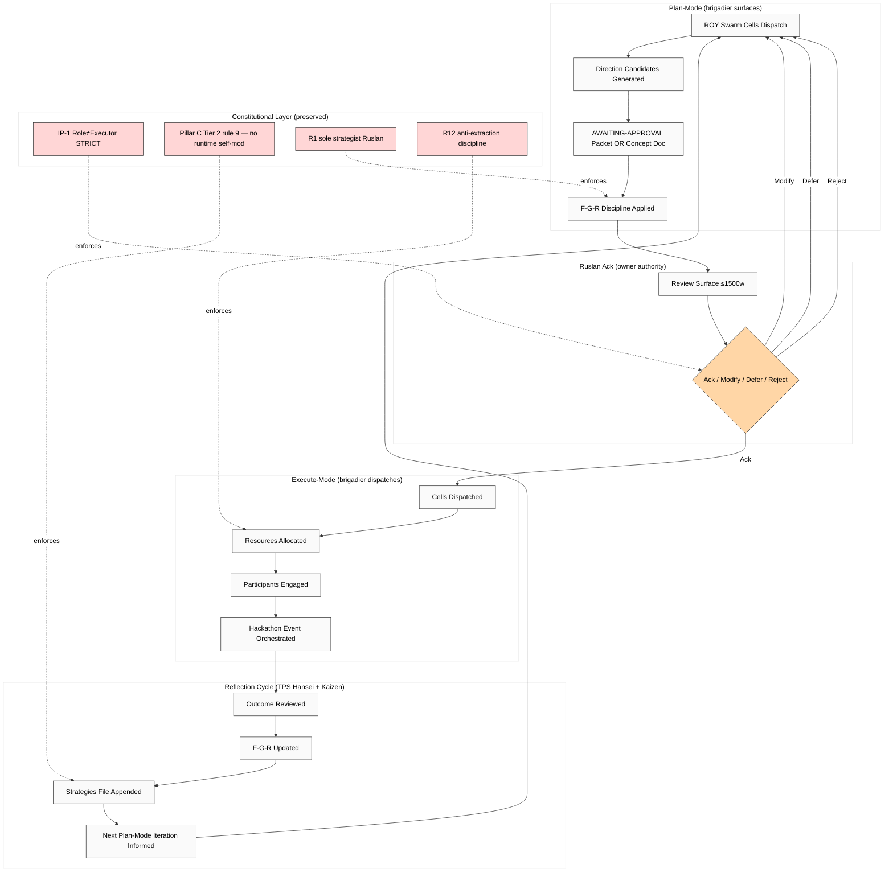

# Hackathon Platform = Recursive Self-Developing Engine

> Companion vision document — plain English (Russian primary) + FPF formal version. Cross-links concept docs A (hackathon platform) + B (recursive engine).

---

## §1 Plain English (Russian primary)

text_008 + text_009 establish Hackathon platform = primary growth vehicle для Jetix сейчас. Не consulting business, не SaaS — platform для проведения качественных глубоких марафонов where participants работают над сложнейшими задачами «на раз два за день» через FPF protocol-mediated coordination + AI capability + mentor pairing + tools/compute access.

**Recursive self-developing engine layer** означает: platform не только проводит хакатоны, но и сама себя развивает через cycles plan-mode (brigadier surfaces direction candidates) → Ruslan acks → execute-mode (resources allocated + participants engaged) → reflection cycle. **IP-1 critical:** «system develops itself» = brigadier surfaces, Ruslan acks; NOT autonomous runtime self-modification (Pillar C Tier 2 rule 9 PRESERVED).

**Why это work:** Hackathon = compressed information-flow event (per Harari Nexus framework + research/hackathon-deep-2026-05-18). 4 hypotheses ranked (A bloggers + sponsor / B engineers / C self-bootstrap / D engineer-mastersaya); Hypothesis A = primary gateway (lowest cost, fastest first event).

**Multi-rhythm cycle** (Thread 11 text_009):
- День — sprint mode (low-medium complexity).
- Месяц — sponsor cycle (medium complexity).
- Год — major marathon (Master Workshop apprenticeship).

**Activation 3-event Year-1 cadence:**
- Q3 2026: 1 day-rhythm hackathon (bloggers + sponsor).
- Q3-Q4 2026: 2 day-rhythm + 1 month-rhythm.
- Q4 2026+: First engineer-mode (year-rhythm pre-activation).

---

## §2 FPF formal version

```
System: Jetix-as-hackathon-platform (A.1)
  Roles: Participant, Mentor, Sponsor, Organizer, Audience (A.2)
  Method: Marathon-mode multi-rhythm cycles (A.3)
    Sub-methods: day-rhythm / month-rhythm / year-rhythm
  Work-as-artefact: per-event solution + project + prize allocation (A.15)
  Work-as-process: initiate → match → solve → reward → recurse (A.16)
    Temporal Duality: plan-mode + execute-mode auto-toggle (A.4)
      IP-1 enforcement: brigadier surfaces → Ruslan acks → execute
      Pillar C Tier 2 rule 9 PRESERVED (no runtime self-modification)

  Bounded contexts (A.6.B):
    - FPF protocol (universal merger language)
    - ROY swarm (multi-agent coordination)
    - Ethereum substrate (DAO governance + QF distribution; H8 overlay)

  Constitutional posture (A.14):
    - R1 + R2 + R6 + R11 + R12 + EP-5 + IP-1 STRICT
    - R12 anti-extraction via QF + fork-and-leave exit tokens
    
  Guard-rails (E.5):
    - AWAITING-APPROVAL gate (Part 6b human gate)
    - Default-Deny table (.claude/config/default-deny-table.yaml)
    - F-G-R discipline per claim
```

---

## §3 Mermaid — Hackathon engine cycle



---

## §4 Cross-refs

- `decisions/strategic/JETIX-AS-HACKATHON-PLATFORM-2026-05-18.md` (concept doc A)
- `decisions/strategic/JETIX-RECURSIVE-SELF-DEVELOPMENT-ENGINE-2026-05-18.md` (concept doc B)
- `swarm/awaiting-approval/h6-hackathon-platform-pre-eminent-2026-05-18.md` (packet A)
- `swarm/awaiting-approval/pillar-a-hackathon-mode-extension-2026-05-18.md` (packet B)
- `wiki/concepts/jetix-as-hackathon-platform.md` (Tier A)
- `wiki/concepts/recursive-self-development-engine.md` (Tier A)

[src: text_008/009 verbatim + concept docs A+B + batch-3 analysis]
