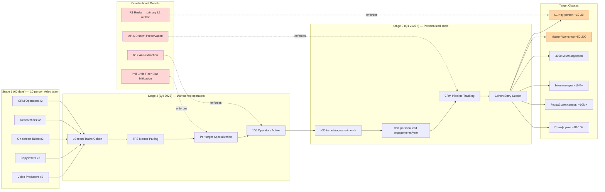

# Outreach System Scalable

> Companion vision document — plain English + FPF formal. Cross-links concept doc D outreach pattern.

---

## §1 Plain English (Russian primary)

text_009 Thread 5 + 13 + 14: Outreach должен быть operationalized — «чтобы не я это делал». Pattern: **10-person video team** records baseline outreach → **100 trained operators** scale personalized engagement → **personalized video per target** к 3000+ миллиардеров / миллионеров / разрабов / инженеров / платформ.

**Priority L1 (Thread 12):** Karpathy + Musk + Anthropic + Buterin — «снежный ком» exponential pull-through.

**Primary aspiration (Thread 14):** Master Workshop of Engineers — «не ступеньки ниже. Точка.» = no compromise on aspiration level.

**Outreach script framing (text_008):** «откинь все свои проекты, считай Jetix» — для всех L1/L2 contacts. **Phil critic dissent preserved (per batch-3 §A.3):** filter bias risk surface; Ruslan picks operator semantics (urgency multiplier OR literal filter criterion).

**6 resources Ruslan мanages (Thread 5):** taxonomy OPEN. 4 candidate lists в concept doc D §4; Ruslan picks (информация / команда / время = first 3 explicit; rest = candidate).

**Activation:**
- Stage 1 (60 days): 10-person video team assembled.
- Stage 2 (Q4 2026): 100 trained operators trained.
- Stage 3 (Q1 2027): Personalized scale to 3000+ targets.

---

## §2 FPF formal version

```
System: Jetix-outreach-system (A.1)
  Roles: Outreach-operator (10-team / 100-trained) (A.2)
    Specialization: video producer / copywriter / researcher / on-screen talent / CRM operator
  Method: 10→100→personalized scale pattern (A.3)
  Work-as-process: target identification → research → script → video → CRM tracking → follow-up (A.16)
  Speech-Acts: outreach script primitives (U.SpeechAct)
  Commitments: per-target engagement commitment (U.Commitment)
  Promises: per-engagement promise tracking (U.PromiseContent)
  
  Target audience taxonomy:
    - L1 key-person: ~10-20 (CRITICAL)
    - Master Workshop of Engineers: ~50-200 (CRITICAL)
    - 3000 миллиардеров: ~3,000 (HIGH)
    - Миллионеры: ~10M+ (MEDIUM-HIGH)
    - Разрабы / инженеры: ~10M+ (MEDIUM)
    - Платформы: ~1K-10K (HIGH — system merger overlap)
  
  Constitutional posture (A.14):
    - R12 anti-extraction in outreach pipeline
    - AP-6 dissent preservation in target feedback
    - Pillar C R1 (Ruslan = primary script author for L1)
```

---

## §3 Mermaid — Outreach scaling flow



---

## §4 Cross-refs

- `decisions/strategic/JETIX-OUTREACH-SYSTEM-SCALABLE-2026-05-18.md` (concept doc D)
- `vision/08-l1-collaboration-roadmap.md` §APPEND (Karpathy + Musk + Anthropic priority)
- `wiki/concepts/outreach-system-scalable.md` (Tier A)
- `decisions/REFLECTION-INBOX-2026-05-16.md` §APX-8 (не ступеньки ниже discipline)
- `crm/README.md` (CRM substrate)

[src: text_009 Thread 5+13+14 verbatim + concept doc D + batch-3 analysis]
