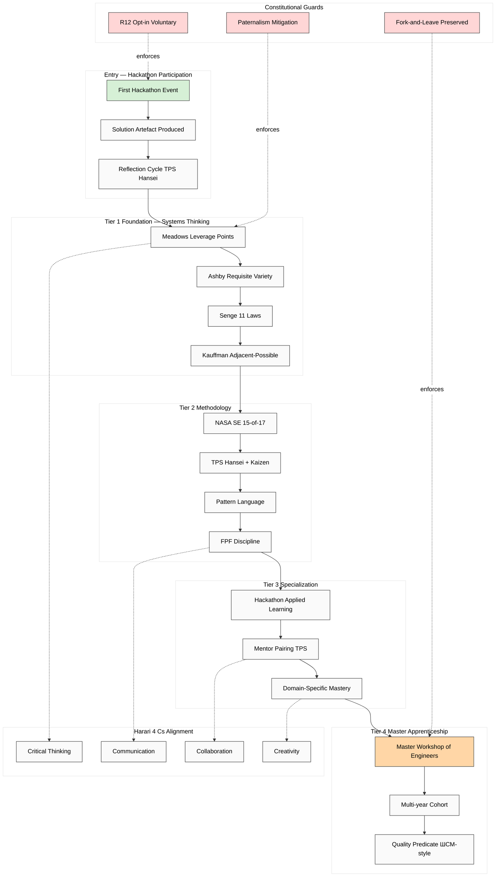

# Education Layer Base — Системное мышление

> Companion vision document — plain English + FPF formal. Cross-links concept doc E + Harari 4 Cs corroboration.

---

## §1 Plain English (Russian primary)

text_009 Thread 6: «эта платформа будет обучать этому ну то есть кому-то системному мышлению адекватному подходу к и как-то и и потом стремиться на то чтобы вот у всех людей был вот этот базовый уровень закрыт». Education layer = базовое системное образование через Workshop curriculum + Hackathon как teaching vehicle.

**Workshop curriculum tier structure:**
- **Tier 1 Foundation** — Meadows leverage points / Ashby variety / Senge laws / Kauffman adjacent-possible.
- **Tier 2 Methodology** — NASA SE 15-of-17 / TPS Hansei + Kaizen / Pattern Language / FPF discipline.
- **Tier 3 Specialization** — Hackathon participation = applied learning vehicle; mentor pairing.
- **Tier 4 Master apprenticeship** — Master Workshop of Engineers (Thread 14 «не ступеньки ниже»).

**Harari 4 Cs alignment** (research/harari-jetix-lens P1#1):
- Critical thinking — «×100 multiplier» semantics analysis.
- Communication — FPF discipline + outreach personalization.
- Collaboration — hackathon team formation + mentor pairing.
- Creativity — solution innovation per hackathon.

**NASA framework integration** (Thread 8): «life-as-spaceship» — personal life-design = systems engineering project. NASA SE processes (Stakeholder Expectations / Requirements / Logical Decomposition / Implementation / Integration / Verification / Technical Assessment) applied к persona scale.

**Paternalism risk (phil critic per batch-3 §B.3):** Workshop curriculum = **opt-in voluntary**; не universalist mandate. R12 anti-extraction = fork-and-leave preserved. «Базовое образование» = aspiration, не enforcement.

---

## §2 FPF formal version

```
System: Jetix-education-layer (A.1)
  Method: Системное мышление curriculum + NASA SE + Pattern Language (A.3)
  Roles: Student / Master / Teacher (A.2; apprenticeship roles)
  Work-as-process: curriculum progression (Tier 1 → 4) (A.16)
  Epistemic role-type: U.Episteme (knowledge transmission)
  Method documentation: U.MethodDescription (curriculum canonical)
  Speech-Acts: lecture / dialogue / Socratic (U.SpeechAct)
  
  Tier structure (A.3 method sub-decomposition):
    Tier 1 Foundation:
      - Meadows leverage points
      - Ashby requisite variety
      - Beer VSM basics
      - Senge 11 laws
      - Kauffman adjacent-possible
    Tier 2 Methodology:
      - NASA SE 15-of-17 processes (life-as-spaceship)
      - TPS Hansei + Kaizen
      - Pattern Language method
      - FPF discipline
    Tier 3 Specialization:
      - Hackathon = applied learning vehicle
      - Mentor pairing (TPS pattern)
      - Domain-specific deepening
    Tier 4 Master apprenticeship:
      - Master Workshop of Engineers
      - Cohort multi-year engagement
      - Medieval guild model + ШСМ 30-year precedent
  
  Constitutional posture (A.14):
    - R12 anti-extraction (opt-in voluntary)
    - Paternalism mitigation (phil critic surface preserved)
    - AP-6 dissent preservation in curriculum feedback
```

---

## §3 Mermaid — Education layer flow



---

## §4 Cross-refs

- `decisions/strategic/JETIX-EDUCATION-LAYER-SYSTEM-THINKING-2026-05-18.md` (concept doc E)
- `decisions/JETIX-WORKSHOP-CONCEPT-2026-04-30.md` (Workshop LOCKED parent)
- `research/harari-jetix-lens-2026-05-18/03-21-lessons.md` P1#1 (4 Cs)
- `research/deepening-2026-05-18/12-nasa-se-15-of-17.md` (NASA SE precedent)
- `research/deepening-2026-05-18/05-pattern-language-lineage.md` (Alexander → Cunningham → Karpathy)
- `wiki/concepts/education-layer-systems-thinking.md` (Tier A)
- `vision/03-jetix-as-masterskaya-platform.md` §APPEND (Workshop = master of info processing + 4 Cs overlay)

[src: text_009 Thread 6+8 verbatim + concept doc E + research streams (Harari + Deepening) + batch-3 analysis]
