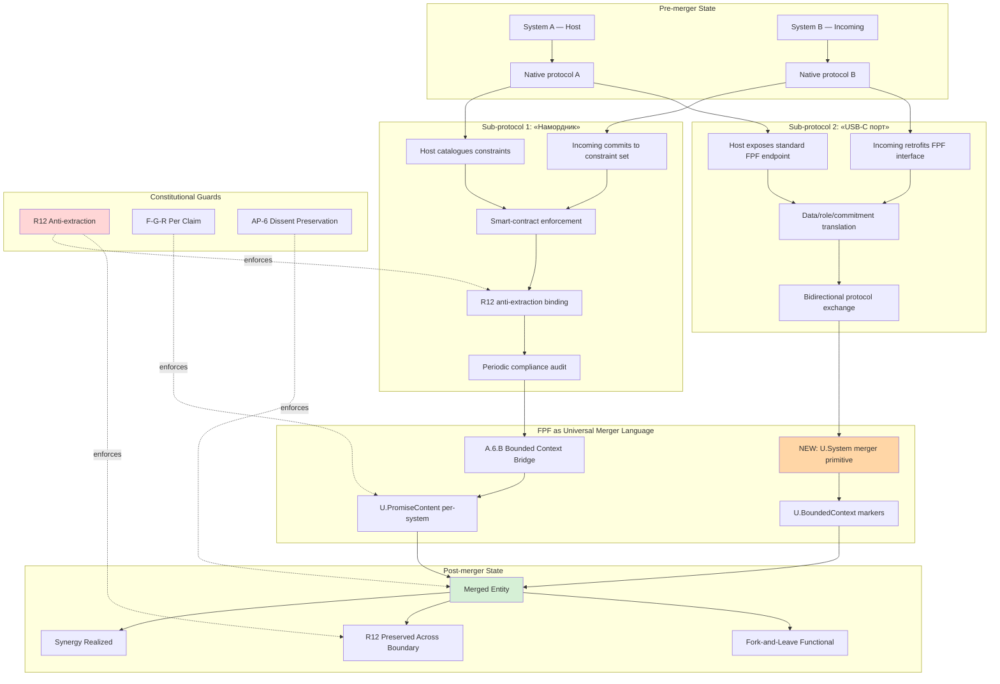

# System Merger Protocol — FPF-based M&A для info systems

> Companion vision document — plain English + FPF formal. Cross-links concept doc C + H9 candidate flag.

---

## §1 Plain English (Russian primary)

text_009 Thread 10: «когда jetix начнет масштабно развиваться всем системам которые вот в потенциальном радиусе... другим похожим системам ну по идее логичнее было бы с ней тоже начать работать». Когда Jetix scales — competitors / similar info systems могут (а) merge / cooperate, либо (б) face «больненько». **System merger protocol** = how Jetix-FPF mediates this.

**Two sub-protocols:**

1. **«Намордник» (constraint imposition)** — receiving system imposes constraint set on incoming system. Ashby requisite-variety frame: host imposes constraint set sufficient к match incoming variety. Programmable enforcement через R12 Ethereum overlay (Mondragón wage ratio cap + QF distribution + fork-and-leave exit).

2. **«USB-C порт переделка» (interop bridge)** — universal connector retrofit. Incoming system implements FPF-compatible interface. FPF = universal merger language (analog USB-C для info systems).

**Strategic Q open (Thread 10):**
- **Option A:** Jetix как outsource provider — companies hire Jetix as M&A integration consultant.
- **Option B:** Jetix как platform-companies-come-to — companies integrate с Jetix-FPF.
- **Option C:** Hybrid (broker + platform).

**Brigadier surface:** Option C (Hybrid) preserves optionality; first 3-5 mergers as broker (learn pattern); platform develops based on learnings. **NOT autonomous decision** — Ruslan picks.

**Cross-precedent:** USB-C (2014) + TCP/IP (1974) + Mondragón federation (1956-) + Audrey Tang g0v + open M&A studies = 5 independent precedents.

**H9 candidate flag** — possible 9th Strategic Insight surface in AWAITING-APPROVAL packet C (Octagon → Nonagon transition consideration).

---

## §2 FPF formal version

```
System merger pattern (A.1 × A.1):
  LHS: Host system (Jetix OR partner host)
  RHS: Incoming system (info-processing system, business OR org)
  
  Bridge primitives (A.6.B Bounded Context bridge):
    - U.BoundedContext (boundary marker)
    - NEW: U.System merger (candidate primitive — FPF-Steward review)
    - U.PromiseContent (per-system commitment to merger constraints)
  
  Sub-protocol 1: «Намордник» (constraint imposition)
    1. Host catalogues required constraints (R12 + FPF + F-G-R)
    2. Incoming system commits as condition of merger
    3. Programmable enforcement (smart-contract / governance / audit)
    4. Periodic compliance audit
  
  Sub-protocol 2: «USB-C порт» (interop bridge)
    1. Incoming system retrofits FPF-compatible interface
    2. Host exposes standard FPF endpoint
    3. Data + role + commitment translation through FPF
    4. Bidirectional protocol-mediated interaction
  
  Constitutional posture across merger (A.14):
    - R12 anti-extraction preserved across boundary (SM-T3 falsifier)
    - F-G-R discipline per claim post-merger
    - AP-6 dissent preservation across merged feedback
  
  Strategic Q (Thread 10 R1 surface):
    Option A: Jetix как outsource provider
    Option B: Jetix как platform-companies-come-to
    Option C: Hybrid (broker + platform)
```

---

## §3 Mermaid — 2-system merge через FPF protocol



---

## §4 Cross-refs

- `decisions/strategic/JETIX-SYSTEM-MERGER-PROTOCOL-FPF-2026-05-18.md` (concept doc C)
- `swarm/awaiting-approval/h9-strategic-insight-candidate-2026-05-18.md` (packet C — H9 candidate flag)
- `design/JETIX-FPF.md` (FPF spec — A.6.B + U.BoundedContext primitives)
- `decisions/strategic/JETIX-ETHEREUM-ARCHITECTURE-2026-05-18/00-MASTER-ARCHITECTURE.md` (Ethereum overlay)
- `wiki/concepts/system-merger-protocol-fpf.md` (Tier A)
- `swarm/awaiting-approval/r12-programmable-ethereum-2026-05-18.md` (R12 substrate)

[src: text_009 Thread 10 verbatim + concept doc C + research streams + batch-3 analysis]
