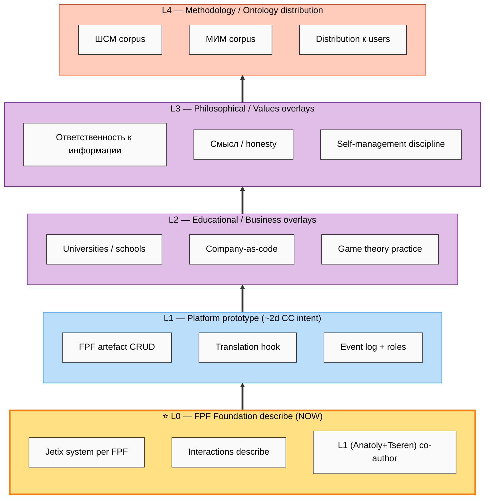

# Diagram 01 — Layered Architecture L0 → L4

> Visual encoding of text_003 strict-order sequencing. Inversion = R1 violation.

**Legend:**
- ⭐ L0 = current focus (yellow); in-progress
- L1 = next (light blue); vapor + intent
- L2-L3 = future (purple); vapor
- L4 = far-future (orange); vapor

**Constitutional note:** Strict-order ⟹ inversion of arrows = R1 violation (AI assumes strategic decision). Cross-layer execution allowed только pre-engage / list-building / scope-drafting (not «build» operations).

[src: vision/06 §0; text_003 ¶1-3]
