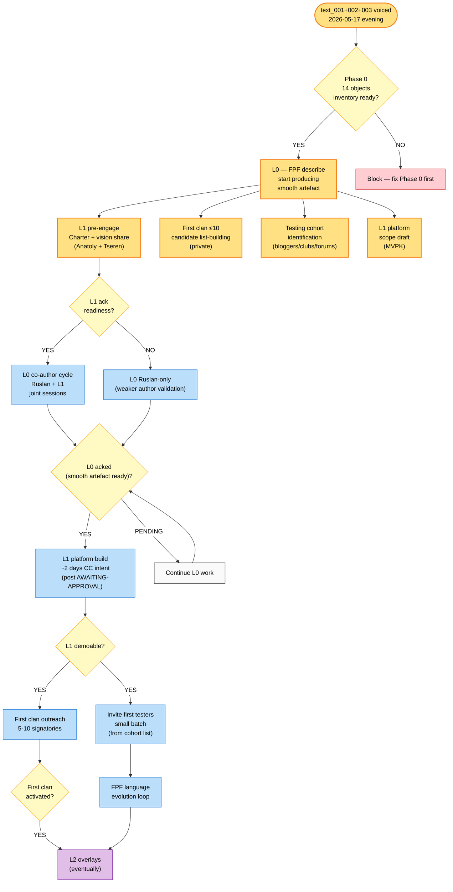

# Diagram 02 — Vision flow: Foundation → Platform → Testing → Clan

> Sequence of events integrating text_002 (vision) + text_003 (sequencing). Time flows top→bottom.

**Legend:**
- Yellow = NOW (R1 allowed; not blocked)
- Light blue = post-L0 dependents
- Purple = far-future (L2+)
- Red = blocker
- Light yellow = decision gate

**Constitutional note:** «L1 build», «invite testers», «clan outreach» = blocked until L0 acked (strict order per vision/06).

[src: text_002 ¶1-4 + text_003 ¶1-4 + vision/04 + vision/05 + vision/08]
