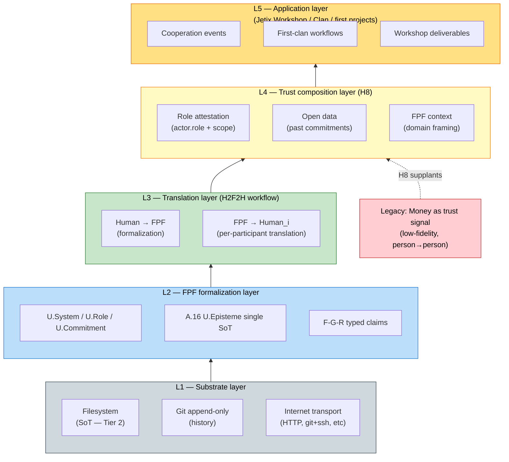

# Diagram 03 — FPF as Protocol Stack

> Visual encoding: FPF + open data + role-based attestation = composed trust + cooperation protocol stack. Inspired by OSI layering metaphor; semantic-only (NOT literal network stack spec).

**Legend:**
- L1 Substrate (grey) = filesystem + git + internet — already exists
- L2 FPF (blue) = formalization — exists as spec; usage = aspirational
- L3 Translation (green) = H2F2H workflow — manual today; tooling = MVPK Component 2 (vision/07)
- L4 Trust (yellow) = H8 composition — text + vapor mechanism
- L5 Application (orange) = Jetix Workshop / Clan — vapor today
- Money (red dashed) = legacy trust signal; H8 supplants (not replaces — supplement)

**Layer dependencies:** higher layers presuppose lower. App layer (L5) collapses if Trust (L4) mechanism absent. Trust (L4) requires Translation (L3) for human accessibility. Translation requires FPF (L2) formalism. FPF requires Substrate (L1) persistence.

**Constitutional note:** H8 LOCK does not claim money replacement — claims fidelity upgrade. Diagram explicit: Money → Trust = «supplants OR supplements» (text_001 ambiguous; vision/00 §7 Q-7).

[src: vision/01 §4 H2F2H + vision/02 §4 properties + H8 LOCK + text_001 ¶3-5 + text_002 ¶1-2]
