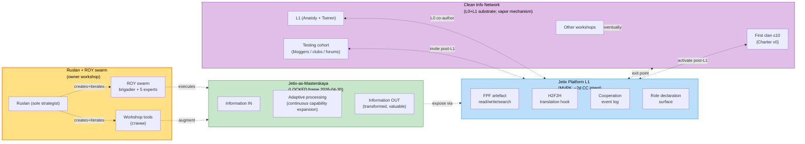

# Diagram 04 — Jetix-as-Masterskaya: exit point к Engineer Network

> Visual encoding: Jetix workshop = local node; platform = interface; «exit» = participation в broader clean info network.

**Positioning claims:**
- **Workshop** (green, LOCKED) = conceptual frame Jetix-as-information-processing-masterskaya — LOCKED 2026-04-30 (Ruslan-dictated)
- **Platform** (blue, vapor L1) = interface обеспечивающий «exit» из workshop → network
- **Network** (purple, vapor) = clean info network (vision/02); destination of «exit»
- **Owner+ROY** (yellow) = currently operational layer

**Adjacent claims NOT shown** (out of scope this diagram):
- H4 Network State (territorial / political — different overlay)
- H6 Realm gamified layer (operational under Workshop+Platform)
- H8 Trust Infrastructure (cross-cutting layer all components)

**Constitutional note:** «exit» metaphor от text_002 ¶3 — semantic, не literal protocol exit. Workshop preserves filesystem-as-SoT (Tier 2 RUSLAN-LAYER); platform interface не replacement, an wrapper.

[src: text_002 ¶3 + WORKSHOP-CONCEPT §0-§2 + vision/02 §3 + vision/03 §3]
