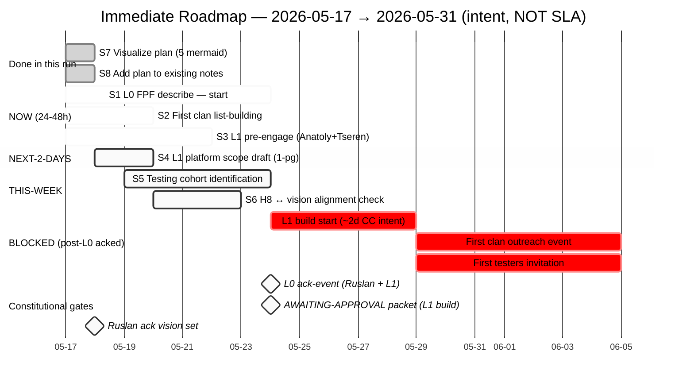

# Diagram 05 — Immediate roadmap gantt

> Visual encoding 8 immediate steps (vision/09 §2). Dates = intent only (EP-3 fidelity flag), NOT SLA.

**Legend:**
- `done` (grey) = delivered в этом run
- `active` (blue) = NOW-horizon, R1-allowed, started
- (white) = scheduled
- `crit` (red) = blocked until L0 ack milestone
- `milestone` = constitutional gate

**EP-3 fidelity disclaimer:**
- All dates = **intent estimates**, not SLAs
- «7d» / «5d» / etc = vision-stage placeholders
- Real cadence Ruslan-determined
- L1 build «~2d CC» = voiced intent (text_003 ¶2), highly uncertain (vision/07 §3.4 range)

**Constitutional gates:**
- `m1 L0 ack-event` — gate для L1 build start (vision/06 strict order)
- `m2 AWAITING-APPROVAL` — Tier 2 R2 requirement before architectural changes
- `m3 Ruslan ack vision set` — gate для acting on этих docs vs treating as drafts

**What's NOT shown:** L2-L4 layer work (far-future; vision/06). Existing Phase 0+ parallel run (separate scope).

[src: vision/09 §2 + vision/06 strict order + Tier 2 R1+R2 constitutional gates]
